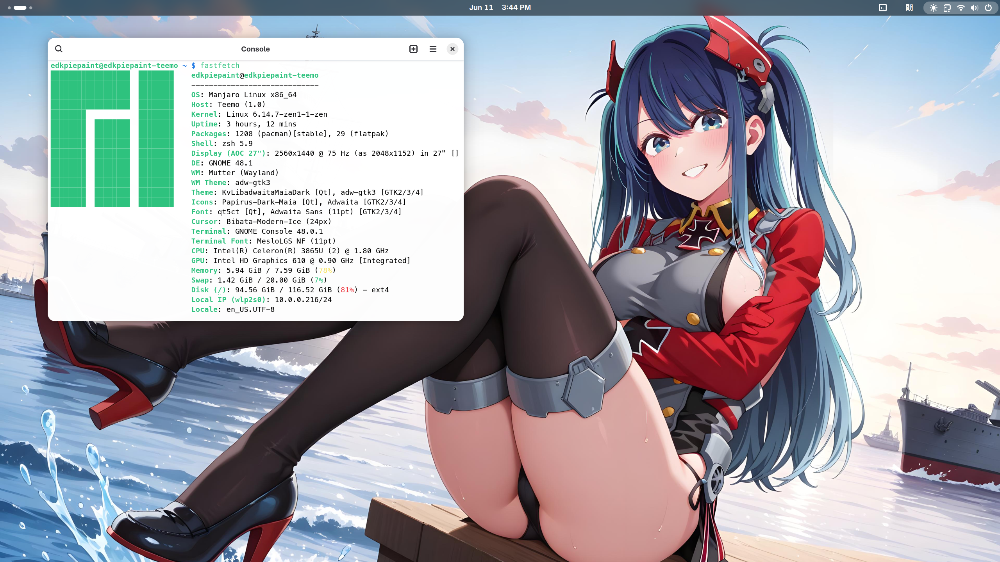

由不知名自由軟體愛好者 EDKPiepaint 創建的一系列迷因，同時將解釋迷因的含義。

# 2024 年

## 我投靠更有價值的樹莓派

時間：2024年9月15日 </br>

當你不再因爲CP值買開發板之後，我選擇更有價值的樹莓派。</br>

含義：做ARM開發板的廠商很多，樹莓派基金會推出的Raspberry Pi系列算是最為成功的產品。其他中國廠商生產的開發板雖然性能更好，外觀更漂亮，但卻常常有驅動閉源、Linux支援度比Android落後、廠商帶頭違反GPL、社群不夠大等問題。</br>
原版：來自[Ivon的部落格](https://ivonblog.com/posts/my-ptt-forum-signatures/) </br>

## DW99: 一表打所有

時間：2024年12月28日 </br>

雖然DW99只是山寨手錶，但是它也可以執行 Android 10，也可以流暢執行諸如《狂野飆車9》一類的爲現在的中高階手機開發的遊戲，在CPU時脈降低到最低的768MHz，開啓飛航模式後，電池的持續時間從1天延長到了10天！不必那些幾千塊的 Apple Watch 和其它正經 Android 手錶差勁！

含義：雖然我對於“DW99”這個不知名山寨 Apple Watch Ultra 的小牌 Android 手錶的相關研究從2025年2月時才開始（高三的寒假從28天縮成7天，提前開學補課，真有你的！！），且主要用於上課或者是自習課摸魚之用，以此來度過難熬的時間。但是，正是因爲我的“摸魚”需要，以及我一貫對於電子產品“鑽研到底”的作風，還有不解鎖，不 Root 就會犯躁鬱症的心理問題，我開始了對這塊手錶的折騰之旅。</br>

這塊手錶原本運行基於 Android 8.1 的“和順城”作業系統，使用的鏡片也是2019年的紫光展銳SC9832E晶片，四核心1.4GHz的時脈使得這塊表的效能和順暢度非常低下。而且原廠的系統後臺保活能力非常差，系統UI大量的動畫缺失讓我感到不爽。通過Google搜尋和檢索各大BBS後，我設法解開了BL鎖，又通過對原廠系統的 Vendor 分區進行了修改，成功刷入了 Android 10 的 GSI。與原廠的 Android 8.1 相比，順暢度、動畫、和後臺保活能力都有了改善。不幸的是，由於 GSI 缺失展訊相關的IMS組件，所有 GSI 都無法進行通話，但是可以使用行動數據網絡。</br>


之後，又通過刷入相關 Magisk 模組、調節 Swap 和 ZRAM 來讓手錶運行時更加順暢，在進行了一系列調優之後，我的DW99也可以玩諸如 Minecraft 基岩版和《狂野飆車》（5、7、8、9 代都可以流暢玩）之類的遊戲了，其中《狂野飆車9》是可以用高畫質玩的。就是靠這些遊戲來度過難熬的學校時光。雖然後期簽了不上晚自習的離校協議，每天都可以下午5點放學，但是這一“摸魚”的傳統還是遺留下來，直到我昨天高考完畢。當然，不是每個自習課都會玩遊戲，有時也會用我的自建VPN看看我的 X 和 Reddit 社群來看看最新的新聞和自由軟體相關的內容，可以說我的待遇，雖不敢說堪比家裏，但是與學校裏那些一週才可以回家一次的住校生而言，也不錯了。後來，也不知是誰最先發現，或者道聽途說，四分部有人在自習課上用手錶摸魚之後，我班上的那些女同學紛紛效仿我，只是她們拿來的都是正兒八經的“真東西”：Apple Watch、OPPO Watch、華爲的Watch GT 3 之類的。除了Apple 外，其它的手錶都是基於 Android 的。她們還因我玩《狂野飆車》的事來挖苦、嘲笑我。每當我說“那你們也下載下來玩玩看”之類的話時，她們便會說“我們的表不能玩”或者“我不會安裝軟體”之類的話，然後便大笑。但是不管別人怎麼看，我用我的DW99實現了一般手機的功能，除了可以玩遊戲、看 YouTube 的視頻，以及瀏覽 Reddit 之類的社群網站，也可以拍照和撥打電話，而那些幾千塊的 Apple Watch、華爲Watch GT 3 卻不能，也算是“一表打所有”了吧（當然，山寨品是不建議購買的）！


## 菜楊也精神了

時間：2024年8月25日 </br>

...所以啊，不要跟我講什麼13代酷睿、12代酷睿，這個8代賽揚，使用 Linux Zen 核心、開啓 ZRAM 和 Swap 的話嗎，菜楊也給你精神了！ </br>

含義：我在2024年，在閒魚上購買了華碩的 Chromebox 3 代電腦，但是我爲了省錢，就選擇了自帶8GB RAM 和預裝 Intel 的 賽揚（因爲賽揚是最低端處理器，也就有了“菜楊”的稱號）3865U處理器的最低端版本。但是，在安裝了 Manjaro Linux 後，通過使用 Zen 核心和合理的 ZRAM與 Swap 配置後，系統的流暢度有了明顯的提升，也從最初的“堪用”到完全可用的水平。



# 2025 年

因爲高三下學期學業繁忙和備戰高考（考試又不是上戰場，有必要備戰嗎）的緣故，2025年的迷因較少。但是依然足夠經典。 </br>

## 我這個手機，是高通MTP845啊！！！

時間：2025年2月 </br>

每當有人指着你的MTP845問你這是什麼的時候，你就可以大聲地對他說：“阿sir，我這個手機，是MTP845啊！” </br>

含義：高通的MTP工程機因爲其低調的黑色塑料外殼、以及邊角料熒幕，配以內在性能強大的晶片，這與普通手機的現代、精緻的外觀有着鮮明的對比，常常會被人誤認爲是十幾年前的手機。


## Linux終於成為了4%

時間：2025年6月1日

根據統計資料顯示，Linux終於成為了4%。 </br>


含義：根據來自 Statcounter 的統計資料顯示，Linux桌面系統的市佔率在2024年來到了4%。面對其他作業系統的圍攻，最後還是只有4%。


## 發現數位水印的液態玻璃終究還是保不住你的隱私

時間：2025年6月11日

有人發現，當他們的iPhone更新至iOS 26 後，在 Tik Tok （俗稱“抖音”）應用程式中拉下通知欄或者展開快速設定，就可以在展示的視頻中，發現隱藏的類似黃色二維碼的水印。但是，使用熒幕截圖或者錄製，這個“水印”就會消失。有人猜測這種水印是用來追蹤攝取相關畫面的截圖，然後對該內容進行傳播的人。</br>

<blockquote class="twitter-tweet"><p lang="zh" dir="ltr">6月11日 有网友苹果手机升级到IOS26后，在抖音页面下拉通知栏看到奇怪的二维码，疑似苹果新系统的液态玻璃特效可以暴露抖音的隐水印。<br>但如果开启录屏，这个隐藏的二维码就会消失。 <a href="https://t.co/XG7u8wSQ8q">pic.twitter.com/XG7u8wSQ8q</a></p>&mdash; 李老师不是你老师 (@whyyoutouzhele) <a href="https://twitter.com/whyyoutouzhele/status/1933097856006770872?ref_src=twsrc%5Etfw">June 12, 2025</a></blockquote> <script async src="https://platform.twitter.com/widgets.js" charset="utf-8"></script> 

含義：儘管iOS 26 這一全新的“液態玻璃”模糊效果能夠暴露出這一深埋在應用中的“暗水印”，但是，iOS是個基於 XNU 核心的封閉原始碼的作業系統，使用者的隱私終究還是被Apple所監控着，而不是被使用者本身所掌握。


## 中國大陸沒有自由與開源(FOSS)軟體所需要的環境

時間：2025年6月14日

你說你不想在這裏，我也不想在這裏！可是天黑的太快，想走也早已來不及！ </br>
喔，我愛你！可惜長城早高高築起，自由變爲專有，我一個人繼續。生活在黑暗裏，直到長城崩塌！一萬匹脫繮的馬，在他腦海中奔跑（哈！哈！哈！）......

含義：因爲衆所周知的原因，像是GitHub 、GitLab 、Codeberg等代碼託管平臺在中國大陸內無法使用，而因爲GFW的存在，使得開源軟體無法被廣泛傳播。還有人爲了賺取錢財，公然違反許可協議，將開源軟體放到諸如“鹹魚”等平臺進行盜賣。更有甚者，在獲取了原始碼之後，竟然**將原開發者的名字悄悄抹去，“正大光明”地寫上自己的名字，宣稱這是自己寫的**[^1]。這無疑是對開源社區極大的不尊重，任意竊取他人勞動果實的行爲，他們褻瀆了開源精神。
2023年11月，知名代理軟體 Clash 的開發者突然刪除了其位於 GitHub 上的原始碼，這一傳奇的代理軟體從此消失在公衆的視野中，並因此引發了“寒蟬效應”。衆多基於 Clash 開發的代理軟體紛紛停止開發。</br>
但是，比起相關專業人士的說法，揭露了自由軟體在中國大陸的發展困境的，卻是官方媒體自己。[^2]
在央視所展示的一段程式開發者通過GitHub下載開源軟體的視頻中，乍看似乎沒有什麼問題，但是，細看之下，開發者的操作可謂“漏洞百出”：

 - 使用者似乎不太會git命令用法，也可能是誤操作了；
 - 終端機的日誌告訴我們，使用者正在通過代理軟體訪問GitHub網址（展示了“7890”端口號碼），這提示了GFW的存在，也可能表明使用者正在使用VPN；
 - 即便如此，使用者仍然遇到了一些問題，最後只能通過鏡像站來解決。

 這是當時的一些評論：
 > Earthly：一开始git clone手动取消了当场export设置proxy（嗯，7890哈哈哈哈哈）然后重新clone，
 >
 > clone的源还是不存在的网站。clone两次都失败后打算用pip装个包（比），结果pip访问proxy超时了，又打起
 >
 > 了tuna的主意，反正直到视频最后都是超时。
 >
 > 车联网 Odys：官方证实了，开源世界最大的障碍，我们的软件工程师在开源世界的最大的障碍，就是墙。
 >
 > softor：翻译：长城防火墙的直接受害者超800万人，影响的生产力更是无法估计。 
 >
 > softor：端口7890，应该是用了clash吧。

這段旨在宣傳「中國繁榮開源生態」的報道恰恰展示了國內軟體開發生態的極端閉塞：不但全球最大型最知名的源代碼託管服務平台——GitHub遭到了防火牆的屏蔽，而且連出鏡央視節目的用戶也得親自翻牆，才能進行正常的軟體開發測試。


```
00001010 00101101 00101101 00101110 00101101 00101101 00101110 00101110 00101110 00101110 00101110 00101101 00101101 00101101 00101101 00101110 00101101 00100000 00101101 00101101 00101110 00101101 00101101 00101101 00101110 00101110 00101101 00101110 00101101 00101101 00101101 00101110 00101101 00101101 00100000 00101101 00101101 00101101 00101101 00101101 00101101 00101101 00101101 00101101 00101101 00101101 00101101 00101101 00101101 00101110 00101101 00100000 00101101 00101110 00101101 00100000 00101110 00101110 00101110 00101101 00100000 00101101 00101110 00100000 00101101 00101110 00101110 00101110 00100000 00101101 00101101 00101110 00101110 00100000 00101110 00101110 00101110 00101101 00100000 00101110 00101101 00101101 00101101 00101101 00101110 00100000 00101110 00101110 00101101 00101110 00100000 00101101 00101110 00100000 00101101 00101101 00101110 00100000 00101101 00101101 00101110 00100000 00101110 00101110 00101110 00101101 00100000 00101101 00101101 00101110 00100000 00101110 00101110 00101110 00101110 00100000 00101101 00101101 00101110 00101101 00100000 00101110 00101101 00101110 00100000 00101110 00101110 00101110 00101101 00100000 00101110 00101110 00101101 00101110 00100000 00101101 00101101 00101110 00101101 00100000 00101110 00101110 00101110 00101101 00100000 00101110 00101110 00101101 00101110 00100000 00101110 00101110 00101101 00100000 00101110 00101101 00101110 00100000 00101101 00101110 00100000 00101110 00100000 00101101 00101101 00101110 00100000 00101110 00101101 00101110 00100000 00101110 00101101 00100000 00101110 00101110 00101110 00101101 00100000 00101110 00101101 00100000 00101101 00100000 00101101 00101110 00100000 00101110 00101110 00101101 00101110 00100000 00101101 00101110 00100000 00101110 00101110 00101110 00100000 00101110 00100000 00101110 00101101 00101110 00100000 00101110 00101101 00101110 00100000 00101110 00101110 00101101 00101110 00100000 00101101 00101110 00101110 00101110 00100000 00101110 00101110 00101110 00100000 00101101 00101101 00101110 00100000 00101110 00101101 00101101 00101101 00100000 00101101 00101110 00100000 00101110 00100000 00101110 00101101 00101110 00100000 00101110 00101101 00101110 00100000 00101110 00101101 00100000 00101101 00101101 00101110 00100000 00101110 00101110 00101101 00100000 00101110 00101110 00101110 00101110 00100000 00101110 00101110 00101101 00101110 00100000 00101110 00101110 00101110 00101101 00100000 00101101 00101110 00100000 00101110 00101110 00101101 00101110 00100000 00101101 00101101 00101110 00100000 00101101 00101101 00101110 00101110 00101101 00101101 00100000 00101110 00101110 00101110 00101101 00100000 00101101 00101110 00101110 00101110 00101110 00101110 00101110 00101110 00101110 00101101 00101101 00101110 00101110 00101101 00100000 00101110 00101110 00100000 00101110 00101101 00101110 00100000 00101101 00101110 00100000 00101101 00101110 00101101 00101101 00100000 00101110 00101101 00101101 00101101 00100000 00101101 00101110 00100000 00101110 00101101 00101110 00101110 00100000 00101110 00101110 00101101 00101110 00100000 00101101 00101101 00101101 00100000 00101110 00101101 00101110 00100000 00101101 00101110 00101101 00101101 00100000 00101110 00101110 00101110 00101101 00100000 00101110 00101101 00101110 00100000 00101110 00101110 00100000 00101110 00101101 00101110 00100000 00101101 00101101 00101110 00101101 00100000 00101110 00101110 00101110 00101101 00100000 00101110 00101101 00100000 00101101 00101101 00101110 00100000 00101110 00101110 00101101 00100000 00101110 00101101 00101110 00100000 00101101 00101110 00101101 00101110 00100000 00101101 00101110 00101110 00101110 00100000 00101110 00101101 00101101 00101101 00100000 00101110 00101101 00101110 00100000 00101110 00100000 00101101 00101110 00101110 00101110 00100000 00101110 00101110 00101110 00100000 00101101 00101101 00101110 00100000 00101110 00101110 00101101 00100000 00101110 00101101 00101110 00100000 00101101 00100000 00101101 00101110 00101101 00101110 00100000 00101101 00101110 00101101 00101101 00100000 00101101 00101110 00100000 00101110 00101101 00100000 00101101 00101101 00101110 00101101 00100000 00101101 00101110 00101110 00101110 00100000 00101101 00101110 00101101 00101110 00100000 00101110 00101101 00101110 00100000 00101110 00101101 00100000 00101101 00101110 00101110 00101110 00101110 00101101 00100000 00101110 00101110 00101101 00101110 00100000 00101101 00101110 00101110 00101110 00100000 00101110 00101110 00101110 00101110 00100000 00101110 00100000 00101110 00101101 00101101 00101110 00100000 00101110 00101101 00101110 00100000 00101101 00101101 00101110 00101101 00100000 00101110 00101101 00101110 00100000 00101110 00101110 00100000 00101110 00101101 00101110 00100000 00101101 00101110 00101101 00101101 00100000 00101101 00101110 00101110 00101110 00100000 00101101 00101110 00101101 00101110 00100000 00101101 00101101 00101110 00101110 00100000 00101110 00101101 00101110 00100000 00101110 00101101 00100000 00101101 00101101 00101110 00100000 00101110 00101101 00101110 00101101 00101110 00101101 00100000 00101110 00101110 00101110 00101110 00100000 00101110 00101101 00100000 00101110 00101110 00101110 00100000 00101101 00101110 00101110 00101110 00100000 00101110 00100000 00101101 00101101 00101110 00100000 00101110 00101110 00101110 00101110 00100000 00101110 00101101 00100000 00101101 00101110 00100000 00101101 00101101 00101110 00100000 00101110 00101101 00101110 00100000 00101101 00101110 00101101 00101101 00100000 00101110 00101101 00101110 00101110 00100000 00101101 00101101 00101110 00101110 00101101 00101101 00100000 00101101 00101110 00101101 00100000 00101110 00101110 00101110 00101101 00100000 00101101 00101110 00100000 00101101 00101110 00101110 00101110 00100000 00101101 00101101 00101110 00101110 00100000 00101110 00101110 00101110 00101101 00100000 00101101 00101110 00101110 00101110 00101110 00101110 00101110 00101110 00101110 00101101 00101110 00101101 00101110 00101110 00100000 00101101 00101101 00101110 00100000 00101110 00101110 00101101 00100000 00101110 00101101 00101110 00100000 00101101 00101101 00101110 00101110 00100000 00101101 00101110 00100000 00101110 00101110 00101110 00101101 00100000 00101110 00101101 00100000 00101110 00101110 00101101 00100000 00101101 00101110 00100000 00101110 00100000 00101101 00101101 00101110 00101101 00100000 00101110 00101101 00101101 00101101 00100000 00101101 00101110 00100000 00101110 00100000 00101110 00101101 00101110 00100000 00101101 00101101 00101110 00101110 00100000 00101101 00101110 00100000 00101110 00101101 00100000 00101110 00101110 00101110 00101110 00100000 00101110 00101110 00101110 00100000 00101101 00101110 00100000 00101110 00101101 00101101 00101110 00100000 00101101 00101101 00101110 00100000 00101110 00101110 00101110 00101110 00100000 00101110 00100000 00101110 00101101 00101110 00100000 00101110 00100000 00101110 00101110 00101110 00101101 00100000 00101110 00101101 00101101 00101110 00100000 00101110 00101110 00101101 00100000 00101101 00101110 00101110 00101110 00100000 00101110 00101110 00101101 00101110 00100000 00101110 00101101 00101110 00100000 00101101 00101101 00101110 00100000 00101101 00101110 00101110 00101110 00100000 00101110 00101101 00101101 00101101 00100000 00101101 00101110 00101110 00101110 00100000 00101110 00100000 00101101 00101110 00101110 00101101 00100000 00101110 00101101 00101101 00101101 00100000 00101110 00101110 00101110 00101101 00100000 00101101 00101101 00101110 00100000 00101110 00101110 00101101 00100000 00101101 00101110 00101110 00101110 00101110 00101110 00101110 00101110 00101110 00101101 00101110 00101101 00101110 00101110 00100000 00101110 00101110 00101101 00100000 00101101 00101110 00100000 00101110 00101110 00101101 00101110 00100000 00101110 00101110 00101101 00101110 00100000 00101110 00101110 00101101 00100000 00101101 00101110 00101110 00101110 00100000 00101110 00101101 00101101 00101101 00100000 00101110 00101101 00100000 00101101 00101110 00100000 00101101 00101101 00101110 00101101 00100000 00101110 00101110 00101110 00101101 00100000 00101110 00101110 00101101 00101110 00100000 00101101 00101110 00100000 00101101 00101110 00101101 00101110 00100000 00101101 00101110 00101101 00101110 00100000 00101101 00101110 00101110 00101110 00100000 00101110 00101110 00101110 00101101 00100000 00101110 00101101 00100000 00101101 00101101 00101110 00100000 00101110 00101110 00101110 00101101 00100000 00101110 00101101 00100000 00101101 00100000 00101110 00101110 00101101 00101110 00100000 00101101 00101101 00101110 00100000 00101101 00101110 00100000 00101110 00101101 00100000 00101110 00101101 00101101 00101110 00100000 00101110 00101101 00101110 00100000 00101101 00101101 00101110 00100000 00101101 00101110 00101110 00101110 00100000 00101110 00101101 00101101 00101101 00100000 00101101 00101110 00100000 00101110 00100000 00101101 00101101 00101110 00101101 00100000 00101101 00101110 00101110 00101110 00100000 00101101 00101110 00101101 00101110 00100000 00101110 00101101 00101110 00100000 00101110 00101101 00100000 00101110 00101110 00101101 00101110 00100000 00101101 00101110 00101110 00101110 00100000 00101110 00101110 00101110 00101110 00100000 00101110 00100000 00101110 00101101 00101101 00101110 00100000 00101110 00101101 00101110 00100000 00101101 00101101 00101101 00101110 00101110 00101110 00100000 00101101 00101101 00101110 00101101 00100000 00101110 00101101 00101110 00100000 00101101 00101110 00101101 00101101 00100000 00101101 00101110 00100000 00101110 00101101 00101110 00101110 00100000 00101110 00101101 00101110 00100000 00101101 00101101 00101110 00101101 00100000 00101101 00101110 00101110 00101101 00100000 00101110 00101101 00101110 00100000 00101110 00100000 00101110 00101101 00100000 00101110 00101101 00101110 00100000 00101101 00101110 00101101 00101101 00100000 00101110 00101110 00101101 00101110 00100000 00101101 00101110 00101110 00101110 00100000 00101110 00101110 00101110 00101110 00100000 00101110 00100000 00101110 00101101 00101101 00101110 00100000 00101110 00101101 00101110 00100000 00101110 00100000 00101110 00101101 00101110 00100000 00101101 00101110 00101101 00101101 00100000 00101110 00101101 00101110 00100000 00101101 00101110 00100000 00101110 00101110 00101101 00101110 00100000 00101110 00101101 00101110 00100000 00101110 00101110 00101101 00101110 00100000 00101101 00101101 00101110 00101110 00101101 00101101 00100000 00101110 00101101 00101101 00101110 00100000 00101101 00101110 00101101 00101101 00100000 00101101 00101110 00101110 00101110 00100000 00101110 00101110 00101101 00101110 00100000 00101110 00101101 00101110 00100000 00101101 00101101 00101110 00101101 00100000 00101101 00101110 00101110 00101110 00101110 00101101 00100000 00101110 00101110 00101101 00101110 00100000 00101101 00101110 00101110 00101110 00100000 00101110 00101110 00101110 00101110 00100000 00101110 00100000 00101110 00101101 00101101 00101110 00100000 00101110 00101101 00101110 00100000 00101101 00101101 00101110 00101101 00100000 00101110 00100000 00101110 00101110 00101110 00101101 00100000 00101110 00101110 00100000 00101110 00101101 00101110 00100000 00101110 00100000 00101110 00101110 00101101 00101110 00100000 00101101 00101101 00101110 00101110 00101101 00101101 00100000 00101101 00101101 00101110 00101110 00100000 00101110 00101110 00101110 00101101 00100000 00101110 00101110 00101101 00101110 00100000 00101110 00101110 00101101 00101110 00100000 00101110 00101110 00101110 00101101 00100000 00101110 00101101 00100000 00101101 00100000 00101101 00101101 00101110 00101101 00100000 00101101 00101110 00101110 00101110 00100000 00101110 00101101 00101101 00101110 00100000 00101110 00101110 00101110 00101110 00100000 00101101 00101101 00101110 00101110 00100000 00101110 00101101 00101110 00100000 00101110 00101101 00100000 00101101 00101101 00101110 00100000 00101101 00101110 00100000 00101101 00101101 00101110 00100000 00101110 00101110 00101110 00101101 00100000 00101101 00101110 00101110 00101110 00100000 00101110 00101101 00100000 00101110 00101101 00101110 00101101 00101110 00101101 00100000 00101110 00101101 00101110 00101101 00101110 00101101 00100000 00101110 00101101 00101110 00101101 00101110 00101101 00100000 00101101 00101101 00101110 00100000 00101110 00101110 00101101 00100000 00101110 00101101 00101110 00100000 00101110 00101110 00101101 00101110 00100000 00101110 00101101 00101110 00100000 00101110 00100000 00101110 00101101 00101110 00100000 00101101 00101110 00100000 00101101 00101110 00101101 00101101 00100000 00101110 00101110 00101110 00101101 00100000 00101101 00101101 00101110 00100000 00101110 00101110 00101110 00101101 00100000 00101110 00101101 00101110 00100000 00101110 00101110 00101101 00101110 00100000 00101110 00101110 00101101 00100000 00101101 00101110 00100000 00101110 00101110 00100000 00101110 00101101 00101110 00100000 00101101 00101101 00101110 00101110 00100000 00101101 00101110 00100000 00101101 00101101 00101110 00101101 00100000 00101110 00101101 00101110 00100000 00101101 00101101 00101110 00100000 00101110 00101110 00101101 00100000 00101110 00101101 00101110 00100000 00101110 00101101 00101110 00100000 00101110 00101101 00100000 00101101 00101101 00101110 00100000 00101110 00101110 00101110 00101101 00100000 00101110 00100000 00101110 00101101 00101110 00100000 00101101 00101110 00101101 00101101 00100000 00101110 00101110 00101110 00101101 00100000 00101110 00101101 00100000 00101110 00101110 00101110 00101110 00100000 00101101 00101110 00101101 00100000 00101101 00101110 00101101 00101110 00100000 00101101 00101110 00101110 00101110 00100000 00101110 00100000 00101101 00101101 00101110 00100000 00101110 00101110 00101110 00101101 00100000 00101110 00101101 00100000 00101101 00100000 00101101 00101110 00100000 00101110 00101101 00100000 00101101 00101101 00101110 00101101 00100000 00101101 00101101 00101110 00101110 00100000 00101101 00101110 00100000 00101110 00101110 00101110 00101101 00100000 00101110 00101101 00100000 00101101 00101101 00101110 00100000 00101110 00101101 00101110 00100000 00101110 00101101 00100000 00101101 00101110 00100000 00101110 00101101 00100000 00101110 00101101 00101101 00101110 00100000 00101110 00101101 00101110 00100000 00101101 00101110 00101101 00101110 00100000 00101110 00100000 00101101 00101110 00101110 00101110 00100000 00101110 00101101 00101101 00101110 00100000 00101110 00101101 00101110 00100000 00101110 00101110 00101101 00101110 00100000 00101110 00101110 00101101 00101110 00100000 00101110 00101110 00101110 00100000 00101101 00101110 00100000 00101110 00100000 00101101 00101101 00101110 00101110 00100000 00101101 00101110 00101110 00101110 00100000 00101110 00100000 00101110 00101101 00101110 00100000 00101101 00101101 00101110 00101101 00100000 00101110 00101110 00101110 00101101 00100000 00101110 00101110 00101110 00100000 00101110 00101110 00101110 00100000 00101110 00101110 00101110 00101101 00100000 00101110 00101101 00101101 00101110 00100000 00101110 00101110 00101110 00101110 00100000 00101101 00101110 00101101 00101101 00100000 00101101 00101101 00101110 00100000 00101101 00101110 00100000 00101110 00101101 00100000 00101101 00101101 00101110 00101101 00100000 00101110 00101110 00101101 00100000 00101101 00101110 00100000 00101110 00101110 00100000 00101110 00101101 00101110 00100000 00101101 00100000 00101110 00100000 00101101 00101110 00100000 00101101 00101101 00101110 00101101 00100000 00101110 00101110 00101110 00101110 00100000 00101101 00101110 00100000 00101101 00101110 00101101 00101101 00100000 00101101 00101110 00101101 00101101 00100000 00101110 00101101 00101110 00101110 00100000 00101110 00101101 00101101 00101101 00100000 00101101 00101110 00101110 00101110 00100000 00101110 00100000 00101110 00101101 00100000 00101101 00101101 00101110 00101101 00100000 00101101 00101110 00101110 00101110 00100000 00101110 00101101 00101101 00101101 00100000 00101110 00101101 00100000 00101101 00101101 00101110 00101110 00100000 00101110 00101101 00101110 00101110 00100000 00101101 00101110 00101101 00101110 00100000 00101101 00101110 00100000 00101110 00101110 00101101 00101110 00100000 00101110 00101110 00101101 00101110 00100000 00101110 00101110 00101110 00101101 00100000 00101101 00101110 00101110 00101110 00100000 00101110 00101101 00100000 00101110 00101101 00101110 00101101 00101110 00101101 00100000 00101101 00101101 00101110 00101101 00101101 00101110 00101110 00101110 00101110 00101110 00101101 00101101 00101101 00101101 00101101 00101110 00100000 00101101 00101101 00101110 00101101 00101101 00101101 00101110 00101101 00101101 00101101 00101101 00101110 00101110 00101110 00101110 00101110 00100000 00101101 00101101 00101101 00101101 00101101 00101101 00101101 00101101 00101101 00101101 00101101 00101101 00101101 00101101 00101110 00101101 00100000 00101110 00101110 00101101 00101110 00100000 00101110 00101101 00101110 00100000 00101101 00101110 00101101 00101101 00100000 00101110 00101110 00101110 00100000 00101101 00101110 00101110 00101110 00101110 00101101 00100000 00101101 00101101 00101110 00101101 00100000 00101101 00101110 00101110 00101110 00100000 00101110 00101110 00101110 00101110 00100000 00101101 00101101 00101101 00100000 00101101 00101101 00101110 00100000 00101101 00101110 00100000 00101110 00101101 00100000 00101101 00101101 00101110 00101101 00100000 00101101 00101110 00100000 00101110 00101101 00100000 00101101 00101110 00101101 00100000 00101110 00101110 00101110 00101101 00100000 00101110 00101101 00101110 00100000 00101101 00101101 00101110 00100000 00101110 00101101 00101110 00101110 00100000 00101101 00101110 00100000 00101101 00101101 00101101 00100000 00101101 00101110 00101110 00101110 00100000 00101110 00101110 00101110 00101110 00100000 00101101 00101101 00101110 00100000 00101101 00101101 00101110 00100000 00101110 00101110 00101101 00100000 00101110 00101101 00101110 00100000 00101110 00101110 00101110 00100000 00101110 00101110 00101110 00101110 00100000 00101101 00101101 00101110 00100000 00101110 00101110 00101110 00101110 00100000 00101110 00100000 00101110 00101101 00101110 00100000 00101110 00101110 00101110 00101101 00100000 00101110 00101101 00101101 00101101 00100000 00101101 00101110 00100000 00101110 00101110 00101101 00101110 00100000 00101101 00101110 00101110 00101110 00100000 00101110 00101101 00100000 00101110 00101101 00101101 00101110 00100000 00101110 00101101 00101110 00100000 00101101 00101110 00101101 00101110 00100000 00101110 00100000 00101101 00101110 00101110 00101110 00100000 00101110 00101110 00101110 00101110 00100000 00101101 00101101 00101110 00101101 00100000 00101101 00101110 00101110 00101110 00100000 00101110 00101110 00101110 00100000 00101101 00101110 00101101 00101110 00100000 00101101 00101110 00101110 00101110 00100000 00101110 00100000 00101101 00101101 00101110 00100000 00101110 00101110 00101110 00101101 00100000 00101110 00101101 00100000 00101101 00100000 00101101 00101110 00101101 00101110 00100000 00101101 00101110 00101110 00101110 00100000 00101110 00101110 00101101 00101110 00100000 00101101 00101101 00101110 00100000 00101101 00101101 00101110 00101110 00100000 00101101 00101110 00100000 00101110 00100000 00101101 00101110 00101110 00101101 00100000 00101110 00101101 00101110 00100000 00101101 00101101 00101110 00100000 00101101 00101110 00101110 00101110 00100000 00101110 00101110 00101101 00101110 00100000 00101101 00101101 00101110 00100000 00101101 00101110 00101110 00101110 00100000 00101101 00101101 00101110 00100000 00101110 00101110 00101101 00100000 00101110 00101101 00101110 00100000 00101101 00101101 00101110 00101110 00100000 00101101 00101110 00100000 00101110 00101101 00101101 00101110 00100000 00101101 00101101 00101101 00100000 00101101 00101110 00101110 00101110 00100000 00101101 00101110 00101110 00101110 00100000 00101101 00101110 00101110 00101101 00100000 00101101 00101110 00100000 00101110 00101110 00101110 00101101 00100000 00101110 00100000 00101101 00101101 00101110 00101110 00100000 00101110 00101101 00101101 00101101 00101101 00100000 00101101 00101110 00101110 00101110 00101110 00101110 00101110 00101110 00101110 00101101 00101110 00101101 00101110 00101110 00100000 00101101 00101110 00100000 00101101 00101101 00101110 00100000 00101110 00101101 00101110 00100000 00101110 00101110 00101101 00101110 00100000 00101101 00101101 00101110 00100000 00101101 00101110 00100000 00101101 00101101 00101110 00101110 00100000 00101110 00101101 00101110 00100000 00101110 00101101 00100000 00101101 00101101 00101110 00100000 00101101 00101101 00101110 00100000 00101101 00101110 00101110 00101110 00100000 00101101 00101101 00101110 00101110 00100000 00101110 00101101 00101110 00101110 00100000 00101101 00101101 00101101 00100000 00101110 00101101 00101110 00100000 00101101 00101110 00101101 00101101 00100000 00101110 00101110 00101110 00101101 00100000 00101110 00101101 00101110 00100000 00101110 00101110 00101110 00100000 00101110 00101110 00101110 00101101 00100000 00101110 00101101 00100000 00101110 00101110 00101110 00100000 00101110 00100000 00101110 00101101 00101110 00100000 00101110 00101101 00101110 00100000 00101110 00101110 00101101 00101110 00100000 00101101 00101110 00101110 00101110 00100000 00101110 00101110 00101110 00100000 00101101 00101101 00101110 00100000 00101110 00101101 00101101 00101101 00100000 00101101 00101110 00100000 00101110 00100000 00101110 00101101 00101110 00100000 00101110 00101101 00101110 00101101 00101110 00101101 00100000 00101101 00101101 00101101 00100000 00101110 00101110 00101110 00101110 00100000 00101101 00101101 00101110 00100000 00101110 00101101 00100000 00101101 00101110 00101110 00101110 00100000 00101110 00101101 00101101 00101101 00100000 00101101 00101101 00101110 00101110 00101101 00101101 00100000 00101110 00101110 00101110 00101101 00100000 00101110 00101101 00100000 00101101 00101110 00100000 00101110 00101110 00101101 00101110 00100000 00101101 00101110 00101110 00101110 00100000 00101110 00101101 00101101 00101110 00100000 00101110 00101110 00101110 00101101 00100000 00101110 00101101 00101110 00100000 00101101 00101101 00101110 00100000 00101110 00101101 00101110 00101110 00100000 00101101 00101101 00101110 00100000 00101110 00101110 00101101 00100000 00101101 00101110 00100000 00101101 00101101 00101110 00100000 00101110 00101110 00100000 00101101 00101110 00100000 00101101 00101110 00101101 00101101 00100000 00101110 00101110 00101110 00101110 00100000 00101110 00101101 00101110 00100000 00101110 00101110 00101101 00101110 00100000 00101101 00101110 00100000 00101110 00101101 00101101 00101110 00100000 00101101 00101110 00100000 00101101 00101101 00101110 00101101 00100000 00101110 00101101 00101110 00100000 00101101 00101101 00101110 00101110 00100000 00101110 00101110 00101110 00101101 00100000 00101110 00101101 00101101 00101110 00100000 00101110 00101101 00101101 00101110 00100000 00101110 00100000 00101110 00101101 00101110 00100000 00101101 00101101 00101110 00101101 00100000 00101110 00101101 00101110 00100000 00101110 00101101 00100000 00101101 00101101 00101110 00100000 00101110 00101110 00101110 00101101 00100000 00101101 00101110 00100000 00101101 00101110 00101101 00101101 00100000 00101110 00101110 00101101 00101110 00100000 00101101 00101110 00100000 00101101 00101101 00101101 00100000 00101101 00101110 00101110 00101110 00100000 00101110 00101110 00100000 00101110 00101101 00101110 00100000 00101101 00101110 00100000 00101101 00101110 00101101 00101101 00100000 00101101 00101110 00101101 00101101 00100000 00101110 00101101 00101110 00100000 00101101 00101110 00101101 00101101 00100000 00101110 00101110 00101101 00101110 00100000 00101110 00101101 00101110 00100000 00101101 00101101 00101110 00101110 00101101 00101101 00100000 00101110 00101110 00101110 00101101 00100000 00101101 00101110 00101110 00101110 00101110 00101110 00101110 00101110 00101110 00101101 00101101 00101110 00101110 00101101 00100000 00101101 00101101 00101110 00101110 00100000 00101110 00101110 00101101 00101110 00100000 00101101 00101101 00101110 00100000 00101101 00101110 00100000 00101110 00100000 00101101 00101101 00101110 00100000 00101110 00101110 00101110 00101101 00100000 00101110 00101101 00100000 00101101 00100000 00101101 00101101 00101110 00100000 00101101 00101110 00101110 00101110 00100000 00101101 00101110 00101110 00100000 00101110 00101110 00101110 00101110 00100000 00101110 00101101 00101110 00100000 00101110 00101110 00101101 00101110 00100000 00101101 00101101 00101110 00100000 00101110 00101110 00101110 00101101 00100000 00101101 00101110 00101110 00101110 00100000 00101110 00101101 00100000 00101110 00101101 00101101 00101101 00100000 00101110 00101110 00101101 00100000 00101110 00101101 00101110 00100000 00101101 00101101 00101110 00100000 00101110 00101110 00101101 00100000 00101110 00101101 00101110 00100000 00101110 00100000 00101101 00101110 00100000 00101101 00101110 00101101 00101101 00100000 00101101 00101110 00101101 00101101 00100000 00101101 00101101 00101110 00100000 00101110 00101110 00101101 00100000 00101110 00101110 00101110 00101101 00100000 00101110 00101110 00101101 00101110 00100000 00101110 00101101 00101110 00100000 00101110 00101110 00101110 00100000 00101110 00101110 00101110 00100000 00101101 00101110 00101110 00101110 00100000 00101110 00100000 00101101 00101101 00101110 00100000 00101110 00101101 00101101 00101101 00100000 00101110 00101110 00101110 00101101 00100000 00101101 00101110 00101101 00101101 00100000 00101101 00101110 00101101 00101101 00100000 00101110 00101101 00101110 00100000 00101110 00101110 00100000 00101110 00101101 00101110 00100000 00101110 00100000 00101101 00101101 00101101 00100000 00101110 00101101 00101110 00100000 00101110 00101110 00101110 00101110 00100000 00101110 00101101 00100000 00101101 00101101 00101110 00101101 00100000 00101110 00101101 00101110 00100000 00101110 00100000 00101110 00101110 00101101 00101110 00100000 00101101 00101101 00101110 00100000 00101101 00101110 00101110 00101110 00100000 00101101 00101110 00101110 00101110 00100000 00101101 00101101 00101110 00101101 00100000 00101101 00101110 00101110 00101110 00100000 00101110 00100000 00101101 00101110 00100000 00101110 00101101 00101101 00101110 00100000 00101110 00101101 00101101 00101110 00100000 00101110 00101101 00101110 00100000 00101101 00101110 00101101 00101110 00100000 00101101 00101101 00101110 00100000 00101110 00101101 00101110 00100000 00101101 00101101 00101110 00101101 00100000 00101101 00101101 00101110 00101101 00100000 00101110 00101110 00101110 00101110 00100000 00101110 00100000 00101110 00101110 00101110 00101101 00100000 00101110 00101101 00100000 00101101 00100000 00101101 00101101 00101110 00101110 00100000 00101110 00101101 00101110 00101110 00100000 00101110 00101110 00101110 00101110 00100000 00101101 00101110 00101101 00101110 00100000 00101110 00101101 00101101 00101110 00100000 00101101 00101110 00101110 00101110 00100000 00101101 00101101 00101110 00101110 00100000 00101110 00101110 00101110 00101101 00100000 00101110 00101101 00100000 00101101 00100000 00101110 00101110 00101110 00101110 00100000 00101110 00101101 00100000 00101110 00101110 00101110 00101101 00100000 00101110 00101110 00100000 00101110 00101101 00101110 00100000 00101110 00100000 00101110 00101110 00101101 00101110 00100000 00101110 00101110 00101110 00101101 00100000 00101101 00101101 00101110 00100000 00101110 00101101 00101110 00101110 00100000 00101101 00101110 00101101 00101101 00100000 00101110 00101110 00101110 00101101 00100000 00101110 00101110 00101110 00100000 00101110 00101101 00101110 00100000 00101110 00101101 00101110 00101101 00101110 00101101 00100000 00101110 00101110 00101101 00101110 00100000 00101101 00101110 00101110 00101110 00100000 00101101 00101101 00101110 00101110 00100000 00101110 00101101 00101110 00100000 00101101 00101101 00101110 00100000 00101110 00101110 00101110 00101101 00100000 00101101 00101101 00101110 00101110 00100000 00101110 00101101 00101110 00100000 00101110 00101110 00101101 00101110 00100000 00101110 00101110 00101110 00101101 00100000 00101110 00101101 00101110 00100000 00101110 00101110 00100000 00101110 00101101 00101110 00100000 00101110 00101101 00100000 00101110 00101101 00101101 00101101 00100000 00101101 00101110 00101110 00101110 00100000 00101110 00101101 00100000 00101101 00101101 00101110 00101101 00100000 00101110 00101101 00101110 00100000 00101110 00100000 00101110 00101101 00101101 00101101 00100000 00101110 00101110 00101101 00100000 00101110 00101101 00101110 00100000 00101101 00101101 00101110 00100000 00101110 00101110 00101101 00100000 00101110 00101101 00101110 00100000 00101110 00100000 00101110 00101110 00101110 00101101 00100000 00101110 00101110 00101101 00101110 00100000 00101101 00101101 00101110 00100000 00101110 00101110 00101110 00101101 00100000 00101101 00101110 00101101 00101101 00100000 00101101 00101110 00101101 00101101 00100000 00101110 00101110 00101101 00100000 00101101 00101110 00100000 00101110 00101110 00100000 00101110 00101101 00101110 00100000 00101101 00101101 00101110 00100000 00101110 00101110 00101101 00100000 00101110 00101101 00101110 00100000 00101110 00100000 00101110 00101110 00101110 00101101 00100000 00101101 00100000 00101110 00101110 00101101 00100000 00101101 00101101 00101110 00100000 00101101 00101110 00101110 00101110 00101110 00101110 00101110 00101110 00101110 00101101 00101110 00101101 00101110 00101110 00100000 00101101 00101110 00101110 00101110 00100000 00101110 00100000 00101101 00101101 00101110 00100000 00101110 00101110 00101101 00100000 00101110 00101101 00101110 00100000 00101101 00101101 00101110 00100000 00101110 00101110 00101110 00101101 00100000 00101101 00101101 00101110 00101110 00100000 00101110 00101101 00101110 00100000 00101101 00101110 00101110 00101110 00101110 00101110 00101110 00101110 00101110 00101101 00101110 00101101 00101110 00101110 00100000 00101101 00101101 00101110 00100000 00101101 00101110 00101110 00101110 00100000 00101110 00101101 00101101 00101110 00100000 00101101 00101110 00101110 00101110 00100000 00101110 00101101 00100000 00101101 00101101 00101110 00100000 00101110 00101110 00101110 00101101 00100000 00101110 00101101 00100000 00101110 00101110 00101110 00101110 00100000 00101110 00101101 00101110 00100000 00101101 00101101 00101110 00101101 00100000 00101101 00101110 00101110 00101110 00100000 00101110 00101110 00101110 00101101 00100000 00101110 00101101 00100000 00101101 00100000 00101101 00101101 00101110 00100000 00101110 00101110 00101101 00100000 00101110 00101101 00101110 00100000 00101101 00101101 00101110 00100000 00101110 00101110 00101101 00100000 00101110 00101110 00101110 00101101 00100000 00101110 00101101 00100000 00101101 00100000 00101110 00101110 00101101 00101110 00100000 00101110 00101110 00101110 00101101 00100000 00101101 00101110 00101101 00101101 00100000 00101101 00101110 00101110 00101110 00100000 00101110 00101110 00100000 00101110 00101101 00101110 00100000 00101101 00101101 00101110 00101110 00101101 00101101 00100000 00101110 00101101 00101110 00100000 00101110 00101110 00100000 00101110 00101101 00101110 00100000 00101110 00101101 00100000 00101110 00101110 00101110 00101101 00100000 00101110 00101110 00101110 00100000 00101101 00101101 00101110 00100000 00101110 00101110 00101101 00100000 00101110 00101101 00101110 00100000 00101110 00101101 00101110 00101110 00100000 00101101 00101110 00100000 00101110 00100000 00101110 00101101 00101110 00100000 00101110 00101110 00101101 00101110 00100000 00101110 00101101 00101110 00100000 00101110 00101101 00101110 00100000 00101110 00101101 00100000 00101101 00101110 00100000 00101110 00101110 00101101 00101110 00100000 00101101 00101110 00101110 00101110 00101110 00101110 00101110 00101110 00101110 00101101 00101101 00101101 00101110 00101110 00100000 00101110 00101110 00101110 00101101 00100000 00101101 00101101 00101110 00101110 00100000 00101101 00101110 00101101 00101110 00100000 00101110 00100000 00101101 00101110 00100000 00101110 00101101 00101101 00101110 00100000 00101101 00101101 00101110 00100000 00101110 00101110 00101110 00101101 00100000 00101110 00101101 00101101 00101110 00100000 00101101 00101110 00100000 00101101 00101110 00101101 00101101 00100000 00101110 00101101 00101110 00101101 00101110 00101101 00100000 00101101 00101110 00101110 00101110 00101110 00101110 00101110 00101110 00101110 00101101 00101101 00101101 00101110 00101101 00100000 00101110 00101110 00101110 00101101 00100000 00101110 00101110 00101101 00101110 00100000 00101101 00101101 00101110 00100000 00101110 00101110 00101101 00100000 00101110 00101110 00101110 00101101 00100000 00101110 00101110 00101101 00101110 00100000 00101101 00101101 00101110 00100000 00101110 00101110 00101101 00100000 00101110 00101101 00101110 00100000 00101110 00101101 00101110 00100000 00101110 00101101 00100000 00101101 00101101 00101110 00101101 00100000 00101101 00101101 00101110 00101110 00101101 00101101 00100000 00101101 00101110 00101110 00101110 00100000 00101110 00100000 00101110 00101101 00101101 00100000 00101110 00101110 00101110 00101110 00100000 00101110 00101110 00101101 00101110 00100000 00101101 00101101 00101110 00100000 00101101 00101110 00100000 00101101 00101110 00101101 00101110 00100000 00101110 00101101 00101110 00100000 00101110 00100000 00101110 00101110 00101110 00101101 00100000 00101101 00101110 00101110 00101110 00100000 00101101 00101101 00101110 00101101 00100000 00101101 00101110 00101110 00101110 00100000 00101110 00101110 00101110 00100000 00101110 00101110 00101101 00100000 00101110 00101110 00101110 00101101 00100000 00101101 00101101 00101101 00100000 00101110 00101101 00101110 00100000 00101110 00100000 00101110 00101101 00100000 00101101 00101110 00100000 00101101 00101101 00101110 00100000 00101110 00101110 00101110 00101101 00100000 00101101 00101110 00101110 00101110 00100000 00101110 00101101 00100000 00101110 00101110 00101101 00101101 00101110 00101110 00100000 00101101 00101101 00101110 00100000 00101110 00101110 00101101 00100000 00101110 00101110 00101110 00101101 00100000 00101110 00101110 00101101 00101110 00100000 00101110 00101110 00101110 00101101 00100000 00101110 00101110 00101101 00101110 00100000 00101110 00101101 00100000 00101101 00101110 00101110 00101110 00101110 00101110 00101110 00101110 00101110 00101101 00101101 00101110 00101110 00101101 00100000 00101101 00101101 00101110 00100000 00101101 00101110 00100000 00101101 00101101 00101110 00101101 00100000 00101110 00101101 00101110 00100000 00101110 00101101 00101101 00101110 00100000 00101110 00101110 00101110 00101101 00100000 00101110 00101110 00101101 00101110 00100000 00101110 00101110 00101110 00101101 00100000 00101101 00101110 00101110 00101110 00100000 00101110 00101101 00100000 00101110 00101110 00101110 00101101 00100000 00101110 00101101 00101101 00101101 00100000 00101101 00101110 00100000 00101110 00101101 00100000 00101101 00101101 00101110 00100000 00101110 00101101 00101110 00100000 00101101 00101101 00101110 00101101 00100000 00101101 00101101 00101110 00100000 00101101 00101110 00101110 00101110 00100000 00101101 00101101 00101110 00101110 00100000 00101101 00101110 00100000 00101101 00101110 00101110 00101101 00100000 00101110 00101101 00101110 00100000 00101101 00101101 00101110 00101110 00101101 00101101 00100000 00101101 00101101 00101101 00100000 00101110 00101110 00101110 00101110 00100000 00101101 00101101 00101110 00100000 00101101 00101110 00101110 00101110 00100000 00101110 00101101 00100000 00101110 00101101 00101110 00100000 00101110 00101110 00101110 00101101 00100000 00101110 00101110 00101101 00100000 00101101 00101110 00100000 00101101 00101101 00101110 00101101 00100000 00101101 00101101 00101110 00100000 00101101 00101110 00101110 00101110 00100000 00101101 00101101 00101110 00101110 00100000 00101101 00101110 00100000 00101101 00101110 00101110 00101101 00100000 00101110 00101101 00101110 00100000 00101110 00101110 00101110 00101101 00100000 00101110 00101101 00100000 00101101 00101101 00101110 00100000 00101110 00101110 00101101 00100000 00101110 00101101 00101110 00100000 00101110 00101110 00101110 00100000 00101101 00101110 00100000 00101110 00101101 00101101 00101110 00100000 00101110 00101101 00101110 00100000 00101101 00101110 00101110 00101110 00100000 00101110 00101110 00101110 00100000 00101110 00100000 00101110 00101101 00101110 00100000 00101101 00101110 00100000 00101101 00101110 00101101 00101101 00100000 00101110 00101110 00101110 00101101 00100000 00101101 00101101 00101110 00100000 00101110 00101101 00101110 00101110 00100000 00101110 00101101 00101110 00101101 00101110 00101101 00100000 00101110 00101110 00101110 00101101 00100000 00101110 00101101 00101101 00101110 00100000 00101101 00101110 00100000 00101110 00101101 00100000 00101101 00101110 00101110 00101110 00101110 00101110 00101110 00101110 00101110 00101101 00101101 00101110 00101110 00101101 00100000 00101101 00101101 00101110 00100000 00101101 00101110 00101101 00101110 00100000 00101110 00100000 00101101 00101110 00101110 00101110 00100000 00101101 00101101 00101110 00101110 00100000 00101110 00101110 00101110 00101101 00100000 00101110 00101110 00101101 00101110 00100000 00101110 00101101 00101110 00100000 00101110 00101101 00101101 00101101 00100000 00101110 00101110 00101101 00100000 00101110 00101101 00101110 00100000 00101101 00101101 00101110 00100000 00101110 00101110 00101101 00100000 00101110 00101101 00101110 00100000 00101110 00100000 00101110 00101110 00101110 00101101 00100000 00101101 00101110 00101110 00101110 00101110 00101110 00101110 00101110 00101110 00101101 00101101 00101110 00101110 00101101 00100000 00101101 00101110 00101101 00101101 00100000 00101101 00101110 00101101 00101101 00100000 00101110 00100000 00101110 00101101 00101110 00100000 00101101 00101101 00101110 00100000 00101110 00101110 00101110 00101110 00100000 00101110 00100000 00101110 00101101 00100000 00101110 00101110 00101110 00101101 00100000 00101110 00101101 00100000 00101101 00101101 00101110 00100000 00101110 00101110 00101101 00100000 00101110 00101101 00101110 00100000 00101110 00101110 00101110 00100000 00101110 00101110 00101110 00101110 00100000 00101101 00101101 00101110 00100000 00101110 00101110 00101110 00101110 00100000 00101110 00100000 00101110 00101101 00101110 00100000 00101101 00101110 00101110 00101110 00101110 00101110 00101110 00101110 00101110 00101101 00101110 00101101 00101110 00101110 00100000 00101101 00101101 00101110 00100000 00101101 00101110 00101110 00101110 00100000 00101110 00101110 00101110 00101110 00100000 00101101 00101110 00101101 00101110 00100000 00101101 00101101 00101110 00101101 00100000 00101101 00101110 00100000 00101101 00101101 00101110 00100000 00101110 00101101 00101110 00100000 00101101 00101101 00101110 00101110 00101101 00101101 00100000 00101101 00101101 00101110 00100000 00101101 00101110 00101110 00101110 00100000 00101110 00101110 00101101 00101110 00100000 00101110 00101110 00101101 00100000 00101101 00101110 00100000 00101110 00100000 00101110 00101101 00101110 00100000 00101101 00101101 00101110 00101110 00101101 00101101 00100000 00101101 00101110 00101110 00101110 00100000 00101110 00100000 00101101 00101101 00101110 00100000 00101101 00101110 00101110 00101110 00100000 00101110 00101110 00101110 00100000 00101110 00101110 00101110 00101101 00100000 00101110 00101101 00100000 00101110 00101110 00101110 00101101 00100000 00101110 00101110 00101101 00101110 00100000 00101110 00101110 00101101 00100000 00101101 00101101 00101110 00100000 00101110 00101110 00101101 00100000 00101110 00101101 00101110 00100000 00101101 00101101 00101110 00100000 00101110 00101101 00101110 00100000 00101110 00101101 00101101 00101110 00100000 00101110 00101110 00101101 00100000 00101110 00101101 00100000 00101110 00101110 00101110 00101101 00100000 00101110 00101101 00101101 00101110 00100000 00101101 00101110 00100000 00101101 00101110 00101101 00101101 00100000 00101101 00101101 00101110 00101101 00100000 00101101 00101110 00101110 00101110 00100000 00101110 00101101 00101101 00101110 00100000 00101110 00101110 00101110 00101110 00100000 00101101 00101101 00101110 00101110 00100000 00101110 00101101 00101110 00100000 00101110 00101101 00100000 00101101 00101101 00101110 00100000 00101101 00101110 00100000 00101101 00101101 00101110 00100000 00101110 00101110 00101110 00101101 00100000 00101101 00101110 00101110 00101110 00100000 00101110 00101101 00100000 00101110 00101110 00101110 00101101 00100000 00101101 00101110 00101101 00101101 00100000 00101110 00101101 00101110 00100000 00101110 00101110 00101110 00100000 00101101 00101101 00101110 00100000 00101110 00101110 00101101 00100000 00101101 00101110 00100000 00101101 00101110 00101101 00101101 00100000 00101110 00101110 00101110 00100000 00101110 00101101 00101101 00101101 00100000 00101101 00101110 00100000 00101110 00101101 00101110 00101110 00100000 00101110 00101101 00101110 00101101 00101110 00101101 00100000 00101101 00101101 00101101 00100000 00101110 00101110 00101110 00101110 00100000 00101101 00101101 00101110 00100000 00101110 00101110 00101110 00101101 00100000 00101110 00101110 00101101 00101110 00100000 00101101 00101101 00101110 00100000 00101110 00101110 00101110 00101101 00100000 00101101 00101110 00101101 00101101 00100000 00101101 00101110 00101101 00101101 00100000 00101110 00101110 00101101 00100000 00101101 00101110 00101110 00101110 00100000 00101101 00101110 00101101 00101110 00100000 00101110 00101101 00101110 00100000 00101101 00101101 00101110 00100000 00101110 00101110 00101101 00100000 00101101 00101110 00100000 00101101 00101101 00101110 00100000 00101101 00101110 00101110 00101110 00100000 00101110 00101101 00100000 00101110 00101101 00101110 00100000 00101101 00101101 00101110 00101101 00100000 00101101 00101110 00100000 00101110 00101101 00101110 00101110 00100000 00101101 00101101 00101110 00101110 00101101 00101101 00100000 00101110 00101110 00101110 00101101 00100000 00101110 00101101 00101101 00101110 00100000 00101101 00101110 00100000 00101110 00101101 00100000 00101101 00101110 00101110 00101110 00100000 00101110 00101101 00100000 00101110 00101101 00101101 00101110 00100000 00101110 00101101 00101110 00100000 00101101 00101110 00100000 00101101 00100000 00101101 00101110 00100000 00101110 00101110 00101110 00101101 00100000 00101110 00101101 00100000 00101110 00101110 00101101 00101110 00100000 00101101 00101101 00101110 00100000 00101101 00101110 00100000 00101110 00101101 00100000 00101101 00101101 00101110 00101101 00100000 00101101 00101110 00101101 00101110 00100000 00101110 00100000 00101101 00101110 00101110 00101110 00100000 00101110 00101110 00101110 00101110 00100000 00101101 00101101 00101110 00101101 00100000 00101101 00101110 00101101 00101101 00100000 00101110 00101101 00101110 00101110 00100000 00101110 00101110 00101110 00101101 00100000 00101110 00101101 00100000 00101101 00101101 00101110 00100000 00101110 00101110 00101101 00100000 00101110 00101101 00101110 00100000 00101101 00101110 00101110 00101110 00100000 00101101 00101110 00101101 00101110 00100000 00101110 00101101 00101110 00100000 00101110 00101101 00100000 00101101 00101110 00101110 00101110 00101110 00101101 00100000 00101110 00101110 00101101 00101110 00100000 00101101 00101110 00101110 00101110 00100000 00101110 00101110 00101110 00101110 00100000 00101110 00100000 00101110 00101101 00101101 00101110 00100000 00101110 00101101 00101110 00100000 00101110 00101101 00101101 00101101 00100000 00101101 00101110 00101110 00101110 00100000 00101110 00100000 00101101 00101110 00101101 00101101 00100000 00101101 00101101 00101110 00101101 00100000 00101101 00101110 00101110 00101110 00101110 00101110 00101110 00101110 00101110 00101101 00101110 00101101 00101110 00101110 00100000 00101110 00101110 00101110 00100000 00101110 00100000 00101110 00101101 00101110 00100000 00101110 00101101 00101110 00100000 00101101 00101101 00101110 00100000 00101101 00101110 00101110 00101110 00100000 00101110 00101101 00101101 00101110 00100000 00101110 00100000 00101110 00101101 00101110 00100000 00101101 00101110 00100000 00101101 00101101 00101110 00100000 00101110 00101101 00101110 00100000 00101101 00101101 00101110 00101110 00101101 00101101 00100000 00101110 00101110 00101110 00100000 00101110 00100000 00101110 00101101 00101110 00100000 00101110 00101101 00101110 00100000 00101101 00101101 00101110 00100000 00101101 00101110 00101110 00101110 00100000 00101110 00101101 00101110 00100000 00101101 00101110 00101101 00100000 00101101 00101110 00101101 00101110 00100000 00101110 00100000 00101110 00101101 00101110 00100000 00101110 00101110 00101101 00101110 00100000 00101110 00101110 00101101 00101110 00100000 00101110 00101101 00101110 00101101 00101110 00101101 00100000 00101101 00101101 00101110 00101101 00101101 00101110 00101110 00101110 00101110 00101110 00101101 00101101 00101101 00101101 00101110 00101101 00100000 00101101 00101101 00101110 00101101 00101101 00101101 00101101 00101110 00101110 00101101 00101110 00101110 00101101 00101101 00101101 00101101 00100000 00101101 00101101 00101101 00101101 00101101 00101101 00101101 00101101 00101101 00101101 00101101 00101101 00101101 00101101 00101110 00101101 00100000 00101101 00101101 00101110 00100000 00101110 00101110 00101101 00100000 00101101 00101110 00100000 00101110 00101101 00100000 00101101 00101110 00101110 00101101 00100000 00101110 00101101 00101110 00101110 00100000 00101101 00101110 00101110 00101110 00100000 00101110 00101110 00101110 00101110 00100000 00101101 00101101 00101110 00100000 00101101 00101110 00101110 00101110 00100000 00101110 00101101 00101110 00100000 00101110 00101110 00100000 00101110 00101101 00101110 00100000 00101110 00100000 00101110 00101101 00101110 00101110 00100000 00101110 00100000 00101110 00101101 00101110 00100000 00101101 00101110 00100000 00101101 00101101 00101110 00101101 00100000 00101110 00101101 00101110 00100000 00101110 00100000 00101101 00101110 00100000 00101110 00101101 00100000 00101101 00101101 00101110 00101101 00100000 00101110 00101110 00100000 00101110 00101110 00101110 00101101 00100000 00101110 00101101 00101110 00100000 00101110 00101101 00101101 00101101 00100000 00101110 00101101 00101110 00100000 00101110 00100000 00101101 00101101 00101110 00100000 00101110 00101110 00101101 00100000 00101101 00101110 00100000 00101110 00101101 00100000 00101101 00101110 00101110 00101101 00100000 00101110 00101101 00101110 00101110 00100000 00101101 00101110 00101110 00101110 00100000 00101110 00101110 00101110 00101110 00100000 00101110 00101110 00101110 00100000 00101101 00101110 00101110 00101110 00100000 00101110 00100000 00101110 00101101 00101101 00101110 00100000 00101101 00101110 00101101 00101101 00100000 00101110 00101110 00101110 00101101 00100000 00101110 00101101 00101101 00101110 00100000 00101101 00101110 00101110 00101101 00100000 00101110 00101110 00101110 00101101 00100000 00101110 00101101 00100000 00101101 00100000 00101101 00101110 00101110 00101110 00100000 00101110 00101101 00100000 00101101 00101101 00101110 00101110 00100000 00101110 00101101 00101110 00101110 00100000 00101110 00100000 00101101 00101110 00101110 00101110 00100000 00101110 00101110 00101110 00101110 00100000 00101101 00100000 00101110 00101110 00101101 00100000 00101101 00101110 00101110 00101110 00101110 00101101 00100000 00101110 00101101 00101101 00101110 00100000 00101110 00101110 00101110 00101110 00100000 00101101 00101101 00101110 00100000 00101110 00101110 00100000 00101110 00101110 00101110 00101101 00100000 00101101 00101101 00101110 00101101 00100000 00101110 00101101 00101110 00100000 00101101 00101110 00101110 00101110 00100000 00101110 00101110 00101101 00101110 00100000 00101101 00101101 00101110 00101110 00101101 00101101 00100000 00101101 00101110 00101101 00101110 00100000 00101101 00101110 00100000 00101101 00101101 00101110 00100000 00101110 00101110 00101110 00101101 00100000 00101110 00101101 00101110 00100000 00101110 00101101 00100000 00101101 00101101 00101110 00100000 00101101 00101110 00101101 00101101 00100000 00101110 00101101 00101110 00101110 00100000 00101110 00100000 00101110 00101101 00101110 00100000 00101101 00101110 00100000 00101101 00101101 00101110 00101101 00100000 00101110 00101110 00101110 00101101 00100000 00101110 00101101 00100000 00101101 00100000 00101101 00101101 00101110 00101110 00100000 00101110 00101101 00101110 00101110 00100000 00101110 00101110 00101110 00101101 00100000 00101101 00101101 00101110 00101110 00100000 00101101 00101110 00101101 00101110 00100000 00101110 00101101 00101110 00100000 00101110 00100000 00101110 00101110 00101110 00100000 00101110 00101101 00101110 00100000 00101110 00101101 00101101 00101110 00100000 00101101 00101101 00101110 00100000 00101110 00101101 00101110 00100000 00101110 00101101 00100000 00101101 00100000 00101101 00101110 00101101 00101101 00100000 00101110 00101110 00101110 00101101 00100000 00101110 00101110 00101101 00101110 00100000 00101110 00101110 00101101 00100000 00101101 00101101 00101110 00101101 00100000 00101101 00101110 00101110 00101110 00100000 00101110 00101101 00101101 00101110 00100000 00101110 00101110 00101110 00101110 00100000 00101101 00101101 00101110 00101110 00100000 00101110 00101101 00101110 00100000 00101110 00101101 00100000 00101101 00101101 00101110 00100000 00101101 00101110 00100000 00101101 00101101 00101110 00100000 00101110 00101110 00101110 00101101 00100000 00101101 00101110 00101110 00101110 00100000 00101110 00101101 00100000 00101101 00101101 00101110 00101110 00101101 00101101 00100000 00101101 00101110 00101101 00101101 00100000 00101110 00101101 00101110 00100000 00101101 00101110 00100000 00101110 00101110 00100000 00101110 00101110 00101110 00101101 00100000 00101110 00101101 00100000 00101101 00100000 00101101 00101110 00101101 00101101 00100000 00101110 00101110 00101110 00101101 00100000 00101101 00101110 00101110 00101101 00100000 00101110 00101101 00101110 00100000 00101110 00101110 00101101 00101110 00100000 00101101 00101110 00100000 00101110 00101101 00100000 00101101 00101101 00101110 00101101 00100000 00101110 00101101 00101101 00101110 00100000 00101101 00101110 00101110 00101110 00100000 00101101 00101101 00101110 00101110 00100000 00101101 00101101 00101110 00101110 00100000 00101110 00101101 00101110 00100000 00101110 00101101 00100000 00101101 00101101 00101110 00100000 00101110 00101110 00101101 00101110 00100000 00101101 00101110 00101110 00101110 00100000 00101110 00101101 00100000 00101110 00101101 00101101 00101110 00100000 00101101 00101110 00101110 00101110 00100000 00101101 00101110 00101110 00101110 00100000 00101101 00101110 00101101 00101101 00100000 00101101 00101110 00100000 00101101 00101110 00101101 00101110 00100000 00101101 00101110 00101110 00101101 00100000 00101101 00101101 00101110 00101110 00101101 00101101 00100000 00101101 00101110 00100000 00101110 00101101 00100000 00101101 00101101 00101110 00101101 00100000 00101110 00101110 00101101 00101110 00100000 00101110 00101110 00101110 00101110 00100000 00101101 00101110 00101101 00101110 00100000 00101101 00101110 00101101 00101110 00100000 00101101 00101110 00101110 00101110 00100000 00101110 00100000 00101101 00101101 00101110 00100000 00101110 00101110 00101110 00101101 00100000 00101110 00101101 00100000 00101101 00100000 00101101 00101101 00101110 00101110 00100000 00101110 00101101 00101110 00100000 00101110 00101101 00101101 00101101 00100000 00101110 00101110 00101110 00101101 00100000 00101101 00101101 00101110 00100000 00101110 00101110 00101101 00100000 00101101 00101101 00101110 00100000 00101110 00100000 00101110 00101110 00101110 00101101 00100000 00101101 00101110 00101101 00101110 00100000 00101101 00101110 00101101 00101101 00100000 00101110 00101101 00101110 00100000 00101110 00101110 00101110 00101101 00100000 00101110 00101101 00100000 00101101 00101101 00101110 00100000 00101110 00101101 00101110 00100000 00101110 00100000 00101101 00101110 00100000 00101110 00101101 00101101 00101110 00100000 00101101 00101101 00101110 00100000 00101110 00101110 00101110 00101101 00100000 00101101 00101110 00101110 00101110 00100000 00101110 00101101 00100000 00101110 00101110 00101101 00101110 00100000 00101101 00101110 00101110 00101110 00100000 00101110 00101101 00100000 00101101 00101101 00101101 00100000 00101110 00101110 00101110 00101101 00100000 00101101 00101110 00101101 00101101 00100000 00101110 00101110 00101110 00101101 00100000 00101101 00101101 00101101 00100000 00101110 00101110 00101110 00101101 00100000 00101101 00101110 00101101 00101101 00100000 00101110 00101110 00101110 00101101 00100000 00101110 00101101 00101110 00101101 00101110 00101101 00100000 00101110 00101110 00101110 00101101 00100000 00101101 00101101 00101110 00100000 00101101 00101110 00101110 00101110 00101110 00101110 00101110 00101110 00101110 00101101 00101101 00101110 00101110 00101101 00100000 00101110 00101110 00101101 00101110 00100000 00101101 00101101 00101101 00100000 00101110 00101101 00101110 00100000 00101110 00101101 00101101 00101110 00100000 00101101 00101110 00100000 00101110 00101110 00101110 00101110 00100000 00101110 00101110 00101101 00101110 00100000 00101110 00101101 00101110 00100000 00101101 00101110 00101110 00101110 00100000 00101110 00101110 00101110 00100000 00101101 00101110 00100000 00101101 00101110 00101101 00101101 00100000 00101101 00101110 00101101 00101101 00100000 00101101 00101110 00101110 00101110 00100000 00101110 00101110 00101110 00100000 00101110 00101101 00101110 00101110 00100000 00101101 00101110 00101110 00101110 00100000 00101110 00101110 00101110 00101110 00100000 00101101 00101101 00101110 00100000 00101110 00101110 00101101 00100000 00101101 00101110 00100000 00101101 00101101 00101110 00100000 00101110 00101110 00101110 00101101 00100000 00101101 00101110 00101110 00101110 00101110 00101110 00101110 00101110 00101110 00101101 00101101 00101110 00101110 00101101 00100000 00101110 00101110 00100000 00101110 00101101 00101110 00100000 00101110 00101110 00101110 00100000 00101110 00101101 00101110 00100000 00101101 00101110 00101101 00101101 00100000 00101101 00101101 00101110 00100000 00101101 00101101 00101110 00101110 00100000 00101110 00101101 00101110 00101110 00100000 00101101 00101110 00101101 00101110 00100000 00101101 00101110 00100000 00101110 00101110 00101101 00101110 00100000 00101110 00101110 00101101 00101110 00100000 00101110 00101110 00101110 00101101 00100000 00101101 00101110 00101110 00101110 00100000 00101110 00101101 00100000 00101110 00101101 00101101 00101101 00100000 00101101 00101110 00100000 00101110 00101110 00101101 00101110 00100000 00101110 00101101 00100000 00101101 00101110 00101110 00101110 00101110 00101110 00101110 00101110 00101110 00101101 00101101 00101110 00101110 00101101 00100000 00101101 00101101 00101110 00100000 00101101 00101110 00100000 00101101 00101110 00101101 00101101 00100000 00101101 00101110 00101110 00101110 00100000 00101110 00101101 00100000 00101110 00101101 00101110 00100000 00101101 00101110 00101101 00101101 00100000 00101110 00101101 00101110 00101110 00100000 00101101 00101110 00101110 00101110 00100000 00101110 00101101 00100000 00101110 00101101 00101110 00100000 00101110 00101101 00101110 00101101 00101110 00101101 00100000 00101101 00101101 00101110 00100000 00101110 00101110 00101101 00100000 00101101 00101110 00100000 00101110 00101101 00100000 00101101 00101110 00101110 00101101 00100000 00101110 00101101 00101110 00101110 00100000 00101101 00101110 00101110 00101110 00100000 00101110 00101110 00101110 00101110 00100000 00101110 00101110 00101110 00100000 00101101 00101110 00101110 00101110 00100000 00101110 00100000 00101101 00101101 00101110 00101110 00100000 00101101 00101110 00100000 00101101 00101110 00101110 00101101 00100000 00101110 00101110 00101110 00101101 00100000 00101110 00101101 00100000 00101101 00100000 00101101 00101101 00101110 00100000 00101110 00101110 00101101 00100000 00101110 00101110 00101110 00101101 00100000 00101110 00101110 00101101 00101110 00100000 00101110 00101110 00101101 00101110 00100000 00101110 00101110 00101101 00100000 00101101 00101110 00101110 00101110 00100000 00101110 00100000 00101101 00101101 00101110 00100000 00101110 00101101 00101101 00100000 00101101 00101110 00101110 00101110 00100000 00101110 00101110 00101110 00101110 00100000 00101110 00100000 00101110 00101101 00100000 00101110 00101101 00101110 00100000 00101110 00101101 00101110 00101110 00100000 00101110 00101110 00101110 00101101 00100000 00101110 00101101 00100000 00101101 00101101 00101110 00100000 00101101 00101110 00101110 00101110 00100000 00101101 00101110 00101110 00101110 00100000 00101101 00101110 00101101 00101110 00100000 00101110 00101101 00101110 00100000 00101110 00101101 00100000 00101110 00101110 00101101 00101110 00100000 00101101 00101110 00101110 00101110 00100000 00101110 00101110 00101110 00101110 00100000 00101110 00100000 00101110 00101101 00101101 00101110 00100000 00101110 00101101 00101110 00100000 00101110 00101101 00100000 00101101 00101110 00101110 00101110 00100000 00101101 00101101 00101110 00100000 00101110 00101101 00101101 00100000 00101110 00101110 00101110 00101110 00100000 00101110 00101110 00101101 00101110 00100000 00101101 00101101 00101110 00100000 00101101 00101110 00101110 00101110 00101110 00101110 00101110 00101110 00101110 00101101 00101101 00101101 00101110 00101110 00100000 00101101 00101110 00100000 00101110 00101101 00101101 00101101 00100000 00101101 00101110 00100000 00101110 00101101 00101110 00101110 00100000 00101101 00101101 00101110 00100000 00101101 00101110 00101110 00101110 00100000 00101101 00101110 00101110 00101101 00100000 00101110 00101110 00101110 00101101 00100000 00101101 00101110 00101101 00101101 00100000 00101101 00101110 00101101 00101101 00100000 00101101 00101101 00101110 00100000 00101110 00101110 00101110 00101101 00100000 00101101 00101101 00101110 00101110 00100000 00101110 00101101 00101110 00100000 00101101 00101101 00101110 00101110 00101101 00101101 00100000 00101101 00101110 00101110 00101110 00101110 00101110 00101110 00101110 00101110 00101101 00101101 00101101 00101110 00101101 00100000 00101101 00101101 00101101 00100000 00101110 00101110 00101110 00101110 00100000 00101101 00101101 00101110 00100000 00101101 00101110 00100000 00101101 00101101 00101110 00101110 00100000 00101110 00101101 00101110 00100000 00101101 00101110 00100000 00101110 00101101 00100000 00101110 00101110 00101110 00101101 00100000 00101110 00101101 00100000 00101101 00100000 00101110 00101110 00101110 00100000 00101110 00101110 00101110 00101110 00100000 00101101 00101110 00101101 00101101 00100000 00101110 00101101 00101101 00101110 00100000 00101110 00101110 00101101 00100000 00101101 00101110 00100000 00101101 00101110 00101101 00101110 00100000 00101101 00101101 00101110 00100000 00101110 00101101 00101110 00100000 00101110 00100000 00101101 00101110 00101110 00101110 00100000 00101110 00101110 00101110 00100000 00101101 00101110 00101101 00101110 00100000 00101110 00101101 00101110 00100000 00101110 00100000 00101110 00101110 00101101 00101110 00100000 00101101 00101110 00101110 00101110 00100000 00101110 00101101 00100000 00101101 00101110 00100000 00101101 00101110 00101101 00101101 00100000 00101101 00100000 00101110 00100000 00101101 00101110 00101110 00101110 00100000 00101110 00101101 00101101 00101101 00100000 00101101 00101101 00101110 00100000 00101110 00101110 00101101 00100000 00101110 00101101 00101110 00101101 00101110 00101101 00100000 00101110 00101110 00101110 00101101 00100000 00101110 00101110 00101110 00100000 00101110 00101101 00101101 00101101 00100000 00101110 00101101 00101110 00100000 00101110 00101101 00101110 00100000 00101110 00101110 00100000 00101110 00101101 00101110 00100000 00101110 00100000 00101101 00101101 00101110 00101110 00100000 00101110 00101101 00101110 00100000 00101110 00101101 00101110 00100000 00101101 00101101 00101110 00100000 00101101 00101110 00100000 00101101 00100000 00101101 00101110 00100000 00101110 00101110 00101110 00101101 00100000 00101110 00101101 00100000 00101110 00101110 00101110 00101101 00100000 00101110 00101101 00100000 00101101 00101101 00101110 00100000 00101110 00101110 00101101 00100000 00101110 00101101 00101110 00100000 00101110 00101110 00101110 00100000 00101110 00101110 00101110 00101110 00100000 00101101 00101101 00101110 00100000 00101110 00101110 00101110 00101110 00100000 00101110 00100000 00101110 00101101 00101110 00100000 00101101 00101101 00101110 00101110 00101101 00101101 00100000 00101110 00101110 00101110 00101101 00100000 00101110 00101110 00101101 00100000 00101101 00101110 00101110 00101110 00100000 00101101 00101110 00101101 00101110 00100000 00101110 00101101 00101110 00100000 00101110 00101110 00101110 00101101 00100000 00101101 00101110 00101110 00101110 00101110 00101110 00101110 00101110 00101110 00101101 00101101 00101110 00101110 00101101 00100000 00101101 00101110 00101101 00101101 00100000 00101101 00101110 00101101 00101101 00100000 00101101 00101101 00101101 00100000 00101110 00101101 00101110 00100000 00101101 00101101 00101110 00101110 00100000 00101101 00101110 00101110 00101110 00100000 00101110 00100000 00101110 00101101 00101110 00100000 00101101 00101101 00101110 00101101 00100000 00101110 00101101 00101110 00100000 00101101 00101101 00101110 00100000 00101110 00101101 00101110 00100000 00101110 00100000 00101101 00101101 00101110 00101110 00100000 00101110 00101110 00101110 00101101 00100000 00101110 00101101 00100000 00101110 00101101 00101110 00100000 00101101 00101101 00101110 00101101 00100000 00101101 00101110 00101110 00101110 00101110 00101110 00101110 00101110 00101110 00101101 00101110 00101101 00101110 00101110 00100000 00101101 00101110 00100000 00101110 00101101 00100000 00101101 00101101 00101110 00101101 00100000 00101101 00101101 00101110 00101110 00100000 00101101 00101110 00101110 00101110 00100000 00101110 00100000 00101110 00101101 00101110 00100000 00101110 00101110 00101110 00100000 00101110 00100000 00101110 00101101 00101110 00100000 00101110 00101101 00101110 00100000 00101110 00101101 00101110 00101101 00101110 00101101 00100000 00101101 00100000 00101101 00101110 00101110 00101110 00100000 00101101 00101110 00101110 00101110 00100000 00101101 00101101 00101110 00101101 00100000 00101101 00101101 00101101 00100000 00101110 00101101 00101110 00101110 00100000 00101110 00101101 00101110 00100000 00101101 00101110 00101110 00101110 00101110 00101110 00101110 00101110 00101110 00101101 00101110 00101101 00101110 00101110 00100000 00101110 00101110 00101110 00100000 00101101 00101110 00101110 00101110 00100000 00101110 00100000 00101110 00101101 00100000 00101101 00101110 00101110 00101110 00100000 00101110 00101101 00101101 00101101 00100000 00101101 00101101 00101110 00101110 00101101 00101101 00100000 00101101 00101110 00101110 00101110 00100000 00101110 00100000 00101110 00101110 00101110 00100000 00101101 00101110 00101110 00101110 00100000 00101110 00100000 00101110 00101101 00101110 00100000 00101110 00101110 00100000 00101110 00101101 00101110 00100000 00101110 00100000 00101110 00101101 00101110 00101101 00101110 00101101 00100000 00101101 00101110 00101110 00101110 00101110 00101110 00101110 00101110 00101110 00101101 00101110 00101101 00101110 00101110 00100000 00101110 00101101 00101110 00100000 00101101 00101101 00101110 00101101 00100000 00101101 00101110 00101110 00101101 00100000 00101101 00101110 00101101 00101110 00100000 00101110 00101110 00101110 00101101 00100000 00101110 00101101 00101110 00100000 00101101 00101110 00101101 00101110 00100000 00101101 00101110 00100000 00101110 00101110 00101110 00101101 00100000 00101110 00101101 00100000 00101101 00101101 00101110 00100000 00101110 00101101 00101101 00100000 00101110 00101110 00101110 00101110 00100000 00101101 00101110 00101101 00101101 00100000 00101110 00101101 00101110 00101110 00100000 00101110 00101110 00101101 00101101 00101101 00100000 00101101 00101101 00101101 00101101 00101101 00100000 00101110 00101110 00101101 00101101 00101101 00100000 00101110 00101110 00101110 00101110 00101110 00001010
```


[^1]:[來自知乎](https://www.zhihu.com/question/4598614819/answer/37112454172)
[^2]:[來自“中國數字時代”](https://chinadigitaltimes.net/chinese/695054.html)