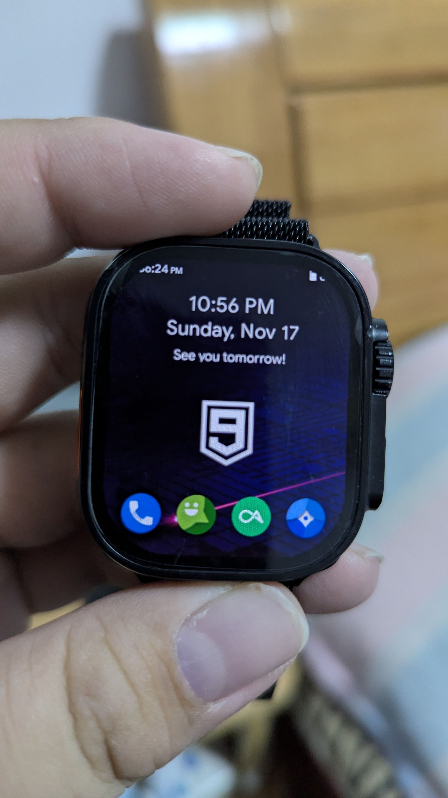
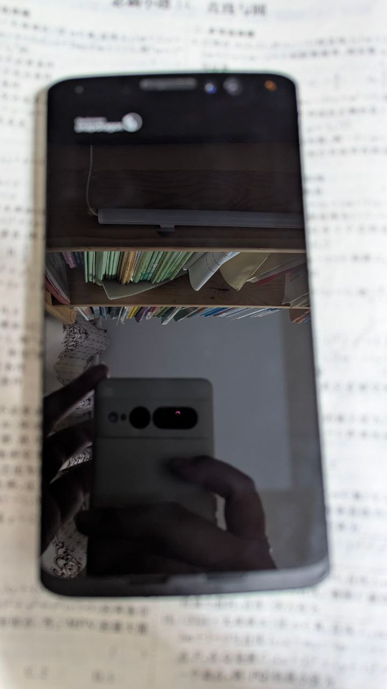

由不知名自由軟體愛好者 EDKPiepaint 創建的一系列迷因，同時將解釋迷因的含義。

# 2024 年

## 我投靠更有價值的樹莓派

時間：2024年9月15日  

當你不再因爲CP值買開發板之後，我選擇更有價值的樹莓派。 

含義：做ARM開發板的廠商很多，樹莓派基金會推出的Raspberry Pi系列算是最為成功的產品。其他中國廠商生產的開發板雖然性能更好，外觀更漂亮，但卻常常有驅動閉源、Linux支援度比Android落後、廠商帶頭違反GPL、社群不夠大等問題。 
原版：來自[Ivon的部落格](https://ivonblog.com/posts/my-ptt-forum-signatures/)  

## DW99: 一表打所有

時間：2024年12月28日  

雖然DW99只是山寨手錶，但是它也可以執行 Android 10，也可以流暢執行諸如《狂野飆車9》一類的爲現在的中高階手機開發的遊戲，在CPU時脈降低到最低的768MHz，開啓飛航模式後，電池的持續時間從1天延長到了10天！不必那些幾千塊的 Apple Watch 和其它正經 Android 手錶差勁！

含義：雖然我對於“DW99”這個不知名山寨 Apple Watch Ultra 的小牌 Android 手錶的相關研究從2025年2月時才開始（高三的寒假從28天縮成7天，提前開學補課，真有你的！！），且主要用於上課或者是自習課摸魚之用，以此來度過難熬的時間。但是，正是因爲我的“摸魚”需要，以及我一貫對於電子產品“鑽研到底”的作風，還有不解鎖，不 Root 就會犯躁鬱症的心理問題，我開始了對這塊手錶的折騰之旅。 

這塊手錶原本運行基於 Android 8.1 的“和順城”作業系統，使用的鏡片也是2019年的紫光展銳SC9832E晶片，四核心1.4GHz的時脈使得這塊表的效能和順暢度非常低下。而且原廠的系統後臺保活能力非常差，系統UI大量的動畫缺失讓我感到不爽。通過Google搜尋和檢索各大BBS後，我設法解開了BL鎖，又通過對原廠系統的 Vendor 分區進行了修改，成功刷入了 Android 10 的 GSI。與原廠的 Android 8.1 相比，順暢度、動畫、和後臺保活能力都有了改善。不幸的是，由於 GSI 缺失展訊相關的IMS組件，所有 GSI 都無法進行通話，但是可以使用行動數據網絡。 

之後，又通過刷入相關 Magisk 模組、調節 Swap 和 ZRAM 來讓手錶運行時更加順暢，在進行了一系列調優之後，我的DW99也可以玩諸如 Minecraft 基岩版和《狂野飆車》（5、7、8、9 代都可以流暢玩）之類的遊戲了，其中《狂野飆車9》是可以用高畫質玩的。就是靠這些遊戲來度過難熬的學校時光。雖然後期簽了不上晚自習的離校協議，每天都可以下午5點放學，但是這一“摸魚”的傳統還是遺留下來，直到我昨天高考完畢。當然，不是每個自習課都會玩遊戲，有時也會用我的自建VPN看看我的 X 和 Reddit 社群來看看最新的新聞和自由軟體相關的內容，可以說我的待遇，雖不敢說堪比家裏，但是與學校裏那些一週才可以回家一次的住校生而言，也不錯了。後來，也不知是誰最先發現，或者道聽途說，四分部有人在自習課上用手錶摸魚之後，我班上的那些女同學紛紛效仿我，只是她們拿來的都是正兒八經的“真東西”：Apple Watch、OPPO Watch、華爲的Watch GT 3 之類的。除了Apple 外，其它的手錶都是基於 Android 的。她們還因我玩《狂野飆車》的事來挖苦、嘲笑我。每當我說“那你們也下載下來玩玩看”之類的話時，她們便會說“我們的表不能玩”或者“我不會安裝軟體”之類的話，然後便大笑。但是不管別人怎麼看，我用我的DW99實現了一般手機的功能，除了可以玩遊戲、看 YouTube 的視頻，以及瀏覽 Reddit 之類的社群網站，也可以拍照和撥打電話，而那些幾千塊的 Apple Watch、華爲Watch GT 3 卻不能，也算是“一表打所有”了吧（當然，山寨品是不建議購買的）！

## 用 Windows 11 的人都是小男娘

時間：2024年10月19日  

那些用 Windows 11 的人都是小男娘！真男人都用 Arch Linux ！  

含義：本迷因的創作目的是對某個同學的人身攻擊所進行的反制措施。原因是某位李姓的同學（我就不指名道姓了）在班上曾公開宣講 Linux 是只有原始人和傻子蠢材一類人才會用的作業系統，以及宣講 Linux 有多麼低劣，Windows 有多麼高效，多麼符合國人使用之類的話。作爲自由軟體愛好者、Linux 使用者的我自然無法容忍。于是我便用同樣的方法對其進行回擊。

## 菜楊也精神了

時間：2024年8月25日  

...所以啊，不要跟我講什麼13代酷睿、12代酷睿，這個8代賽揚，使用 Linux Zen 核心、開啓 ZRAM 和 Swap 的話嗎，菜楊也給你精神了！  

含義：我在2024年，在閒魚上購買了華碩的 Chromebox 3 代電腦，但是我爲了省錢，就選擇了自帶8GB RAM 和預裝 Intel 的 賽揚（因爲賽揚是最低端處理器，也就有了“菜楊”的稱號）3865U處理器的最低端版本。但是，在安裝了 Manjaro Linux 後，通過使用 Zen 核心和合理的 ZRAM與 Swap 配置後，系統的流暢度有了明顯的提升，也從最初的“堪用”到完全可用的水平。

# 2025 年

因爲高三下學期學業繁忙和備戰高考（考試又不是上戰場，有必要備戰嗎）的緣故，2025年的迷因較少。但是依然足夠經典。  

## 我這個手機，是高通MTP845啊！！！

時間：2025年2月  

每當有人指着你的MTP845問你這是什麼的時候，你就可以大聲地對他說：“阿sir，我這個手機，是MTP845啊！”  

含義：高通的MTP工程機因爲其低調的黑色塑料外殼、以及邊角料熒幕，配以內在性能強大的晶片，這與普通手機的現代、精緻的外觀有着鮮明的對比，常常會被人誤認爲是十幾年前的手機。

## Linux終於成為了4%仔

時間：2025年6月1日

根據統計資料顯示，Linux終於成為了4%。  

解釋：根據來自 Statcounter 的統計資料顯示，Linux桌面系統的市佔率在2024年來到了4%。面對其他作業系統的圍攻，最後還是只有4%。

