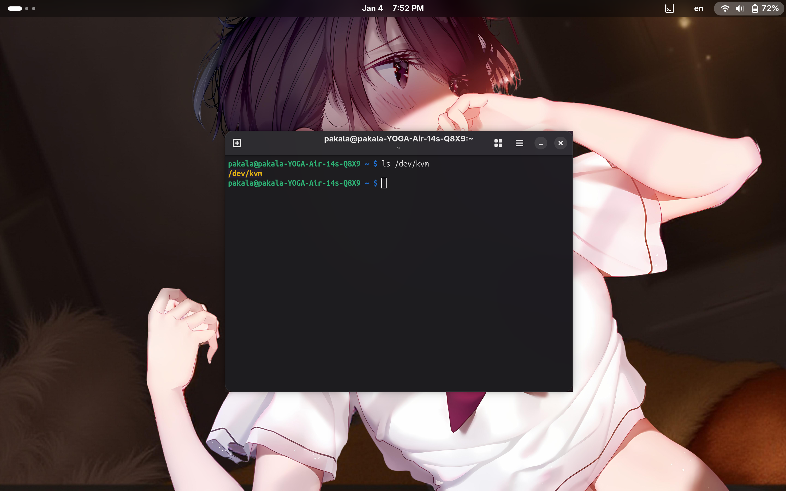
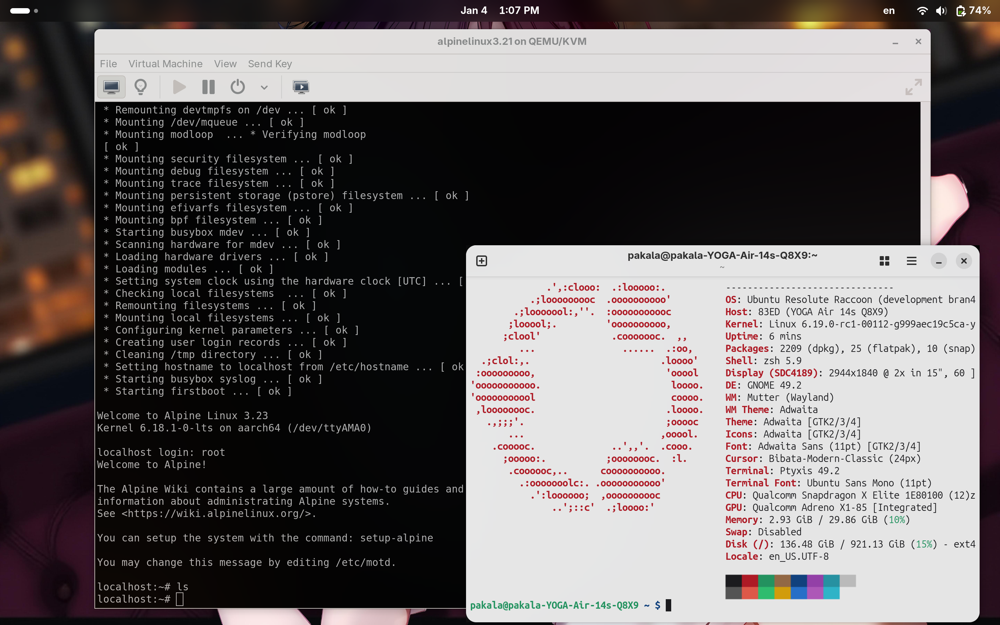
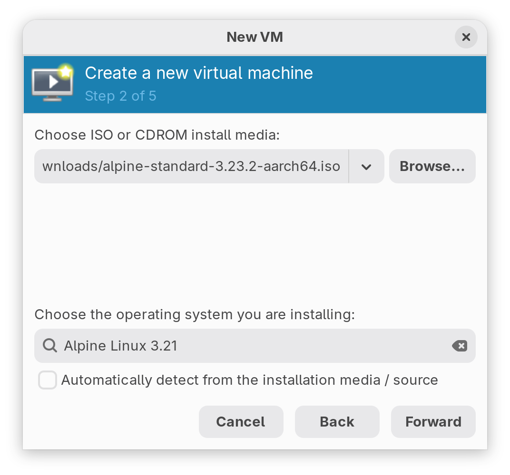
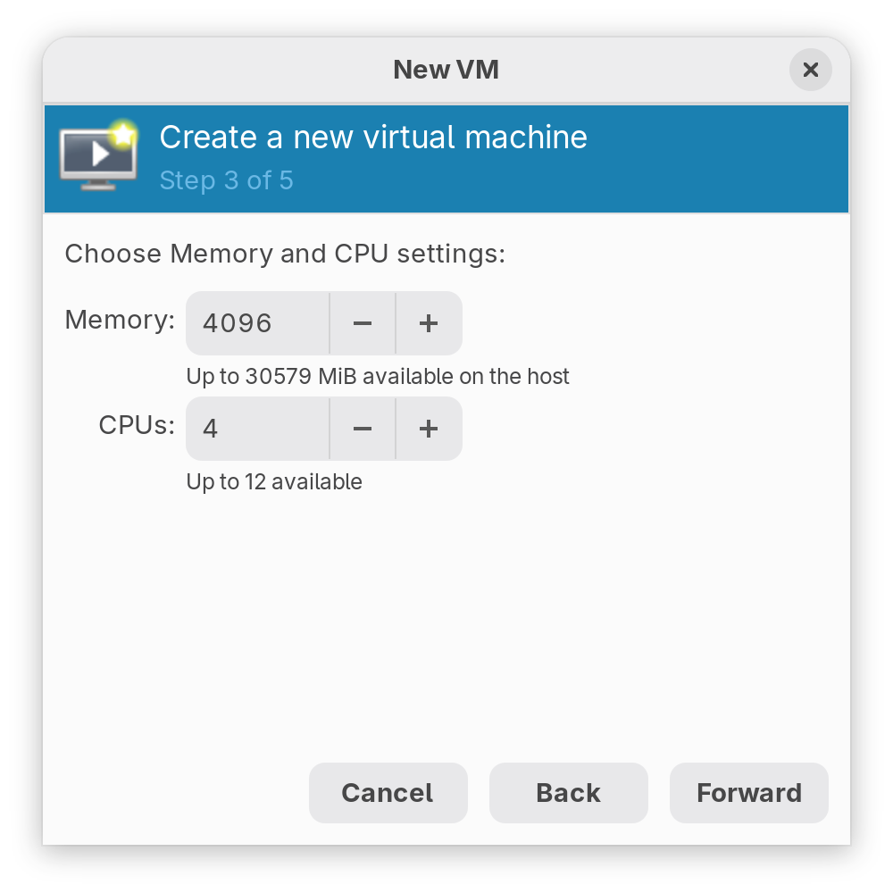
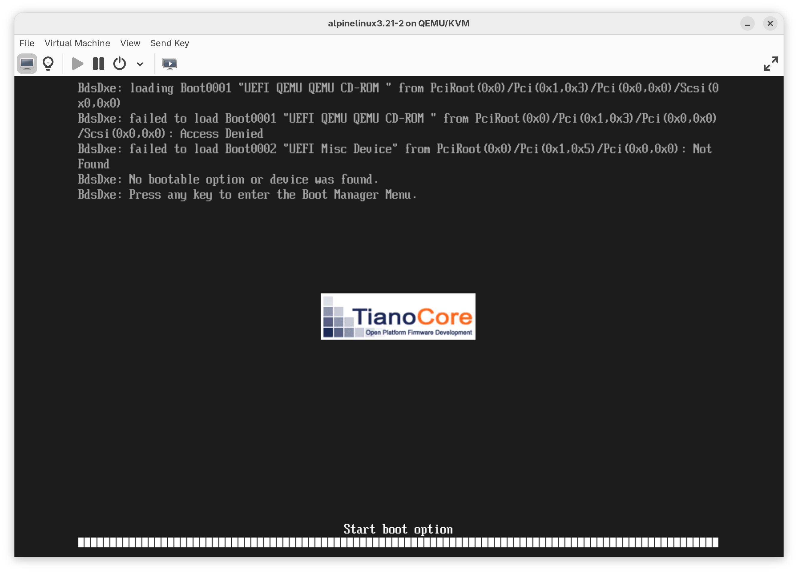

# 一切的開端

自從我將我的主力筆電從 MacBook Air 換成這臺 Lenovo Yoga Air 14s 之後，我對於驍龍 X Elite 的好感也逐漸上升。不只是震驚於12顆效能強勁的Oryon CPU 核心和32GB的記憶體，使得我無論是應付日常事物，亦或是嵌入式Linux開發都變得綽綽有餘。但是，就像其他任何筆電一樣，這臺 Yoga Air 14s 也有自己的缺點。</br>
它默認採用的是 Windows 11 ARM 作業系統，而且還預載的是 Home Edition，與完整版的 Windows 11 相比缺少了 Hyper-V虛擬機支援。我只好備份了有用的資料後，抹掉整個硬碟重新安裝了 Windows 11 Pro，這次在「可選功能」中總算有了「Hyper-V」選項，我便打開了相關功能，然後重開機，下載了 Debian 13 的ARM 安裝映像檔。嘗試啓用虛擬機，然而虛擬機卻卡住了，無論怎麼修改虛擬機設定檔都無法進入 Debian 的安裝程式。加之 Windows 作業系統是出了名的「間諜軟體」，我可不想讓 Microsoft 監控我！所以我又安裝了目前唯一多數硬體工作正常的 Ubuntu 作業系統。但是 KVM 的功能需要自己手動配置。</br>


# 準備工作

首先，在網路搜尋「 UEFI Shell 」，找到相對應的 [GitHub 存儲庫網址](https://github.com/pbatard/UEFI-Shell/releases)，下載檔案名爲 `shellaa64.efi` 的EFI應用程式，將其複製到 EFI系統分割中的 `/EFI/BOOT/` 目錄下。

::github{repo="pbatard/UEFI-Shell"}

如果妳使用的是 rEFInd 或者 `systemd-boot` 引導載入器，那麼它們會自動搜尋 UEFI shell 並將其添加到選單中，如果是 GRUB 使用者，可能還需要進行手動設定。</br>
然後，到 GitHub 上搜尋[「slbounce」](https://github.com/TravMurav/slbounce)，然後下載 `slbounce.efi` 和 `sltest.efi` 兩個EFI應用程式，將其複製到 EFI系統分割中。之後我們需要從 Windows 中複製 `tcblaunch.exe`，可以從正常的系統中複製，也可以從其他地方獲取。至於 `tcblaunch.exe` 則是我們要後續執行「安全啓動」（Secure Launch，高通 Windows 平臺中，作業系統核心將自身從默認的EL1異常層級提升到EL2層級執行的過程）所需要的關鍵「鑰匙」。其原理過於複雜，對於絕大多數使用者可能難以理解，所以我將其根據我的理解寫於下面，供專業讀者進行參考：

- 現代的 Windows on ARM（WoA）設備默認使用 Hyper-V 提供部分虛擬化功能（例如：Windows Subsys. for Linux (WSL), Windows Sandbox, Windows Subsystem for Android (WSA) 以及 Docker 之類），其虛擬機管理員總是以EL2異常層級執行。這與作業系統核心在EL1異常層級執行，和應用程式在EL0異常層級執行所不同。因爲 ARM 提出的 [ARM Base Root Requirements](https://developer.arm.com/documentation/den0044/latest) 規範強制要求，UEFI韌體必須執行在 EL2異常層級下，以准許安裝或配置虛擬機或者支援虛擬化感知的作業系統；
- 自 SD835 (MSM8998)起，高通驍龍平臺的引導程式一律採用標準的 UEFI 韌體取代了之前的 Little Kernel 引導程式。但是高通的 UEFI 韌體並不滿足上述的「 ARM Base Root Requirements 」 中對於 UEFI 韌體的要求，儘管高通平臺支援 ARM 虛擬化技術，但是 UEFI 韌體是以 EL1 異常層級執行，所以作業系統及其虛擬機管理員無法訪問硬體 Hypervisior 。因此就必須實現自訂軟體實作，使得作業系統可以接管EL2異常層級的控制權，並且啓動Hypervisior；
- Qualcomm 所謂的 Secure Launch，不是 ARM Trusted Boot（BL1/BL2/BL31/TF-A）[^1] ，也不是 UEFI Secure Boot，而是 Windows 專用的 hypervisor 啓動過程：即在 Windows kernel 啓動前，於「可信狀態」下建立 EL2 執行環境，並讓 Hyper‑V 接管該層級；
- `tcblaunch.exe` 是 Microsoft 簽名的 TCB（Trusted Computing Base）組件，其能力包括：呼叫 Qualcomm 平臺私有的 Secure Monitor / firmware 接口、重新配置 Exception Level、初始化 hypervisor 所需的系統暫存器與記憶體佈局，這是在不修改韌體的情況下進入 EL2異常層級的唯一方法；
- `slbounce` 的設計目標並非繞過或破壞 Secure Launch，而是在合法且被信任的前提下觸發 Secure Launch，於不啓動 Windows 的情況下取得 EL2，並將已建立之 EL2 狀態交由 Linux 繼承；
- Secure Launch 在設計上即發生於 OS 啓動之前，因此 EFI 階段是唯一合理的切入點。其中，`ExitBootServices()` 函式作為 UEFI 與作業系統之間的邊界，因此成為最合適的攔截位置。slbounce 以 EFI driver 形式載入，其實際流程如下：

1. slbounce.efi 被 UEFI loader 載入;
2. 驗證並定位 `tcblaunch.exe`;
3. 安裝 `ExitBootServices()` hook;
4. 攔截 bootloader 對 `ExitBootServices()` 的呼叫;
5. 在 EFI context 中執行 `tcblaunch.exe`;
6. Secure Launch firmware 路徑被觸發並建立 EL2；
7. `tcblaunch.exe` 正常返回；
8. 控制權交還 bootloader，繼續啓動 Linux；
   此時，系統已完成 Secure Launch，但後續啓動的並非 Windows，而是 Linux。</br>
   下載完成後，重開機到 `systemd-boot` 引導器，選擇「 EFI Shell 」，之後你就會進入 UEFI Shell。此時我們需要找到硬碟的 EFI系統分割（例如 `fs3`），然後在 shell 中鍵入 `fs3:`，按下 Enter 鍵，你就會來到 EFI系統分割。可以鍵入 `ls` 來查看分割內容。
   找到先前複製的 `sltest.efi` `slbounce.efi` 以及 `tcblaunch.exe`，開始進行測試。
   鍵入 `sltest.efi tcblaunch.exe`，此時螢幕上會出現「 Performing Secure Launch 」的日誌，如果成功，在熒幕頂端會展示綠色的矩形框。之後重開機即可。

# 編譯核心

由於 Ubuntu 的核心並不支援 EL2 異常層級，所以我們需要自行編譯核心。我採用了 Linaro 維護的 `aarch64-laptop` [核心分支](https://gitlab.com/Linaro/arm64-laptops/linux/-/tree/qcom-laptops)。
使用 `git clone` 將原始碼下載到本機，然後鍵入 `make defconfig qcom_laptops.config` 產生核心配置檔，之後鍵入 `make -j12` 開始編譯。整個編譯過程耗時大約5分鐘（我有拿手機記錄時間，並把編譯核心和模組的時間算進去），之後鍵入 `sudo make modules_install install` 安裝編譯好的核心。在編譯中會生成所有 X Elite 設備的`-el2.dtb` 設備樹，這是啓用 Secure Launch 所需的設備樹。之後配置引導載入器，新增 EL2 異常層級的配置檔，並指定對應的設備樹：

```yaml
# NOTE: This is an example configuration file for systemd-boot.
# In /boot/efi/loader/entries

title Ubuntu (EL2)
linux /vmlinux-6.19.0-rc1-00112-g999aec19c5ca-dirty
initrd /initrd.img-6.19.0-rc1-00112-g999aec19c5ca-dirty
options root=UUID=610ef124-aae3-4bbe-a29d-a17f44c708e9 debug earlycon=efifb ro clk_ignore_unused pd_ignore_unused cma=128M efi=noruntime loglevel=7 snd_soc_x1e80100.i_accept_the_danger id_aa64mmfr0.ecv=1 earlycon console=tty0 crashkernel=2G-4G:320M,4G-32G:512M,32G-64G:1024M,64G-128G:2048M,128G-:4096M
devicetree /x1e80100-lenovo-yoga-slim7x-el2.dtb
```

需要注意在核心中添加 `id_aa64mmfr0.ecv=1` 引數，否則在使用虛擬機時會當機重啓。

# 安裝 Virt Manager

準備完成後，進入 EFI Shell，找到硬碟的 EFI系統分割，鍵入 `load slbounce.efi` 加載驅動程式，之後找到系統的開機載入器，通過 EFI Shell 執行，選擇先前的配置選項。如果核心正常啓動，就說明 Secure Launch 成功。在終端機中鍵入 `ls /dev/kvm` 確認是否有 `/dev/kvm` 裝置，如果有，就表示 KVM 模組成功安裝。



之後的步驟，建議將你的筆電接上電源，因爲高通 ADSP 在 EL2 異常層級下不會被核心 Hypervisior 初始化，因此所有依賴 ADSP 子系統的功能會噴掉，比如 Wi-Fi和電池（表現爲電量始終顯示0%），還有聲音。目前的解決辦法是使用 ADSP-lite 驅動，這樣勉強可以補回一些功能。或者改用新的 [qebspil](https://github.com/stephan-gh/qebspil/)驅動，讓UEFI初始化這些子系統。

現在，讓我們來安裝 Virt Manager，這是一個用於管理虛擬機的圖形化工具。在 Ubuntu 26.04 環境下，可以通過 `sudo apt install virt-manager` 安裝。之後啓用對應的 `systemd` 服務即可。
然後，安裝`qemu-system-arm`套件：
```bash
sudo apt install qemu-system-arm
```
之後，將自己加入`libvirt`組，登出，再登入，就可以使用 Virt Manager 啓動虛擬機了。



之後，建立新的虛擬機，注意虛擬機類型要選擇「KVM」才會有KVM加速。


載入 Alpine Linux 安裝映像檔，然後按下「下一步」。



指定分給虛擬機的記憶體和CPU個數，驍龍 X Elite 已經很強了，所以我分給虛擬機 4個核心和4GB 記憶體。



建立虛擬磁碟，我選擇 20GB 的空間。


設定虛擬機的網路，保持默認即可。之後開機，你應該會看到 Tianocore 的啓動 Logo:


如果遇到「Access denied」錯誤，這是因爲虛擬機的UEFI韌體開啓了安全啓動，到「設定」中關閉即可。



之後開機。開機後只會有`tty`畫面，鍵入`root`登入系統。</br>
之後鍵入`setup-alpine`安裝 Alpine Linux，接着就會問一系列問題：</br>
```bash
root@alpine:~# setup-alpine
# 鍵盤配置
Select keyboard layout: [us]
Select variant: [us-alt-int]

# 主機名稱
Enter system hostname: [alpine]

# 啟用網路界面
Which one do you want to initialize? [eth0]

# 使用DHCP
Ip  address for eth0? [dhcp]
Do you want to do any manual netowrk configuration? [n]

# 設定Root密碼
New password:

#設定時區
Which timezone are you in? [Asia/Taipei]

#是否設定代理伺服器

HTTP/FTP proxy URL? [none]

# 啟用community套件庫
Enter mirror number: [c]

# 讓Alpine自動抓取速度最快的套件庫站點
Enter mirror number: [f]

# 新增一般使用者帳號"ykia"和設定密碼
Setup a user? [ykia]
New password for ykia:

# 跳過新增SSH金鑰
Enter ssh key or URL for ivon: [none]

# 安裝OpenSSH伺服器
Which ssh server? [openssh]

# 將系統安裝至硬碟，Alpine會自動安裝GRUB
Which disk would you like to use? [vda]
How would you like to use it? [sys]
WARNING: Erase the above disk(s) and continue? [y]
```

安裝完成後重開機，登入 `root` 賬號，執行`apk update && apk upgrade`更新套件庫。</br>
安裝 `sudo` 套件，並設定 `ykia` 為 `sudo` 的管理員：</br>
```bash
apk add sudo
```
執行`visudo`將一般使用者加入sudo：</br>
```bash
ykia ALL=(ALL:ALL) ALL
```
之後重開機，改用一般賬號登入。</br>

如果覺得虛擬機執行效能低下，可以在「設定」中配置使用 OpenGL 加速，虛擬機可以喫到 Adreno 內建繪圖卡的 3D 加速：


[^1]: 唯一的例外是 ChromeOS 平臺(LC)，它採用 ARM 的 Trusted Firmware (TF-A)，而不是高通專有的引導流程，默認允許作業系統以 EL2異常層級啓動。