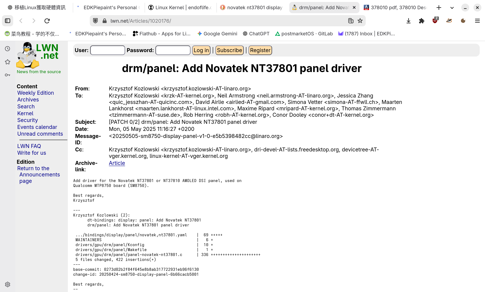
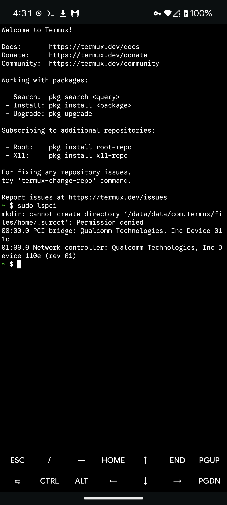
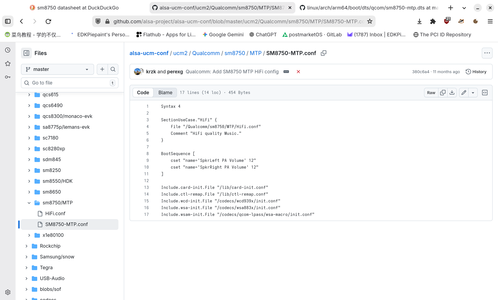

在上次的 MTP8750 評測後，我給予這臺工程機非常好的評價。既然它作爲一臺合格的工程機，那就必須要做點只有工程機才能乾的事，所以我決定要移植 Arch Linux ARM 作業系統。

# 硬體探索

在上次的測評中我將高通常見的工程平臺（MTP,QRD）與一般量產手機進行了對比，同時也簡單的介紹了這臺 MTP8750 的硬體配置。這裏，我們再從之前的文章中貼上這些規格，供大家參考：

- 一顆早期（ES）版的 SM8750 CPU [^1]，8個核心，ARM V9指令集；
- Adreno 830 GPU，支援 OpenGL ES 3.2；
- 16GB LPDDR5X記憶體；
- 512GB UFS 4.0，經確認UFS來自東芝

想要獲取更多硬體資訊，我們就需要從作業系統下手了，好在 Android 至少算是個 Linux 發行版，有很多 Linux 獲取硬體資料的方法在 Android 上同樣使用。只是對於默認拔掉 Root 的 Android 來說，Linux 上獲取硬體信息的方法會有不少阻礙，破除這些阻礙的方法就是取得 Root 權限。不過工程機的 AOSP 系統默認開啓 `ADB Root` ，因此除錯和獲取日誌都要比量產機容易的多，只需要一根 Type-C 數據線就可以開始工作了：首先，開啓終端機，安裝 `android-tools` 套件：

```bash
sudo pacman -S android-tools
```

然後鍵入 `adb root` 將 `adbd` 以 Root 重開，當看到用戶提示符號變成井號（#）之後，就代表你成功取得 Root 權限了！現在，讓我們開始後續的工作吧！

## 獲取核心版本

和 Linux 發行版一樣，Android也可以通過常見的 `uname` 和 `cat /proc/version` 命令來獲得核心版本，這樣可以讓我們明白這臺手機的核心版本與主線核心的差別。這是來自 SM8750 MTP 的結果：

```bash
sun:/ # cat /proc/version
Linux version 6.6.50-android15-8-maybe-dirty-4k (kleaf@build-host) (Android (11368308, +pgo, +bolt, +lto, +mlgo, based on r510928) clang version 18.0.0 (https://android.googlesource.com/toolchain/llvm-project 477610d4d0d988e69dbc3fae4fe86bff3f07f2b5), LLD 18.0.0) #1 SMP PREEMPT Thu Jan  1 00:00:00 UTC 1970
```

核心採用的是基於長期支援版本（LTS）修改的 6.6.50核心，發佈於2023年。雖然近些年來 Google 的 GKI 在一定程度上縮短了 Android 下游核心與主線核心的差距，但是問題依舊嚴峻。作爲一個發佈於2024年的晶片，卻還再用著過時的 6.6 核心... 值得一提的是核心採用了 4K 分頁大小編譯，看來 SM8750 還有支援16K 分頁的核心嘍？不過這都和我們的主線任務沒有任何關係。

## 獲取記憶體資訊

記憶體資訊可以通過 `cat /proc/meminfo` 命令獲取，這樣可以獲得記憶體容量、使用量、空間等資訊。這是來自 SM8750 MTP 的結果：

```bash
130|sun:/ # cat /proc/meminfo
MemTotal:       15543532 kB
MemFree:         4895720 kB
MemAvailable:   11264748 kB
Buffers:           18684 kB
Cached:          5749708 kB
SwapCached:            8 kB
Active:          3812464 kB
Inactive:        3266116 kB
Active(anon):    1636304 kB
Inactive(anon):        8 kB
Active(file):    2176160 kB
Inactive(file):  3266108 kB
Unevictable:      303252 kB
Mlocked:          180348 kB
SwapTotal:       6291452 kB
SwapFree:        5168380 kB
Dirty:                72 kB
Writeback:             0 kB
AnonPages:       1609740 kB
Mapped:          1303112 kB
Shmem:            153116 kB
KReclaimable:    1242056 kB
Slab:             783164 kB
SReclaimable:     265852 kB
SUnreclaim:       517312 kB
KernelStack:       74688 kB
ShadowCallStack:       0 kB
PageTables:       162628 kB
SecPageTables:         0 kB
NFS_Unstable:          0 kB
Bounce:                0 kB
WritebackTmp:          0 kB
CommitLimit:    14063216 kB
Committed_AS:   307714316 kB
VmallocTotal:   257687552 kB
VmallocUsed:      226660 kB
VmallocChunk:          0 kB
Percpu:            23616 kB
AnonHugePages:    178176 kB
ShmemHugePages:        0 kB
ShmemPmdMapped:        0 kB
FileHugePages:         0 kB
FilePmdMapped:         0 kB
CmaTotal:         643072 kB
CmaFree:          590220 kB
```

目前來看，這裏面唯一有用的一句是 `MemTotal` 字段，它告訴我們這臺工程機有16GB的記憶體...

## 獲取分區信息

同樣地，使用 `cat /proc/partitions` 命令可以獲取分區信息，這樣可以獲得各個分區的大小、格式、掛載點等資訊。這是來自 SM8750 MTP 的結果：

```bash
major minor  #blocks  name

   1        0       8192 ram0
   1        1       8192 ram1
   1        2       8192 ram2
   1        3       8192 ram3
   1        4       8192 ram4
   1        5       8192 ram5
   1        6       8192 ram6
   1        7       8192 ram7
   1        8       8192 ram8
   1        9       8192 ram9
   1       10       8192 ram10
   1       11       8192 ram11
   1       12       8192 ram12
   1       13       8192 ram13
   1       14       8192 ram14
   1       15       8192 ram15
   7        0      39744 loop0
   7        8        836 loop1
   7       16      93148 loop2
   7       24      11252 loop3
   7       32       6312 loop4
   7       40     101248 loop5
   7       48        268 loop6
   7       56        336 loop7
   7       64      29528 loop8
   7       72       4860 loop9
   7       80       3632 loop10
   7       88      92200 loop11
   7       96        808 loop12
   7      104     111964 loop13
   7      112      46412 loop14
   7      120      11252 loop15
   8        0  487096320 sda
   8        1          8 sda1
   8        2      32768 sda2
   8        3       1024 sda3
   8        4        512 sda4
   8        5        512 sda5
   8        6    6291456 sda6
   8        7         64 sda7
   8        8         64 sda8
   8        9      65536 sda9
   8       10   17301504 sda10
   8       11    4194304 sda11
   8       12  459208524 sda12
   8       16      20480 sdb
   8       17       3584 sdb1
   8       18        344 sdb2
   8       19         32 sdb3
   8       20         32 sdb4
   8       21        256 sdb5
   8       48      32768 sdd
   8       49        104 sdd1
   8       50        128 sdd2
   8       51       1024 sdd3
   8       32      20480 sdc
   8       33       3584 sdc1
   8       34        344 sdc2
   8       35         32 sdc3
   8       36         32 sdc4
   8       37        256 sdc5
   8       64      32768 sde
   8       65        104 sde1
   8       66       4096 sde2
   8       67       4096 sde3
   8       68       4096 sde4
   8       69        128 sde5
   8       80    4194304 sdf
   8       81       5120 sdf1
   8       82        512 sdf2
   8       83        512 sdf3
   8       84       5120 sdf4
   8       85       8192 sdf5
   8       86     460800 sdf6
   8       87      10240 sdf7
   8       88       1024 sdf8
   8       89      65536 sdf9
   8       90      10240 sdf10
   8       91        128 sdf11
   8       92      98304 sdf12
   8       93        128 sdf13
   8       94         80 sdf14
   8       95         64 sdf15
 259        0      24576 sdf16
 259        1       2048 sdf17
 259        2       2048 sdf18
 259        3        256 sdf19
 259        4     174080 sdf20
 259        5     550000 sdf21
 259        6       1024 sdf22
 259        7        128 sdf23
 259        8      16384 sdf24
 259        9      98304 sdf25
 259       10      30720 sdf26
 259       11        256 sdf27
 259       12     102400 sdf28
 259       13       2048 sdf29
 259       14       8192 sdf30
 259       15         64 sdf31
 259       16       1024 sdf32
 259       17        512 sdf33
 259       18         24 sdf34
 259       19        256 sdf35
 259       20        128 sdf36
 259       21       5120 sdf37
 259       22        512 sdf38
 259       23        512 sdf39
 259       24       5120 sdf40
 259       25       8192 sdf41
 259       26     460800 sdf42
 259       27      10240 sdf43
 259       28       1024 sdf44
 259       29      65536 sdf45
 259       30      10240 sdf46
 259       31        128 sdf47
 259       32      98304 sdf48
 259       33        128 sdf49
 259       34         80 sdf50
 259       35         64 sdf51
 259       36      24576 sdf52
 259       37       2048 sdf53
 259       38       2048 sdf54
 259       39        256 sdf55
 259       40     550000 sdf56
 259       41       1024 sdf57
 259       42        128 sdf58
 259       43     174080 sdf59
 259       44      98304 sdf60
 259       45        256 sdf61
 259       46     102400 sdf62
 259       47       2048 sdf63
 259       48       8192 sdf64
 259       49         64 sdf65
 259       50       1024 sdf66
 259       51        512 sdf67
 259       52         24 sdf68
 259       53        256 sdf69
 259       54        128 sdf70
 259       55          4 sdf71
 259       56       1024 sdf72
 259       57       8192 sdf73
 259       58      40960 sdf74
 259       59     524288 sdf75
 259       60        128 sdf76
 259       61        512 sdf77
 259       62         28 sdf78
 259       63        512 sdf79
 259       64     235520 sdf80
 259       65       1024 sdf81
 259       66      20480 sdf82
 259       67        128 sdf83
 259       68        128 sdf84
 259       69      32768 sdf85
 259       70         64 sdf86
 259       71        128 sdf87
 259       72          8 sdf88
   8       96    4194304 sdg
   8      112    4194304 sdh
 254        0       1692 dm-0
 254        1    2589236 dm-1
 254        2      11940 dm-2
 254        3     804512 dm-3
 254        4    1647464 dm-4
 254        5     141248 dm-5
   7      128      93148 loop16
   7      136        836 loop17
   7      144      23324 loop18
   7      152      40892 loop19
   7      160        268 loop20
   7      168      41180 loop21
   7      176      15832 loop22
   7      184      39744 loop23
   7      192      32064 loop24
   7      200      23324 loop25
   7      208      26196 loop26
   7      216      40792 loop27
   7      224      41420 loop28
   7      232       1336 loop29
   7      240       7088 loop30
   7      248       7288 loop31
   7      256       8152 loop32
   7      264      19164 loop33
   7      272        824 loop34
   7      280      14116 loop35
   7      288      10984 loop36
   7      296      10752 loop37
   7      304       1860 loop38
   7      312       6132 loop39
   7      320       1616 loop40
   7      328      10076 loop41
   7      336        268 loop42
   7      344      26256 loop43
   7      352       3104 loop44
   7      360       6184 loop45
   7      368      25136 loop46
   7      376       4556 loop47
   7      384       9624 loop48
 254        6      24928 dm-6
 254        7       6124 dm-7
 254        8      26040 dm-8
 254        9        256 dm-9
 254       10       4508 dm-10
 254       11       9536 dm-11
 254       13       9984 dm-13
 254       14       1588 dm-14
 254       15      29284 dm-15
 254       17       1832 dm-17
 254       19      10656 dm-19
 254       21      10884 dm-21
 254       22      13992 dm-22
 254       24       6072 dm-24
 254       25        804 dm-25
 254       28      19000 dm-28
 254       29       8076 dm-29
 254       31       7216 dm-31
 254       38       7020 dm-38
 254       43        324 dm-43
 254       44      41084 dm-44
 254       45      25980 dm-45
 254       48      23128 dm-48
 254       50      31800 dm-50
 253        0    6291456 zram0
 254       51  459208524 dm-51
```

這樣只能得到每個分割的大小，看不出其他資訊來。想要獲得每個設備節點的對應關係，需要在 `/dev` 目錄下執行 `ls -l /dev` 獲取結果：

```yaml
sun:/dev/block/by-name # ls -l
total 0
lrwxrwxrwx 1 root root 15 1970-01-07 17:43 ALIGN_TO_128K_1 -> /dev/block/sdd1
lrwxrwxrwx 1 root root 15 1970-01-07 17:43 ALIGN_TO_128K_2 -> /dev/block/sde1
lrwxrwxrwx 1 root root 15 1970-01-07 17:43 abl_a -> /dev/block/sdf8
lrwxrwxrwx 1 root root 16 1970-01-07 17:43 abl_b -> /dev/block/sdf44
lrwxrwxrwx 1 root root 15 1970-01-07 17:43 aop_a -> /dev/block/sdf2
lrwxrwxrwx 1 root root 16 1970-01-07 17:43 aop_b -> /dev/block/sdf38
lrwxrwxrwx 1 root root 15 1970-01-07 17:43 aop_config_a -> /dev/block/sdf3
lrwxrwxrwx 1 root root 16 1970-01-07 17:43 aop_config_b -> /dev/block/sdf39
lrwxrwxrwx 1 root root 15 1970-01-07 17:43 apdp -> /dev/block/sdb5
lrwxrwxrwx 1 root root 15 1970-01-07 17:43 apdpb -> /dev/block/sdc5
lrwxrwxrwx 1 root root 15 1970-01-07 17:43 bluetooth_a -> /dev/block/sdf7
lrwxrwxrwx 1 root root 16 1970-01-07 17:43 bluetooth_b -> /dev/block/sdf43
lrwxrwxrwx 1 root root 16 1970-01-07 17:43 boot_a -> /dev/block/sdf12
lrwxrwxrwx 1 root root 16 1970-01-07 17:43 boot_b -> /dev/block/sdf48
lrwxrwxrwx 1 root root 15 1970-01-07 17:43 cdt -> /dev/block/sdd2
lrwxrwxrwx 1 root root 16 1970-01-07 17:43 connsec -> /dev/block/sdf83
lrwxrwxrwx 1 root root 16 1970-01-07 17:43 core_nhlos_a -> /dev/block/sdf20
lrwxrwxrwx 1 root root 16 1970-01-07 17:43 core_nhlos_b -> /dev/block/sdf59
lrwxrwxrwx 1 root root 16 1970-01-07 17:43 cpucp_a -> /dev/block/sdf22
lrwxrwxrwx 1 root root 16 1970-01-07 17:43 cpucp_b -> /dev/block/sdf57
lrwxrwxrwx 1 root root 16 1970-01-07 17:43 cpucp_dtb_a -> /dev/block/sdf31
lrwxrwxrwx 1 root root 16 1970-01-07 17:43 cpucp_dtb_b -> /dev/block/sdf65
lrwxrwxrwx 1 root root 15 1970-01-07 17:43 ddr -> /dev/block/sdd3
lrwxrwxrwx 1 root root 16 1970-01-07 17:43 devcfg_a -> /dev/block/sdf13
lrwxrwxrwx 1 root root 16 1970-01-07 17:43 devcfg_b -> /dev/block/sdf49
lrwxrwxrwx 1 root root 16 1970-01-07 17:43 devinfo -> /dev/block/sdf71
lrwxrwxrwx 1 root root 16 1970-01-07 17:43 dpm -> /dev/block/sdf88
lrwxrwxrwx 1 root root 15 1970-01-07 17:43 dsp_a -> /dev/block/sdf9
lrwxrwxrwx 1 root root 16 1970-01-07 17:43 dsp_b -> /dev/block/sdf45
lrwxrwxrwx 1 root root 16 1970-01-07 17:43 dtbo_a -> /dev/block/sdf16
lrwxrwxrwx 1 root root 16 1970-01-07 17:43 dtbo_b -> /dev/block/sdf52
lrwxrwxrwx 1 root root 16 1970-01-07 17:43 featenabler_a -> /dev/block/sdf23
lrwxrwxrwx 1 root root 16 1970-01-07 17:43 featenabler_b -> /dev/block/sdf58
lrwxrwxrwx 1 root root 15 1970-01-07 17:43 frp -> /dev/block/sda5
lrwxrwxrwx 1 root root 15 1970-01-07 17:43 fsc -> /dev/block/sde5
lrwxrwxrwx 1 root root 15 1970-01-07 17:43 fsg -> /dev/block/sde4
lrwxrwxrwx 1 root root 15 1970-01-07 17:43 hyp_a -> /dev/block/sdf5
lrwxrwxrwx 1 root root 16 1970-01-07 17:43 hyp_b -> /dev/block/sdf41
lrwxrwxrwx 1 root root 16 1970-01-07 17:43 imagefv_a -> /dev/block/sdf18
lrwxrwxrwx 1 root root 16 1970-01-07 17:43 imagefv_b -> /dev/block/sdf54
lrwxrwxrwx 1 root root 16 1970-01-07 17:43 init_boot_a -> /dev/block/sdf30
lrwxrwxrwx 1 root root 16 1970-01-07 17:43 init_boot_b -> /dev/block/sdf64
lrwxrwxrwx 1 root root 16 1970-01-07 17:43 keymaster_a -> /dev/block/sdf10
lrwxrwxrwx 1 root root 16 1970-01-07 17:43 keymaster_b -> /dev/block/sdf46
lrwxrwxrwx 1 root root 15 1970-01-07 17:43 keystore -> /dev/block/sda4
lrwxrwxrwx 1 root root 16 1970-01-07 17:43 logdump -> /dev/block/sdf75
lrwxrwxrwx 1 root root 16 1970-01-07 17:43 logfs -> /dev/block/sdf73
lrwxrwxrwx 1 root root 16 1970-01-07 17:43 mdcompress -> /dev/block/sdf82
lrwxrwxrwx 1 root root 15 1970-01-07 17:43 metadata -> /dev/block/sda9
lrwxrwxrwx 1 root root 15 1970-01-07 17:43 misc -> /dev/block/sda3
lrwxrwxrwx 1 root root 15 1970-01-07 17:43 modem_a -> /dev/block/sdf6
lrwxrwxrwx 1 root root 16 1970-01-07 17:43 modem_b -> /dev/block/sdf42
lrwxrwxrwx 1 root root 15 1970-01-07 17:43 modemst1 -> /dev/block/sde2
lrwxrwxrwx 1 root root 15 1970-01-07 17:43 modemst2 -> /dev/block/sde3
lrwxrwxrwx 1 root root 15 1970-01-07 17:43 multiimgoem_a -> /dev/block/sdb4
lrwxrwxrwx 1 root root 15 1970-01-07 17:43 multiimgoem_b -> /dev/block/sdc4
lrwxrwxrwx 1 root root 15 1970-01-07 17:43 multiimgqti_a -> /dev/block/sdb3
lrwxrwxrwx 1 root root 15 1970-01-07 17:43 multiimgqti_b -> /dev/block/sdc3
lrwxrwxrwx 1 root root 16 1970-01-07 17:43 pdp_a -> /dev/block/sdf35
lrwxrwxrwx 1 root root 16 1970-01-07 17:43 pdp_b -> /dev/block/sdf69
lrwxrwxrwx 1 root root 16 1970-01-07 17:43 pdp_cdb_a -> /dev/block/sdf36
lrwxrwxrwx 1 root root 16 1970-01-07 17:43 pdp_cdb_b -> /dev/block/sdf70
lrwxrwxrwx 1 root root 15 1970-01-07 17:43 persist -> /dev/block/sda2
lrwxrwxrwx 1 root root 16 1970-01-07 17:43 pvmfw_a -> /dev/block/sdf32
lrwxrwxrwx 1 root root 16 1970-01-07 17:43 pvmfw_b -> /dev/block/sdf66
lrwxrwxrwx 1 root root 16 1970-01-07 17:43 qmcs -> /dev/block/sdf26
lrwxrwxrwx 1 root root 16 1970-01-07 17:43 quantumcontentfv -> /dev/block/sdf81
lrwxrwxrwx 1 root root 16 1970-01-07 17:43 quantumfv -> /dev/block/sdf79
lrwxrwxrwx 1 root root 16 1970-01-07 17:43 quantumsdk -> /dev/block/sdf74
lrwxrwxrwx 1 root root 16 1970-01-07 17:43 questdatafv -> /dev/block/sdf24
lrwxrwxrwx 1 root root 16 1970-01-07 17:43 qupfw_a -> /dev/block/sdf14
lrwxrwxrwx 1 root root 16 1970-01-07 17:43 qupfw_b -> /dev/block/sdf50
lrwxrwxrwx 1 root root 16 1970-01-07 17:43 qweslicstore_a -> /dev/block/sdf27
lrwxrwxrwx 1 root root 16 1970-01-07 17:43 qweslicstore_b -> /dev/block/sdf61
lrwxrwxrwx 1 root root 16 1970-01-07 17:43 rawdump -> /dev/block/sda10
lrwxrwxrwx 1 root root 16 1970-01-07 17:43 recovery_a -> /dev/block/sdf28
lrwxrwxrwx 1 root root 16 1970-01-07 17:43 recovery_b -> /dev/block/sdf62
lrwxrwxrwx 1 root root 14 1970-01-07 17:43 sda -> /dev/block/sda
lrwxrwxrwx 1 root root 14 1970-01-07 17:43 sdb -> /dev/block/sdb
lrwxrwxrwx 1 root root 14 1970-01-07 17:43 sdc -> /dev/block/sdc
lrwxrwxrwx 1 root root 14 1970-01-07 17:43 sdd -> /dev/block/sdd
lrwxrwxrwx 1 root root 14 1970-01-07 17:43 sde -> /dev/block/sde
lrwxrwxrwx 1 root root 14 1970-01-07 17:43 sdf -> /dev/block/sdf
lrwxrwxrwx 1 root root 14 1970-01-07 17:43 sdg -> /dev/block/sdg
lrwxrwxrwx 1 root root 14 1970-01-07 17:43 sdh -> /dev/block/sdh
lrwxrwxrwx 1 root root 16 1970-01-07 17:43 secdata -> /dev/block/sdf78
lrwxrwxrwx 1 root root 16 1970-01-07 17:43 shrm_a -> /dev/block/sdf19
lrwxrwxrwx 1 root root 16 1970-01-07 17:43 shrm_b -> /dev/block/sdf55
lrwxrwxrwx 1 root root 16 1970-01-07 17:43 soccp_dcd_a -> /dev/block/sdf34
lrwxrwxrwx 1 root root 16 1970-01-07 17:43 soccp_dcd_b -> /dev/block/sdf68
lrwxrwxrwx 1 root root 16 1970-01-07 17:43 soccp_debug_a -> /dev/block/sdf33
lrwxrwxrwx 1 root root 16 1970-01-07 17:43 soccp_debug_b -> /dev/block/sdf67
lrwxrwxrwx 1 root root 16 1970-01-07 17:43 spunvm -> /dev/block/sdf85
lrwxrwxrwx 1 root root 16 1970-01-07 17:43 spuservice_a -> /dev/block/sdf11
lrwxrwxrwx 1 root root 16 1970-01-07 17:43 spuservice_b -> /dev/block/sdf47
lrwxrwxrwx 1 root root 15 1970-01-07 17:43 ssd -> /dev/block/sda1
lrwxrwxrwx 1 root root 16 1970-01-07 17:43 storsec -> /dev/block/sdf76
lrwxrwxrwx 1 root root 15 1970-01-07 17:43 super -> /dev/block/sda6
lrwxrwxrwx 1 root root 16 1970-01-07 17:43 testparti -> /dev/block/sda11
lrwxrwxrwx 1 root root 16 1970-01-07 17:43 toolsfv -> /dev/block/sdf72
lrwxrwxrwx 1 root root 15 1970-01-07 17:43 tz_a -> /dev/block/sdf4
lrwxrwxrwx 1 root root 16 1970-01-07 17:43 tz_b -> /dev/block/sdf40
lrwxrwxrwx 1 root root 16 1970-01-07 17:43 tzsc -> /dev/block/sdf84
lrwxrwxrwx 1 root root 15 1970-01-07 17:43 uefi_a -> /dev/block/sdf1
lrwxrwxrwx 1 root root 16 1970-01-07 17:43 uefi_b -> /dev/block/sdf37
lrwxrwxrwx 1 root root 16 1970-01-07 17:43 uefisecapp_a -> /dev/block/sdf17
lrwxrwxrwx 1 root root 16 1970-01-07 17:43 uefisecapp_b -> /dev/block/sdf53
lrwxrwxrwx 1 root root 16 1970-01-07 17:43 uefivarstore -> /dev/block/sdf77
lrwxrwxrwx 1 root root 16 1970-01-07 17:43 userdata -> /dev/block/sda12
lrwxrwxrwx 1 root root 16 1970-01-07 17:43 vbmeta_a -> /dev/block/sdf15
lrwxrwxrwx 1 root root 16 1970-01-07 17:43 vbmeta_b -> /dev/block/sdf51
lrwxrwxrwx 1 root root 15 1970-01-07 17:43 vbmeta_system_a -> /dev/block/sda7
lrwxrwxrwx 1 root root 15 1970-01-07 17:43 vbmeta_system_b -> /dev/block/sda8
lrwxrwxrwx 1 root root 16 1970-01-07 17:43 vendor_boot_a -> /dev/block/sdf25
lrwxrwxrwx 1 root root 16 1970-01-07 17:43 vendor_boot_b -> /dev/block/sdf60
lrwxrwxrwx 1 root root 16 1970-01-07 17:43 vm-bootsys_a -> /dev/block/sdf21
lrwxrwxrwx 1 root root 16 1970-01-07 17:43 vm-bootsys_b -> /dev/block/sdf56
lrwxrwxrwx 1 root root 16 1970-01-07 17:43 vm-persist -> /dev/block/sdf80
lrwxrwxrwx 1 root root 15 1970-01-07 17:43 xbl_a -> /dev/block/sdb1
lrwxrwxrwx 1 root root 15 1970-01-07 17:43 xbl_b -> /dev/block/sdc1
lrwxrwxrwx 1 root root 15 1970-01-07 17:43 xbl_config_a -> /dev/block/sdb2
lrwxrwxrwx 1 root root 15 1970-01-07 17:43 xbl_config_b -> /dev/block/sdc2
lrwxrwxrwx 1 root root 16 1970-01-07 17:43 xbl_ramdump_a -> /dev/block/sdf29
lrwxrwxrwx 1 root root 16 1970-01-07 17:43 xbl_ramdump_b -> /dev/block/sdf63
lrwxrwxrwx 1 root root 16 1970-01-07 17:43 xbl_sc_logs -> /dev/block/sdf87
lrwxrwxrwx 1 root root 16 1970-01-07 17:43 xbl_sc_test_mode -> /dev/block/sdf86
```

現在，每個分割的信息便一目瞭然了。需要注意的是在新的平臺下，高通將 UEFI 韌體放到了單獨的UEFI分割中，原來的`XBL`分割只是一個空殼而已（當然也不是什麼都沒有）。

## 獲取其他硬體（觸摸屏、Wi-Fi網路卡、音訊 Codec 等）

通過獲取 `dmesg`， 可以得到大量關於設備的信息。其中核心啓動引數中有一段非常引人注意：

```yaml
[    0.000000] Kernel command line: console=ttynull stack_depot_disable=on cgroup_disable=pressure kasan.stacktrace=off kvm-arm.mode=protected bootconfig ioremap_guard log_buf_len=512K loglevel=6 cpufreq.default_governor=performance sysctl.kernel.sched_pelt_multiplier=4 no-steal-acc kpti=0 swiotlb=0 loop.max_part=7 irqaffinity=0-1 pcie_ports=compat printk.console_no_auto_verbose=1 kasan=off rcupdate.rcu_expedited=1 rcu_nocbs=0-7 kernel.panic_on_rcu_stall=1 disable_dma32=on cgroup_disable=pressure fw_devlink.strict=1 can.stats_timer=0 pci-msm-drv.pcie_sm_regs=0x1D07000,0x1040,0x1048,0x3000,0x1 ftrace_dump_on_oops slub_debug=- video=vfb:640x400,bpp=32,memsize=3072000 nosoftlockup console=ttynull qcom_geni_serial.con_enabled=0 bootconfig  msm_drm.dsi_display0=qcom,mdss_dsi_nt37801_wqhd_plus_cmd: rootwait ro init=/init silent_boot.mode=nonsilent
```

其中 `msm_drm.dsi_display0=qcom,mdss_dsi_nt37801_wqhd_plus_cmd` 告訴了我們關於屏幕的信息：這是一塊由 Novatek 生產的顯示面板（Panel），型號是 NT37801，解析度是 1440x3220，AMOLED，重新整理頻率爲120Hz，DSI接口，輸出格式是 WQHD+。于是我在網路上檢索關於這塊面板的圖紙和 datasheet，但是並沒有找到。于是我又到 `lwn.net` 上檢索關於該面板的相關合並請求或者 commit，果不其然，我找到了：



其提交日誌中明確寫到：「[添加了 Novatek NT37801（也叫 Novetek NT37801 AMOLED DSI 顯示面板）的驅動支援，其被用於高通 SM8750 MTP 開發板(SM8750)](https://lwn.net/Articles/1020176/)」，這就是我想要的結果了，雖然沒有發現 datasheet，但是知道了面板型號和連接方式，這就足夠了。</br>
獲取PCIE設備需要我們通過 `lspci` 命令：

```bash
lspci -e                                                               
01:00.0 :   (rev 01)
00:00.0 :  
```

但是，從中並不能得到什麼有效信息，于是我附加了 `-nn` 參數：

```yaml
sun:/ $ lspci -nn                                                              
01:00.0  [0280]:   [17cb:110e] (rev 01)
00:00.0  [0604]:   [17cb:011c]
```

這樣就得到了 PCIe 設備的 Vendor 和 Device ID，接下來就可以到 [PCI ID Repository](https://pci-ids.ucw.cz/) 資料庫中查詢了。造訪[該網站](https://pci-ids.ucw.cz/)，選擇「PCI Devices」，在「Vendor」一列，選擇「All」，之後使用瀏覽器的搜索功能，鍵入 `17cb`，之後再鍵入 `110e`。不幸的是，PCI ID Repository 沒有收錄這個設備，那要怎麼辦呢？只能通過 Termux 來幫助我們了。首先安裝 `pciutils`，Termux 的 `root repo` 裏有收。然後執行 `lspci` 即可：



依然沒有什麼變化，不過根據[公佈的規格](https://phonedb.net/index.php?m=processor&id=999&c=qualcomm_snapdragon_8_elite_sm8750-ab__sun&d=detailed_specs)來看，PCIE掛的應該是自家的 X80 5G NR 數據機。</br>
音訊codec用的是WSA 883X晶片，目前主線設備樹中已有音訊的定義，ALSA也有了對應的配置文件。




相機依然使用I²C，前面和背部的加起來統共5個鏡頭：前面用的是三星的`s5kjn1`，後面面兩個索尼的`imx766` `imx858` 一個來自 OmniVision 的`ov32c4c`，還有一個三星的`s5k33dxx`。值得一提的是相機還附帶了兩個EEPROM，看來主線核心的相機修復工作應該比較困難了...


## 總結

看來 SM8750 的主線 Linux 移植又是困難重重喔...不過，在瞭解了這些硬體信息後，就可以爲主線 Linux 的移植做好準備了。

 [^1]:與正式版的4.32GHz時脈不同，這顆ES版的基頻只有3.63GHz。
