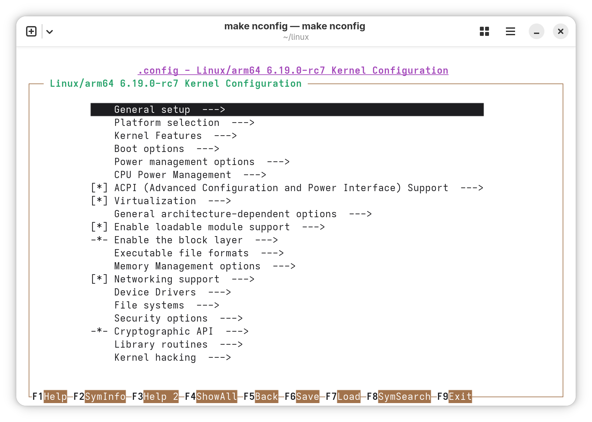

在前面簡單瞭解了韌體之後，這次就要開始系統移植了。畢竟原型機就要做些只有原型機才能做的事...</br>
當然，我的移植過程也並不是一帆風順。這不是舊平臺，像SD410、845、660 那樣，主線核心支援基本完善，網路上能夠找到的資料也有很多。到目前爲止，SM8750的主線核心支援程度比較良好，像是CPU，USB，顯示，GPU，音訊以及ADSP，CDSP等功能已有支援。[^1] </br>


# 一切要從這裏開始...

先說結果：「目前是未完成狀態」。僅有CPU（包括DVFS），顯示（採用 EFI framebuffer），USB網路，音訊，內建UFS快閃記憶體，UART序列，基於GPIO的按鍵，ADSP，CDSP工作，其餘部分仍在嘗試修補中。這比我在去年的時候根據 [Linaro 的教學](https://www.linaro.org/blog/let-s-boot-the-mainline-linux-kernel-on-qualcomm-devices/)第一次嘗試移植的結果要好不少。花費了半天時間，最後只有UART工作，熒幕也沒有畫面。</br>
不過，高通對於自家的晶片的主線核心支援還是比較積極的。我認識的一位朋友「_堪拉派裏*_」就對我說，他使用 SD 8 Elite Gen 5 的原型機，根據[高通給出的教學](https://www.qualcomm.com/developer/blog/2025/10/same-day-snapdragon-8-elite-gen-5-upstream-linux-support)，只用了半個小時就移植了完整版的 Debian 13 並且實現了大部分被主線核心支援的功能！不過那就是另一個文章會講到的事情了。

> _*這裏作者開了一個玩笑，「堪拉派裏」（Kaanapali）就是高通驍龍 8 Elite Gen 5 晶片的開發代號的非正式音譯。其韓國標準語的非正式音譯爲「가나파리」或「카나파리」。_

# 硬體需求

- 一臺 SM8750 MTP 原型機（建議採用未熔燬的版本，便於修改韌體）;

此裝置有[對應的 OpenEmbedded 配置檔](https://layers.openembedded.org/layerindex/recipe/483277/)，同時受 Linus 的主線核心，[社群維護的 SM8750 主線核心分支](https://github.com/sm8750-mainline/linux)，和 [Xlie Electronic](https://github.com/Xlie-Electronic-Customs/linux) 開發的核心分支支援。但是因爲該裝置僅面向OEM廠家和開發人員限量發售，因此尚未有正式移植。

- 裝置：必須爲64位元 Linux 作業系統（不限架構，X86，ARM，RISC-V 都可以），虛擬機也可以。我的裝置CPU爲驍龍 X Elite，RAM 爲32GB，另有一臺單板機，CPU爲RK3588，8GB記憶體。

Armbian 是基於 Ubuntu 和 Debian 的專門爲基於ARM晶片的嵌入式設備設計的嵌入式 Linux 發行版，系統檔案很小。不用像 Android 那樣，下載好幾百G的原始碼，編譯也不用花上好幾個小時甚至幾天。對於不想從頭編譯 `Rootfs` 的開發者，Armbian 也有針對 ARM 架構的「UEFI 通用映像」，最低只需要編譯適合的核心就可以開機。

# 安裝編譯核心的套件

編譯核心之前我們需要安裝一些編譯套件。在 Ubuntu 或基於 Debian 的發行版上，從終端機鍵入以下命令：

```bash
sudo apt install make gcc git cmake bc bison flex
```
之後，通過 `git` 命令來下載核心原始碼：

```bash
git clone https://github.com/Xlie-Electronic-Customs/linux.git
```
我使用的是由 Xlie 開發的主線核心分支，目前支援功能最多，對於目前會導致系統當機的數據機也有了解決方案。[^2]

# 設定核心編譯選項 & 編譯核心

首先需要取得核心原始碼。以原型機所發售的時間來看，高通自己的 Linux 核心原始碼問題最少，但是高通自己的核心需要開發人員賬號才可以存取，所以只好使用社群維護的主線核心分支。例如我使用的就是 Xlie 開發的核心原始碼。目前已更新到了 7.0-rc6 版本，所支援的硬體也比較多，適合SM8750系列手機的移植。 使用 `git clone https://github.com/Xlie-Electronic-Customs/linux.git` 命令下載核心原始碼，鍵入 `make nconfig` 來設定編譯選項。</br>
之後，到[SM8750主線核心原始碼](https://github.com/sm8750-mainline/linux/blob/v6.16/arch/arm64/configs/sm8750.config)下載 `sm8750.config` 設定檔，然後丟入`arch/arm64/configs` 目錄。執行`make sm8750.config defconfig`產生設定檔。之後鍵入`make nconfig` 或者 `make xconfig` 來編輯設定檔。在設定頁面使用上下左右四個鍵來移動，空白鍵選擇。`F8` 來檢索配置名稱。



這是SM8750 MTP 原型機所必須的主線核心設定檔：

 - `CONFIG_FW_LOADER_COMPRESS`: 便於核心加載被壓縮的韌體檔案。
 - `CONFIG_DRM_EFIDRM` `CONFIG_FB_EFI`: 支援 EFI framebuffer 驅動。這是在高通的 Adreno 830 繪圖卡尚不被主線支援前，最保險的方法，但是GNOME等其它桌面將無法使用。
 - `CONFIG_VT`：提供TTY控制臺支援（如果妳使用下游 Android 核心）。
 - `CONFIG_EFI` ：支援 EFI 環境。因爲我們將要使用裝置自帶的UEFI韌體開機，爲後期使用`systemd-boot` 或 GRUB 進行引導開機。
 - `CONFIG_EFIVAR_FS`: 啓用 `efivar` 文件系統支援，這是由核心自動產生的文件系統，便於系統設定開機引導次序，添加或清除啓動項目，如果不啓用則`efibootmgr`無法檢視、修改引導次序。
 - `CONFIG_EFI_ARMSTUB_DTB_LOADER`：能夠通過開機載入器爲核心指定設備樹，從而覆寫韌體提供的設備樹，實現設備樹更新（通過 `systemd-boot` 的 `devicetree`引數 或 GRUB 中 `dtb=` 引數控制）。
 - `CONFIG_EFI_CAPSULE_LOADER`：爲核心打開 UEFI capsule loader 支援，便於使用者通過應用程式來更新裝置上的UEFI韌體和其它韌體。
 - `CONFIG_RTC_DRV_EFI`：添加UEFI時鐘。方便系統更新時間。
 - `CONFIG_DRM_PANEL_NOVATEK_NT37801`：打開 NT37801 熒幕支援。這是SM8750 MTP 和 QRD 原型機的顯示熒幕，採用 DSI 協定。 

 調整好之後，按下`F6`儲存，然後按`Esc`離開設定畫面。之後要來編譯核心，這一步可能會有點漫長，編譯時記得留意終端機輸出的信息，方便檢視編譯流程。如果覺得編譯很耗時，可以在`make` 命令後面加註 `-j($nproc)` 引數，其中 `$nproc` 代表 CPU 核心數，可以加快編譯速度。順利的話只需5分鐘就可以完成了，如果編譯中遇到錯誤就會停下來，這時候就需要找到編譯出錯的位置，將錯誤信息複製到 Google 或者 Startpage 上去檢索修復方案。若是錯誤信息不明顯，可以使用`make -j1` 來減慢編譯速度，從而看到更多問題。
 編譯完成後，會得到一個沒有壓縮的核心還有對應的設備樹，接下來就需要「組裝」作業系統，然後嘗試開機了。

 # 刷入裝置

將原型機關機，按住電源按鈕和音量增按鈕開機（不是正常的「按一下電源按鈕開機」），此時裝置會進入「BDS 設定選單（BDS Menu）」（該功能需要開啓了除錯功能的韌體支援)。在這裏就可以對裝置的USB、PMIC、以及UEFI韌體進行設定。</br>


之後，準備一條 micro USB 數據線，將裝置與電腦鏈接。在終端機上鍵入`sudo minicom qcom`來存取 UART 序列（或者使用`sudo minicom -D /dev/ttyUSB0 -b 115200`來存取），之後就可以通過鍵盤控制妳的裝置了（終端機展示的內容與裝置熒幕上的一致）。在裝置上，使用音量增減按鈕選取「Mass storage mode」（或按一下鍵盤上的`9`），按一下電源按鈕確認（或者`Enter`鍵），此時熒幕會熄滅，裝置上UFS快閃記憶體的分割表會在終端機展示出來。通過鍵盤上的上下鍵選擇「UFS LUN 0」，按下「Enter」鍵確認分割，再按一下`M`掛載 LUN 0 的分割，從電腦上存取內容。</br>
在電腦上開啓GNOME Disks 磁碟管理工具（也可使用 `parted` 命令）。找到掛載的磁碟，使用鍵盤的左右鍵找到 `userdata` 分割，點擊左下的齒輪圖示，點選「調整分割大小」，鍵入一個數字，將 `partlabel` 命名爲 `linux` 或者其他名字，之後點選「格式化」將分割格式化爲 Ext4 文件系統，原先的 `userdata` 分割保持默認，妳的資料會保留下來（也可以直接格式化）。然後，新建一個 `EFI` 系統分割，格式化爲 FAT32 文件系統（FAT16 或者 W95 FAT32 也可以），大小爲500~1000MB。完成後按下任意鍵離開「Mass storage mode」，之後選擇「Reboot」重開機來套用新的分割。進入「BDS 設定選單」後，再次進入「Mass storage mode」（或者在 EBL 中鍵入`mass`命令也可以），掛載 LUN 0。到 [Armbian](https://www.armbian.com/uefi-arm64/) 網站去下載 UEFI ARM 64位元的通用映像檔，然後掛載映像，找到 Armbian 的 rootfs，選擇「建立分割映像」，將建立的分割映像刷入裝置的UFS快閃記憶體。</br>

然後，從 [PostmarketOS][https://images.postmarketos.org/bpo/edge/postmarketos-trailblazer/]的網站下載通用映像，掛載映像，從 EFI 分割中複製出 `bootaa64.efi` `loader/entries/pmos.conf` 文件。在裝置上建立 `EFI/BOOT` 和 `loader/entries` 資料夾，將二個檔案分別複製到對應目錄下。然後從核心原始碼中複製編譯的 `sm8750-mtp.dtb` 設備樹到EFI分割中。</br>

之後修改並更名 `pmos.conf`配置檔，使得下次開機後能夠引導 Armbian：

```yaml

# armbian.conf

title Armbian
linux vmlinuz
options loglevel=7 debug pd_ignore_unused clk_ignore_unused iomem=relaxed root=PARTLABEL= ro rootwait earlycon
devicetree sm8750-mtp.dtb 

```

在不使用 `initramfs` 的情況下，由於每次啓動後UFS的分割及UUID都會改變，因此使用UUID指定 Rootfs 的方法就會導致 kernel panic，所以只能使用分割標籤的方法啓動。

## 修改引導順序

高通SM8750 MTP 原型機的開機韌體採用符合 [ARM Embedded Base Boot Requirements](https://arm-software.github.io/ebbr/) 標準的 UEFI 韌體，能夠支援PXE啓動、USB啓動，同時提供 UEFI Shell 方便進行韌體管理。

按住電源按鈕和音量增按鈕來進入「BSD 設定選單」，選擇「Enter Shell」來進入 UEFI Shell。然後鍵入 `map -a` 來檢視裝置上的UFS快閃記憶體分割，找到建立的EFI分割（例如`fs4`），鍵入 `fs4:`來檢視 EFI分割中的內容。

```bash
Shell> dir fs4:\efi -b

Directory of: fs4:\efi\
     03/18/2026  23:19 <DIR>         4,096  .
     03/18/2026  23:19 <DIR>             0  ..
     03/18/2026  21:41 <DIR>         4,096  BOOT
               0 File(s)           0 bytes
               3 Dir(s)

```
使用`bcfg`命令來添加開機項目[^3]：

```bash
Shell> bcfg boot addp 1 FS4:\EFI\BOOT\BOOTAA64.efi "Armbian"
Target = 0004.
     bcfg: Add Boot0004 as 1
```

之後每次開機，裝置都應該會進入 Armbian 了。當然妳也可以直接通過 UEFI shell 中手動執行開機載入器啓動系統。

# 結果

這是我在 [YouTube 上發佈的視頻](https://youtube.com/shorts/Ecv3HICeK74?si=5m9OW-QJOP2zHKan)：

<iframe width="560" height="315" src="https://www.youtube.com/embed/Ecv3HICeK74?si=5m9OW-QJOP2zHKan" title="YouTube video player" frameborder="0" allow="accelerometer; autoplay; clipboard-write; encrypted-media; gyroscope; picture-in-picture; web-share" referrerpolicy="strict-origin-when-cross-origin" allowfullscreen></iframe>


就像我早就提到過的：僅有CPU（包括DVFS），顯示（採用 EFI framebuffer），USB網路，音訊，內建UFS快閃記憶體，UART序列，基於GPIO的按鍵，ADSP，CDSP工作，其餘部分仍在嘗試修補中。至少和其它市面上常見的零售機相比，第一次嘗試開機就可以看到畫面（雖然是軟體渲染）也足夠開心了。之後如果把所有硬體的功能修補完成，就可以給 Armbian 上游提交PR，把自己的成果公佈出去讓別人下載，也算是自己從零實作了一個高效能「PinePhone Pro」吧，畢竟原版 Pinephone Pro 雖然改用 RK3399 晶片，效能也是弱弱的。

[^1]:[Qualcomm Snapdragon 8 Elite - PostmarketOS Wiki](https://wiki.postmarketos.org/wiki/Qualcomm_Snapdragon_8_Elite_(SM8750))
[^2]:[remoteproc: qcom: pas: Fixing region_assign_idx](https://github.com/Xlie-Electronic-Customs/linux/commit/ea4c3038c355839ab93caac87f0fa29b0fa91a49)
[^3]:[HOWTO - Add UEFI Shell boot option](https://www.digitalstorm.com/forums/howto-add-uefi-shell-boot-option-tidf53003/)
