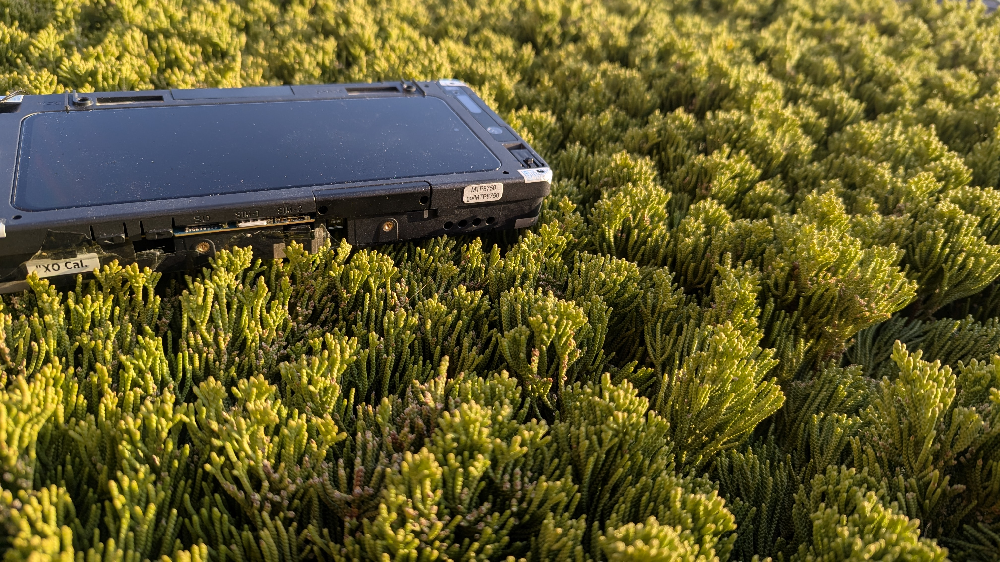
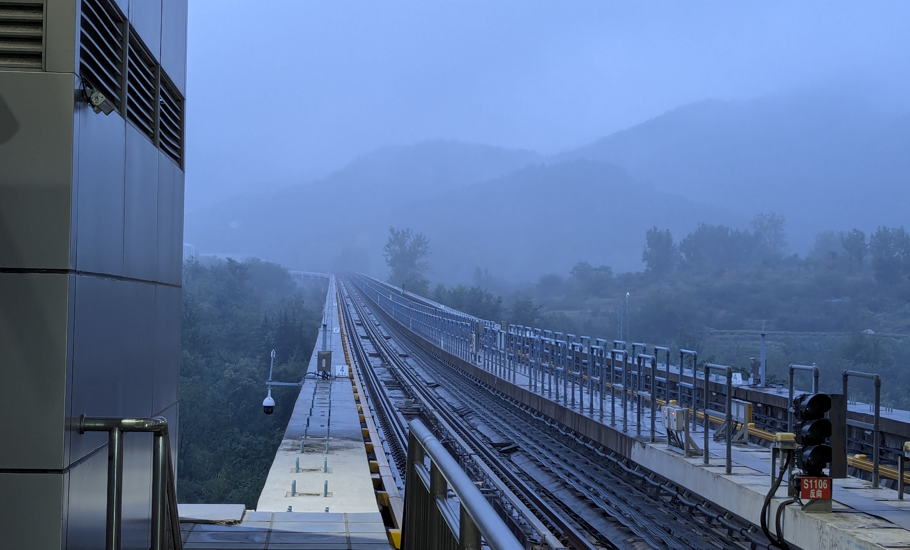

講講最近的雙持體驗變化。

# 早期

首先來講早期。高中以前的手機都是父母換新後留下來給我的，長期以來都是如此，我就有了奇妙的手機雙持體驗。最初的目的是爲了更好的拍照和滿足日常使用，加之沒有錢買iPhone。所以一直都是 Android + Android 的組合。 
2020年之前（真快啊，不是嗎？）我使用的手機是從父親手中留下的酷派 Cool 1，因爲那時對於規格一無所知，所以只會從手機的快閃記憶體容量來分辨手機的優劣，加之根本沒有錢買手機。我就一直釘在 Cool 1 上。雖然那臺手機有著兩顆1300萬畫素的鏡頭，但是效果依然難以入眼，基本的錄音也不清晰。仿佛低階的 Android 手機成爲廠商 cost-down 的事情是理所當然一般。好在錄影效果很不錯，可以錄製 4K 30FPS 的影片，熒幕素質也不錯。唯一的問題是驍龍652效能過於低下，即使刷成 LineageOS 也堪用。後來因爲 CPU 過熱脫焊，又只好暫時依賴一臺退下來的華爲 Y9 （2018） 來度日，我很討厭華爲這家手機廠商，因爲他們的手機壓根不給使用者解鎖！想要解鎖還要「幾經周折」，不是把手機「大卸八塊」就是鑽漏洞，或是刷工程韌體解決。雖然最後還是把手機解鎖了，然後刷成 Lineage OS 17.1 的 GSI，可刷機之後發現效果竟然不如原廠韌體好用！不過好在拍照不錯，有獨特的韻味。喇叭的聲音還有一種特殊的音箱感。 
 
但是，或許是因爲老媽不懂手機，她的手機早已經過數不清的專有軟體的摧殘，內建的eMMC記憶體壽命將盡，反應十分緩慢。不過高中的入學考試我考了不錯的成績，父親同意給我買一臺新手機作爲我的獎勵。 
那臺手機就是 Pixel 4 XL，它有6GB的RAM，64GB的UFS記憶體。和效能強勁的驍龍855處理器，而且非常容易解鎖，它就理所當然的成爲了我最喜歡的東西。刷機、Root、LSPosed...樂此不疲。升入高中後，我依然保留了「雙持」的習慣。雖然當時那臺華爲 Y9 已經勉強堪用了，我依然把它留在身邊，算是我第一次踏入GSI世界的紀念。 
買了Google的手機之後，我完全驚訝於 Google 設計語言的精湛和與衆不同。2019年，大多數手機都已用上了挖孔屏，而Pixel 4 還是採用了四邊不等寬設計，尤其是頂端的寬度，寬到我可以把小指放上去了。當然，寬大的黑邊之下，藏了九個傳感器。其中包括至今都讓我回味無窮的Soli 雷達晶片，能夠根據使用者的手勢動作，進行預先設定的行爲。這簡直就是「火星科技」一樣的存在。至於拍照和錄影，也都有了很多的提升，只能說「Google」相機的演算法與索尼的鏡頭在一起，就會造就世界上最好的手機相片。他對我的影響非常深遠，以至於我在看到驍龍8 Gen 2的 MTP原型機時，總會懷疑這是否就是拿 Pixel 4 XL 熒幕改的（驍龍8 Gen 2的MTP工程機熒幕同樣繼承了Pixel 4 的「寬頂」設計）...

# 現在

現在，「雙持」的習慣依舊保留下來，而且一定要是跨系統的雙持。每隔一段時間（現在不干了），我就會用各種聽起來很「科技」的理由，說服我的父親給我買各種過季的二手 Android機，用於刷成 Linux 用。一方面是爲了擺脫早就被各種專有軟體污染到「污濁不堪」Android 系統，改用自由軟體爲主的 Linux 作業系統。如果不依賴 Android 才能用的應用之外，也是體驗 Linux 手機生態的好機會。另一方面，也希望能藉由「雙持」的機會，讓我學習更多的 Linux 指令。此外也可以實現更多超越「手機」的功能，比如架設 Minecraft 伺服器，跑VPN用來擋廣告之類。當然也可以使用諸如 MU-Aloha 之類的UEFI韌體重新引導 Linux 和 Android，甚至實現網路啓動和USB啓動這些只有在工程機才能做到的行爲（現在看來，即使是工程機實現這些也不容易）。 
過去也曾差點成爲「Apple fan」，有點經濟壓力的因素在吧，但是iPhone的神話早就破滅，比起iOS這種專有軟體而言，我更喜歡像是 PostmarketOS 之類的自由軟體。 
未來的配置可能是輕巧的，配置中等的 Android 機和一支可以刷機的 Linux手機，比如現在我使用的 Pixel 7 和 Nothing Phone(1) 這樣的組合。Nothing Phone 真的是一支適合裝 Linux 日用的手機，支援程度不比一加6T差，而且驍龍778+的效能也比較不錯，12GB記憶體也能夠滿足日常使用。 
至於 Pixel 7，如果不是我的 Pixel 4 XL 熒幕壞了（Pixel 4 XL 熒幕損壞和記憶體問題是通病，後者的問題源於核心中錯誤的驅動），我還會一直使用它的。我把我的 Pixel 7當作一臺十年前的數位相機使用，橫着手持拍照和錄影，大部分時候不需要處理圖片，最多用Google相簿內建的「魔術橡皮擦」稍微處理就好了，然後相片傳到 Nothing Phone 上，使用GIMP進行進階處理。 
附上最近的幾張相片（默認使用HDR相片，瀏覽器需支援HDR相片或視訊才能啓用HDR效果）。

對於臨時需要傳照片的場合，除了SFTP之外，也可以用跨平臺的 LocalSend 或者 KDE Connect，當然也可以是 Android 之間的「快速分享」功能，真的非常實用！現在大部分 Android 手機應該也支援這個功能，LineageOS也有。不用下載APP，兩邊只需要開啟藍牙和Wifi，雙方不需要「配對」手續（其實就原理上來說應該還是有，不過不需要手動操作）也不用連線到無線熱點，就可以匿名傳檔案，即使一邊完全沒辦法上網也能分享。檔案很多速度依然很快，50張照片200MB一分鐘內傳完。 
有人或許會問：既然如此熱衷於手機攝影，爲何不買臺單眼相機？我還沒奢侈到如此程度（況且理由不好造），只是想隨時隨地，點一下就可以「爆射」（Tap and shot）！
