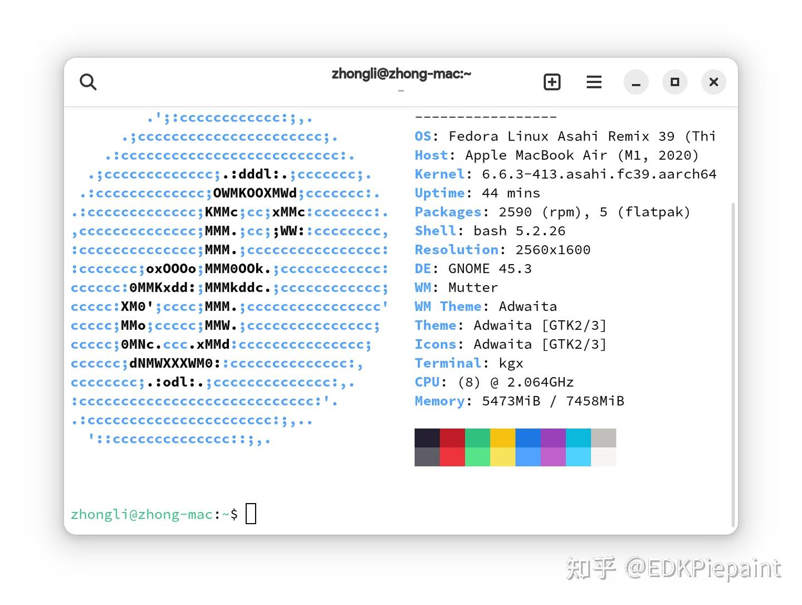

如果你是一名自由軟體愛好者，你可能早在2020年就聽說了Asahi Linux的事情。這是一個旨在為Apple Silicon 晶片移植完整版 Linux的專案。然而就在我從Google上找尋更多相關的信息時，突然想到：Youtube上有不少與之相關的視頻，而國內卻缺少關於Asahi Linux的介紹，使用體驗呢...幾乎沒有幾篇，而且都比較“過時”——因為Asahi Linux的項目進展較快，所以那些文章也就顯得舊了些。

所以，這就是我寫這篇文章的目的。向大家介紹我自己的Asahi Linux使用體驗，也許它在未來的某一天會過時，但它仍然可以為後面那些想要嘗試Linux的人做個參考，算是一個“前車之鑑”。本次使用的電腦是 MacBook M1(2020),其配置在下方：


| 名稱          | MacBook Air (M1,2020)                                                                                  |
| --------------- | -------------------------------------------------------------------------------------------------------- |
| 處理器        | Apple M1(Tonga)                                                                                        |
| RAM           | 8GB LPDDR4x                                                                                            |
| 存儲          | 256GB Apple Fabric SSD                                                                                 |
| 網路卡        | Broadcom BCM4378                                                                                       |
| GPU           | Apple G13G B1                                                                                          |
| Linux核心版本 | 6.6.3-413.asahi.fc39.aarch64+16k #1 SMP PREEMPT_DYNAMIC Sat Jan 27 17:19:54 UTC 2024 aarch64 GNU/Linux |

如果你準備好了，那我們就開始吧！

# Asahi Linux 現在的狀況

Asahi Linux 早在去年（2023年）的8月2日就宣布他們將要[進行一次發行版的變動](https://asahilinux.org/2023/08/fedora-asahi-remix/)，從[原來的Arch Linux遷移到Fedora Linux](https://asahilinux.org/2024/01/fedora-asahi-new/)，因為後者有官方的ARM支援，且有完善的硬體驅動和豐富的社區支援。目前，該專案已經遷移完成，自2024年1月12日後，Asahi Linux將基於新的Fedora Linux開發，成為Fedora Linux的一個官方姊妹發行版：Fedora Asahi Remix 。

至於設備的支援情況，在我的M1 MacBook Air 上，除去已有的鍵盤（包括鍵盤燈）、觸摸板、顯示、GPU、3.5mm耳機口、Type-C（USB 3.0）、無線網路和藍牙，又新增了揚聲器和Facetime攝像頭的支援。（其實所有M1 和M2的Mac都支援了上面這些）

當然，還有主線核心！



# 全新的體驗

打開[Asahi Linux](https://asahilinux.org/)的網站，排版依舊，但仔細看卻又稍有區別：


```bash
curl https://alx.sh |sh
```

在macOS的終端機鍵入上述命令，在經過兩次重新啟動後，我們就看到了Asahi Linux附帶的GNOME桌面：


Linux發行版，我體驗過不少，Fedora我也用過一段時間。但是在ARM架構的筆記本電腦上使用Linux，我還是第一次。特別是自從我的MacBook到了我手中之後，這個讓人無法想象的薄若蟬翼的筆記本電腦震驚了我數十次。而我之前的筆記本電腦，是14年前的華碩K42Jc筆記本，i3 M 730四核心CPU，附帶英偉達的Geforce 310M GPU。它連使用Arch Linux（安裝了GNOME）都力不從心，我卻用了它13年，直到2021年的6月，我入手了Macbook。
在安裝完成後，Fedora自帶的軟體還是有點少，於是我用dnf命令安裝了一系列軟體，從文書處理、網路瀏覽、影音娛樂和虛擬機這四個方面來介紹。


# 文書處理

在如今的2024年，文書處理已經是作為一台電腦最基本的要求。在Windows 上，我們可以用Microsoft Office來解決問題；在macOS上，我們還可以用Microsoft Office，但也可以用Apple自家的Pages、Numbers 和Keynote來處理這些。而在Linux上，又可以用什麼來處理呢？

為了解決這個問題，我使用了Libreoffice
來解決我的問題。在Fedora上，只需一行命令就可以安裝：

```bash
sudo dnf install libreoffice
```

自然要運行看看，對吧？

首先，我運行了Writer（Libreoffice的一個處理文件的應用，類比Word)可以打開，沒有任何問題。隨後，我又鍵入文字，並且對它們進行字體、字號的修改、插入圖片/視頻......所有你在Word下面的操作，我全都試了一遍，沒有問題：


接着是Impress（類似於PowerPoint），可惜我沒有PPT簡報，應該是沒問題的，排版也不會錯亂：


最後是Calc（類似Excel），包括公式在內也沒有問題：


文書處理非常的完美，Asahi Linux完美地完成了這個工作！

# 網路瀏覽

首先是GNOME Web，它有點太流暢，在鍵入中文時，iBus輸入法的候選詞的位置會隨機移動，有時就直接消失了（然而我沒有截到圖，所以只有瀏覽器本身）：


但是它可以開控制台，有着和Safari相似的布局：


然後是Chromium瀏覽器，安裝起來也不費力，比起GNOME Web來好多了, 網頁滾動比起GNOME Web來，就平滑很多，擴展程式也沒問題：


播放視頻也挺好的，實測在bilibili上觀看1080P 60幀視頻毫無壓力！（時間原因忘記放圖片了）Youtube的1440P視頻也很順暢。

# 影音娛樂

讓我寫影音娛樂，說實話，我自己起的標題，我自己都寫不下去。因為我幾乎不下載視頻看，音樂倒是聽了不少，所以接下來，我會主要從音樂應用來講述我的使用體驗。

說到音樂，因為最近Asahi Linux修補了揚聲器的支援，所以我可以試一試在Linux下面揚聲器的聲音了。我打開了GNOME Music應用，通過SFTP從我的Arch Linux工作站上複製了幾首歌到硬碟里，然後逐個播放了它們，雖說我不懂音樂的流派、節奏之類的，但是在Linux下面，這些音樂從喇叭里播放給我的感覺是...有點悶，聽起來像是低音揚聲器 。要說改進呢，當然也有。我們知道，M1系列的MacBook在macOS下面播放音樂時，音量超過80%會有破音問題，而在Linux下面卻沒有這種情況。

至於在線音樂，我嘗試安裝了採用Electron編寫的第三方網易雲音樂應用，結果是無法運行，嘗試執行electron會返回```Segmentation fault```錯誤。後來從Electron官網上下載基於ARM64的包解決了這個問題。


但是它在我的小米平板5上（你可以參考我在酷安上發布的動態)卻能打開並且完美運行啊...

我又安裝了GNOME視頻播放器、VLC，它們都可以正常地播放視頻，並沒有出現預期中的花屏、不相容等。

然後來到遊戲方面，得益於Asahi Linux為GPU更新了OpenGL 3.1的支援，我們可以運行相當多的遊戲（包括Minecraft之類）! 為此，我從HMCL（不是那個HMCL，那個HMCL是監管員[^1]）網站上下載了Jar文件，準備大玩一番時，HMCL卻拋出了錯誤：

```bash
[11:39:26] [org.jackhuang.hmcl.util.SelfDependencyPatcher.patch/INFO] Missing JavaFX dependencies, attempting to patch in missing classes
Exception in thread "main" java.lang.NoClassDefFoundError: Could not initialize class java.awt.Toolkit
	at java.desktop/java.awt.Component.<clinit>(Component.java:624)
	at org.jackhuang.hmcl.util.SelfDependencyPatcher.fetchDependencies(SelfDependencyPatcher.java:297)
	at org.jackhuang.hmcl.util.SelfDependencyPatcher.patch(SelfDependencyPatcher.java:204)
	at org.jackhuang.hmcl.Main.checkJavaFX(Main.java:103)
	at org.jackhuang.hmcl.Main.main(Main.java:74)
Caused by: java.lang.ExceptionInInitializerError: Exception java.lang.UnsatisfiedLinkError: Can't load library: /usr/lib/jvm/java-17-openjdk-17.0.9.0.9-3.fc39.aarch64/lib/libawt_xawt.so [in thread "main"]
	at java.base/java.lang.ClassLoader.loadLibrary(ClassLoader.java:2398)
	at java.base/java.lang.Runtime.load0(Runtime.java:755)
	at java.base/java.lang.System.load(System.java:1953)
	at java.base/jdk.internal.loader.NativeLibraries.load(Native Method)
	at java.base/jdk.internal.loader.NativeLibraries$NativeLibraryImpl.open(NativeLibraries.java:388)
	at java.base/jdk.internal.loader.NativeLibraries.loadLibrary(NativeLibraries.java:232)
	at java.base/jdk.internal.loader.NativeLibraries.loadLibrary(NativeLibraries.java:174)
	at java.base/jdk.internal.loader.NativeLibraries.findFromPaths(NativeLibraries.java:315)
	at java.base/jdk.internal.loader.NativeLibraries.loadLibrary(NativeLibraries.java:285)
	at java.base/java.lang.ClassLoader.loadLibrary(ClassLoader.java:2403)
	at java.base/java.lang.Runtime.loadLibrary0(Runtime.java:818)
	at java.base/java.lang.System.loadLibrary(System.java:1989)
	at java.desktop/java.awt.Toolkit$2.run(Toolkit.java:1392)
	at java.desktop/java.awt.Toolkit$2.run(Toolkit.java:1390)
	at java.base/java.security.AccessController.doPrivileged(AccessController.java:318)
	at java.desktop/java.awt.Toolkit.loadLibraries(Toolkit.java:1389)
	at java.desktop/java.awt.Toolkit.initStatic(Toolkit.java:1427)
	at java.desktop/java.awt.Toolkit.<clinit>(Toolkit.java:1401)
	at java.desktop/javax.swing.UIManager.getSystemLookAndFeelClassName(UIManager.java:668)
	at org.jackhuang.hmcl.ui.SwingUtils.<clinit>(SwingUtils.java:9)
	at org.jackhuang.hmcl.util.SelfDependencyPatcher.fetchDependencies(SelfDependencyPatcher.java:286)
	... 3 more
```
看來Minecraft是玩不成了，那我們就來玩它的同類型遊戲“Minetest”吧！Minetest的安裝過程十分簡單 ，同樣的終端執行一行命令:

```bash
sudo dnf install minetest
```
當然，也可以從GNOME軟體中心進行安裝：


說到軟體安裝，Fedora其實做得非常好。他把dnf命令整合進 GNOME Software 或者 KDE 的 Discover 這些圖形化前端中，極大地降低了新用戶安裝軟件的難度。畢竟對於新用戶來講，他可能不知道什麼是終端機，也不會敲dnf命令。但是有圖形化UI，他就懂了一切。


話說遠了。繼續回到遊戲上，Minetest運行的非常好。它可以正確的調用OpenGL圖形API，遊戲可以穩定在100FPS以上:


除去Minecraft無法運行，其他的都挺好的。

# 虛擬機

我們知道，ARM指令集（ARM-v8)支援虛擬化。這也就意味着現代所有採用ARMV8指令集的處理器都支援虛擬化，它們具有運行虛擬機的能力。然而高通（Qualcomm）生產的SoC在量產機器上封鎖了虛擬化，那些PC級別的晶片也只能通過特殊的韌體（還得有OEM簽名）才可以在Windows上體驗虛擬機。連發科的CPU需要特殊手段才可以，Google Tensor系列因為沒有電腦搭載它，所以不在範圍之列。那麼今天的Apple M1 是否具有虛擬化的能力呢？通過終端機執行 " ls /dev/kvm"命令後可以看到，“KVM”三個字母出現了：


但是，執行了下面兩條命令後，返回的卻是空值：

```bash
lsmod | grep kvm
 返回為空

cat /proc/cpuinfo | egrep "vmx|svm"
同樣的，結果是空的
```
所以，我通過安裝了QEMU的軟體，來嘗試開啟KVM，安裝過程依舊簡單：

```bash
 sudo dnf install @virtualization
```
開啟了相關服務：

```bash
# sudo systemctl enable libvirtd

# sudo systemctl start libvirtd
```

然後就到了測試環節了！在“Virtual Machine Manager”中創建一個FreeBSD虛擬機，下載FreeBSD光盤映像，開機！


它工作了！通過其自帶的資源監視器可以看到虛擬機的CPU占用和本機CPU占用率，我使用了虛擬機3個小時，結果是，沒什麼壓力吧。

# 結論
雖然Asahi Linux支援的非常好，M1晶片也很不錯，但是為了能夠更好地支援Apple晶片，Asahi的核心採用16K分頁地址，這導致了部分應用無法運行。此外，Apple M1由於只有64位元指令集，一些32位元應用將無法運行。

雖然，Asahi Linux開發組作了相當巨大的工作，寫下了千字的維基頁面，供我們參考，還由此催生出一大批社區發行版[^2]（如Debian、Ubuntu、Gentoo Linux還有國內的Deepin[^3]），但是，Asahi Linux開發組仍然還有很長的路要走。隨着Apple M系列晶片不斷推陳出新，Asahi Linux開發組為了達成他們的那個“適用於所有Apple晶片組的Linux發行版”[^4] 和那條UART除錯線[^5] 的目標，他們仍要面對如山高一般的困難，在沒有文檔、沒有先例的一條路上，暴霜露，斬荊棘，為一個個自由軟體愛好者、開發者們鋪設一條康莊大道。

最後，這裡是EDKPiepaint，登出，祝你有個美好的一天！新年快樂！
[^1]: 如果這裡出現的是那個HMCL，那我可能要作頸椎按摩。
[^2]:你可以在[Asahi Linux](https://github.com/AsahiLinux/docs/wiki/SW%3AAlternative-Distros) 的Wiki中找到更多資訊。 
[^3]:非常有趣的是，Deepin由兩個版本。一個是[Deepin社區維護的版本]( https://github.com/deepin-community/deepin-m1)，另一個是[Deepin M1 SIG](https://www.deepin.org/index/docs/sig/sig/deepin-m1/README)維護的版本。
[^4]:就在官網寫着呢！原文是：Asahi Linux aims to bring you a polished Linux® experience on Apple Silicon Macs. 
[^5]:實際上，Asahi Linux開發組確實有要打造一條Type-C的UART除錯線的想法，用於MacBook和Android手機。M系列的MacBook Air確實有UART串口，但是需要特殊方法激活，[Postmarket OS]( https://wiki.postmarketos.org/wiki/Apple_Macbook_Air_M1_(apple-MacBookAir10,1)) 和 Asahi Linux Wiki上有更多資訊。
