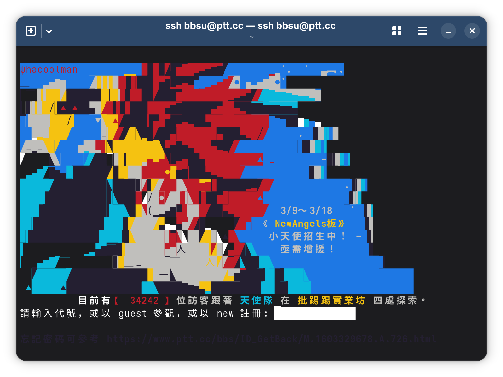
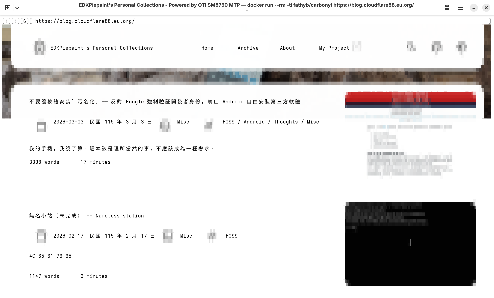
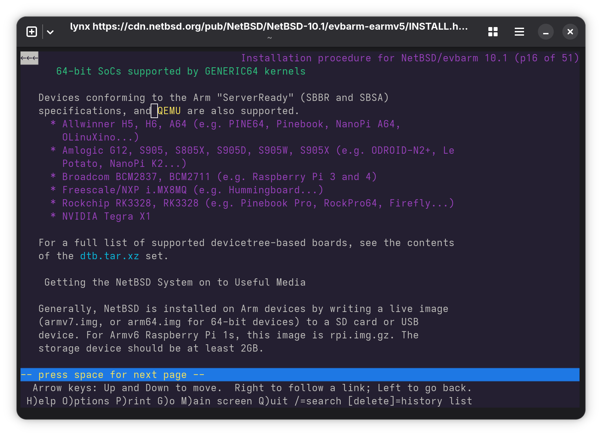
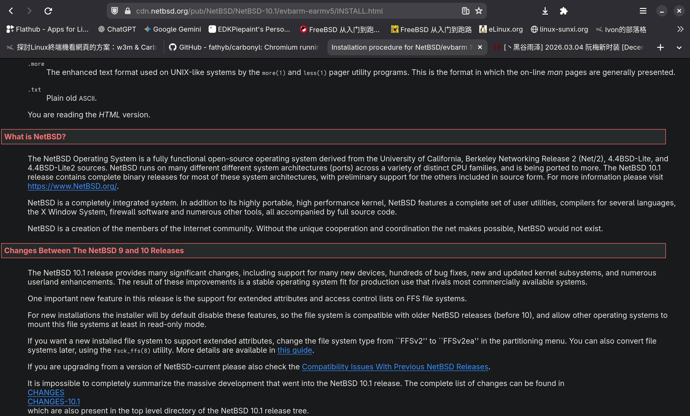
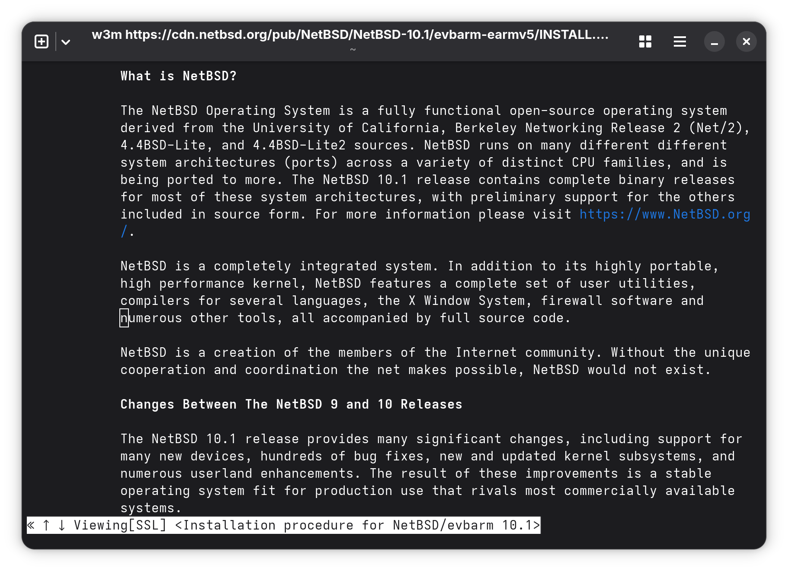
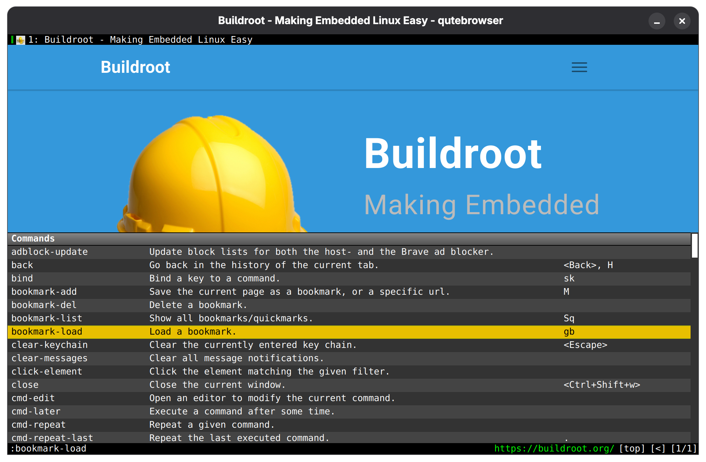

:::warning
本文是不適宜在工作時間展示的內容（NSFW），包含成人內容（文字描寫和圖像），請謹慎閱讀。
:::

一直在想能不能通過 Linux 或是 FreeBSD 的TTY控制臺，不使用任何桌面環境來訪問網際網路，因爲現在的瀏覽器都太肥了。無論是
FireFox 還是 Chrome 都是如此，我們的老祖宗（不過才過去三十年而已）都是用 DOS 文字介面訪問 BBS 的。

其實臺灣的PTT就可以支援SSH訪問（ `ssh bbsu@ptt.cc`）而不用開瀏覽器。在只能用SSH或是 Telnet 的工作階段也可以上去發廢文，尤其適用於那些只提供控制臺的設備，比如採用嵌入式 Linux 的機上盒、路由器或者數據機之類。不過部分終端機可能受限於編碼問題，中文可能無法顯示。

那我們沒理由不能通過終端機造訪網路。

特別是像一些嵌入式設備，只有幾百MB的記憶體，CPU時脈又相對低下，而且都使用客製化的 Linux 作業系統，根本沒有足夠的硬體資源去支援常見的桌面環境的執行。連一些簡單的 WM 都會卡頓，至於吃上幾GB甚至十幾GB記憶體的瀏覽器就更不用想了。 

_（主機：嗯...唔...哈啊！要去了！...要去了...嗯...哈...**Kernel Panic**)_

現在的主流社群媒體網站，大抵只有像 [Hacker News](https://news.ycombinator.com/) 和 [舊版 Reddit](https://old.reddit.com/)能夠方便用終端機來瀏覽，其他的網站還是太「臃腫」了一點。其實我的部落格採用了基於 Astro 的框架，已經盡最大可能爲低階設備進行了優化，且介面也較爲簡潔明朗，但還是不適合用終端機來檢視。從下面的對比就可以看出：

如果妳認爲架設自己的網站，必須要用諸如 Jekyll 或者 Astro 之類的框架，或是還要考慮 CSS，JavaScript之類的功能，那看看這個 [Motherfucking Website](https://motherfuckingwebsite.com/) 吧，事實證明，妳不需要任何框架也可以架設自己的網站！去他媽的。（圖片來源：[[Komi]Kazusa NTR | 和纱NTR 1（Blue Archive）[Chinese]](https://e-hentai.org/g/3824815/4a6f47354d/))

> Damn! Working form zero to one, misconfigured  
> Dumping RAM and it sounds like:  
> Screw you, Crashdump!  
> _--- Adopted from [Blow Your Fuses -- A FOSS Parody of You're Mine by DAGames](https://blog.cloudflare88.eu.org/posts/blow-your-fuses/) by EDKPiepaint_

啊...久等了。看看 Linux 有哪些終端瀏覽器可以使用，這些瀏覽器可比主流的瀏覽器方案要簡單多了呢。這些文字瀏覽器不需要像是 X11, Wayland 之類任何顯示協定就可以工作，甚至妳在工作期間還可以偷偷開SSH來摸魚一下，它們的響應速度也很快，對於低階設備和嵌入式設備非常友好。不過妳在檢視或下載檔案時，可能還是需要圖形環境。 
文字瀏覽器在各大 Linux 發行版或者 FreeBSD 套件庫都有收，終端機的特色就是鍵盤操作，可不是用滑鼠點一點就可以上網了。如果妳會用 Vim 或是 EE 之類編輯器的話，相信妳只需要檢視每個程式的 `man page` 就能上網了。

# EWW 和 Lynx

僞裝成文字編輯器的作業系統 EMacs 有內建 [EWW](https://www.gnu.org/software/emacs/manual/html_mono/eww.html) 文字瀏覽器，而 [Lynx](https://github.com/lynx-family/lynx) 則是目前最古老的文字瀏覽器。

::github{repo="lynx-family/lynx"}

這兩個文字瀏覽器只能瀏覽 Web 1.0 時代的網頁，或者是純文字頁面的網頁（比如 [OpenBSD 網站](https://www.openbsd.org/78.html) 或者 [NetBSD 的安裝指導](https://cdn.netbsd.org/pub/NetBSD/NetBSD-10.1/evbarm-earmv5/INSTALL.html) ，至於[Ehentai (我最喜歡的網站，可以看H漫)](https://e-hentai.org/?page=1) 也還勉強看）用這個上網的時候，我的世界是黑暗的，人生是黑白的，感覺就像回到了三十年前。

`w3m` 則是支援CSS的文字瀏覽器，文字版面比較接近網頁原本的樣子和外觀。至於文字以外的介面需要靠想象力，`w3m` 同樣支援展示圖片，這需要終端機支援 [Graphics protocol](https://sw.kovidgoyal.net/kitty/graphics-protocol/) 或者通過 Sixel 像素畫來展示 。例如通過 Kitty 和 ImageMagick 就可以在終端機內繪製完整解析度的圖片。播放影片的話，就通過 `w3m` 載入外部程式，解析鏈接後丟給 `mpv` 播放即可。

這大概是目前還堪用的瀏覽器，既能看網頁，又可以看圖，RAM佔用不到 100MB，而且速度很快。

當然，也有終端機渲染彩色網頁的例子...

# 跑在容器中的瀏覽器： Browsh 與 Carbonyl

...如果看了還不加阻止的話，我的資證大概會被注銷吧...嗯，不管怎麼樣，想要看到這些東西的話，也要瀏覽器支援 WebGL（並非）且支援渲染圖片才可以啊。但是終端機沒有任何方法直接渲染圖片，所以看妳和別人愛愛——不是，是檢索其它嵌入式作業系統原始碼是不可能的啊。不過我們在像是 Docker 或者 Podman 容器中執行一個瀏覽器，用以保證基本的 CSS，JavaScript 和網頁排版正常，然後將畫面串流到終端機裏面，就可以解決這個問題了~ [Browsh](https://github.com/browsh-org/browsh) 就是這樣做的。不過這樣會在背景執行一個 FireFox 實例，這樣的RAM佔用與正常的 FireFox 沒有區別。

::github{repo="browsh-org/browsh"}

比 Browsh 更進階的有基於 Chromium 的 [Carbonyl](https://github.com/fathyb/carbonyl)，沒有執行一個瀏覽器實例，而是渲染後傳到終端機裏面。讓 WebGL 運作並且使用 Unicode 顯示字元，除了文字以外就是馬賽克，RAM佔用不到100MB，並且在SSH階段也可以使用，不過實用性不高。我打中文都會變成韓文，實用性還可以，至少可以檢視一些網頁，並且可以下載檔案。支援通過 Docker 或者下載二進位檔案運行，對於嵌入式設備來說是個不錯的瀏覽器。而且在最新的版本中還[改善了 BitMap 渲染](https://github.com/fathyb/carbonyl/releases/tag/v0.0.3)，網頁元素更加易於辨識了（所以吶，末花，老師很快就可以從終端機看妳和別人愛愛的影片了，而且不會擔心被發現！[^1]）

當然，也可以用一些專門爲某個網站設計的 TUI 程式，例如 Reddit，GitHub，YouTube，Spotify，GitHub 上面一檢索就會有一大把任妳挑選。但是不是所有網站都可以通過 TUI 呈現。 
如果遇到不能通過 TUI 展示的網站（例如 Thread 和 Line）呢？要怎麼辦才好啊？ 

# 實在不行就回歸簡易GUI瀏覽器吧
那就採用像是 [Qutebrowser](https://github.com/qutebrowser/qutebrowser) 的方案，只有展示網頁的功能，類似 Android 和 Windows 的 Webview 一樣。其餘功能都通過 Vim 的快捷鍵去操作，這樣就可以了，完全不需要通過滑鼠去瀏覽內容。而且圖片還比較清楚，使用組合鍵就可以「點按」網頁上任意元素。

::github{repo="qutebrowser/qutebrowser"}

它採用 QtWebEngine 渲染網頁元素，載入完整網頁的話RAM佔用與一般 Chromium 瀏覽器無異（約2~4GB，內建 Adblocker 用於擋廣告）。所以這個比較適合用在硬體資源豐裕的嵌入式設備上，比較適合用於控制中心、點餐機、和POS等類似用途設備上，也能夠較爲方便地被編譯到 Buildroot，OpenEmbedded，Yocto 之類的嵌入式 Linux 或者其它基於BSD的嵌入式作業系統。