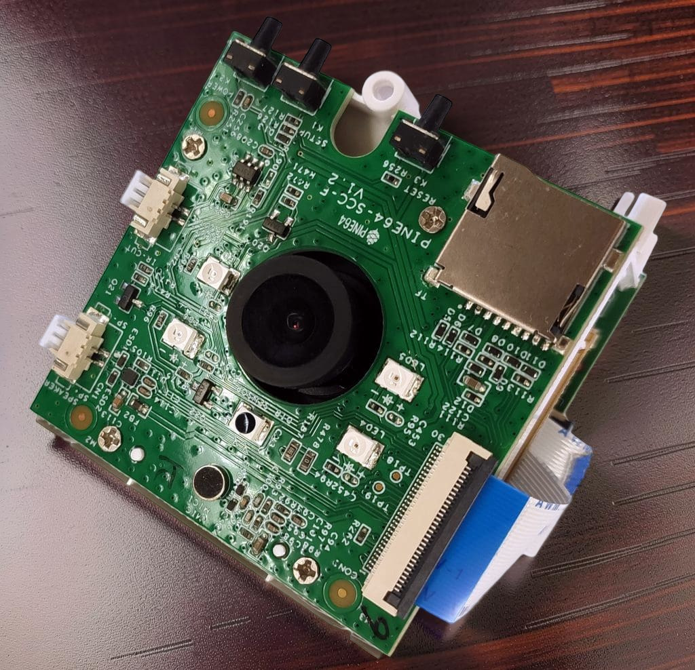

想過一個問題，是否可以僅利用自由軟體，組裝屬於自己的開源數位相機呢？ 
一直好奇那些市面上常見的網路攝影機都是怎樣工作的，我也曾考慮過是否要在自己家安裝網路攝影機。但是現在妳能買到的網路攝影機基本上都是跑專有軟體的「監視器」，妳的隱私可能隨時都會被公司或政府所監控着。這樣的硬體真的讓我難以下手。 
 
不過至少，這個問題從技術方面來講，應該是可行的。可以使用 Arm 或者 RISC-V 指令集的單晶片，以及主線 Linux 核心支援的硬體和鏡頭就可以制作一個屬於自己的網路攝影機了。比較經典的例子有 [PINE64 生產的 Pinecube](https://pine64.org/documentation/PineCube/)，採用 Allwinner S3 晶片的網路攝影機。所有硬體被主線核心支援。目前被 Armbian, NixOS 和 Buildroot 等 Linux 發行版所支援，還支援 Power over Ethernet 功能和 IR 呢。有關 Pinecube 的進階玩法也非常豐富。 

開源的影像處理流程也存在：處理影像的軟體有 GIMP，Krita，digiKam 之類，對於SVG圖更是有 Inkscape 之類軟體支援。如果想要剪影片，Kdenlive 軟體就非常不錯。   
但是 Pinecube 採用的 `ov5640` 攝像模組最多只能拍攝5百萬畫素，1080P解析度的影片。在這個 4K，8K 影片隨處可見的時代，Pinecube 的規格顯得略有點過時。雖然可以自己更換支援4K錄影的攝像模組，但依舊要考慮驅動程式的問題。不過就像網站講的那樣，對於夜班保全這種工作確實比較適合。畢竟不需要考慮伺服器公司是否會偷偷檢視妳的影片，也可以自己架設影片串流伺服器。 
 
那些光圈比手機大許多的單眼相機和攝影機，如 Canon 或者 Sony 出的，上面跑的軟體大多都是專有軟體。雖然 Sony 也有內建 Android 的相機（Android 系統終於放在了應該在的裝置上），但是都塞了 Sony 自家的軟體進去。 
會不會有一臺從韌體到軟體都採用自由軟體的數位相機呢？我想要的是真正可以用來日常使用的相機，不是像 MTP8750 那樣的原型機，更不是單板電腦外掛攝像模組的玩具。缺乏自由軟體的裝置真的讓我難以下手（雖然有些裝置也買不起就是了，比如 SC8380XP 的 CRD原型機 :P）。 
 

> There should be a photo showing Qualcomm's SC8380XP CRD prototype machine, but I had to remove it due to copyright issues. Screw you, Qualcomm!

因爲我拒絕使用任何專有軟體而不購買中國產 Android 手機，不購買 PS4，Switch 這類家機一樣，因爲這些企業奪走了許多優秀開源專案的成果。Linux 上的 Steam 我起初還可以勉強接受，但是用 Steam 我內心已經非常煎熬了。 
 
所以，我還是希望有一款真正自由的開源數位相機，可以像 Pinecube 那樣，採用主線 Linux 核心支援的硬體和軟體，並且可以自由選擇自己喜歡的圖像處理軟體。這樣的相機可以像 Pinecube 那樣，可以用做日常保全，也可以用來拍攝一些私密照片(比如妳邊看「小黃書」邊用桌子愛愛的照片)。 
 
即使是「開放」的 Android 裝置的拍照技術，也很大程度上被封閉原始碼的 APP 控制着呢...每家手機廠商都會編寫針對自家手機的相機 APP，並且強迫我們使用這些 APP。縱然我們有 [OpenCamera](https://sourceforge.net/p/opencamera/code/ci/master/tree/) 和 [FreeDCam](https://github.com/KillerInk/FreeDcam)這些開放原始碼的相機 APP，他們也不能完全利用每臺手機的鏡頭硬體功能，例如30倍 AI 放大，以及美化相片的演算法。 
拍照之後的演算法更是各大廠家的機密。Sony，小米，Google，Samsung 都有自家的韻味，即使妳有辦法移植 Google camera 到其他裝置，也無法弄清背後的機理。因此，Opencamera 所拍的相片品質就會與原廠相機 APP 所拍的相片品質有所落差，往往需要使用 digiKam 修圖。成爲單純看感光元件效能的軟體，不過這樣也可以看出廠商在背後做的手腳。 
因爲 Android 最初是作爲數位相機所開發的作業系統，因此在存取相機硬體方面的效果遠遠要比 GNU/Linux 成熟。例如 AOSP 所支援的 `Camera2API` 可以讓妳[調整 ISO](https://developer.android.com/media/camera/camerax) 
 
至於像 Arch Linux，PostmarketOS 那樣的上游 Linux 發行版，想要驅動相機硬體會更困難。光是跑通相機硬體就謝天謝地了。看看主線核心對於 Nothing Phone 1 的相機支援程度就知道大概，只有長焦鏡頭和前置鏡頭才被支援，對於 Oneplus 6T 而言卻要好一些。不過高通平臺相機在主線核心中的顏色總是怪怪的，遠不如 Android 下面表現的鮮豔。對於 GNU/Linux 下面拍照的學問，目前鮮有人研究(似乎不知不覺又發現了研究方向呢...?)。 
目前我在非 Android 系統上能夠做到影片畫質和在 Android 下表現相當的裝置，是很久以前在高通 SDM845 MTP 原型機上改裝 Windows 11 Arm 系統，安裝高通爲 MTP 原型機開發的驅動程式在 Windows 自帶的相機 APP 上拍攝的。但畢竟是原型機，沒有普遍參考意義。
 
爲 PinePhone 開發Megapixel 相機 App 的開發者也只是寫了一個 pipeline 出來。雖然也有 Oneplus 6T 的支援，但是並不能用。 
看來，現在最務實的「開源攝影」方式，還是買一臺硬體素質足夠強的 Android 手機，可以刷 crDroid 或者 LineageOS，然後安裝 OpenCamera 或者 FreeDCam 這些自由軟體相機 APP。就像我對自己的 Pixel 7 Pro 和 SM8750 QRD 原型機那樣做的那樣(MTP 原型機這樣的「磚頭」還是太不方便了些)，是比較不錯的選擇。至於驅動程式和韌體，要閉源就閉源吧，唉... :( 