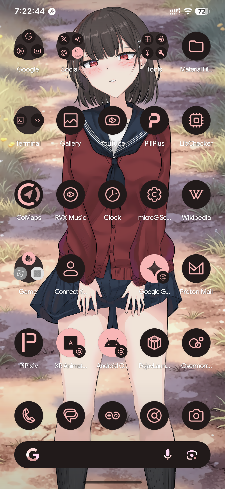
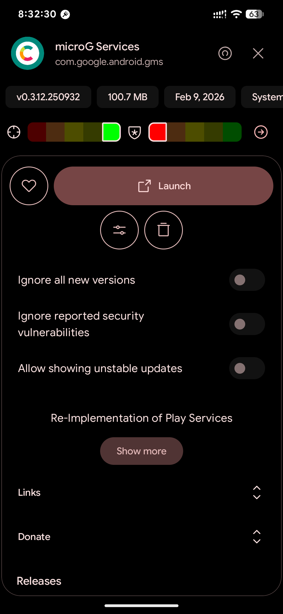
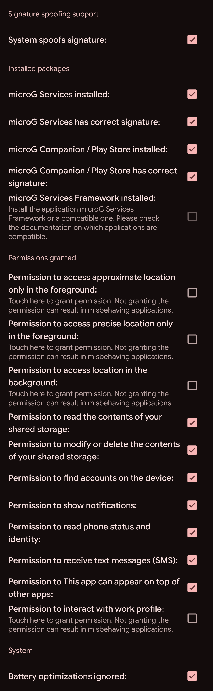
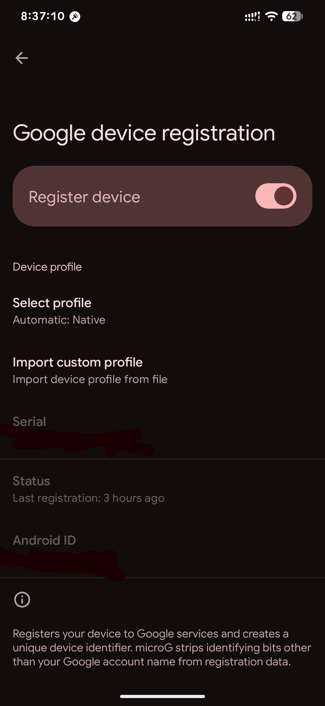
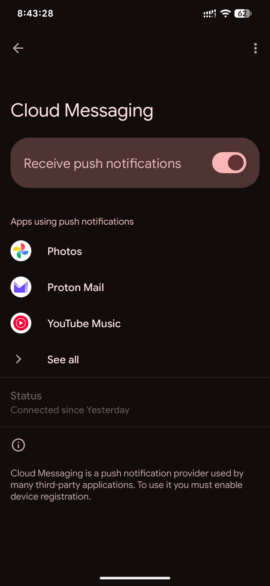
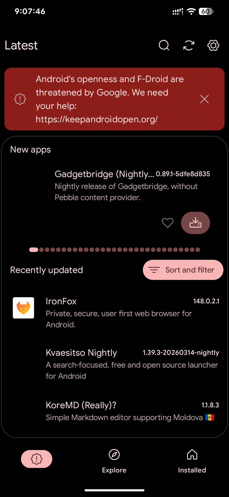
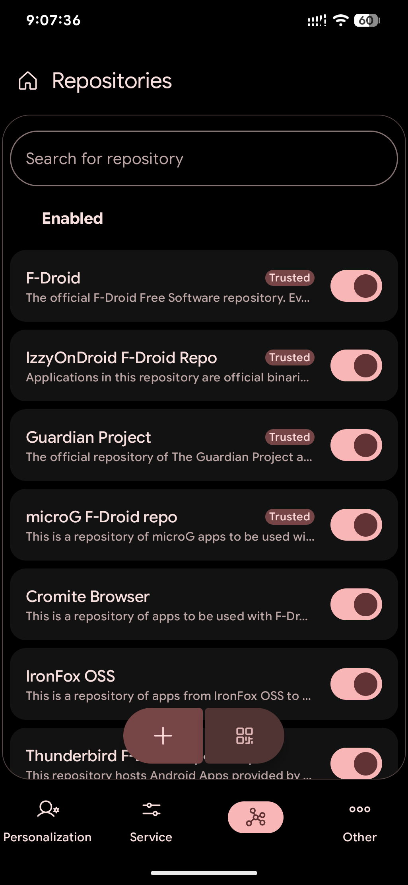

> De-google your Android devices, and using FOSS softwares and MicroG instead of Google-specific services.

本文是一次將常見 Android 手機「去 Google 化」的嘗試。在完全去除 Google 服務的 Android 手機上，不使用 Google 服務，僅在必要時通過瀏覽器存取 Google 服務，真的可行嗎？可以的。例如下圖全新安裝的 Android 系統，絕大多數都是自由（或尊重自由的）軟體（忽略下面的「Google 電話」和「Google 簡訊」圖標，那只是「主題圖示（Themed icons）」給AOSP默認的電話和簡訊應用應用的圖示而已）：

# 「去 Google 化」的含義

按照維基百科的定義，[「去 Google 化（De-google）」](https://en.wikipedia.org/wiki/DeGoogle) 是近年來在歐美地區興起的草根運動，就是將常見的 Google 服務從 Android 裝置拔掉，不再依賴 Google 提供的服務。旨在保護隱私，對抗監控資本主義，降低未來的[轉移成本(Barrier of exit)](https://ckhung0.blogspot.com/2014/10/barrier-of-exit.html)，脫離圍牆花園等等。 
根據威脅模型（Threat model）分析，去 Google 化可以分爲許多方面。從最簡單的擺脫 Google 服務，例如 Gmail、Google 行事曆，到完全移除 Google 服務及其內容，具體的行爲看個人需求來定義。 

Reddit有個[r/degoogle](https://www.reddit.com/r/degoogle/)板專門在討論去Google化的策略。 

本文要講的，是最「極端」的「去 Google 化」例子，將 Android 裝置內所有 Google 服務及內容全部清除。 

# 解鎖手機 & 刷機

在中國大陸以外（現在連中國大陸的手機都內建了）的手機是多半裝有 [Google 服務](https://www.android.com/intl/zh-TW_tw/gms/)的，且很多 APP 都依賴它們，根本無法解除安裝。如果在內建 Google 服務的系統上強制反安裝 Google 程式，很有可能會讓作業系統出現問題，嚴重的可能會使裝置無法正常使用。因此最好把手機刷成偏原生風格的 Android 系統，例如 LineageOS 或者是 GrepheneOS，這類系統不會內建任何 Google 服務或者組件，想要 de-google 還是很方便的。另外想要 Root 也是非常容易的。 

我們需要停止使用 Google 服務，但是大多數應用都依賴 Google 服務，甚至有些應用偵測到沒有 Google 服務甚至就不給執行。這時候就要通過「microG」這個開源的替代品來取代專有的 Google Play 服務。它可以將 Google 服務所收集的資料最小化，同時還可以保證依賴 GMS 的程式正常執行。

::github{repo="microg/GmsCore"}

去 Google 化自然是拒絕使用 Google Play 的，但是妳總得需要一個圖形化應用商店吧？當然妳可以像我一樣，通過修改 Android 系統分割來爲 Android 添加一個套件管理器（比如 `opkg` `apk` 等等，讓它看起來更像一個嵌入式 Linux 作業系統）。只是這樣比較複雜，得需要解決根目錄唯讀和 SELinux 問題。因此本文將介紹使用僅包含自由軟體的「F-Droid」（的替代「Neo Store」），以及 「Aurora Store」 來取代 Google Play。 

我使用的手機是高通於2024年「發佈」的[驍龍 8 Elite MTP原型機](https://blog.cloudflare88.eu.org/posts/sm8750-mtp-review/)，雖然是一臺僅面向開發人員和OEM的測試機[^1]，但也可以用於軟體開發和除錯。雖然高通的「原廠」系統本身就接近原生
Android 了，但還是內建了高通的私貨，有大量測試軟體。在這裏我選擇乾淨一點，直接將手機刷成 LineageOS。原因無他，就 LineageOS 支援的手機最多，預設的情況下不會內建 Google 框架，可以自由選擇是否安裝。 

LineageOS 內建的組件很少，但是我認爲原生 Android 就足夠我日常使用了。而且 Matarial you 介面設計簡單好看，足夠好用。
如果你的手機還有 Lineage OS 之外的刷機包，也沒有必要一定限定要使用 Lineage OS，像 GrepheneOS 也很不錯，提供的隱私保護比絕大多數 Android 客製化系統更徹底。但須要注意是否有發佈不包括 Google 服務的刷機包。刷機後建議通過 KernelSU 或者 Apatch 來取得 Root，雖然並非必要，但是可以方便修改系統檔案。

# 安裝 microG 

MicroG 是 Google 服務的自由開源實作。也是 Google 服務 API 的開源實作，用以取代 Google 服務，避免應用無法運作。讓你方便從應用存取 Google 賬號，與常見的 GAPPS 安裝檔相比，microG 是完全開源的 Google API 重新實作的服務，而不是使用 GMS 二次分發。
雖然使用 microG 有點「做半套」的感覺，但是 microG 本身不需要任何 Root 權限，日後想要解除安裝也比較方便，而且也不需要登入 Google 賬戶。 
但是，microG 只能部分取代 Google 服務，對於付費的部分就未必支援。Google 自家開發的應用也有不支援 microG 的。

microG 不需要任何權限就可以安裝，不過需要作業系統支援「簽名僞裝」，一般只有基於 LineageOS 的客製化系統才會支援這個功能，所以我選擇 LineageOS 作爲演示。 

1. 至 [microG 網站](https://github.com/microg/GmsCore/wiki/Downloads)下載 `microG services` `microG companion` 二個應用，建議通過「Neo Store」訂閱 [microG 套件庫](https://microg.org/fdroid/repo/?fingerprint=9BD06727E62796C0130EB6DAB39B73157451582CBD138E86C468ACC395D14165)，方便接受更新。

2. 開啓「microG 設定」，點按「自我檢查」，將要求的功能視個人需要開啓，之後回到主畫面點按「註冊爲 Google 設備」，這樣就可以登入 Google 賬號。

3. 有應用要求通過 FCM 推送通知時，就會列在「雲端推播」，如果不想使用專有的FCM推送，認爲不夠保護隱私，請改用 UnifiedPush 替代。

4. 如果要使用導航等地圖軟體，建議安裝SIM卡並開啓WiFi。然後在「位置」中，開啓「向線上服務發出請求」「從GPS學習」這二個選項，使用線上的 position.xyz 服務獲取位置。**最新的 microG 已經不支援採用 UnifiedNip 的後端服務了**，這樣地圖類應用的導航功能才可以運作。我的經驗是，使用 OpenStreetMap 圖資的 CoMaps 可以快速完成定位，而 OSMAnd 則是慢吞吞的。

5. microG 也支援 Play integrity 驗證。但是想要通過這個驗證卻非常有難度，如果使用一個早就被注銷的 `keybox` 配合 Play integrity Fix 和 Tricky store 模組就可以做到通過 Basic 和 Device 驗證，當然也可以做到 Strong 驗證。

# 修改系統網路設定

以下內容涉及修改系統 DNS、NTP伺服器、GPS等設定，請根據下面短片操作：

<iframe width="657" height="370" src="https://www.youtube.com/embed/E1U5qoiR1fM" title="How to De-Google LineageOS" frameborder="0" allow="accelerometer; autoplay; clipboard-write; encrypted-media; gyroscope; picture-in-picture; web-share" referrerpolicy="strict-origin-when-cross-origin" allowfullscreen></iframe>

# 安裝 Neo Store 和 Aurora Store

> 除了不要安裝 Google 應用之外，也不要安裝任何中國開發的應用！

這二個應用商店不使用 Root 權限的情況下，安裝應用都必須要手動安裝。

通常 Google Play 才有的應用，F-Droid 總會有對應的開源替代品。而 Aurora Store 就是方便下載只有 Google Play 才有的應用。例如 Mosavi。

1. 裝 Neo Store，用來下載開源應用

::github{repo="NeoApplications/Neo-Store"}

之後點按右上角的「設定」圖示，點按「套件庫」，開啓「IzzyOnDroid F-Droid Repo」「F-Droid Archives」這二個套件庫，就可以下載應用了。

2. 至 [Aurora Store](https://auroraoss.com/)網站，或者在 Neo Store 檢索「Aurora Store」下載安裝。Aurora Store 開啓後，點按「匿名」來訪問 Google Play 商店。Aurora 會使用一組匿名的 Google 賬號，方便妳下載 Google Play 上的免費應用了。如果妳登入自己的 Google 賬戶，就可以下載之前購買過的付費應用，但是無法購買新的應用。另外如果想要存取不同地區的 Google Play 商店，需要使用 VPN 來連線登入。

:::warning
Aurora Store 會把 microG 服務當作真的 Google 服務，因此請將其加入「黑名單」來避免被更新！
:::

有些APP執行依賴GMS服務，單純裝 Aurora Store 是不夠的，得依賴 microG。不過microG無法100%實現所有GMS的功能。

[^1]:限量發售（來源未驗證）

