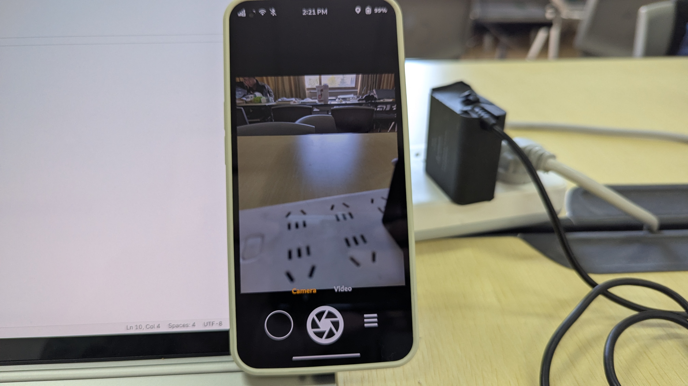
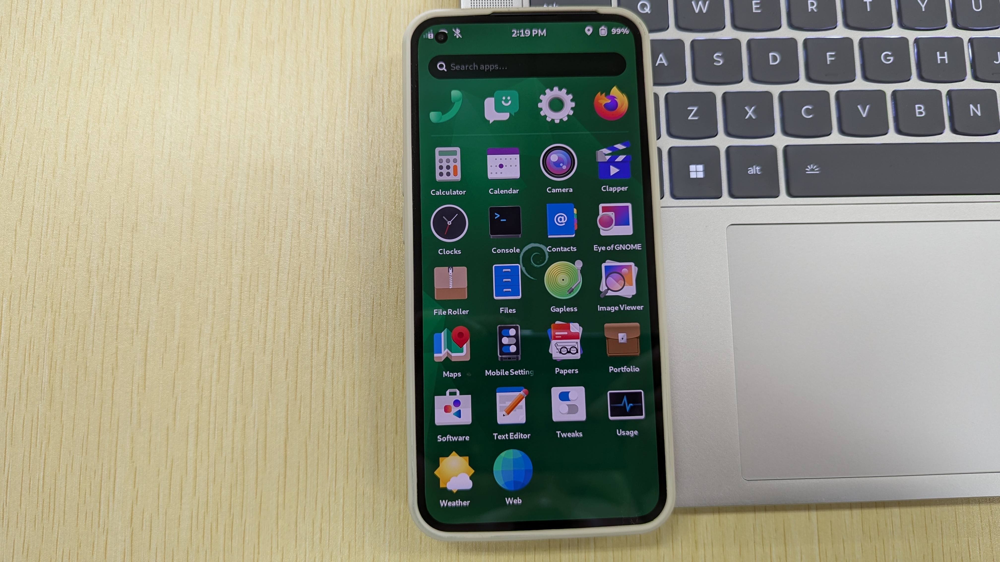
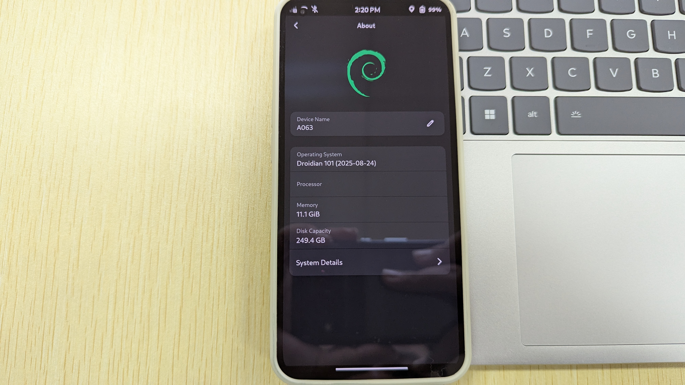
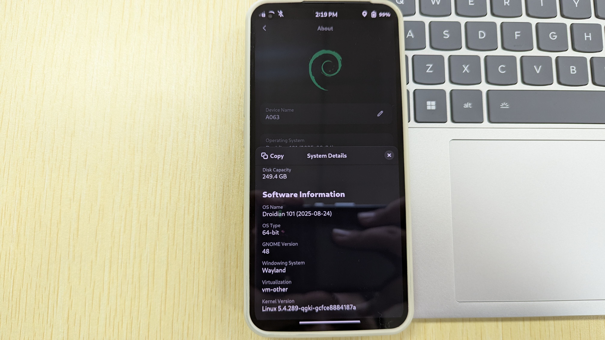
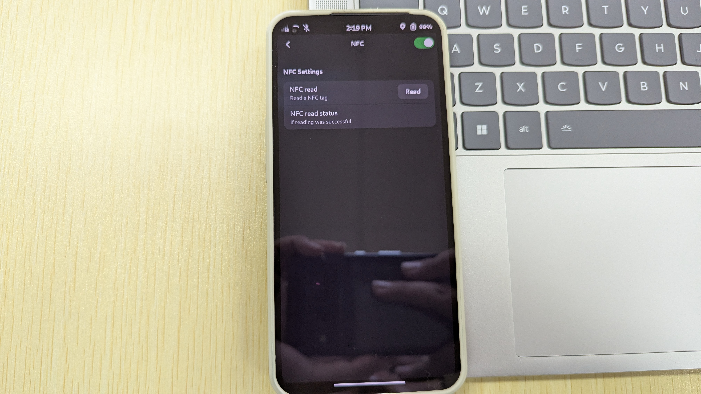
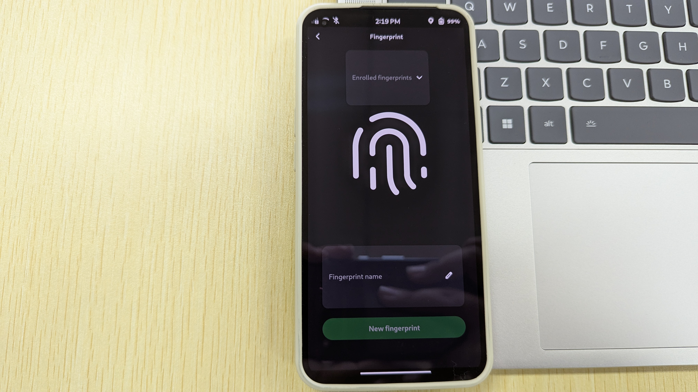
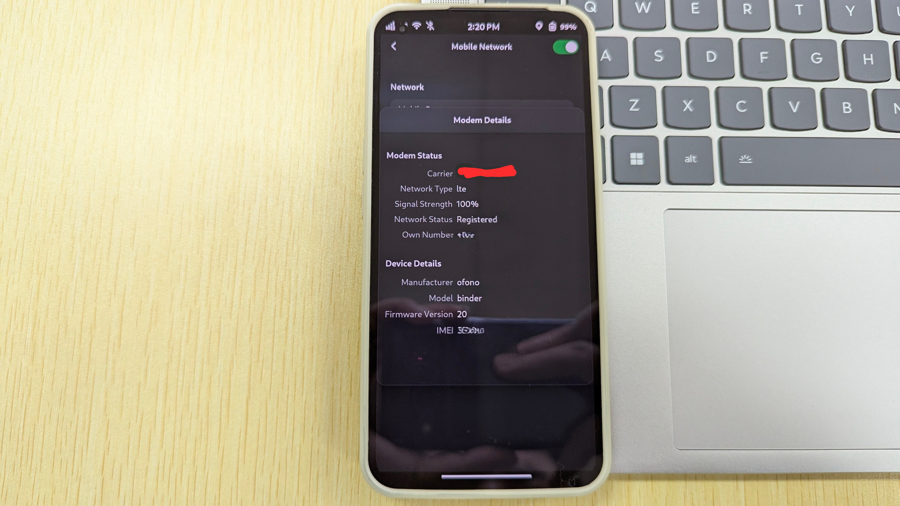

把 Android 手機刷機成 Debian 系統，是一個很有趣的嘗試。

## Droidian 介紹

Droidian 是一個基於 Debian 的 Testing 分支開發的行動裝置作業系統，目的在於將 Android 手機的系統改裝爲 Debian 系統，讓 Android 手機可以像一般 Linux 電腦一樣，享受 Debian 的各種好處。</br>
由於 Android 對 Linux 核心和文件系統做出了大量修改（例如刪除了 Linux 中常見的 X 視窗系統和 Wayland，亦不支援支撐大多數 Linux 程式所需的 Glib 或 musl C函式庫），使得市面上的絕大多數 Android 手機移植 Linux 系統變得疑難重重。因此，Droidian 專案的產生，便是解決這個問題而來的：它採用 [Halium](https://halium.org/) 和 libhybris，把 Android 的 bionic 與普通 Linux 的 Glibc 的C函式庫進行對應，並且相容 Android 中的 HAL 和硬體驅動程式，以此來降低移植難度。如果你的手機出廠預載 Android 9 及以上系統，Droidian 還可以通過 GSI 的方式移植，只需重新編譯核心即可。</br>

## 安裝 Droidian

我的設備在 XDA 上有[非官方移植](https://github.com/Nonta72/nothing-spacewar)，支援狀況也非常不錯：大部分功能正常，甚至也可以撥打電話，相機的畫素雖然被限制在1200萬，但是畫面的顏色卻非常不錯，比起主線核心那個沒有經過3A處理的樣子好了不少。</br>



這是目前支援的項目：
 - 屏幕（重新整理頻率爲60Hz）
 - 相機（畫素1200萬）
 - 麥克風
 - 藍牙
 - 電池管理（雖然不及 Android 原生的好，但還是可以用）
 - 無線網路（藍牙無線網路也能正常使用）
 - 音效（沒有耳機孔，但是可以用耳機）
 - 無線充電（雖然不及 Android 原生的好，但還是可以用，可能有危險）
 - 數據機（不支援5G行動數據，但是可以使用）
 - NFC
 - GPS
 - 傳感器
 - 震動（效果非常好！可以開發其他用途）
 - 陀螺儀（效果非常好！可以開發其他用途）
 - 加速度計
 </br>
 這是無法工作的項目：
 - 雙SIM卡
 - 熒幕下方指紋識別（Phosh 目前不支援這種設計）
 - Glyph 燈帶
 - 90Hz及120Hz 重新整理頻率
 
 ### 刷機過程

 參考 XDA 的[教學](https://xdaforums.com/t/rom-linux-droidian-for-spacewar-with-waydroid.4762595/)，到[這裏](https://github.com/Nonta72/nothing-spacewar)下載需要的文件，你可以去 [Droidian](https://github.com/droidian-images/droidian/releases) 的GitHub 上下載最新版的映像檔嘗試。</br>
 下載完成後，解壓縮文件。</br>
 之後，去[這裏](https://github.com/spike0en/nothing_archive/releases/tag/Spacewar_T1.5-230310-1650)下載 Android 13 韌體，必須是原廠韌體，否則會有顯示Bug。下載完後，通過fastboot刷入各分區即可。或使用下面的腳本（來源：[Nothing Flasher](https://github.com/spike0en/nothing_flasher/blob/main/README.md#-download) by spike0en)：

 ```bash
 #!/usr/bin/env bash

echo "#################################"
echo "# Spacewar Fastboot ROM Flasher #"
echo "#    t.me/s/Nothing_Archive     #"
echo "#################################"

##----------------------------------------------------------##
if [ ! -d "$(pwd)/platform-tools-r33.0.0" ]; then
    if [[ $OSTYPE == 'darwin'* ]]; then
        fastboot_dl="https://dl.google.com/android/repository/platform-tools_r33.0.0-darwin.zip"
    else
        fastboot_dl="https://dl.google.com/android/repository/platform-tools_r33.0.0-linux.zip"
    fi
    curl -L "$fastboot_dl" -o "$(pwd)/platform-tools-r33.0.0.zip"
    unzip "$(pwd)/platform-tools-r33.0.0.zip"
    rm "$(pwd)/platform-tools-r33.0.0.zip"

    if [ -d "$(pwd)/platform-tools" ]; then
        mv "$(pwd)/platform-tools" "$(pwd)/platform-tools-r33.0.0"
    fi
fi

fastboot="$(pwd)/platform-tools-r33.0.0/fastboot"

if [ ! -f "$fastboot" ] || [ ! -x "$fastboot" ]; then
    echo "Fastboot cannot be executed, exiting"
    exit 1
fi

# Partition Variables
boot_partitions="boot vendor_boot dtbo"
firmware_partitions="abl aop bluetooth cpucp devcfg dsp dtbo featenabler hyp imagefv keymaster modem multiimgoem qupfw shrm tz uefisecapp xbl xbl_config"
logical_partitions="system system_ext product vendor odm"
junk_logical_partitions="null"
vbmeta_partitions="vbmeta_system"

function SetActiveSlot {
    if ! "$fastboot" set_active a; then
        echo "Error occured while switching to slot A. Aborting"
        exit 1
    fi
}

function handle_fastboot_error { 
    case "$FASTBOOT_ERROR" in
        [nN] )
            exit 1
	    ;;
    esac
}

function ErasePartition {
    if ! "$fastboot" erase $1; then
        read -rp "Erasing $1 partition failed, Continue? If unsure say N, Pressing Enter key without any input will continue the script. (Y/N)" FASTBOOT_ERROR
        handle_fastboot_error
    fi
}

function RebootFastbootD {
    echo "##########################"             
    echo "# REBOOTING TO FASTBOOTD #"       
    echo "##########################"
    if ! "$fastboot" reboot fastboot; then
        echo "Error occured while rebooting to fastbootd. Aborting"
        exit 1
    fi
}

function FlashImage {
    if ! "$fastboot" flash $1 $2; then
        read -rp "Flashing$2 failed, Continue? If unsure say N, Pressing Enter key without any input will continue the script. (Y/N)" FASTBOOT_ERROR
        handle_fastboot_error
    fi
}

function FlashSuper {
    RebootBootloader
    if ! "$fastboot" flash super super.img; then
        RebootFastbootD
        FlashImage "super" \ "super.img"
    fi
}

function DeleteLogicalPartition {
    if ! "$fastboot" delete-logical-partition $1; then
        if ! echo $1 | grep -q "cow"; then
            read -rp "Deleting $1 partition failed, Continue? If unsure say N, Pressing Enter key without any input will continue the script. (Y/N)" FASTBOOT_ERROR
            handle_fastboot_error
        fi
    fi
}

function CreateLogicalPartition {
    if ! "$fastboot" create-logical-partition $1 $2; then
        read -rp "Creating $1 partition failed, Continue? If unsure say N, Pressing Enter key without any input will continue the script. (Y/N)" FASTBOOT_ERROR
        handle_fastboot_error
    fi
}

function ResizeLogicalPartition {
    if [ $junk_logical_partitions != "null" ]; then
	for i in $junk_logical_partitions; do
            for s in a b; do 
                DeleteLogicalPartition "${i}_${s}-cow"
                DeleteLogicalPartition "${i}_${s}"
    	    done
	done
    fi

    for i in $logical_partitions; do
        for s in a b; do 
            DeleteLogicalPartition "${i}_${s}-cow"
            DeleteLogicalPartition "${i}_${s}"
            CreateLogicalPartition "${i}_${s}" \ "1"
        done
    done
}

function WipeSuperPartition {
    if ! "$fastboot" wipe-super super_empty.img; then 
        echo "Wiping super partition failed. Fallback to deleting and creating logical partitions"
        ResizeLogicalPartition
    fi
}

function RebootBootloader {
    echo "###########################"
    echo "# REBOOTING TO BOOTLOADER #"       
    echo "###########################"
    if ! "$fastboot" reboot bootloader; then
        echo "Error occured while rebooting to bootloader. Aborting"
        exit 1
    fi
}
##----------------------------------------------------------##

echo "#############################"
echo "# CHECKING FASTBOOT DEVICES #"
echo "#############################"
"$fastboot" devices

echo "#############################"
echo "# CHANGING ACTIVE SLOT TO A #"
echo "#############################"
SetActiveSlot

echo "###################"
echo "# FORMATTING DATA #"
echo "###################"
read -rp "Wipe Data? (Y/N) " DATA_RESP
case "$DATA_RESP" in
    [yY] )
        echo 'Please ignore "Did you mean to format this partition?" warnings.'
        ErasePartition userdata
        ErasePartition metadata
        ;;
esac

echo "############################"
echo "# FLASHING BOOT PARTITIONS #"
echo "############################"
read -rp "Flash images on both slots? If unsure, say N. (Y/N) " SLOT_RESP
for i in $boot_partitions; do
    case "$SLOT_RESP" in
        [yY] )
            for s in a b; do
                FlashImage "${i}_${s}" \ "$i.img"
            done
	    ;;
	*)
            FlashImage "${i}_a" \ "$i.img"
	    ;;
    esac
done

echo "###################"
echo "# FLASHING VBMETA #"
echo "###################"
read -rp "Disable android verified boot?, If unsure, say N. Bootloader won't be lockable if you select Y. (Y/N) " VBMETA_RESP
case "$VBMETA_RESP" in
    [yY] )
        if [ "$SLOT_RESP" = "y" ] || [ "$SLOT_RESP" = "Y" ]; then
            for s in a b; do
                FlashImage "vbmeta_${s} --disable-verity --disable-verification" \ "vbmeta.img"
            done
        else
            FlashImage "vbmeta_a --disable-verity --disable-verification" \ "vbmeta.img"
        fi
        ;;
    *)
        if [ "$SLOT_RESP" = "y" ] || [ "$SLOT_RESP" = "Y" ]; then
            for s in a b; do
                FlashImage "vbmeta_${s}" \ "vbmeta.img"
            done
        else
            FlashImage "vbmeta_a" \ "vbmeta.img"
        fi
        ;;
esac

echo "#####################"
echo "# FLASHING FIRMWARE #"
echo "#####################"
RebootFastbootD
for i in $firmware_partitions; do
    case "$SLOT_RESP" in
        [yY] )
            for s in a b; do
                FlashImage "${i}_${s}" \ "$i.img"
            done
	    ;;
	*)
            FlashImage "${i}_a" \ "$i.img"
	    ;;
    esac
done

echo "###############################"
echo "# FLASHING LOGICAL PARTITIONS #"
echo "###############################"
if [ ! -f super.img ]; then
    if [ -f super_empty.img ]; then
        WipeSuperPartition
    else
        ResizeLogicalPartition
    fi
    for i in $logical_partitions; do
        FlashImage "${i}_a" \ "$i.img"
    done
else
    FlashSuper
fi

echo "####################################"
echo "# FLASHING OTHER VBMETA PARTITIONS #"
echo "####################################"
for i in $vbmeta_partitions; do
    case "$VBMETA_RESP" in
        [yY] )
            FlashImage "${i}_a --disable-verity --disable-verification" \ "$i.img"
            ;;
        *)
            FlashImage "${i}_a" \ "$i.img"
            ;;
    esac
done

echo "#############"
echo "# REBOOTING #"
echo "#############"
read -rp "Reboot to system? If unsure, say Y. (Y/N) " REBOOT_RESP
case "$REBOOT_RESP" in
    [yY] )
        "$fastboot" reboot
        ;;
esac

echo "########"
echo "# DONE #"
echo "########"
echo "Stock firmware restored."
echo "You may now optionally re-lock the bootloader if you haven't disabled android verified boot."
```
刷完後，運行文件提供的刷機腳本，等待完成即可。

## 體驗
刷完開機後，預設密碼`1234`，基本操作與 PostmarketOS 無異。其預設UI爲Phosh，不能自行更換。強行更換會遇到依賴地獄。



開機後，可以看到Droidian的桌面，可以正常運行各種應用程式。手機的基本功能都能正常工作，還可以撥打電話。雖然熒幕的整理頻率很低，但是驍龍778G+的效能很強，絲毫不會有任何卡頓。也算是解決了目前主線核心不支援通話音頻的問題。</br>
比起這些體驗而言，我最關心的還是核心版本。通過`uname -a`查看，得知核心版本爲5.4的QGKI核心，遠遠落後於主線6.17的版本。根據 Droidian 自身的原理來看，應該是不能升級核心版本，除非 Nothing 官方升級 Nothing Phone 1 的 BSP 核心。但是 Nothing Phone 1 早已經被官方停止支援，指望廠商是不可能的事情。</br>





雖然核心版本老舊，但是仍然可以執行絕大多數程式。在打開GNOME的設定後，有幾個選項也同樣帶給了我驚喜：

- 設置裏有了NFC相關的選項，比起 Android 上各種NFC設定，在Linux上看到這個選項反而讓我驚訝不已。要知道主線 Linux 對於 NFC 的支援雖然在2.6核心就被引入，但是一直缺乏用戶友好的程式，而主流的桌面環境更是缺乏相關支援。雖然Droidian 的 NFC 設定非常簡單，但是有總比沒有好！



- 設置中還有指紋選項，雖然 GNOME 也支援了指紋解鎖，但是我沒有一臺設備有指紋識別器，那些內建指紋識別的，能夠刷 Linux 的手機，因爲廠商不提供 Linux 驅動，而不支援指紋解鎖，真是可惜。如今我終於可以在 Droidian 上一飽眼福了（爲什麼是“飽眼福”？因爲Phosh不支援屏幕下指紋識別，即使識別器本身可用，也無法解鎖屏幕）！



- 因爲是基於原廠核心修改，加之 Halium 與 libhybris 的採用，數據機的韌體實現方式也不同了。它被一個叫“ofono”的軟體棧替代，而不是主線核心中掛載數據機韌體啓動數據機的方案，與此同時，數據機的廠商也變成了“binder”，而不是“Qualcomm Incomprated”。不過，你依然可以撥打電話，與朋友發短訊聊天：



唯一的問題是揚聲器的聲音非常響亮，而音量調節是沒有用的，只有最大和靜音兩個選擇。

## Waydroid 與應用程式相容性
根據 Halium 的編譯指南所寫，我們最終編譯出來的核心，是可以相容LXC容器的。而Waydroid則是把 Android 包裝到 LXC 容器中。讓 Android 幾乎以無效能損失的方式執行在 Linux 系統上。Droidian 將 Waydroid 的選項整合到了系統設定裏，方便普通使用者管理。不過我還是通過`sudo apt install waydroid` 來安裝了，因爲命令非常直接明了。而且我早就有 Waydroid 的使用經驗，那幾條命令我也早就熟記於心。當然使用體驗比主線核心相去不遠，我仍然可以在 Linux 桌面環境下運行原生的 Android 應用，例如 Telegram、Signal、甚至是 Google Maps。實際測試後發現，Waydroid 的啓動速度非常快，應用的運行也相當流暢，幾乎與原廠無異。而且把 Android 應用放在 Waydroid 中還比較安全，因爲容器裏的應用無法訪問外部的文件，此外也可以有效遏制不少應用開機自啓動的問題，不只是拖累系統執行效能，也可能會在背景收集使用者資料，亦或是幹些不明所以的勾當。這都是在普通 Android 機做不到的。

## 總結

Droidian 在 Nothing Phone 1 上的移植體驗讓我看見了「Android 與 Linux 能夠真正融合」的可能。雖然目前仍存在許多小問題，但它已經證明：即便在封閉的 Android 裝置上，我們仍能擁抱一個真正自由的 Linux 桌面。但它同樣讓我明白了 Android 手機與 Linux 手機的差異： Android 核心落後於主線核心至少5年，大量上游的修補無法及時應用於 Android，使 Android 裝置面臨着安全問題。此外，設備廠商對於核心的大量修改，使得 Android 設備移植主線 Linux 核心非常困難。主線核心對於硬體的實現，往往需要核心開發者花費幾個月甚至幾年時間才能做好。曾經有人拿 Pinephone 與 一加6T的主線核心原始碼做過對比，結果是 Pinephone 的主線核心與上游相差50行代碼，而後者則相差500行代碼。這個差距正是目前 Android 裝置在自由軟體世界中難以完全融入的現實寫照。這也是 Droidian 和 Halium 教給我的，最爲生動的一課，它不是教科書，卻勝似教科書。而最可貴的一點是：這節課必須由你親自完成，對照文檔從無到有，一步步修復、除錯甚至於重新實現手機的所有功能。</br>
這種學習,不是速成的知識輸入，而是緩慢而紮實的理解；它會讓你更尊重硬體、理解驅動、體會抽象核心與具體裝置之間那條看不見的拉鋸線，它也會讓你對於 Linux，乃至整個 UNIX 世界有着比以往更加深刻的認識。它也會讓你對於自由軟體、開源社群、開放文化有著更深刻的理解。完成它的報酬或許不是獎盃或者金錢，也可能不會有任何商業價值。但它會是一段值得珍惜的歷程，一個你永遠都不會忘記的經驗。是能讓一台手機在自由軟體下運作的成就感，更是你對一個開源生態貢獻的一小塊基石——雖小，卻能被後來者踏上，繼續向前。
