<!-- Co-translated by Gemini -->

(Original text written on January 4, 2026)
# The Beginning of Everything

Since I swapped my primary laptop from a MacBook Air to this Lenovo Yoga Air 14s, my fondness for the Snapdragon X Elite has been steadily climbing. It's not just the shock of having 12 high-performance Oryon CPU cores and 32GB of RAM that makes it more than enough for daily tasks and embedded Linux development alike. However, like any laptop, this Yoga Air 14s has its shortcomings.</br>
</br>
It ships by default with Windows 11 ARM, and specifically the Home Edition, which lacks Hyper-V virtualization support compared to the Pro version. I ended up backing up my useful data and wiping the entire drive to install Windows 11 Pro. This time, the "Optional features" finally included the "Hyper-V" option. I enabled the relevant features, rebooted, and downloaded the Debian 13 ARM installation image. I tried to fire up a virtual machine, but it hung; no matter how I tweaked the VM configuration, I couldn't get into the Debian installer. Plus, Windows is notorious "spyware," and I have zero desire to let Microsoft monitor me! So, I installed the only OS where most hardware currently works reasonably well: Ubuntu. But KVM functionality requires manual configuration.</br>

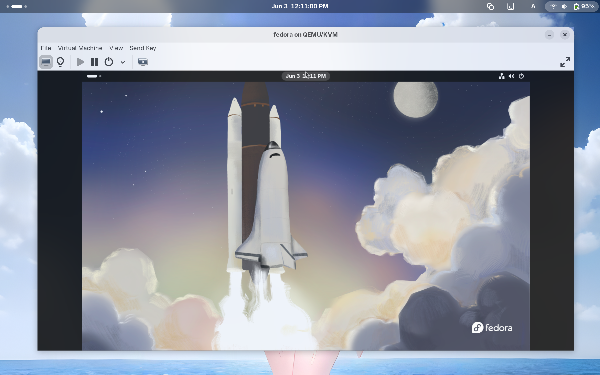

# Preparations

First, search for "UEFI Shell" on the web, find the corresponding [GitHub repository URL](https://github.com/pbatard/UEFI-Shell/releases), and download the EFI application named `shellaa64.efi`. Copy it to the `/EFI/BOOT/` directory in your EFI System Partition (ESP).</br>

::github{repo="pbatard/UEFI-Shell"}

If you are using rEFInd or the `systemd-boot` loader, they will automatically scan for the UEFI shell and add it to the menu. GRUB users might still need to perform manual configuration.</br>

Next, head over to GitHub and search for 「slbounce」, then download the `slbounce.efi` and `sltest.efi` EFI applications and copy them into your ESP. We then need to copy `tcblaunch.exe` from Windows. You can grab it from a running system or obtain it elsewhere. `tcblaunch.exe` is the critical "key" required for performing a "Secure Launch", the process on Qualcomm Windows platforms where the OS kernel elevates itself from the default EL1 Exception Level to EL2. The underlying theory is quite complex and might be difficult for most users to grasp, so I’ve summarized my understanding below for professional readers to reference:</br>

- Modern Windows on ARM (WoA) devices default to using Hyper-V to provide certain virtualization features (e.g., WSL, Windows Sandbox, WSA, and Docker). Its hypervisor always executes at the EL2 Exception Level. This differs from the OS kernel running at EL1 and applications at EL0. The [ARM Base Boot Requirements (BBR)](https://developer.arm.com/documentation/den0044/latest) specification strictly requires that UEFI firmware must execute at EL2 to permit the installation or configuration of hypervisors or virtualization-aware operating systems.</br>
</br>
- Since the SD835 (MSM8998), Qualcomm Snapdragon platforms have uniformly adopted standard UEFI firmware to replace the previous Little Kernel (LK) bootloader. However, Qualcomm's UEFI implementation does not satisfy the aforementioned ARM BBR requirements. Although the Snapdragon platform supports ARM virtualization extensions, the UEFI firmware executes at EL1. Consequently, the OS and its VM managers cannot access the hardware hypervisor. Therefore, a custom software implementation is required to allow the OS to seize control of the EL2 Exception Level and start the Hypervisor.</br>
</br>
- Qualcomm's so-called Secure Launch is neither ARM Trusted Boot (BL1/BL2/BL31/TF-A) [^1] nor UEFI Secure Boot. It is a Windows-proprietary hypervisor startup sequence: before the Windows kernel starts, it establishes an EL2 execution environment under a "trusted state" and lets Hyper-V take over that level.</br>
</br>
- `tcblaunch.exe` is a Microsoft-signed TCB (Trusted Computing Base) component. Its capabilities include: calling Qualcomm's private Secure Monitor / firmware interfaces, reconfiguring Exception Levels, and initializing the system registers and memory layout required by the hypervisor. This is the only way to enter the EL2 Exception Level without modifying the firmware.</br>
</br>
- The design goal of `slbounce` is not to bypass or break Secure Launch, but rather to trigger Secure Launch under legal and trusted premises. It obtains EL2 without actually starting Windows and hands the established EL2 state over to Linux.</br>
</br>
- Secure Launch is designed to occur before the OS starts, making the EFI stage the only logical entry point. Specifically, the `ExitBootServices()` function, acting as the boundary between UEFI and the OS, becomes the most suitable interception point. slbounce loads as an EFI driver, and its actual workflow is as follows:

1. `slbounce.efi` is loaded by the UEFI loader.
2. Validates and locates `tcblaunch.exe`.
3. Installs an `ExitBootServices()` hook.
4. Intercepts the bootloader's call to `ExitBootServices()`.
5. Executes `tcblaunch.exe` within the EFI context.
6. The Secure Launch firmware path is triggered, establishing EL2.
7. `tcblaunch.exe` returns normally.
8. Control is returned to the bootloader to continue starting Linux.
At this point, the system has completed the Secure Launch, but it is Linux that starts next, not Windows.

After downloading, reboot into the `systemd-boot` loader and select "EFI Shell." You will enter the UEFI Shell. We need to find the ESP on the hard drive (e.g., `fs3`), then type `fs3:` and press Enter to enter the partition. You can type `ls` to view the contents.</br>
</br>
Find the previously copied `sltest.efi`, `slbounce.efi`, and `tcblaunch.exe` to begin testing.
Type `sltest.efi tcblaunch.exe`. A log saying "Performing Secure Launch" will appear. If successful, a green rectangular box will be displayed at the top of the screen. Reboot afterwards.</br>
</br>

# Compiling the Kernel

Since the stock Ubuntu kernel does not support the EL2 Exception Level, we need to compile our own. I used the `aarch64-laptop` kernel branch maintained by Linaro.</br>
Use `git clone` to download the source code locally, then type `make defconfig qcom_laptops.config` to generate the kernel configuration. Follow this with `make -j12` to start compiling. The entire process took about 5 minutes (I timed it with my phone, including the kernel and module compilation), then type `sudo make modules_install install` to install the compiled kernel. During compilation, `-el2.dtb` device trees for all X Elite devices are generated; these are required for enabling Secure Launch. Next, configure the bootloader by adding an EL2 entry and specifying the corresponding device tree:</br>

```yaml
# NOTE: This is an example configuration file for systemd-boot.
# In /boot/efi/loader/entries

title Ubuntu (EL2)
linux /vmlinux-6.19.0-rc1-00112-g999aec19c5ca-dirty
initrd /initrd.img-6.19.0-rc1-00112-g999aec19c5ca-dirty
options root=UUID=610ef124-aae3-4bbe-a29d-a17f44c708e9 debug earlycon=efifb ro clk_ignore_unused pd_ignore_unused cma=128M efi=noruntime loglevel=7 snd_soc_x1e80100.i_accept_the_danger id_aa64mmfr0.ecv=1 earlycon console=tty0 crashkernel=2G-4G:320M,4G-32G:512M,32G-64G:1024M,64G-128G:2048M,128G-:4096M
devicetree /x1e80100-lenovo-yoga-slim7x-el2.dtb
```

Note: Be sure to add the `id_aa64mmfr0.ecv=1` parameter to the kernel options, otherwise the system will crash and reboot when using a virtual machine.</br>

# Installing Virt Manager

Once ready, enter the EFI Shell, find the hard drive's ESP, and type `load slbounce.efi` to load the driver. Then, find your system's bootloader and execute it via the UEFI Shell, selecting the EL2 configuration. If the kernel starts normally, it means Secure Launch was successful. Type `ls /dev/kvm` in the terminal to confirm the presence of the `/dev/kvm` device; if it's there, the KVM module is successfully loaded. You should also see logs regarding GIC and KVM in `dmesg`:

```yaml
# dmesg | grep kvm
[    0.067555] kvm [1]: nv: 568 coarse grained trap handlers
[    0.067687] kvm [1]: nv: 664 fine grained trap handlers
[    0.067777] kvm [1]: IPA Size Limit: 44 bits
[    0.067789] kvm [1]: GICv4 support disabled
[    0.067791] kvm [1]: GICv3: no GICV resource entry
[    0.067792] kvm [1]: disabling GICv2 emulation
[    0.067806] kvm [1]: GIC system register CPU interface enabled
[    0.067813] kvm [1]: vgic interrupt IRQ9
[    0.067839] kvm [1]: Broken CNTVOFF_EL2, trapping virtual timer
[    0.067845] kvm [1]: VHE mode initialized successfully
```

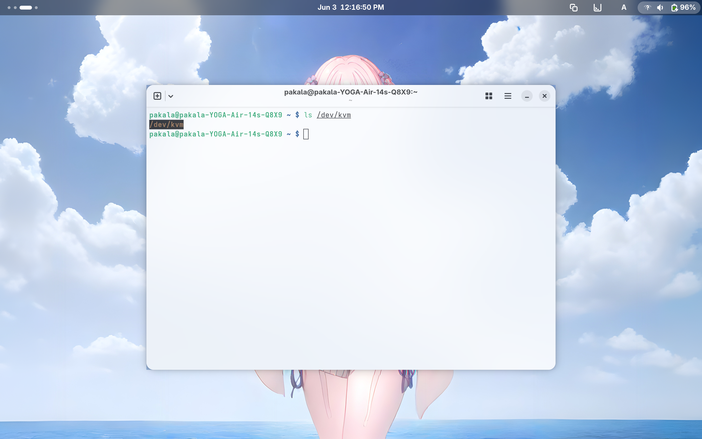

For the subsequent steps, I recommend keeping your laptop plugged in. This is because Qualcomm remote processors like the ADSP and CDSP will only be initialized with basic firmware by the kernel hypervisor under EL2. Consequently, all features dependent on the full firmware of these processors will break—such as Wi-Fi and battery management (resulting in the battery level being stuck at 0%), as well as audio. The current workaround is to use the ADSP-lite driver, which restores some basic functionality, or switch to the newer qebspil driver to let the UEFI firmware initialize these remote processors.</br>

If you need to use the `qebspli` driver, you must create a `firmware` folder in the EFI partition and place the remote coprocessor firmware for the chip inside. You can check the required firmware using the command: `find /sys/firmware/devicetree -name firmware-name -exec cat {} + | xargs -0n1`.</br>

Now, let's install Virt Manager, a graphical tool for managing virtual machines. On Ubuntu 26.04, you can install it via `sudo apt install virt-manager`. Enable the corresponding `systemd` service afterwards.</br>
Then, install the `qemu-system-arm` package:
```bash
sudo apt install qemu-system-arm
```
Next, add yourself to the `libvirt` group, log out, and log back in. You can now use Virt Manager to start virtual machines.

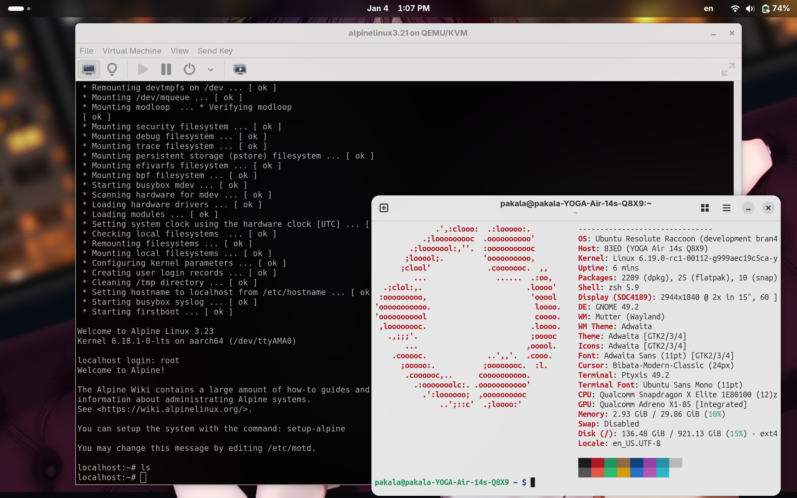

Create a new virtual machine, ensuring the virtualization type is set to "KVM" to enable KVM acceleration.

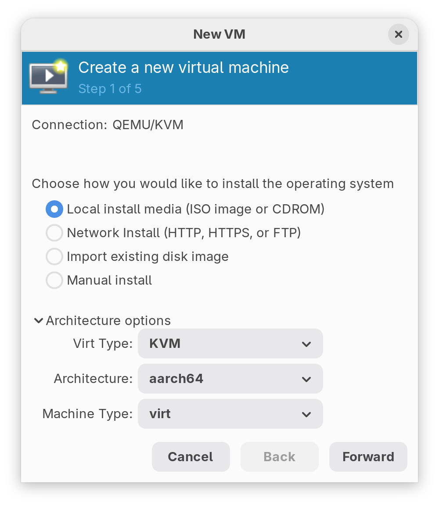

Load the Alpine Linux installation ISO image and click "Next."

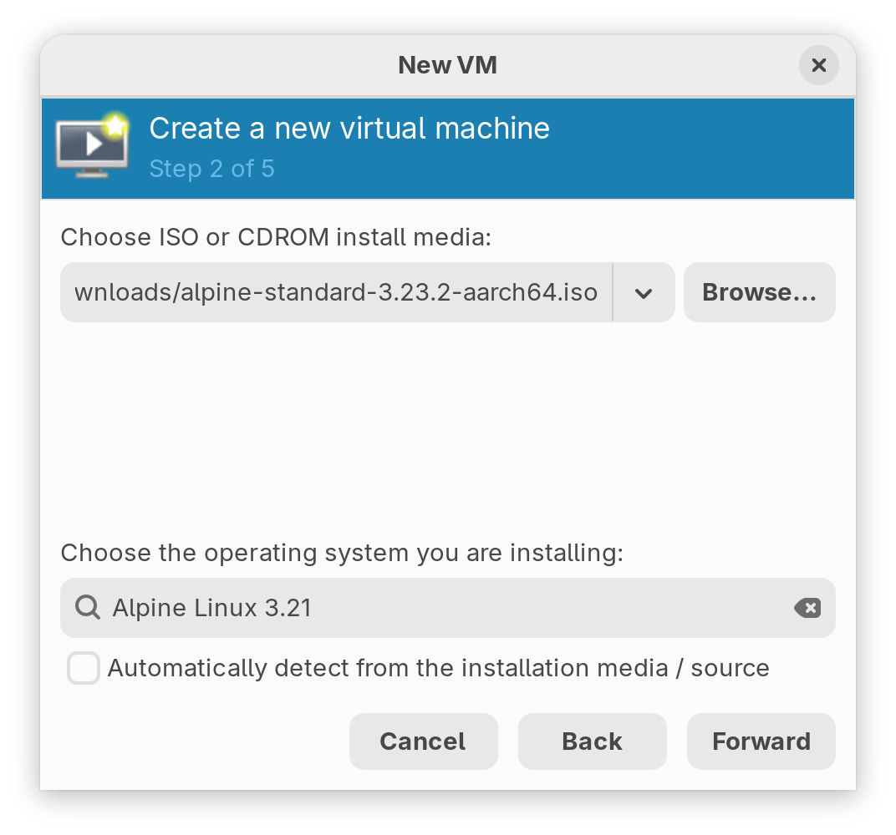

Specify the memory and CPU cores allocated to the VM. The Snapdragon X Elite is already quite powerful, so I allocated 4 cores and 4GB of RAM.

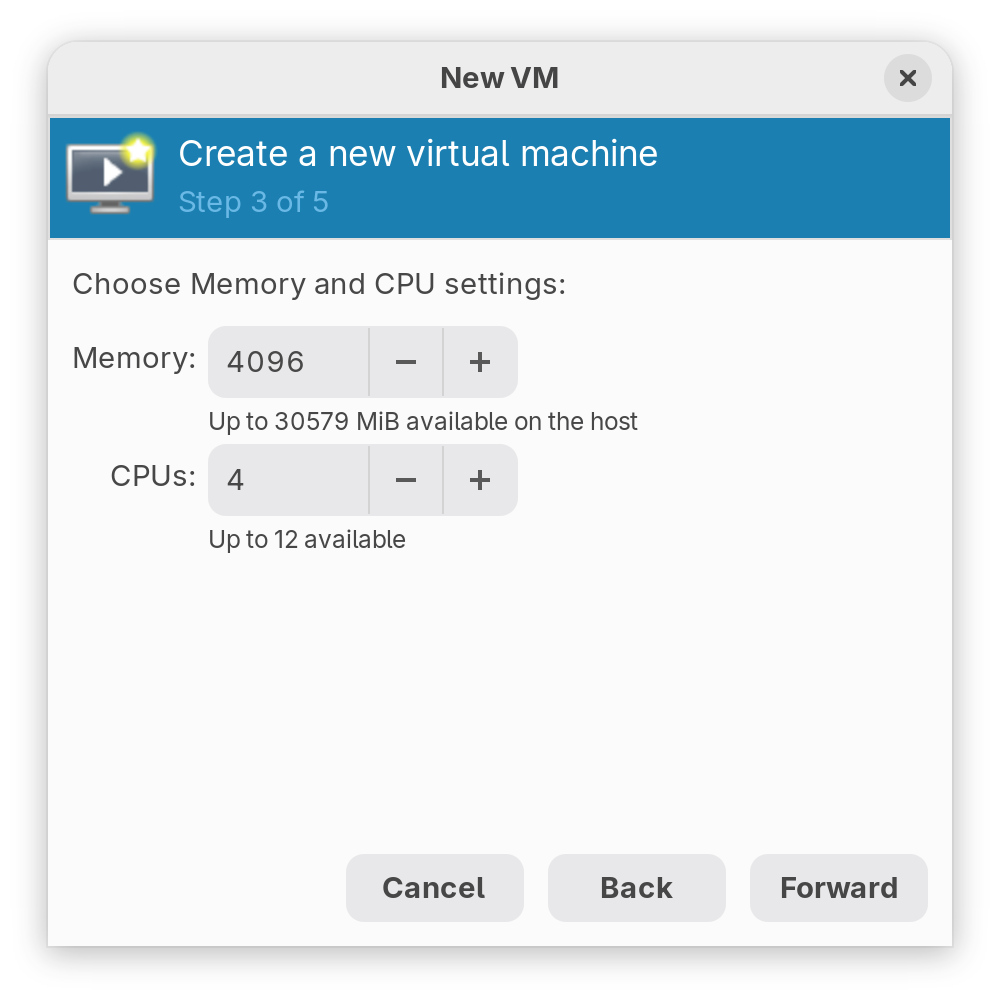

Create a virtual disk; I chose 20GB of space.

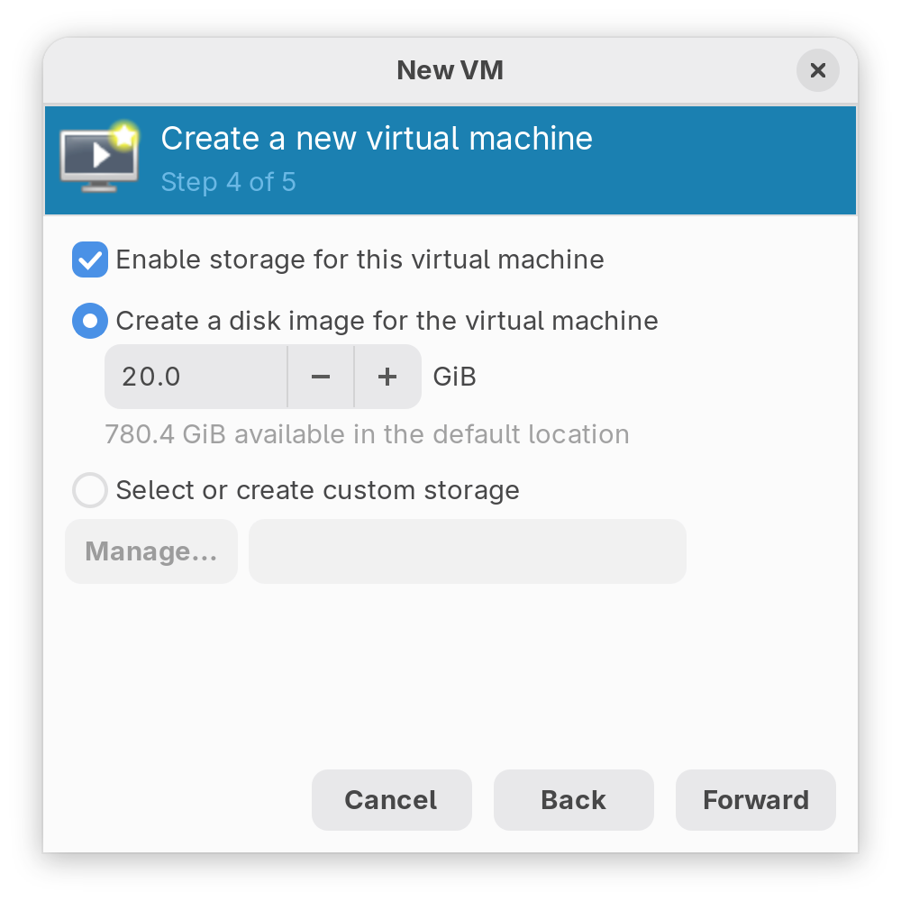

Set up the VM's network, keeping the defaults. Upon booting, you should see the Tianocore splash logo:

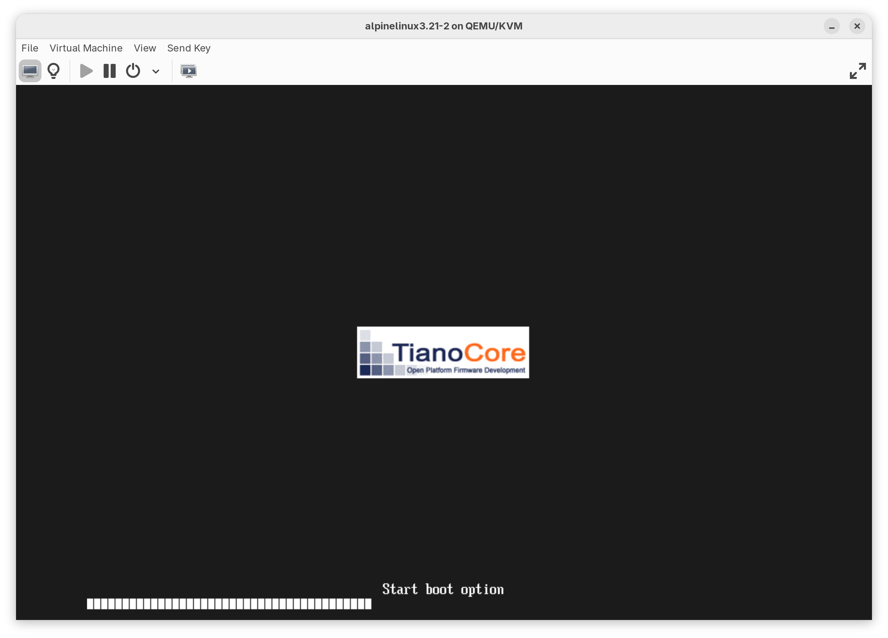


If you encounter an "Access denied" error, it's because the VM's UEFI firmware has Secure Boot enabled; you can disable it in the "Settings."

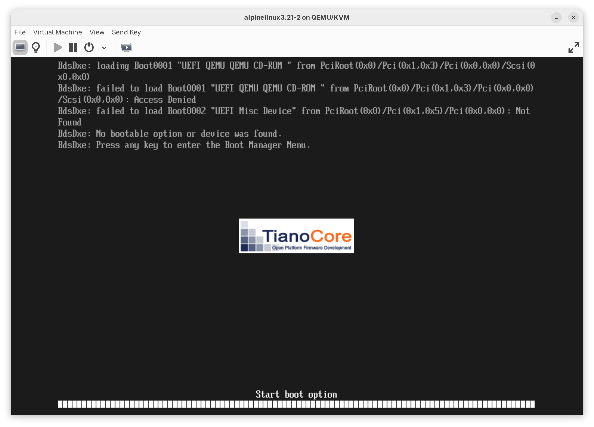


Boot the machine. You'll be presented with a `tty` screen; type `root` to log in.
Then, type `setup-alpine` to install Alpine Linux, which will prompt you with a series of questions:
```bash
root@alpine:~# setup-alpine
# Keyboard layout
Select keyboard layout: [us]
Select variant: [us-alt-int]

# Hostname
Enter system hostname: [alpine]

# Enable network interface
Which one do you want to initialize? [eth0]

# Use DHCP
Ip  address for eth0? [dhcp]
Do you want to do any manual netowrk configuration? [n]

# Set Root password
New password:

# Set Timezone
Which timezone are you in? [Asia/Taipei]

# Proxy settings
HTTP/FTP proxy URL? [none]

# Enable community repository
Enter mirror number: [c]

# Let Alpine find the fastest mirror
Enter mirror number: [f]

# Create a user account "ykia" and set password
Setup a user? [ykia]
New password for ykia:

# Skip adding SSH keys
Enter ssh key or URL for ivon: [none]

# Install OpenSSH server
Which ssh server? [openssh]

# Install system to disk; Alpine will install GRUB automatically
Which disk would you like to use? [vda]
How would you like to use it? [sys]
WARNING: Erase the above disk(s) and continue? [y]
```

After installation, reboot and log into the `root` account. Run `apk update && apk upgrade` to update the repositories.
Install the `sudo` package and set `ykia` as a `sudo` administrator:
```bash
apk add sudo
```
Run `visudo` to add the user to sudo:
```bash
ykia ALL=(ALL:ALL) ALL
```
Reboot once more and log in with your regular account.</br>

If you feel the VM's performance is sluggish, you can configure OpenGL acceleration in the "Settings"; the VM can then utilize the 3D acceleration from the integrated Adreno graphics:

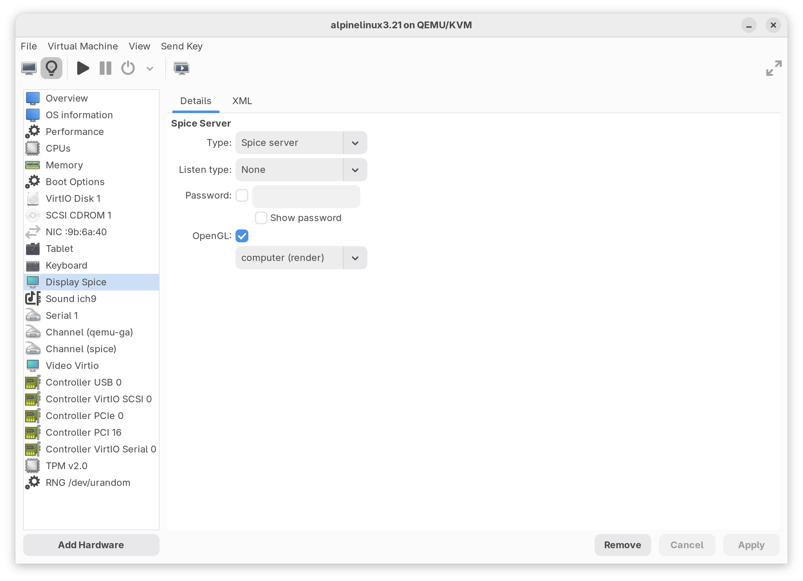

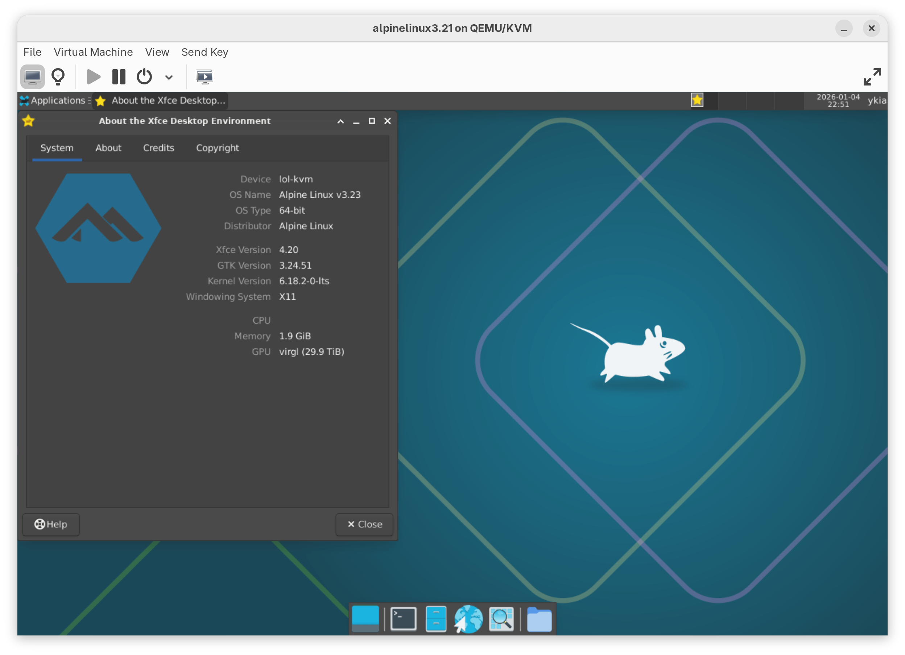

[^1]: The sole exception is the ChromeOS platform (LC), which utilizes ARM's Trusted Firmware (TF-A) rather than Qualcomm's proprietary boot sequence, allowing the OS to boot into the EL2 Exception Level by default.