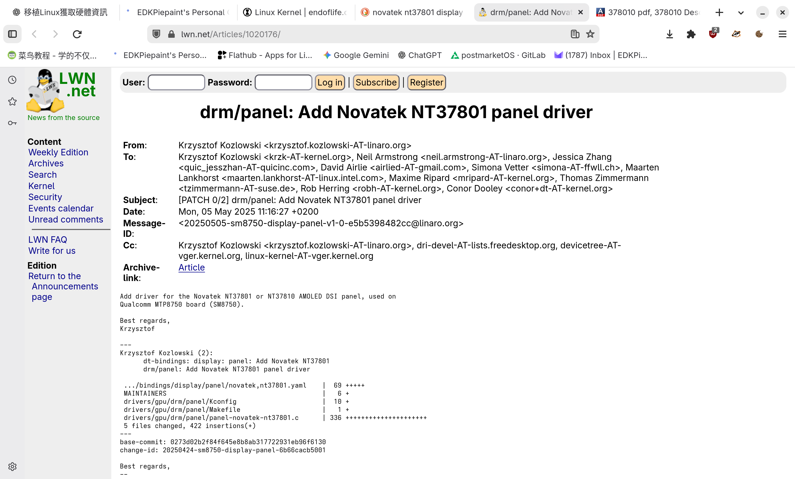
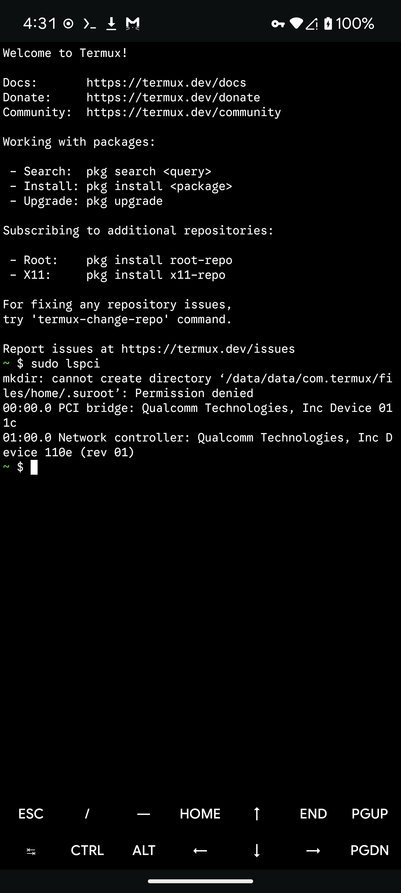
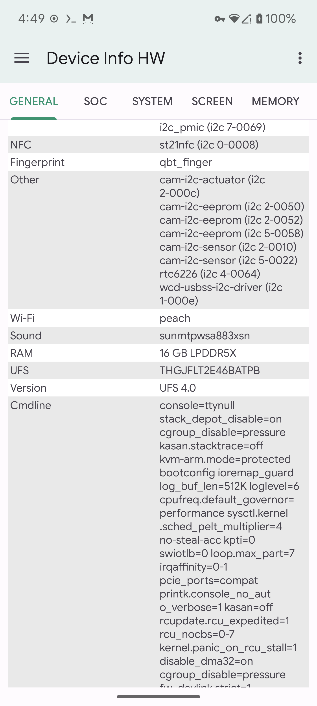
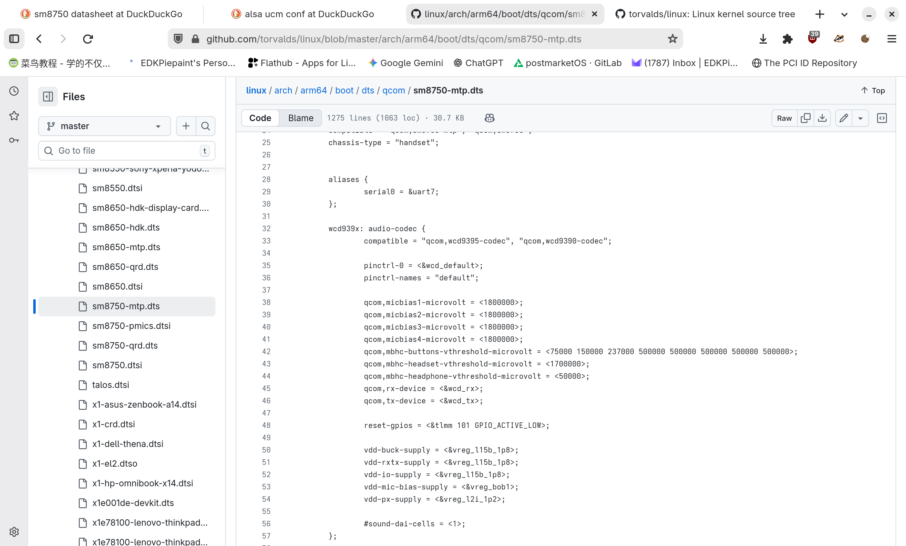
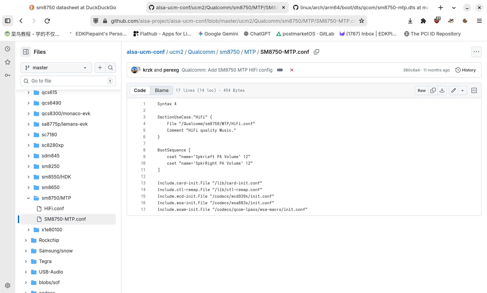

<!-- Co-translated by Gemini -->

After my previous review of the MTP8750, I gave this prototype a stellar evaluation. Since it's a proper prototype, it's only fitting to do something only a prototype can do, so I've decided to port the Armbian operating system to it.

# Hardware Exploration

In my last review, I compared Qualcomm's common engineering platforms (MTP, QRD) with mass-produced smartphones and briefly introduced the MTP8750's hardware configuration. Here, I'll reiterate those specifications from the previous article for your reference:

- An early sample (ES) version of the SM8750 CPU [^1], 8 cores, ARM V9 instruction set;
- Adreno 830 GPU, supporting OpenGL ES 3.2;
- 16GB LPDDR5X memory;
- 512GB UFS 4.0, confirmed to be manufactured by Toshiba.

To obtain more hardware information, we need to start with the operating system. Fortunately, Android is, at its core, a Linux distribution, so many Linux methods for retrieving hardware data are equally applicable on Android. However, for Android, which typically lacks root access by default, obtaining hardware information via Linux methods can be quite an obstacle. The way to overcome these hurdles is to acquire root privileges. Luckily, the prototype's AOSP system comes with `ADB Root` enabled by default, making debugging and log retrieval significantly easier than on production devices. All you need is a Type-C data cable to get started: First, open a terminal and install the `android-tools` package:

```bash
sudo pacman -S android-tools
```

Then, type `adb root` to restart `adbd` with root privileges. Once the user prompt changes to a hash symbol (#), you've successfully obtained root access! Now, let's proceed with the rest of the work!

## Obtaining Kernel Version

Just like with any Linux distribution, Android allows you to retrieve the kernel version using the common `uname` and `cat /proc/version` commands. This helps us understand the difference between the phone's kernel version and the mainline kernel. Here's the output from the SM8750 MTP:

```bash
sun:/ # cat /proc/version
Linux version 6.6.50-android15-8-maybe-dirty-4k (kleaf@build-host) (Android (11368308, +pgo, +bolt, +lto, +mlgo, based on r510928) clang version 18.0.0 (<https://android.googlesource.com/toolchain/llvm-project> 477610d4d0d988e69dbc3fae4fe86bff3f07f2b5), LLD 18.0.0) #1 SMP PREEMPT Thu Jan  1 00:00:00 UTC 1970
```

The kernel is a modified 6.6.50 kernel based on a Long-Term Support (LTS) version, released in 2023. While Google's GKI has somewhat narrowed the gap between Android downstream kernels and the mainline kernel in recent years, the issue remains severe. For a chip released in 2024, it's still running an outdated 6.6 kernel... It's worth noting that the kernel was compiled with 4K page size. Does this mean the SM8750 also has a kernel that supports 16K pages? Anyway, none of this is relevant to our main task.

## Obtaining Memory Information

Memory information can be obtained using the `cat /proc/meminfo` command, which provides details such as memory capacity, usage, and available space. Here's the output from the SM8750 MTP:

```bash
130|sun:/ # cat /proc/meminfo
MemTotal:       15543532 kB
MemFree:         4895720 kB
MemAvailable:   11264748 kB
Buffers:           18684 kB
Cached:          5749708 kB
SwapCached:            8 kB
Active:          3812464 kB
Inactive:        3266116 kB
Active(anon):    1636304 kB
Inactive(anon):        8 kB
Active(file):    2176160 kB
Inactive(file):  3266108 kB
Unevictable:      303252 kB
Mlocked:          180348 kB
SwapTotal:       6291452 kB
SwapFree:        5168380 kB
Dirty:                72 kB
Writeback:             0 kB
AnonPages:       1609740 kB
Mapped:          1303112 kB
Shmem:            153116 kB
KReclaimable:    1242056 kB
Slab:             783164 kB
SReclaimable:     265852 kB
SUnreclaim:       517312 kB
KernelStack:       74688 kB
ShadowCallStack:       0 kB
PageTables:       162628 kB
SecPageTables:         0 kB
NFS_Unstable:          0 kB
Bounce:                0 kB
WritebackTmp:          0 kB
CommitLimit:    14063216 kB
Committed_AS:   307714316 kB
VmallocTotal:   257687552 kB
VmallocUsed:      226660 kB
VmallocChunk:          0 kB
Percpu:            23616 kB
AnonHugePages:    178176 kB
ShmemHugePages:        0 kB
ShmemPmdMapped:        0 kB
FileHugePages:         0 kB
FilePmdMapped:         0 kB
CmaTotal:         643072 kB
CmaFree:          590220 kB
```

For now, the only useful line here is the `MemTotal` field, which tells us this prototype has 16GB of RAM...

## Obtaining Partition Information

Similarly, using the `cat /proc/partitions` command provides partition information, including the size, format, and mount points of each partition. Here's the output from the SM8750 MTP:

```bash
major minor  #blocks  name

   1        0       8192 ram0
   1        1       8192 ram1
   1        2       8192 ram2
   1        3       8192 ram3
   1        4       8192 ram4
   1        5       8192 ram5
   1        6       8192 ram6
   1        7       8192 ram7
   1        8       8192 ram8
   1        9       8192 ram9
   1       10       8192 ram10
   1       11       8192 ram11
   1       12       8192 ram12
   1       13       8192 ram13
   1       14       8192 ram14
   1       15       8192 ram15
   7        0      39744 loop0
   7        8        836 loop1
   7       16      93148 loop2
   7       24      11252 loop3
   7       32       6312 loop4
   7       40     101248 loop5
   7       48        268 loop6
   7       56        336 loop7
   7       64      29528 loop8
   7       72       4860 loop9
   7       80       3632 loop10
   7       88      92200 loop11
   7       96        808 loop12
   7      104     111964 loop13
   7      112      46412 loop14
   7      120      11252 loop15
   8        0  487096320 sda
   8        1          8 sda1
   8        2      32768 sda2
   8        3       1024 sda3
   8        4        512 sda4
   8        5        512 sda5
   8        6    6291456 sda6
   8        7         64 sda7
   8        8         64 sda8
   8        9      65536 sda9
   8       10   17301504 sda10
   8       11    4194304 sda11
   8       12  459208524 sda12
   8       16      20480 sdb
   8       17       3584 sdb1
   8       18        344 sdb2
   8       19         32 sdb3
   8       20         32 sdb4
   8       21        256 sdb5
   8       48      32768 sdd
   8       49        104 sdd1
   8       50        128 sdd2
   8       51       1024 sdd3
   8       32      20480 sdc
   8       33       3584 sdc1
   8       34        344 sdc2
   8       35         32 sdc3
   8       36         32 sdc4
   8       37        256 sdc5
   8       64      32768 sde
   8       65        104 sde1
   8       66       4096 sde2
   8       67       4096 sde3
   8       68       4096 sde4
   8       69        128 sde5
   8       80    4194304 sdf
   8       81       5120 sdf1
   8       82        512 sdf2
   8       83        512 sdf3
   8       84       5120 sdf4
   8       85       8192 sdf5
   8       86     460800 sdf6
   8       87      10240 sdf7
   8       88       1024 sdf8
   8       89      65536 sdf9
   8       90      10240 sdf10
   8       91        128 sdf11
   8       92      98304 sdf12
   8       93        128 sdf13
   8       94         80 sdf14
   8       95         64 sdf15
 259        0      24576 sdf16
 259        1       2048 sdf17
 259        2       2048 sdf18
 259        3        256 sdf19
 259        4     174080 sdf20
 259        5     550000 sdf21
 259        6       1024 sdf22
 259        7        128 sdf23
 259        8      16384 sdf24
 259        9      98304 sdf25
 259       10      30720 sdf26
 259       11        256 sdf27
 259       12     102400 sdf28
 259       13       2048 sdf29
 259       14       8192 sdf30
 259       15         64 sdf31
 259       16       1024 sdf32
 259       17        512 sdf33
 259       18         24 sdf34
 259       19        256 sdf35
 259       20        128 sdf36
 259       21       5120 sdf37
 259       22        512 sdf38
 259       23        512 sdf39
 259       24       5120 sdf40
 259       25       8192 sdf41
 259       26     460800 sdf42
 259       27      10240 sdf43
 259       28       1024 sdf44
 259       29      65536 sdf45
 259       30      10240 sdf46
 259       31        128 sdf47
 259       32      98304 sdf48
 259       33        128 sdf49
 259       34         80 sdf50
 259       35         64 sdf51
 259       36      24576 sdf52
 259       37       2048 sdf53
 259       38       2048 sdf54
 259       39        256 sdf55
 259       40     550000 sdf56
 259       41       1024 sdf57
 259       42        128 sdf58
 259       43     174080 sdf59
 259       44      98304 sdf60
 259       45        256 sdf61
 259       46     102400 sdf62
 259       47       2048 sdf63
 259       48       8192 sdf64
 259       49         64 sdf65
 259       50       1024 sdf66
 259       51        512 sdf67
 259       52         24 sdf68
 259       53        256 sdf69
 259       54        128 sdf70
 259       55          4 sdf71
 259       56       1024 sdf72
 259       57       8192 sdf73
 259       58      40960 sdf74
 259       59     524288 sdf75
 259       60        128 sdf76
 259       61        512 sdf77
 259       62         28 sdf78
 259       63        512 sdf79
 259       64     235520 sdf80
 259       65       1024 sdf81
 259       66      20480 sdf82
 259       67        128 sdf83
 259       68        128 sdf84
 259       69      32768 sdf85
 259       70         64 sdf86
 259       71        128 sdf87
 259       72          8 sdf88
   8       96    4194304 sdg
   8      112    4194304 sdh
 254        0       1692 dm-0
 254        1    2589236 dm-1
 254        2      11940 dm-2
 254        3     804512 dm-3
 254        4    1647464 dm-4
 254        5     141248 dm-5
   7      128      93148 loop16
   7      136        836 loop17
   7      144      23324 loop18
   7      152      40892 loop19
   7      160        268 loop20
   7      168      41180 loop21
   7      176      15832 loop22
   7      184      39744 loop23
   7      192      32064 loop24
   7      200      23324 loop25
   7      208      26196 loop26
   7      216      40792 loop27
   7      224      41420 loop28
   7      232       1336 loop29
   7      240       7088 loop30
   7      248       7288 loop31
   7      256       8152 loop32
   7      264      19164 loop33
   7      272        824 loop34
   7      280      14116 loop35
   7      288      10984 loop36
   7      296      10752 loop37
   7      304       1860 loop38
   7      312       6132 loop39
   7      320       1616 loop40
   7      328      10076 loop41
   7      336        268 loop42
   7      344      26256 loop43
   7      352       3104 loop44
   7      360       6184 loop45
   7      368      25136 loop46
   7      376       4556 loop47
   7      384       9624 loop48
 254        6      24928 dm-6
 254        7       6124 dm-7
 254        8      26040 dm-8
 254        9        256 dm-9
 254       10       4508 dm-10
 254       11       9536 dm-11
 254       13       9984 dm-13
 254       14       1588 dm-14
 254       15      29284 dm-15
 254       17       1832 dm-17
 254       19      10656 dm-19
 254       21      10884 dm-21
 254       22      13992 dm-22
 254       24       6072 dm-24
 254       25        804 dm-25
 254       28      19000 dm-28
 254       29       8076 dm-29
 254       31       7216 dm-31
 254       38       7020 dm-38
 254       43        324 dm-43
 254       44      41084 dm-44
 254       45      25980 dm-45
 254       48      23128 dm-48
 254       50      31800 dm-50
 253        0    6291456 zram0
 254       51  459208524 dm-51
```

This only gives us the size of each partition, without any other details. To get the mapping of each device node, we need to execute `ls -l /dev` in the `/dev` directory to obtain the results:

```yaml
sun:/dev/block/by-name # ls -l
total 0
lrwxrwxrwx 1 root root 15 1970-01-07 17:43 ALIGN_TO_128K_1 -> /dev/block/sdd1
lrwxrwxrwx 1 root root 15 1970-01-07 17:43 ALIGN_TO_128K_2 -> /dev/block/sde1
lrwxrwxrwx 1 root root 15 1970-01-07 17:43 abl_a -> /dev/block/sdf8
lrwxrwxrwx 1 root root 16 1970-01-07 17:43 abl_b -> /dev/block/sdf44
lrwxrwxrwx 1 root root 15 1970-01-07 17:43 aop_a -> /dev/block/sdf2
lrwxrwxrwx 1 root root 16 1970-01-07 17:43 aop_b -> /dev/block/sdf38
lrwxrwxrwx 1 root root 15 1970-01-07 17:43 aop_config_a -> /dev/block/sdf3
lrwxrwxrwx 1 root root 16 1970-01-07 17:43 aop_config_b -> /dev/block/sdf39
lrwxrwxrwx 1 root root 15 1970-01-07 17:43 apdp -> /dev/block/sdb5
lrwxrwxrwx 1 root root 15 1970-01-07 17:43 apdpb -> /dev/block/sdc5
lrwxrwxrwx 1 root root 15 1970-01-07 17:43 bluetooth_a -> /dev/block/sdf7
lrwxrwxrwx 1 root root 16 1970-01-07 17:43 bluetooth_b -> /dev/block/sdf43
lrwxrwxrwx 1 root root 16 1970-01-07 17:43 boot_a -> /dev/block/sdf12
lrwxrwxrwx 1 root root 16 1970-01-07 17:43 boot_b -> /dev/block/sdf48
lrwxrwxrwx 1 root root 15 1970-01-07 17:43 cdt -> /dev/block/sdd2
lrwxrwxrwx 1 root root 16 1970-01-07 17:43 connsec -> /dev/block/sdf83
lrwxrwxrwx 1 root root 16 1970-01-07 17:43 core_nhlos_a -> /dev/block/sdf20
lrwxrwxrwx 1 root root 16 1970-01-07 17:43 core_nhlos_b -> /dev/block/sdf59
lrwxrwxrwx 1 root root 16 1970-01-07 17:43 cpucp_a -> /dev/block/sdf22
lrwxrwxrwx 1 root root 16 1970-01-07 17:43 cpucp_b -> /dev/block/sdf57
lrwxrwxrwx 1 root root 16 1970-01-07 17:43 cpucp_dtb_a -> /dev/block/sdf31
lrwxrwxrwx 1 root root 16 1970-01-07 17:43 cpucp_dtb_b -> /dev/block/sdf65
lrwxrwxrwx 1 root root 15 1970-01-07 17:43 ddr -> /dev/block/sdd3
lrwxrwxrwx 1 root root 16 1970-01-07 17:43 devcfg_a -> /dev/block/sdf13
lrwxrwxrwx 1 root root 16 1970-01-07 17:43 devcfg_b -> /dev/block/sdf49
lrwxrwxrwx 1 root root 16 1970-01-07 17:43 devinfo -> /dev/block/sdf71
lrwxrwxrwx 1 root root 16 1970-01-07 17:43 dpm -> /dev/block/sdf88
lrwxrwxrwx 1 root root 15 1970-01-07 17:43 dsp_a -> /dev/block/sdf9
lrwxrwxrwx 1 root root 16 1970-01-07 17:43 dsp_b -> /dev/block/sdf45
lrwxrwxrwx 1 root root 16 1970-01-07 17:43 dtbo_a -> /dev/block/sdf16
lrwxrwxrwx 1 root root 16 1970-01-07 17:43 dtbo_b -> /dev/block/sdf52
lrwxrwxrwx 1 root root 16 1970-01-07 17:43 featenabler_a -> /dev/block/sdf23
lrwxrwxrwx 1 root root 16 1970-01-07 17:43 featenabler_b -> /dev/block/sdf58
lrwxrwxrwx 1 root root 15 1970-01-07 17:43 frp -> /dev/block/sda5
lrwxrwxrwx 1 root root 15 1970-01-07 17:43 fsc -> /dev/block/sde5
lrwxrwxrwx 1 root root 15 1970-01-07 17:43 fsg -> /dev/block/sde4
lrwxrwxrwx 1 root root 15 1970-01-07 17:43 hyp_a -> /dev/block/sdf5
lrwxrwxrwx 1 root root 16 1970-01-07 17:43 hyp_b -> /dev/block/sdf41
lrwxrwxrwx 1 root root 16 1970-01-07 17:43 imagefv_a -> /dev/block/sdf18
lrwxrwxrwx 1 root root 16 1970-01-07 17:43 imagefv_b -> /dev/block/sdf54
lrwxrwxrwx 1 root root 16 1970-01-07 17:43 init_boot_a -> /dev/block/sdf30
lrwxrwxrwx 1 root root 16 1970-01-07 17:43 init_boot_b -> /dev/block/sdf64
lrwxrwxrwx 1 root root 16 1970-01-07 17:43 keymaster_a -> /dev/block/sdf10
lrwxrwxrwx 1 root root 16 1970-01-07 17:43 keymaster_b -> /dev/block/sdf46
lrwxrwxrwx 1 root root 15 1970-01-07 17:43 keystore -> /dev/block/sda4
lrwxrwxrwx 1 root root 16 1970-01-07 17:43 logdump -> /dev/block/sdf75
lrwxrwxrwx 1 root root 16 1970-01-07 17:43 logfs -> /dev/block/sdf73
lrwxrwxrwx 1 root root 16 1970-01-07 17:43 mdcompress -> /dev/block/sdf82
lrwxrwxrwx 1 root root 15 1970-01-07 17:43 metadata -> /dev/block/sda9
lrwxrwxrwx 1 root root 15 1970-01-07 17:43 misc -> /dev/block/sda3
lrwxrwxrwx 1 root root 15 1970-01-07 17:43 modem_a -> /dev/block/sdf6
lrwxrwxrwx 1 root root 16 1970-01-07 17:43 modem_b -> /dev/block/sdf42
lrwxrwxrwx 1 root root 15 1970-01-07 17:43 modemst1 -> /dev/block/sde2
lrwxrwxrwx 1 root root 15 1970-01-07 17:43 modemst2 -> /dev/block/sde3
lrwxrwxrwx 1 root root 15 1970-01-07 17:43 multiimgoem_a -> /dev/block/sdb4
lrwxrwxrwx 1 root root 15 1970-01-07 17:43 multiimgoem_b -> /dev/block/sdc4
lrwxrwxrwx 1 root root 15 1970-01-07 17:43 multiimgqti_a -> /dev/block/sdb3
lrwxrwxrwx 1 root root 15 1970-01-07 17:43 multiimgqti_b -> /dev/block/sdc3
lrwxrwxrwx 1 root root 16 1970-01-07 17:43 pdp_a -> /dev/block/sdf35
lrwxrwxrwx 1 root root 16 1970-01-07 17:43 pdp_b -> /dev/block/sdf69
lrwxrwxrwx 1 root root 15 1970-01-07 17:43 persist -> /dev/block/sda2
lrwxrwxrwx 1 root root 16 1970-01-07 17:43 pvmfw_a -> /dev/block/sdf32
lrwxrwxrwx 1 root root 16 1970-01-07 17:43 pvmfw_b -> /dev/block/sdf66
lrwxrwxrwx 1 root root 16 1970-01-07 17:43 qmcs -> /dev/block/sdf26
lrwxrwxrwx 1 root root 16 1970-01-07 17:43 quantumcontentfv -> /dev/block/sdf81
lrwxrwxrwx 1 root root 16 1970-01-07 17:43 quantumfv -> /dev/block/sdf79
lrwxrwxrwx 1 root root 16 1970-01-07 17:43 quantumsdk -> /dev/block/sdf74
lrwxrwxrwx 1 root root 16 1970-01-07 17:43 questdatafv -> /dev/block/sdf24
lrwxrwxrwx 1 root root 16 1970-01-07 17:43 qupfw_a -> /dev/block/sdf14
lrwxrwxrwx 1 root root 16 1970-01-07 17:43 qupfw_b -> /dev/block/sdf50
lrwxrwxrwx 1 root root 16 1970-01-07 17:43 qweslicstore_a -> /dev/block/sdf27
lrwxrwxrwx 1 root root 16 1970-01-07 17:43 qweslicstore_b -> /dev/block/sdf61
lrwxrwxrwx 1 root root 16 1970-01-07 17:43 rawdump -> /dev/block/sda10
lrwxrwxrwx 1 root root 16 1970-01-07 17:43 recovery_a -> /dev/block/sdf28
lrwxrwxrwx 1 root root 16 1970-01-07 17:43 recovery_b -> /dev/block/sdf62
lrwxrwxrwx 1 root root 14 1970-01-07 17:43 sda -> /dev/block/sda
lrwxrwxrwx 1 root root 14 1970-01-07 17:43 sdb -> /dev/block/sdb
lrwxrwxrwx 1 root root 14 1970-01-07 17:43 sdc -> /dev/block/sdc
lrwxrwxrwx 1 root root 14 1970-01-07 17:43 sdd -> /dev/block/sdd
lrwxrwxrwx 1 root root 14 1970-01-07 17:43 sde -> /dev/block/sde
lrwxrwxrwx 1 root root 14 1970-01-07 17:43 sdf -> /dev/block/sdf
lrwxrwxrwx 1 root root 14 1970-01-07 17:43 sdg -> /dev/block/sdg
lrwxrwxrwx 1 root root 14 1970-01-07 17:43 sdh -> /dev/block/sdh
lrwxrwxrwx 1 root root 16 1970-01-07 17:43 secdata -> /dev/block/sdf78
lrwxrwxrwx 1 root root 16 1970-01-07 17:43 shrm_a -> /dev/block/sdf19
lrwxrwxrwx 1 root root 16 1970-01-07 17:43 shrm_b -> /dev/block/sdf55
lrwxrwxrwx 1 root root 16 1970-01-07 17:43 soccp_dcd_a -> /dev/block/sdf34
lrwxrwxrwx 1 root root 16 1970-01-07 17:43 soccp_dcd_b -> /dev/block/sdf68
lrwxrwxrwx 1 root root 16 1970-01-07 17:43 soccp_debug_a -> /dev/block/sdf33
lrwxrwxrwx 1 root root 16 1970-01-07 17:43 soccp_debug_b -> /dev/block/sdf67
lrwxrwxrwx 1 root root 16 1970-01-07 17:43 spunvm -> /dev/block/sdf85
lrwxrwxrwx 1 root root 16 1970-01-07 17:43 spuservice_a -> /dev/block/sdf11
lrwxrwxrwx 1 root root 16 1970-01-07 17:43 spuservice_b -> /dev/block/sdf47
lrwxrwxrwx 1 root root 15 1970-01-07 17:43 ssd -> /dev/block/sda1
lrwxrwxrwx 1 root root 16 1970-01-07 17:43 storsec -> /dev/block/sdf76
lrwxrwxrwx 1 root root 15 1970-01-07 17:43 super -> /dev/block/sda6
lrwxrwxrwx 1 root root 16 1970-01-07 17:43 testparti -> /dev/block/sda11
lrwxrwxrwx 1 root root 16 1970-01-07 17:43 toolsfv -> /dev/block/sdf72
lrwxrwxrwx 1 root root 15 1970-01-07 17:43 tz_a -> /dev/block/sdf4
lrwxrwxrwx 1 root root 16 1970-01-07 17:43 tz_b -> /dev/block/sdf40
lrwxrwxrwx 1 root root 16 1970-01-07 17:43 tzsc -> /dev/block/sdf84
lrwxrwxrwx 1 root root 15 1970-01-07 17:43 uefi_a -> /dev/block/sdf1
lrwxrwxrwx 1 root root 16 1970-01-07 17:43 uefi_b -> /dev/block/sdf37
lrwxrwxrwx 1 root root 16 1970-01-07 17:43 uefisecapp_a -> /dev/block/sdf17
lrwxrwxrwx 1 root root 16 1970-01-07 17:43 uefisecapp_b -> /dev/block/sdf53
lrwxrwxrwx 1 root root 16 1970-01-07 17:43 uefivarstore -> /dev/block/sdf77
lrwxrwxrwx 1 root root 16 1970-01-07 17:43 userdata -> /dev/block/sda12
lrwxrwxrwx 1 root root 16 1970-01-07 17:43 vbmeta_a -> /dev/block/sdf15
lrwxrwxrwx 1 root root 16 1970-01-07 17:43 vbmeta_b -> /dev/block/sdf51
lrwxrwxrwx 1 root root 15 1970-01-07 17:43 vbmeta_system_a -> /dev/block/sda7
lrwxrwxrwx 1 root root 15 1970-01-07 17:43 vbmeta_system_b -> /dev/block/sda8
lrwxrwxrwx 1 root root 16 1970-01-07 17:43 vendor_boot_a -> /dev/block/sdf25
lrwxrwxrwx 1 root root 16 1970-01-07 17:43 vendor_boot_b -> /dev/block/sdf60
lrwxrwxrwx 1 root root 16 1970-01-07 17:43 vm-bootsys_a -> /dev/block/sdf21
lrwxrwxrwx 1 root root 16 1970-01-07 17:43 vm-bootsys_b -> /dev/block/sdf56
lrwxrwxrwx 1 root root 16 1970-01-07 17:43 vm-persist -> /dev/block/sdf80
lrwxrwxrwx 1 root root 15 1970-01-07 17:43 xbl_a -> /dev/block/sdb1
lrwxrwxrwx 1 root root 15 1970-01-07 17:43 xbl_b -> /dev/block/sdc1
lrwxrwxrwx 1 root root 15 1970-01-07 17:43 xbl_config_a -> /dev/block/sdb2
lrwxrwxrwx 1 root root 15 1970-01-07 17:43 xbl_config_b -> /dev/block/sdc2
lrwxrwxrwx 1 root root 16 1970-01-07 17:43 xbl_ramdump_a -> /dev/block/sdf29
lrwxrwxrwx 1 root root 16 1970-01-07 17:43 xbl_ramdump_b -> /dev/block/sdf63
lrwxrwxrwx 1 root root 16 1970-01-07 17:43 xbl_sc_logs -> /dev/block/sdf87
lrwxrwxrwx 1 root root 16 1970-01-07 17:43 xbl_sc_test_mode -> /dev/block/sdf86
```

Now, the information for each partition is crystal clear. It's worth noting that on this new platform, Qualcomm has placed the UEFI firmware in a separate UEFI partition, and the original `XBL` partition is merely a shell (though not entirely empty, of course).

## Obtaining Other Hardware Information (Touchscreen, Wi-Fi Card, Audio Codec, etc.)

By fetching `dmesg`, we can obtain a wealth of information about the device. Among the kernel boot parameters, one particular section stands out:

```yaml
[    0.000000] Kernel command line: console=ttynull stack_depot_disable=on cgroup_disable=pressure kasan.stacktrace=off kvm-arm.mode=protected bootconfig ioremap_guard log_buf_len=512K loglevel=6 cpufreq.default_governor=performance sysctl.kernel.sched_pelt_multiplier=4 no-steal-acc kpti=0 swiotlb=0 loop.max_part=7 irqaffinity=0-1 pcie_ports=compat printk.console_no_auto_verbose=1 kasan=off rcupdate.rcu_expedited=1 rcu_nocbs=0-7 kernel.panic_on_rcu_stall=1 disable_dma32=on cgroup_disable=pressure fw_devlink.strict=1 can.stats_timer=0 pci-msm-drv.pcie_sm_regs=0x1D07000,0x1040,0x1048,0x3000,0x1 ftrace_dump_on_oops slub_debug=- video=vfb:640x400,bpp=32,memsize=3072000 nosoftlockup console=ttynull qcom_geni_serial.con_enabled=0 bootconfig  msm_drm.dsi_display0=qcom,mdss_dsi_nt37801_wqhd_plus_cmd: rootwait ro init=/init silent_boot.mode=nonsilent
```

The `msm_drm.dsi_display0=qcom,mdss_dsi_nt37801_wqhd_plus_cmd` parameter provides information about the display: it's a panel manufactured by Novatek, model NT37801, with a resolution of 1440x3220, AMOLED, a refresh rate of 120Hz, DSI interface, and WQHD+ output format. I then scoured the internet for schematics and datasheets for this panel but came up empty. So, I turned to `lwn.net` to search for related merge requests or commits for this panel, and lo and behold, I found it:




Its commit log explicitly states: '[Added driver support for Novatek NT37801 (also known as Novetek NT37801 AMOLED DSI display panel)](https://lwn.net/Articles/1020176/), used on the Qualcomm SM8750 MTP board'. This is exactly what I was looking for. Although I didn't find a datasheet, knowing the panel model and connection method is sufficient.

To obtain PCIe device information, we need to use the `lspci` command:

```bash
lspci -e                                                               
01:00.0 :   (rev 01)
00:00.0 :  
```

However, this didn't yield any useful information, so I appended the `-nn` parameter:

```yaml
sun:/ $ lspci -nn                                                              
01:00.0 :   [17cb:110e] (rev 01)
00:00.0 :   [17cb:011c]
```

This gave us the Vendor and Device IDs of the PCIe device. Next, we can query the PCI ID Repository database. Visit the website, select 'PCI Devices', choose 'All' in the 'Vendor' column, then use your browser's search function to type `17cb`, followed by `110e`. Unfortunately, the PCI ID Repository doesn't list this device. What now? We'll have to rely on Termux. First, install `pciutils`, which is available in Termux's `root repo`. Then, simply run `lspci`:



Still no change. However, according to the [published specifications](https://phonedb.net/index.php?m=processor&id=999&c=qualcomm_snapdragon_8_elite_sm8750-ab__sun&d=detailed_specs), the PCIe device should be Qualcomm's own X80 5G NR modem.

The audio codec uses the WSA 883X chip. There are already audio definitions in the mainline device tree, and ALSA has corresponding configuration files.







The camera still uses I²C, with a total of 5 lenses, front and back combined: the front uses Samsung's `s5kjn1`, and the rear features two Sony `imx766` `imx858` sensors, one OmniVision `ov32c4c`, and another Samsung `s5k33dxx`. It's worth noting that the camera also comes with two EEPROMs, which suggests that mainline kernel camera support will likely be quite challenging...


## Conclusion

It seems that porting mainline Linux to the SM8750 is going to be a tough nut to crack... Nevertheless, now that we have this hardware information, we can prepare for the mainline Linux port.

 [^1]:Unlike the official version's 4.32GHz clock speed, this ES version has a base frequency of only 3.63GHz.


