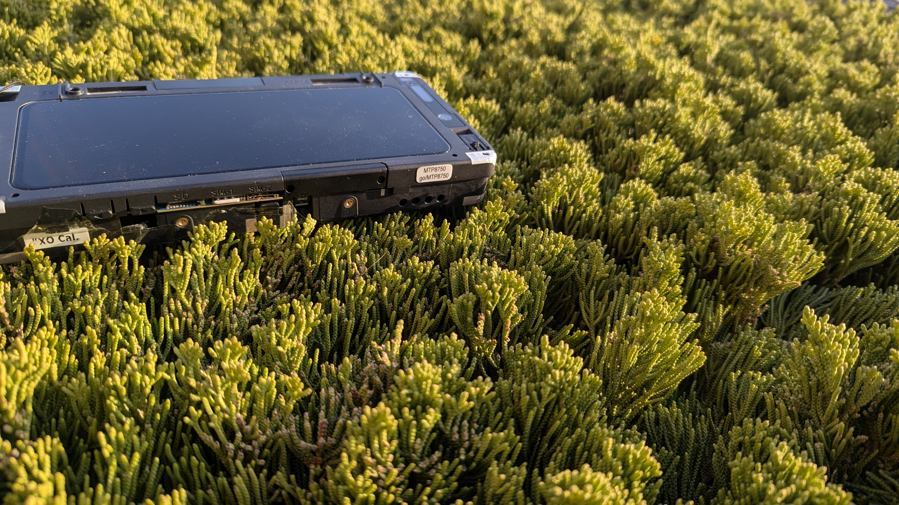
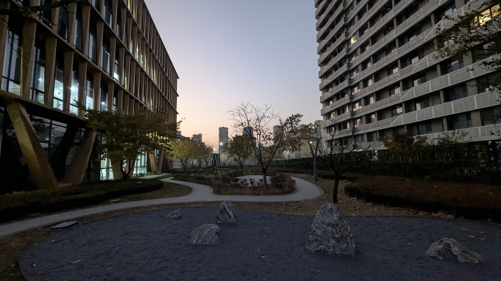

<!-- Co-translated by Gemini -->
Let's talk about the recent changes in my dual-phone experience.

# The Early Days

First, let's look at the early days. Before high school, my phones were always hand-me-downs from my parents after they upgraded. This led to a rather peculiar dual-phone habit. Initially, the goal was simply to get better photos and meet daily needs without having the cash for an iPhone. So, it was always an Android + Android combo. 

Before 2020 (Time flies, doesn't it?), the phone I was using was a Coolpad Cool 1 left by my father. Since I knew nothing about specs back then, I could only distinguish the quality of a phone by its flash memory capacity. Plus, I had no money to buy a new one, so I stuck with the Cool 1. 
 

Although that phone had two 13-megapixel lenses, the results were still eyesores, and the basic audio recording was unclear. It's as if low-end Android phones being cost-down victims for manufacturers is a given. Fortunately, the video recording was decent, capable of recording 4K 30FPS video, and the screen quality wasn't bad. The only problem was that the Snapdragon 652 performance was way too low, barely usable even when flashed with LineageOS.  

Later, due to CPU overheating and desoldering, I had to temporarily rely on a retired Huawei Y9 (2018) to get by. I hate Huawei as a manufacturer because their phones simply do not allow users to unlock the bootloader! Wanting to unlock it requires "going through many twists and turns," either by "dismembering" the phone, exploiting vulnerabilities, or flashing engineering firmware. Although I eventually unlocked the phone and flashed it with a Lineage OS 17.1 GSI, I found that the experience wasn't even as good as the stock firmware! On the bright side, the photos were nice, with a unique charm. The speakers even had a specific "bookshelf speaker" feel. 
 

However, perhaps because my mom doesn't understand phones, her phone had already been ravaged by countless proprietary software. The internal eMMC memory was nearing the end of its lifespan, making it extremely sluggish. But I got a good score on my high school entrance exam, so my dad agreed to buy me a new phone as a reward. 

That phone was the Pixel 4 XL. It had 6GB of RAM and 64GB of UFS storage, paired with a powerful Snapdragon 855 processor. Since it was very easy to unlock, it naturally became my favorite thing. Flashing, rooting, LSPosed... I never got tired of it. After entering high school, I maintained my "dual-wielding" habit. Even though that Huawei Y9 was barely usable by then, I kept it around as a memento of my first step into the world of GSIs. 

After buying a Google phone, I was completely amazed by Google's exquisite and unique design language. In 2019, most phones had already moved to hole-punch displays, but the Pixel 4 still used an asymmetrical bezel design. The top bezel was especially wide—wide enough for me to rest my pinky finger on it.  
 

Of course, hidden under those thick black borders were nine sensors, including the Soli radar chip that I still reminisce about to this day. It could perform pre-set actions based on the user's hand gestures. It was essentially like "Martian technology." As for photography and videography, there were many improvements. I can only say that "Google" camera algorithms paired with Sony sensors result in the best mobile photos in the world. It had a profound impact on me, so much so that when I see the Snapdragon 8 Gen 2 MTP prototype, I always suspect if it's just a modified Pixel 4 XL screen (the Snapdragon 8 Gen 2 MTP prototype's screen also inherited the Pixel 4's "wide top" design)... 

# The Present

Now, the "dual-wielding" habit remains, and it must be cross-system dual-wielding. Every once in a while (I don't do this anymore), I would use all sorts of "tech-sounding" reasons to convince my dad to buy me various out-of-season second-hand Android phones to flash for Linux use.  
On one hand, it's to escape the "foul and murky" Android system polluted by proprietary software and switch to a Linux OS primarily based on Free Software. Besides the applications that require Android to function, it's also a great opportunity to experience the Linux mobile phone ecosystem.  
 

On the other hand, I hope to use the "dual-wielding" opportunity to learn more Linux commands. Furthermore, it allows for functions that transcend a "phone," such as hosting a Minecraft server or running a VPN for ad-blocking. Of course, one can also use UEFI firmware like MU-Aloha to reboot Linux and Android, and even achieve PXE boot and USB boot—behaviors that were once only possible on prototype machines (now it seems even achieving these on prototypes isn't easy). 

I almost became an "Apple fan" in the past, probably due to some financial pressure, but the iPhone myth was shattered long ago. Compared to proprietary software like iOS, I much prefer Free Software like postmarketOS. 

My future setup will likely be a lightweight, mid-spec Android phone paired with a flashable Linux phone, like my current combo of a Pixel 7 and a Nothing Phone (1). The Nothing Phone is truly a phone suitable for daily Linux use; its support is no worse than the OnePlus 6T, and the performance of the Snapdragon 778G+ is quite decent. The 12GB of RAM is enough for daily tasks. 

As for the Pixel 7, if it weren't for the fact that my Pixel 4 XL screen broke (screen failure and memory issues are common flaws for the Pixel 4 XL, the latter stemming from a bugged driver in the kernel), I would have kept using it. I use my Pixel 7 like a ten-year-old digital camera, holding it horizontally for photos and videos. Most of the time, I don't need to process the images, maybe just a quick touch-up with Google Photos' built-in "Magic Eraser." Then I transfer the photos to the Nothing Phone and use GIMP for advanced editing. 

Attaching a few recent photos (HDR photos are used by default; your browser must support HDR photos or video to enable the HDR effect).

For occasions where I need to transfer photos temporarily, besides SFTP, I can use cross-platform tools like LocalSend or KDE Connect. Of course, there's also the "Quick Share" feature between Android devices, which is extremely practical! Most Android phones should support this now, including LineageOS. No need to download an app; both sides just need Bluetooth and Wi-Fi enabled. There's no "pairing" procedure (technically there probably is one in the background, but no manual operation is needed), and no need to connect to a Wi-Fi hotspot to share files anonymously. Even if one side has no internet access at all, you can still share. Transfer speeds are fast even with many files; 50 photos totaling 200MB finish in under a minute. 
 

Some might ask: Since I'm so passionate about mobile photography, why not buy a DSLR? I haven't reached that level of luxury yet (plus, excuses are hard to come by). I just want to be able to "Tap and shot" anytime, anywhere!