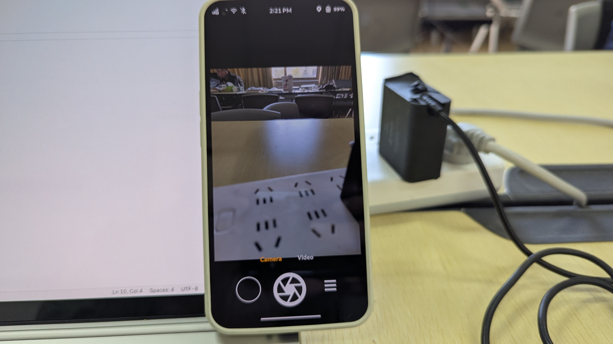
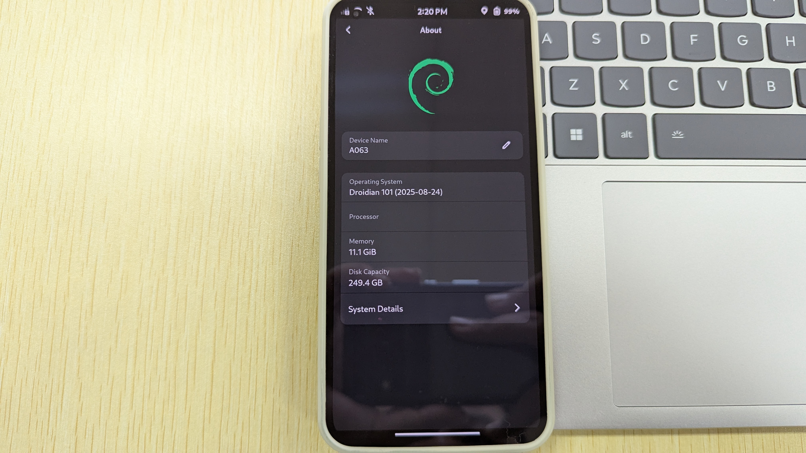
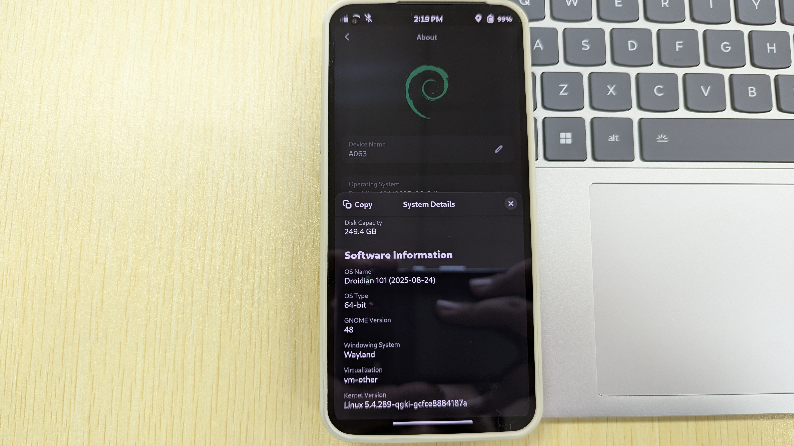
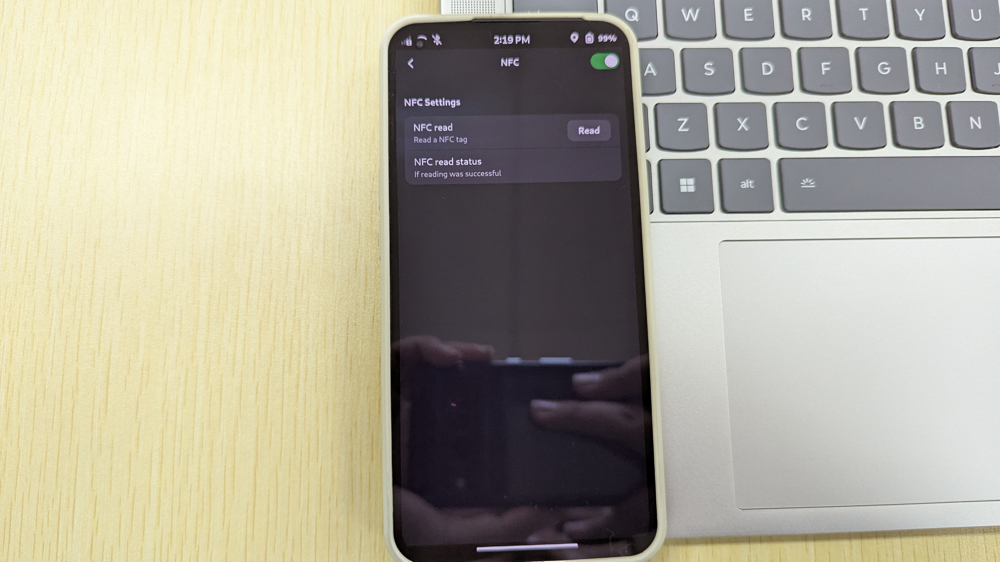
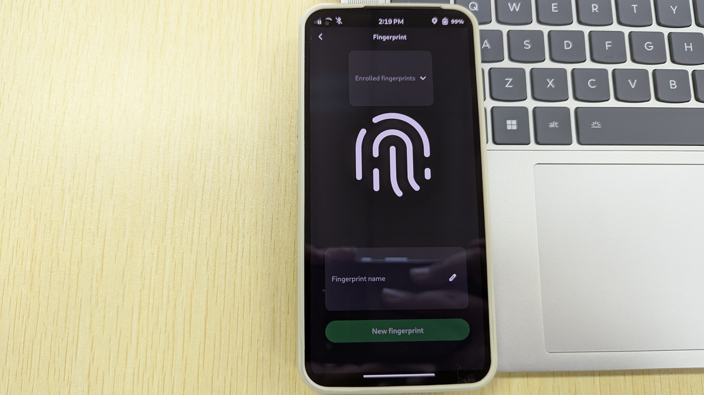
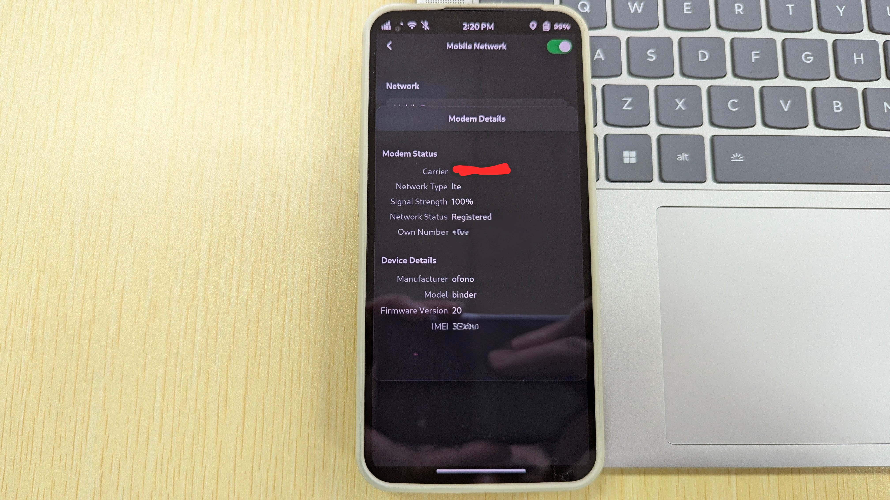

<!-- Co-translated by Gemini -->
Flashing a Debian system onto an Android phone is a very interesting endeavor.

## Droidian Introduction

Droidian is a mobile device operating system developed based on Debian's Testing branch. Its goal is to transform Android phones into Debian systems, allowing them to enjoy the various benefits of Debian just like a regular Linux computer. 
Since Android has made extensive modifications to the Linux kernel and filesystem (such as removing common components like the X Window System and Wayland, and not supporting the Glibc or musl C libraries required by most Linux programs), porting Linux systems to most Android phones on the market is fraught with difficulties. Therefore, the Droidian project was created to solve this problem: it uses [Halium](https://halium.org/) and libhybris to map Android's bionic with common Linux Glibc C libraries, ensuring compatibility with Android's HAL and hardware drivers to reduce porting difficulty. If your phone shipped with Android 9 or above, Droidian can even be ported via a GSI by simply recompiling the kernel. 

## Installing Droidian

My device has an [unofficial port](https://github.com/Nonta72/nothing-spacewar) on XDA, and the support status is quite excellent: most functions work, it can even make phone calls, and although the camera resolution is limited to 12 megapixels, the color quality is very good—much better than the un-processed 3A output of the mainline kernel. 

Here are the currently supported items:
 - Screen (refresh rate at 60Hz)
 - Camera (12-megapixel resolution)
 - Microphone
 - Bluetooth
 - Battery management (not as good as original Android, but usable)
 - Wi-Fi (Bluetooth tethering also works normally)
 - Audio (no headphone jack, but earphones work)
 - Wireless charging (not as good as original Android, but usable; may be dangerous)
 - Modem (5G mobile data not supported, but functional)
 - NFC
 - GPS
 - Sensors
 - Vibration (excellent effects! can be developed for other uses)
 - Gyroscope
 - Accelerometer
  
 Items that do not work:
 - Dual SIM
 - Under-display fingerprint recognition (Phosh currently does not support this design)
 - Glyph light strip
 - 90Hz and 120Hz refresh rates
 
 ### Flashing Process

 Refer to the [tutorial](https://xdaforums.com/t/rom-linux-droidian-for-spacewar-with-waydroid.4762595/) on XDA, and go [here](https://github.com/Nonta72/nothing-spacewar) to download the necessary files. You can also go to [Droidian's](https://github.com/droidian-images/droidian/releases) GitHub to download the latest image files to try. 
 After the download is complete, extract the files. 
 Next, go [here](https://github.com/spike0en/nothing_archive/releases/tag/Spacewar_T1.5-230310-1650) to download the Android 13 firmware; it must be the stock firmware, otherwise you will encounter display bugs. Once downloaded, flash each partition via fastboot. Alternatively, use the following script (Source: [Nothing Flasher](https://github.com/spike0en/nothing_flasher/blob/main/README.md#-download) by spike0en) 

 
After flashing, run the flashing script provided with the files and wait for completion.

## Experience
After flashing and booting, the default password is `1234`. Basic operations are similar to PostmarketOS. The default UI is Phosh, which cannot be changed manually without running into dependency hell.

Once booted, you can see the Droidian desktop and run various applications normally. The basic functions of the phone all work, including making calls. Although the screen refresh rate is low, the performance of the Snapdragon 778G+ is very strong, and there is no stuttering at all. This also solves the current issue of the mainline kernel not supporting call audio. 
Beyond the experience, I am most concerned about the kernel version. Checking via `uname -a`, I found the kernel version is 5.4 QGKI, which lags significantly behind the mainline 6.17 version. Given the nature of Droidian, it is likely impossible to upgrade the kernel version unless Nothing officially upgrades the Nothing Phone (1) BSP kernel. However, official support for the Nothing Phone (1) has already ended, so relying on the manufacturer is out of the question. 

Although the kernel version is old, it can still run most programs. After opening the GNOME settings, a few options also brought me surprises:

- There are NFC-related options in the settings. Compared to various NFC settings on Android, seeing this option on Linux actually surprised me. You should know that although NFC support was introduced in the mainline Linux kernel back in version 2.6, it has always lacked user-friendly programs, and major desktop environments lack support. Although Droidian's NFC settings are very simple, something is better than nothing!

- There is also a fingerprint option in the settings. Although GNOME supports fingerprint unlocking, I don't have a single device with a fingerprint reader. Many phones capable of running Linux that have built-in fingerprints don't support them because manufacturers don't provide Linux drivers, which is a real shame. Now, I can finally treat my eyes in Droidian (why "treat eyes"? because Phosh doesn't support under-display fingerprints; even if the reader itself is functional, it can't unlock the screen)!

- Since it is based on the stock kernel with modifications and uses Halium and libhybris, the modem's firmware implementation is different. It is replaced by a software stack called "ofono," instead of the solution in the mainline kernel that mounts modem firmware to start the modem. At the same time, the modem manufacturer has changed to "binder" instead of "Qualcomm Incorporated." However, you can still make phone calls and send text messages to chat with friends:

The only problem is that the speaker sound is extremely loud, and volume adjustment doesn't work; there are only two choices: maximum and mute.

## Waydroid and Application Compatibility
According to the Halium compilation guide, the kernel we ultimately compile is compatible with LXC containers. Waydroid, in turn, wraps Android inside an LXC container, allowing Android to run on a Linux system with almost no performance loss. Droidian integrates Waydroid options into the system settings, making it convenient for average users to manage.  
 
However, I still installed it via `sudo apt install waydroid` because the command is very direct and clear. Besides, I already have experience using Waydroid, and I've long since memorized those few commands. Of course, the experience is not far from the mainline kernel; I can still run native Android apps under the Linux desktop environment, such as Telegram, Signal, and even Google Maps.  
 
Actual tests found that Waydroid starts very quickly and apps run quite smoothly, almost identically to the stock experience. Furthermore, placing Android apps inside Waydroid is relatively safe because apps in the container cannot access external files. This also effectively curbs the issue of many apps auto-starting at boot, which not only drags down system performance but also involves background data collection or other shady business—things you can't do on a regular Android phone.

## Summary

The experience of porting Droidian to the Nothing Phone (1) has shown me the possibility of a "true fusion of Android and Linux." Although small problems still exist, it has proven that even on a closed Android device, we can embrace a truly free Linux desktop.  
 
However, it also helped me understand the difference between Android phones and Linux phones: the Android kernel lags behind the mainline by at least 5 years, and a large number of upstream patches cannot be applied to Android in time, leaving Android devices facing security issues. Furthermore, extensive modifications to the kernel by manufacturers make it extremely difficult for Android devices to port the mainline Linux kernel.  
 
Implementing hardware support in the mainline kernel often takes kernel developers months or even years. Someone once compared the mainline kernel source code of the PinePhone and the OnePlus 6T; the result was that the PinePhone's mainline kernel differed from upstream by 50 million lines of code, while the latter differed by 500 million lines. This gap is a realistic reflection of the difficulty Android devices have in fully integrating into the Free Software world. This is the most vivid lesson that Droidian and Halium have taught me—it is not a textbook, but it is better than one. And the most valuable point is: this lesson must be completed by you personally, following documentation from scratch, repairing, debugging, and even re-implementing all of the phone's functions step by step. 
 
This kind of learning is not a quick injection of knowledge, but a slow and solid understanding. It will make you respect hardware more, understand drivers, and feel that invisible tug-of-war between the abstract kernel and the concrete device. it will also give you a deeper understanding of Linux and the entire UNIX world than ever before. You will also gain a deeper understanding of Free Software, the open-source community, and open culture.  
 
The reward for completing it may not be a trophy or money, and it may not have any commercial value, but it will be a journey to cherish, an experience you will never forget. It is the sense of accomplishment of making a phone work under Free Software, and it is a small stepping stone you have contributed to an open-source ecosystem—small, yet capable of being stepped on by those who come after, as they continue forward.