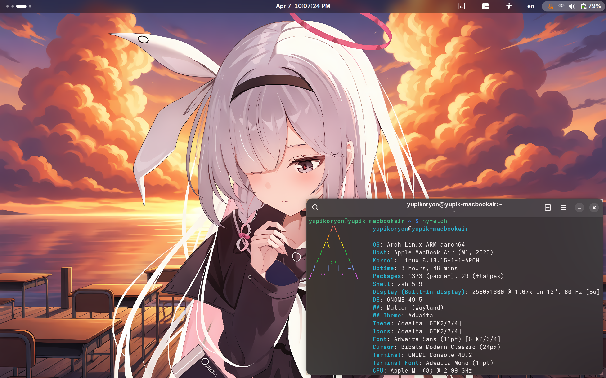
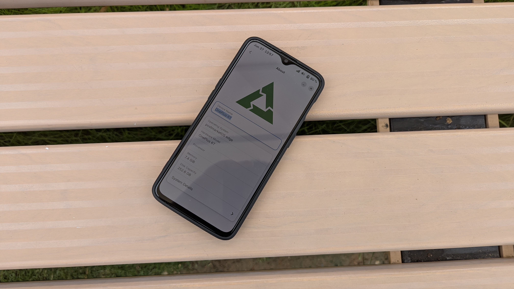

<!-- Co-translated by Gemini -->
Please listen to the music below while reading this article for a better experience:

<iframe width="560" height="315" src="https://www.youtube.com/embed/xzhAOVbGrUs?si=9XvqCgimGi_uOqES" title="YouTube video player" frameborder="0" allow="accelerometer; autoplay; clipboard-write; encrypted-media; gyroscope; picture-in-picture; web-share" referrerpolicy="strict-origin-when-cross-origin" allowfullscreen></iframe>

<audio controls>
  <source src="https://github.com/Android-Piepaint/android-astro-files/raw/refs/heads/main/Porter%20Robinson%20-%20Look%20at%20the%20Sky%20(loophoof,%20NLS%20and%20Proto_ssin%20Remix_Cover)%20ft.%20hittcell%20-%20PR%CE%9BDA%20_%20_ssynae.ogg" type="audio/mpeg">
  Your browser does not support the audio element.
</audio>

"저는 리뉴스(Linux)를 공부하는 좋아합니다." Unlike most people in Computer Engineering, my decision to learn Linux wasn't forced upon me by a school curriculum. On the contrary, I proactively stepped into the realm of Linux, BSD, and Free Software issues because I advocate for Free Software and the GNU philosophy, and my major is related to networking. 
I have never considered myself to have "mastered" Linux. Especially regarding servers, my grasp isn't deep enough yet—after all, it's difficult to justify placing true server hardware at home, given the unbearable noise and energy consumption. Currently, I use Linux as my primary daily driver for web browsing, word processing, and graphic design. On rare occasions, I play games (Minecraft), and I also develop simple programs in C.  
 
For instance, just last week, I designed a [program for the seven-segment display on a POS machine from an unknown manufacturer to show system time, average CPU clock speed, and memory usage](https://github.com/Android-Piepaint/Dumb-POS-display-clock-monitor). Reverse-engineering the display protocol alone took me half an hour. 
 
The advantage of learning Linux is discovering many open-source solutions (such as self-hosting Nextcloud cloud storage or using Docker for a self-hosted Android cloud phone). Many of these programs are cross-platform and can replace various commercial counterparts. Of course, I am speaking from my own daily usage; many solutions do not adhere to industry standards and may not even be acceptable to everyone. 
 
Unlike the way most people learn Linux, my approach has been quite "fragmented." Relevant knowledge points were acquired through web searches, browsing subreddits, and following related courses on YouTube. In recent years, I also discovered the "CoolApk" forum in Mainland China, finding many "ingenious but seemingly useless techniques" there.  
 
Knowledge was completed bit by bit. Only recently did I learn that even Chinese input methods have multiple frameworks to choose from. To deepen my understanding, I began reading NiaoGe's Linux Private Kitchen(鳥哥的 Linux 私房菜) and [Running Linux on Computers: Hardware Testing Notes(電腦上試跑 Linux：硬體測試筆記)](https://github.com/cc-books/testnotes). Only then did I understand what it feels like to learn progressively.  
 
Both books have electronic versions, which is convenient; I can start learning anywhere with just a tablet or laptop. To further my understanding, I specifically subscribed to YouTube courses related to operating systems and embedded OS porting. Although the videos are in English without subtitles, my passion for Linux and Free Software, combined with a serviceable level of English, allowed me to learn many new things. I even convinced my family to buy various prototype machines and single-board computers for experimentation, costing quite a bit, yet they never criticized me (and I understand how hard they work for that money). 
 
As for why I learn embedded OS porting? Because it doesn't require math! `:P` 

# Chronicles

In reality, the time I have spent truly using Linux and *BSD totals only six and a half years; everything before that was merely a "transition period."

## 2018: The Prologue

My earliest contact was with Android X86 9.0 (obviously, Android is not a GNU/Linux distribution, but it uses a modified Linux kernel). I sought an alternative because 64-bit Windows 10 was a bit sluggish on a desktop with 4GB of RAM. 
 
After using it, although performance improved, the G2020 CPU was an X86 architecture, and very few common mobile apps could actually open on the computer. Although I later enabled compatibility programs and could download more apps from Google Play, it could only execute 32-bit ARM programs. It was fundamentally unusable for daily life, so I eventually re-installed Chrome OS. However, the motherboard's integrated graphics weren't powerful enough, so running Android apps was always laggy. 
 
Consequently, I didn't use it much afterwards, but it was my first encounter with an operating system modified from the Linux kernel—it was the beginning of everything. My phone's gallery still has photos of that desktop.

## 2019: Encountering macOS, The Eve of the Linux "Era"

After a period of silence, a classmate I knew whose family used a MacBook enthusiastically told me about macOS. It was the first time I saw an operating system with such a modern UI and such a refined laptop. It was also my first contact with a commercial UNIX operating system using the Mach-O microkernel outside of Android, Chrome OS, and Windows. But I could hardly convince my family to buy a MacBook costing thousands! So, I made do with virtual machines. My impression of MacBooks was limited to seeing one in an Apple Store in an underground mall in 2013; the "Command" key and its four-leaf clover icon left a deep memory. Because of this, it left a shadow even on the "shoddy" "Creeper" laptop I designed as a child (which was just cardboard boxes assembled into a laptop shape). Even today, fifteen years later, I still stare at the "Command" key on a MacBook. 
 
Later, I learned about the "Hackintosh" (OSX86) project. After some searching and experimentation, I eventually installed macOS on the desktop. I was using macOS 10.15.6 at the time, but I found it wasn't as smooth as a real Mac. Perhaps it wasn't the G2020 CPU itself, but rather that the integrated Intel HD Graphics 2500 had no macOS drivers, forcing me to use software rendering. Even so, I persisted for a year before finally switching to Manjaro Linux.  
 
During this period, I learned to use virtual machines. I even went as far as creating an [OpenCore configuration file for the motherboard](https://github.com/Android-Piepaint/GIGABYTE-B460M-D2V-Hackintosh). Under macOS, I also began learning basic UNIX commands (`cd`, `ls`, `top`, etc.), and learned to set up the `brew` and `macports` package managers, which served as a foundation for my later switch to Linux.

 ::github{repo="Android-Piepaint/GIGABYTE-B460M-D2V-Hackintosh"}

## 2020: Fedora Takes the Stage, Manjaro Linux Dominates, The Linux Era Arrives

2020 was the year of the broadest exposure. My Asus K501E laptop was unable to upgrade to Windows 10 due to having only 2GB of RAM and an old BIOS firmware, leaving it stuck on the end-of-life Windows 7. I had no choice but to install Linux to keep using the laptop.  
 
Perhaps out of a desire to be "different," I didn't choose the common Ubuntu but instead used Fedora Linux for the latest software. Compared to the fan "going full throttled" under Windows, it was almost silent in Fedora, only spinning slightly and blowing out warm air when watching YouTube videos. I completed many "firsts" on that fifteen-year-old laptop: the first time using the `dnf` package manager to install common software (Firefox, LibreOffice, Telegram...), the first time customizing GNOME and KDE Plasma desktops, and the first time compiling software... Naturally, as more "firsts" appeared, I unconsciously learned more command usages: using `ps -aux` to view current processes, `free` to check remaining memory space, `df -h` to inspect disk partitions and capacity, and `dmesg` to grab kernel logs.  
 
Later, I switched to Manjaro Linux because, as a rolling release distribution, the software is always up-to-date—essentially, you can use the upstream code as soon as it's compiled. With the change in distribution, the package manager naturally changed too. Manjaro is the distribution I used the longest, from installing it on my laptop and desktop in May until switching to the upstream Arch Linux in March 2021. 
 
If you ask me what left the deepest impression about Manjaro, it would be its massive repositories. Besides the system's own repositories, you can use software from Flathub or Snap, and Appimage files are also available. What if the software or package you need isn't in those three? Manjaro is also compatible with the Arch Linux User Repository (AUR); you just need to search for the software on AUR to build and install it. Of course, installing packages from AUR requires manual intervention, as some need to be compiled from source. 
The Manjaro experience served as the foundation for my later "Distro hoppin’ ".

## 2021: Migrating to Arch Linux, Becoming a Distro Hopper

After using Fedora and Manjaro, my excitement for Linux began to wane. So, I decided to try different distributions. Between March and August, I tried many: Qubes OS, which focuses on security through virtual machines; Gentoo Linux, which focuses on custom systems and improving computer performance; and Fedora Silverblue, an immutable "stable distribution." Later, I became interested in Linux-powered smartphones like the PinePhone and began learning about Linux distributions designed for mobile devices, but since I didn't have a supported device at the time, I just poked around in QEMU... 
 
Later, I became interested in Arch Linux and installed it after downloading the image. Unlike most Linux distributions, the Arch Linux installation image has no graphical interface and no installation script. The entire installation process must be completed through commands. For someone used to graphical interfaces, seeing a TTY console with only black and white for the first time was very novel.  
 
"This is the most essential side of Linux; the once-familiar installation process has now become a test for you." Armed with the Arch Wiki installation guide, I began the process: partitioning the hard drive, mounting partitions, installing the base system, using `chroot` to create users, configuring system files...  
 
When the process ended and I saw the familiar TTY console appear after rebooting, the joy was already beyond words. It was incredible that I could feel a sense of accomplishment just for "completing a Linux installation." As for usage, since I had previously used the Arch-based Manjaro, there was nothing particularly special. (The image below was not from that time, but from after migrating to the ARM architecture.) 

However, this time I gained a relatively comprehensive understanding of Linux installation mechanisms. Simultaneously, I learned to configure `swap` and `zram` to improve system memory and how to use GRUB and `systemd-boot` to modify kernel boot parameters, which laid the groundwork for my attempts to port Linux to phones, tablets, and eventually prototype machines.

## 2022: Migrating to 64-bit ARM Architecture, Starting the Embedded Journey; Fully Embracing Free Software Starts Now

> See also: [My 5-Year ARM64 Architecture Journey](https://blog.cloudflare88.eu.org/posts/my-5-years-arm64-architecture-journey/)

2022 was the most important year in my Linux learning history. Due to long-term learning via YouTube courses, my horizons expanded. Out of a desire to be "different," I came into contact with FreeBSD and OpenBSD. Unlike Linux, which was originally designed as a "POSIX-compliant UNIX clone," the BSD series of operating systems carries ancient UNIX blood—the giant that ruled computers for 30 years. UNIX design philosophy influenced many operating systems and an entire generation; even today's Windows mimics UNIX.  
 In many ways, the configuration methods for BSD are even more primitive than Linux. The configuration documentation is also harder to understand. Fortunately, there are many tutorials online explaining how to configure FreeBSD, and by following FreeBSD's own documentation, I successfully installed graphics drivers and GNOME. The only unsolvable problem was that the PCIe Wi-Fi card I bought when installing macOS wasn't supported by FreeBSD, so I had to use wired networking instead. 
 
Perhaps due to trying various operating systems and compiling programs, the seven-year-old 500GB HDD in my desktop began frequent power failures, reaction times increased noticeably, and the number of bad sectors grew. Although I later replaced it with an SSD, the dual-core G2020 CPU could no longer meet my needs. My demand for a new computer became increasingly urgent.  
 
Finally, during a trip to a mall, I took the opportunity to suggest getting a new laptop to my family. To my surprise, everyone agreed, and we made an exception to buy a MacBook Air "base model" with 8GB of RAM and a 512GB hard drive. It just happened to coincide with Apple's release of its M1 ARM chip, so I naturally became a "tester." After enjoying the brilliance of the Retina display, I soon learned about the Asahi Linux project, which ports the mainline kernel to Apple's M-series chips. I also installed Arch Linux Arm on my laptop to replace macOS for daily use and work, beginning my migration to Arm.  
 
Around the same time, I also started researching "embedded devices." Because my laptop used an ARM chip, I could treat it as a large "single-board computer" for porting purposes. Since all MacBook components are soldered to the motherboard and it provides a UART for debugging, it was the first embedded device I encountered. Asahi Linux uses `m1n1` and U-Boot as the bootloaders to initiate Linux, which also led me to start learning about U-Boot, mastering simple commands to control computer booting. My learning direction was **officially** set. 

 
As the hardware environment migrated to Arm, the corresponding software had to migrate as well. Fortunately, most common software on Linux has an Arm version released, so the migration process was smooth. However, many commercial proprietary programs I used did not have an Arm release. 
  
At the time, solutions like `box64` or `FeX-EMU`, which can execute X86 applications with near-native performance, were not yet available. Thus, I began looking for open-source "alternatives": using Inkscape instead of Sketch for graphic design, using Kdenlive instead of DaVinci Resolve for video production, and using Blender instead of SketchUp for 3D modeling.  
 
This also allowed me to experience the convenience of "open-source software"—as long as you have the source code, you can compile and install it yourself even if the developer hasn't released a file for your platform. For this, I learned about patching and using Git. With the source code public and viewable by everyone, developers couldn't hide any shady business. Perhaps it is because of this experience that most of the software I choose today is Free Software. Regarding devices, my choices are primarily based on the Arm and RISC-V architectures. 
 
Furthermore, terms common in embedded Linux operating systems, such as "Device Tree," "page size," and "Execute-in-Place (XIP)," began to replace terms like "ACPI," "DSDT," "BIOS," and "Hyper-threading." I also shifted from "general" Linux system learning to the study of embedded devices and embedded OS porting. At this point, my learning direction was truly finalized. 
 
In August, I browsed the introduction to the Free Software Foundation (FSF) and also learned about the GNU philosophy. Combined with attending the FOSDEM 2022 developers' meeting online, the concepts of "Free Software," "digital human rights," and "privacy rights" began to deeply influence my thinking. The GNU philosophy became the standard for my future writing, video releases, and daily document processing (even now, if someone asks for a text draft, I use the patent-free `.odt` format to save and send it; whether the recipient can access it is not my concern). 

> Free software means as a matter of liberty, not price. To understand the concept, you should think of 'free' as in 'free speech,' not as in 'free beer'. More precisely, it means that the users have the freedom to run, copy, distribute, study, change and improve the software.

Because I have always identified with the FSF's philosophy—for privacy, for security, and most importantly, for freedom—I decided to fully switch to Linux. This means the operating systems on both my computer and phone must be Linux, and the software running on them must mostly be Free Software. Even computer peripherals (drawing tablets, network cards, etc.) must be Linux-friendly, proving that Linux isn't just for servers but can also be used as a desktop system. 
To this day, fully Free Software accounts for 90% of the software installed on my computer. In my spare time, I also create small musical works related to Free Software, which are collected under the ["Music" category of this blog](https://blog.cloudflare88.eu.org/archive/category/Music/). 
 

## 2023 – 2025: Linux on Mobile Devices (MIDs), The "Snaptop" Emerges

Initially, I wanted to add a few servers to my home, but after careful consideration, I gave up because it didn't suit my household conditions; keeping them running 24/7 would be a significant burden in terms of noise and electricity bills.  
 
I decided to use retired, out-of-season phones with Linux installed to serve as lightweight servers instead. After all, the performance of current Android phones has generally improved, making them suitable for running Docker container services. Since I already had experience with Linux, I bought a OnePlus 6T with good mainline kernel support, installed PostmarketOS, and set up containers to self-host a gallery service as an alternative to Google Photos, ran an Ad Blocker, and even briefly set up a Minecraft server for multiplayer games...  
 
In short, I set up everything commonly found on a server on a phone. Plus, they have built-in batteries, serving as a cheap UPS system; even a power outage wouldn't be a problem. Later, my SDM845 MTP prototype replaced my OnePlus 6T and was also used to host my blog, while the original OnePlus 6T became a "backup phone." After inserting a SIM card, it even gave me a "PinePhone-like" experience. Later, I ported Arch Linux ARM to it, allowing me to enjoy the latest software. This is also the origin of the background on my blog's homepage. 

Naturally, for better performance, I later switched to a Nothing Phone 1. Its 12GB of RAM allows for more Docker containers, but this time the focus was more on daily use. The only problem was that the Snapdragon 778G CPU had poor mainline kernel support; for instance, the audio required manually patching every time I booted to work. Of course, I learned many things, such as patching firmware based on hardware nodes in the Device Tree and modifying kernel configuration files to enable Docker support...  
 
Later, unsatisfied with Fedora on the MacBook, I began porting PostmarketOS to it, which has now been accepted upstream and entered the testing branch. 
 

As for the arrival of the "Snaptop," it could be called an "accident." Due to a heavy rainstorm, my MacBook suffered water damage to the screen due to improper protection and had to be sent for repairs. While waiting, I needed a new laptop for daily use, and I didn't want to switch to any X86-based laptop because their performance is as weak as ever!  

 

 
It just so happened that I remembered seeing a Lenovo Snaptop in a store earlier. To test the mainline kernel support for the Qualcomm Snapdragon X Elite chip, I once again convinced my family to buy one for me. Later, I conducted many experiments on this laptop, such as using "Secure launch" to run Linux in EL2 so I could use KVM virtual machines and other containers using KVM. Roughly a quarter of the content on this blog is about Snaptops.

## 2025 – Present: Becoming a Linux Porter, Growing Slowly

With deeper learning in embedded systems, ordinary Linux phones no longer satisfy my needs. Most phones supporting the mainline kernel are retail devices with hardware-based Secure Boot enabled, making firmware modification nearly impossible. Since the previous 845 prototype's battery became too old to continue using, I had to buy an 8750 MTP prototype (actually two; the other is used as a server to host my blog. If you look closely, you'll see "Powered by QTI SM8750 MTP" at the end of the site title) and began the porting of the mainline kernel and Armbian Linux. Fortunately, the mainline kernel has always had a Device Tree for the SM8750 MTP, and ALSA configuration files were also available for audio. However, the porting work remains difficult; porting the kernel alone took three months, just to solve a display issue. To escape Android's convoluted boot process (mainly because `boot` images are hard to create), I switched to the common UEFI boot method found on PCs, using an EFI Framebuffer to temporarily resolve the display issue. 

Fortunately, since the 835, Qualcomm has switched to UEFI firmware adhering to the [ARM EBBR standard](https://arm-software.github.io/ebbr/) on all chips (according to Qualcomm BSP documentation, it should be called "Core Platform Boot," firmware based on Coreboot). Knowledge learned from UEFI firmware can be directly applied here.  
 
Later, during the process of compiling the mainline kernel for the Nothing Phone 1, I realized that firmware must be placed in specific locations given in the Device Tree to load successfully. Using this simple method, I successfully patched the two remote processors, ADSP and CDSP, on the MTP prototype in the 7.0 mainline kernel. Later, I was surprised to find that the mainline kernel supports Type-C dual-role switching, meaning the Type-C Dock I bought specifically for my laptop finally came in handy.

This was my first time successfully porting a Linux operating system to a relatively modern platform without the aid of any schematics or BSP references (Because I don't own any BSP codes). Although more than half of the hardware is non-functional, considering the scarcity of mainline kernel support for phones using the SM8750 chip and that most phones are supported even less than my prototype, I feel my progress has been somewhat rapid. I even went as far as posting a video on YouTube; although it has fewer than 2K views, it's clear that everyone likes "developers" who port Linux to devices... 
 
Here is the link to my video: _Look at the code, I'm still here, and you'll be alive next year_ (the background music of my video is "Look at the Sky" by Porter Robinson)!

<iframe width="560" height="315" src="https://www.youtube.com/embed/Ecv3HICeK74?si=5m9OW-QJOP2zHKan" title="YouTube video player" frameborder="0" allow="accelerometer; autoplay; clipboard-write; encrypted-media; gyroscope; picture-in-picture; web-share" referrerpolicy="strict-origin-when-cross-origin" allowfullscreen></iframe>

Every time the familiar Linux boot log flickers on the screen, those white characters flashing against a pure black background are, to me, not just the execution of code, but a form of "breathing" that transcends hardware lock-ins. 
 
In these past few months of day-and-night dialogue with the SM8750 prototype, I suddenly understood that the line "I'm still here" in Porter Robinson's lyrics is actually the hardware's response to the developer. Those electronic parts locked by manufacturers, forgotten by the era, or viewed as "early prototypes" should have remained silent in a landfill, but because of our obsession with the mainline kernel, they have regained the right to breathe freely. As long as someone is still writing code, the vitality of this technology will continue into next year and beyond. 

This made me re-examine the theme I want to talk about next.

# "공부" Means "Kung Fu," and Also "Learning"

In Korean, one way to write "learning" is "공부 (Gongbu)," whose Hanja origin is exactly "Kung Fu (功夫)." 

I used to view porting Linux as a technical intuition, but this three-month process—just to solve a single screen issue—made me realize that true learning is, in fact, a kind of "Kung Fu."  
 
It's not a fast-track cram school; it's like an old monk entering meditation or a craftsman sharpening a blade. It's the resilience ground out second by second amidst countless Kernel Panics and CrashDumps. When I push aside the wasted time that could have been spent in "idle leisure" to read books like "NiaoGe's Linux Private Kitchen" or "Running Linux on Computers: Hardware Testing Notes," or search for articles on embedded devices, or spend hours on YouTube watching embedded OS porting and Linux-related course videos; or when I use the "`make`" command to verify results while compiling programs or kernels, I am not just learning "knowledge" but practicing "Kung Fu."  
 
This Kung Fu is simple to describe but difficult to master. The simplicity lies in merely making those cold chips "come alive" as described in the lyrics; the difficulty lies in often requiring months or even years of sweat. it requires developers to be able to endure loneliness and, in the midst of months or years of boredom, hold onto that glimmer representing the "Free Software spirit" and the "GNU philosophy."