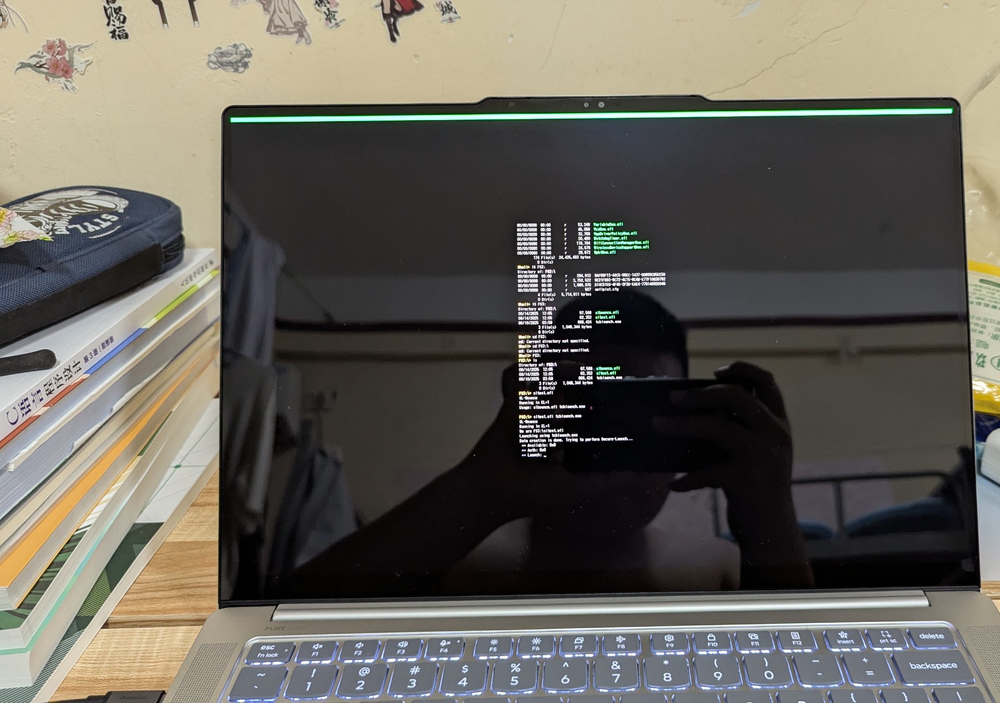
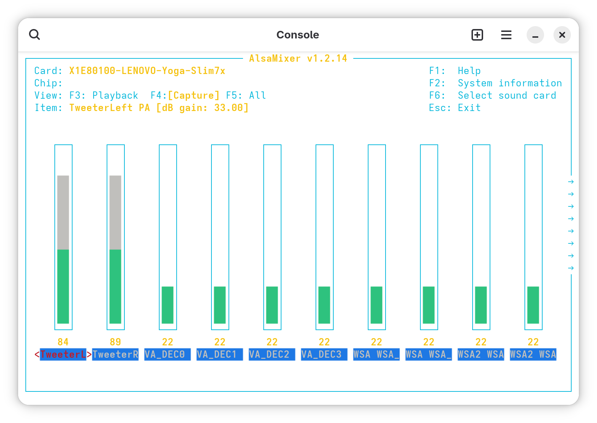
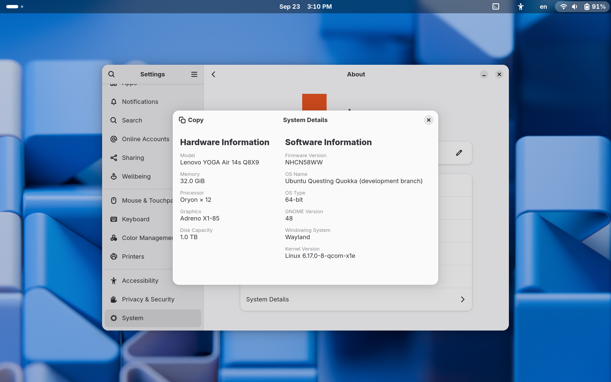

我一直都對採用ARM晶片的筆記本電腦有着濃厚的興趣。不僅僅是因爲CPU與衆不同，更是因爲被RISC晶片的優秀能耗比所驚豔，在優越的性能表現下，卻又有着長久的續航能力。這是普通x86架構的筆電所無法企及的。然而，因爲一個小小的意外，我與這臺筆電的故事，便從此開始了。

:::warning[中國大陸的閱讀者請注意]
本文包含部分（或全部包含）政治類話題，以及一些其它具有爭議性的，或者因爲當地的內容審查政策而不予通過的內容。儘管本部落格已被GFW所封鎖，但部分專業讀者仍有能力訪問本部落格。在此鄭重提醒：**如果您是[極端愛國主義者，或者具有排外主義立場的人，亦或是熱衷於在網路上攻擊異議人士的人](https://zh.wikipedia.org/zh-tw/%E5%B0%8F%E7%B2%89%E7%B4%85)，請立即關閉本網站**！！！
當地的內容審查政策可能不予通過的內容：
 - 敏感單詞（COVID-19)
:::

## 我爲什麼選擇 Qualcomm X Elite？
我最早看到有關驍龍版筆電的消息是在2020年，那時候我還在唸初中二年級，因爲COVID-19的全球流行，我便在家中上網課。在一個偶然的機會下，我在網路上找到了一加6T安裝Windows 11 ARM的教學影片，在當時這個影片給了我一個極大的震撼，我無法相信，一個婦孺皆知的常識“手機因爲與個人電腦（PC）的CPU架構不同，是無法執行常見的 Windows 11 和 Linux 作業系統的”在這個教學影片中被完全地推翻了。也是從那時，我第一次知道了 Windows還有 ARM 的版本。以及一系列關於 Windows on ARM 設備的技術性知識。其中影片中提到現在手機安裝 Windows 作業系統的驅動程式，大多是由搭載 Windows ARM 的筆電、工程機、平板電腦等設備的驅動程式提取或簡單修改而來的。我便在網路上檢索有關 Windows on ARM 的設備，結果發現市面上竟然真的有這樣的筆電！它們採用高通驍龍SoC，使用eMMC或者UFS快閃記憶體作爲內置硬碟，並且支援硬體虛擬化，還內建數據機，方便在沒有無線網路的地方，使用4G上網來連接到網際網路。</br>

雖然驍龍本非常吸引我，但是本着“能用就不要買新”的原則，父母一直不同意給我買驍龍本，我只好繼續用我父親的華碩 K50IE筆記本，來自2010年，使用雙核 Core 2 Duo處理器的筆電，外附輝達GeForce 310M GPU。直到初四那年，我考上了高中，又想盡辦法說服了我的父親，但是我父親認爲驍龍本不過是什麼低端筆電，想要給我購入一臺華爲筆電。但我知道，x86超級本的性能並不好，很多超級本甚至只有內建GPU，其繪圖能力相當底下，最終我買了 MacBook Air，採用蘋果M1晶片，並同時也瞭解了Asahi Linux 專案正在開發爲M1晶片適配的 Linux 發行版。並一直用到現在，直到上週五，因爲一場大雨，我的筆電由於保管不當而導致熒幕受潮而不得不運到上海進行維修。在此期間我便沒有了筆電可用，翌日，父母便要我從我唸大學的城市回家，並且帶着我去選購一臺新的筆電。我便藉此機會，把驍龍本的事情告訴了父親。他便疑惑的問我，什麼是“驍龍本”，我把我所知道的一切告訴了他。但是父親覺得不如選一臺x86超級本，因爲驍龍本在軟體上存在相容性問題，而且價格也比普通x86超級本高出許多，甚至可以用購買驍龍本的錢來買一臺極致性能的遊戲本。考慮到便攜性以及我過去五年來幾乎不再使用 Windows 作業系統，而以 Linux 系統爲主，父親也曾問我驍龍本是否有完善的 Linux 核心支援。我便把我所收集到的資料和相關專案給了他，最終我提着我的驍龍本回了家。

## 我對於驍龍本的印象

我所購買的設備是聯想的 YOGA Air 14S，雖然是個比較老的型號，但是其驍龍版在2024年上市，並不算是什麼老舊的東西。它配備了一個分辨率爲2944x1840的OLED屏幕，其重新整理頻率爲90Hz，支援觸控。以及驍龍 X1E80100，12核心的CPU。響應速度非常快。由於我需要做開發之用，我選擇了32GB的RAM，1TB的三星NVME高速固態硬碟。到手的時候，我發現它安裝的是 Windows 11 ARM 版，並且還預裝了廠商的軟體，我本想把整個硬碟抹掉重新安裝 Linux，但是考慮到 Windows on ARM 設備的韌體更新往往隨着Windows 更新而更新，我只好暫且保留它，在默認分出的500 GB 分割中，我決定安裝 Linux。

## 安裝 Linux

首先關閉 Windows 自帶的 Bitlocker 硬碟加密，然後重新啓動電腦，在開機時按下F2,以此進入 UEFI設定。選擇“安全”選項，之後關閉安全啓動，到目前唯一支援程度較爲良好的 [Ubuntu](https://people.canonical.com/~platform/images/ubuntu-concept/) 網站下載採用針對驍龍X Elite 處理器的自定核心的安裝映像，將其寫入USB隨身碟，插入電腦後啓動，進入Ubuntu安裝程式。根據安裝器指引完成安裝，不知道爲什麼，Ubuntu 給我的筆電套用了 Yoga Slim 7x 的設備樹。但是不要高興的太早，因爲我們沒有需要的驅動程式......

## 目前的問題

- 待機（suspend）還沒有修好，根本無法休眠；
- 不支援 HDR 視訊；
- 內建相機無法使用；
- NPU無法使用、內建TPM也無法使用，可能面臨安全問題；
- 電源管理有問題，耗電明顯比 Windows 11 高，待機的耗電量也比較高；

## 修復驅動程式
正如你在 Live CD 中體驗的那樣，你會面臨沒有硬體加速、電池記量器始終顯示0%，還有麥克風、攝像頭、聲音不工作的問題。對於後三者，已經有其他部分機型的解決方案，但是前面兩個問題是可以被解決的。在高通平臺上，除了需要必須的核心模組外，還需要相關的韌體，這樣在開機時，核心模組便能載入相關韌體，繼而驅動對應的韌體。在 Ubuntu中，有一個收錄了 X Elite 相關的硬體工具套件庫，裏面有一個腳本，它可以從 Windows 系統中提取韌體，並生成對應的 deb套件包，安裝後，便可解決驅動程式的問題。想要安裝這個腳本，只需要打開終端機，然後鍵入：

```bash
sudo apt update && sudo apt install qcom-firmware-extract
```

接著，在終端機中鍵入：

```bash
sudo qcom-firmware-extract
```

這個腳本會自動掛載 Windows所在的分割，並將 Windows 系統中的驅動程式提取出來，然後生成對應的 deb套件包，安裝後，便可解決驅動程式的問題。執行的結果如下：

```bash
Mounting Windows partition nvme0n1p3...
Extracting firmware from /tmp/fwfetch.ZTiJ47EF/mnt/Windows/System32/DriverStore/FileRepository
	adsp_dtbs.elf
	adspr.jsn
	adsps.jsn
	adspua.jsn
	battmgr.jsn
	cdsp_dtbs.elf
	cdspr.jsn
	qcadsp8380.mbn
	qccdsp8380.mbn
	qcdxkmsuc8380.mbn
	qcdxkmsucpurwa.mbn
Building package qcom-x1e-firmware-extracted-x1e80100-lenovo-83ed_20250916_arm64...
Installing qcom-x1e-firmware-extracted-x1e80100-lenovo-83ed_20250916_arm64...
update-initramfs: Generating /boot/initrd.img-6.17.0-8-qcom-x1e
W: Possible missing firmware /lib/firmware/apple/dfrmtfw-*.bin for built-in driver apple_z2
Using DTB: qcom/x1e80100-lenovo-yoga-slim7x.dtb
Installing /lib/firmware/6.17.0-8-qcom-x1e/device-tree/qcom/x1e80100-lenovo-yoga-slim7x.dtb into /boot/dtbs/6.17.0-8-qcom-x1e/qcom/x1e80100-lenovo-yoga-slim7x.dtb
Taking backup of x1e80100-lenovo-yoga-slim7x.dtb.
Installing new x1e80100-lenovo-yoga-slim7x.dtb.
System running in EFI mode, skipping.
update-initramfs: Generating /boot/initrd.img-6.16.0-27-qcom-x1e
W: Possible missing firmware /lib/firmware/apple/dfrmtfw-*.bin for built-in driver apple_z2
Using DTB: qcom/x1e80100-lenovo-yoga-slim7x.dtb
Installing /lib/firmware/6.16.0-27-qcom-x1e/device-tree/qcom/x1e80100-lenovo-yoga-slim7x.dtb into /boot/dtbs/6.16.0-27-qcom-x1e/qcom/x1e80100-lenovo-yoga-slim7x.dtb
Taking backup of x1e80100-lenovo-yoga-slim7x.dtb.
Installing new x1e80100-lenovo-yoga-slim7x.dtb.
Ignoring old or unknown version 6.16.0-27-qcom-x1e (latest is 6.17.0-8-qcom-x1e)
Done! Reboot to load the added firmware files. 
```
之後，重啓電腦，驅動程式便已經正常了。

## 嘗試啓用 KVM

根據已有消息，驍龍在410之後的處理器上永久禁用了EL2（只有部分例外），但是PC平臺的處理器上並不會封鎖 EL2異常等級，而 ARM 平臺的處理器只有運行在 EL2 模式下才能啓用 KVM。因此我嘗試在 Ubuntu 25.04 上檢查是否開啓了KVM ， 但結果並不愉快：

```bash
ls /dev/kvm
/dev/kvm: No such file or directory
```
這表示 KVM 並未開啓。也就是說，Linux運行在 EL1模式下。我又查看了核心日誌：

```bash
sudo dmesg | egrep -i "EL2|kvm|hypervisor|gunyah"
[sudo] password for edkpiepaint: 
[    0.000000] OF: reserved mem: 0x0000000080000000..0x00000000807fffff (8192 KiB) nomap non-reusable gunyah-hyp@80000000
[    0.000000] CPU features: detected: HCRX_EL2 register
[    0.000000] CPU features: detected: Broken CNTVOFF_EL2
[    0.071971] kvm [1]: HYP mode not available
```
不難看出，韌體將一部分記憶體保留給了 Gunyah（Qualcomm 的 EL2 Hypervisor），核心也發現了CPU支援 EL2相關的特性，但核心提示 `HYP mode not available`，說明韌體將 EL2留給了 Gunyah，使得 Linux 無法在 EL2 模式執行 KVM host，無法啓用 KVM。于是我又想起了之前在工程機上使用 `[slbounce]` 來將CPU執行到 EL2模式下，然後加載其作爲驅動，從而使 Android 獲得了 EL2, 從而有了使用 KVM 的能力。通過同樣的方式，我下載了 `sltest` 工具，在UEFI Shell 中執行 `sltest` ，結果如下：

::github{repo="TravMurav/slbounce"}

```bash
sltest.efi tcblaunch.exe
```
然後，看到了代表成功進入 EL2 模式的綠色線亮起，就知道這個CPU 支援 EL2 模式了。



然後，到[這裏](https://code.launchpad.net/~ubuntu-concept/ubuntu/+source/linux/+git/oracular)下載一份支援 X1E80100 的主線核心，然後向配置文檔中添加下面幾行：

```bash
CONFIG_KVM_COMMON=y
CONFIG_HAVE_KVM_IRQCHIP=y
CONFIG_HAVE_KVM_IRQ_ROUTING=y
CONFIG_HAVE_KVM_DIRTY_RING=y
CONFIG_HAVE_KVM_DIRTY_RING_ACQ_REL=y
CONFIG_NEED_KVM_DIRTY_RING_WITH_BITMAP=y
CONFIG_KVM_MMIO=y
CONFIG_HAVE_KVM_MSI=y
CONFIG_HAVE_KVM_READONLY_MEM=y
CONFIG_HAVE_KVM_CPU_RELAX_INTERCEPT=y
CONFIG_KVM_VFIO=y
CONFIG_KVM_GENERIC_DIRTYLOG_READ_PROTECT=y
CONFIG_HAVE_KVM_IRQ_BYPASS=y
CONFIG_HAVE_KVM_VCPU_RUN_PID_CHANGE=y
CONFIG_KVM_XFER_TO_GUEST_WORK=y
CONFIG_KVM_GENERIC_HARDWARE_ENABLING=y
CONFIG_KVM_GENERIC_MMU_NOTIFIER=y
CONFIG_VIRTUALIZATION=y
CONFIG_KVM=y
CONFIG_NVHE_EL2_DEBUG=y
```
之後編譯核心並安裝，之後重新啓動到UEFI Shell，執行 `load slbounce.efi`後重新啓動，再生成對應的設備樹：

```bash
# Generate device tree
fdtoverlay \
	-i /boot/x1e80100-lenovo-yoga-slim-7x.dtb \
	-o /boot/x1e80100-lenovo-yoga-slim-7x-el2.dtb \
	./out/dtbo/x1e-el2.dtbo
```
然後重新配置`grub.cfg`:

```bash
menuentry 'Ubuntu, with Linux 6.14.0-rc7+' --class ubuntu --class gnu-linux --class gnu --class os $menuentry_id_option 'gnulinux-6.14.0-rc7+-advanced-6f3056d7-f77e-4d80-9a52-ce923e1d5fda' {
		recordfail
		load_video
		gfxmode $linux_gfx_mode
		insmod gzio
		if [ x$grub_platform = xxen ]; then insmod xzio; insmod lzopio; fi
		insmod part_gpt
		insmod ext2
		search --no-floppy --fs-uuid --set=root 6f3056d7-f77e-4d80-9a52-ce923e1d5fda
		echo	'Loading Linux 6.14.0-rc7+ ...'
		linux	/boot/vmlinux-6.14.0-rc7+ root=UUID=6f3056d7-f77e-4d80-9a52-ce923e1d5fda ro  clk_ignore_unused pd_ignore_unused cma=128M efi=noruntime loglevel=7 console=tty0 snd-soc-x1e80100.i_accept_the_danger=1 id_aa64mmfr0.ecv=1 crashkernel=2G-4G:320M,4G-32G:512M,32G-64G:1024M,64G-128G:2048M,128G-:4096M
		initrd	/boot/initrd-vmlinux-6.14.0-rc7+
		echo	'Loading device tree blob...'
		devicetree	/boot/x1e80100-lenovo-yoga-slim7xel2.dtb
        }
```

那麼最後能否啓用KVM呢？結果是不行。這可能與韌體有關，畢竟 YOGA Slim 7x 的韌體更新後，有日誌明確寫出加入了 Linux EL2的支援。而與其硬體配置完全相同的 Yoga Air 14s 的韌體更新卻沒有任何日誌。也只能等聯想後續韌體更新了。

## 修復聲音的艱難路

在經過檢索大量的資訊和新聞後，我發現聯想Yoga Slim 7x 就是Yoga Air 14s，只是銷售地區的不同，這兩者的外觀、硬體配置完全相同。且Linux 核心也直接套用了 Yoga Slim 7x 的設備樹和韌體。那麼能不能借用 Yoga Slim 7x 的設備樹和韌體，來修復聲音呢？ 在檢索了有關 Ubuntu 在驍龍 X Elite 的Bug 反饋後，有人嘗試修復 Lenovo Yoga Slim 7x 的聲音問題，經過反復的測試和除錯，最終成功修復了聲音問題。而且我還知道，想要修復聲音問題，我還需要對應的 `toplogy` 文件和 ALSA 配置檔，才能修復聲音。`topology`檔可以從[linux-firmware的存儲庫](https://gitlab.com/kernel-firmware/linux-firmware)取得。下載 Yoga Slim 7x 的 `toplogy` 文件，然後複製到 `/lib/firmware/qcom/LENOVO/83ED` 目錄下，重新啓動。</br>
 </br>

 </br>
 那麼聲音修復了嗎？並沒有，喇叭還是沒有聲音，`dmesg` 也只有一句這樣的報錯:

 ```yaml
 [ 10.603979] MultiMedia2 Playback: ASoC: no backend DAIs enabled for MultiMedia2 Playback, possibly missing ALSA mixer-based routing or UCM profile
 ```
 ALSA SoC 層沒有找到對應的路由，也就是說，雖然音效驅動載入了，但缺少正確的 UCM（Use Case Manager）profile 或者 mixer 路由設定，因此聲音無法輸出。在檢索了`/usr/share/alsa/ucm2`目錄後，發現缺少與X1E80100相關的配置文檔。我又將[上游](https://github.com/alsa-project/alsa-ucm-conf)包含 X1E80100 的配置文檔放入 `/usr/share/alsa/ucm2` 目錄下，重新啓動，聲音依然沒有，`dmesg` 也沒有任何改變。這次的錯誤訊息依然是:

 ```yaml
  [ 10.603979] MultiMedia2 Playback: ASoC: no backend DAIs enabled for MultiMedia2 Playback, possibly missing ALSA mixer-based routing or UCM profile
  ```
但是有沒有識別到聲卡呢？當然是有了：

```bash
aplay -l
**** List of PLAYBACK Hardware Devices ****
card 0: X1E80100LENOVOY [X1E80100-LENOVO-Yoga-Slim7x], device 1: MultiMedia2 Playback (*) []
  Subdevices: 1/1
  Subdevice #0: subdevice #0
```
而之前則是完全不能偵測到音效裝置，說明我的修復思路大體上還是正確的。</br>
然後我又重新啓動了`pipewire`服務:

```bash
systemctl --user restart pipewire pipewire-pulse wireplumber
```
但是依然沒有聲音。</br>
隨後我嘗試手動使用`alsamixer`重新創建路由，但是當我面對大大小小的音量調節時，我愣住了，我只會對已有的路由進行修改，這還是建立在有官方文檔的的基礎上進行的。從頭創立ALSA路由表完全就是超出了我的知識範圍，我意識到，我需要其他人的幫助。</br>



在ChatGPT的輔助下，我最終在 Slim 7x 的UCM配置檔上稍作了修改，將修改後的UCM檔丟入`/usr/share/alsa/ucm2`目錄下，重新啓動，卻迎來了更多的錯誤：

```yaml
[ 3084.667865] q6apm-dai 6800000.remoteproc:glink-edge:gpr:service@1:dais: Trying to bind component "6800000.remoteproc:glink-edge:gpr:service@1:dais" to card "X1E80100-LENOVO-Yoga-Slim7x" but is already bound to card "X1E80100-LENOVO-Yoga-Slim7x" 
[ 3084.667876] snd-x1e80100 sound: ASoC: failed to instantiate card -19
```
原因是ALSA與核心驅動未對應... </br>

 </br>
 在更新到最新的 Ubuntu 25.10 後，新的版本帶給了我很多改變：全新的GNOME 49 和改進的動效在這臺筆電上非常順暢，雖然核心未有升級，但是韌體得到了更新。
 


 這次聲音的問題也有了變化，雖然還是沒有聲音：

 ```yaml
 snd-x1e80100 sound: ASoC: Parent card not yet available, widget card binding deferred
```

執行 `/proc/asound/cards`後，也偵測到聲卡，這意味着DSP和韌體都OK了, 只是UCM配置和路由設定問題：

```bash

cat /proc/asound/cards

0 [X1E80100LENOVOY]: x1e80100 - X1E80100-LENOVO-Yoga-Slim7x
                      LENOVO-83ED-YOGAAir14sQ8X9-LNVNB161216
```
而過一段時間後，`dmesg` 又顯示了新的訊息：

```yaml
[ 11.428544] snd-x1e80100 sound: ASoC: Parent card not yet available, widget card binding deferred [ 11.432023] ALSA: Control name 'stream1.vol_ctrl1 MultiMedia2 Playback Volume' truncated to 'stream1.vol_ctrl1 MultiMedia2 Playback Volu' 
[ 11.433224] input: X1E80100-LENOVO-Yoga-Slim7x Headset Jack as /devices/platform/sound/sound/card0/input14 [ 11.717229] wsa884x-codec sdw:1:0:0217:0204:00:1: Bus clash detected 
[ 11.717266] wsa884x-codec sdw:4:0:0217:0204:00:1: Bus clash detected 
[ 11.718469] wsa884x-codec sdw:1:0:0217:0204:00:1: Bus clash detected 
[ 11.718486] wsa884x-codec sdw:4:0:0217:0204:00:1: Bus clash detected 
[ 11.719680] wsa884x-codec sdw:1:0:0217:0204:00:1: Bus clash detected 
[ 11.719696] wsa884x-codec sdw:4:0:0217:0204:00:1: Bus clash detected 
[ 11.720866] wsa884x-codec sdw:1:0:0217:0204:00:1: Bus clash detected 
[ 11.720882] wsa884x-codec sdw:4:0:0217:0204:00:1: Bus clash detected 
[ 11.722028] wsa884x-codec sdw:1:0:0217:0204:00:1: Bus clash detected 
[ 11.722044] wsa884x-codec sdw:4:0:0217:0204:00:1: Bus clash detected 
[ 11.723196] wsa884x-codec sdw:1:0:0217:0204:00:1: Bus clash detected 
[ 11.723240] wsa884x-codec sdw:4:0:0217:0204:00:1: Bus clash detected 
[ 11.724364] wsa884x-codec sdw:1:0:0217:0204:00:1: Bus clash detected 
[ 11.724386] wsa884x-codec sdw:4:0:0217:0204:00:1: Bus clash detected 
[ 11.725528] wsa884x-codec sdw:1:0:0217:0204:00:1: Bus clash detected 
[ 11.725549] wsa884x-codec sdw:4:0:0217:0204:00:1: Bus clash detected 
[ 11.726729] wsa884x-codec sdw:1:0:0217:0204:00:1: Bus clash detected 
[ 11.726745] wsa884x-codec sdw:4:0:0217:0204:00:1: Bus clash detected 
[ 11.727901] wsa884x-codec sdw:1:0:0217:0204:00:1: Bus clash detected 
[ 11.727920] wsa884x-codec sdw:4:0:0217:0204:00:1: Bus clash detected 
[ 11.729062] wsa884x-codec sdw:1:0:0217:0204:00:1: Reached MAX_RETRY on alert read 
[ 11.729081] wsa884x-codec sdw:4:0:0217:0204:00:1: Reached MAX_RETRY on alert read 
[ 12.159732] wsa884x-codec sdw:1:0:0217:0204:00:1: Bus clash detected
```
看來功放又出了問題，修復聲音之路依舊漫長...
