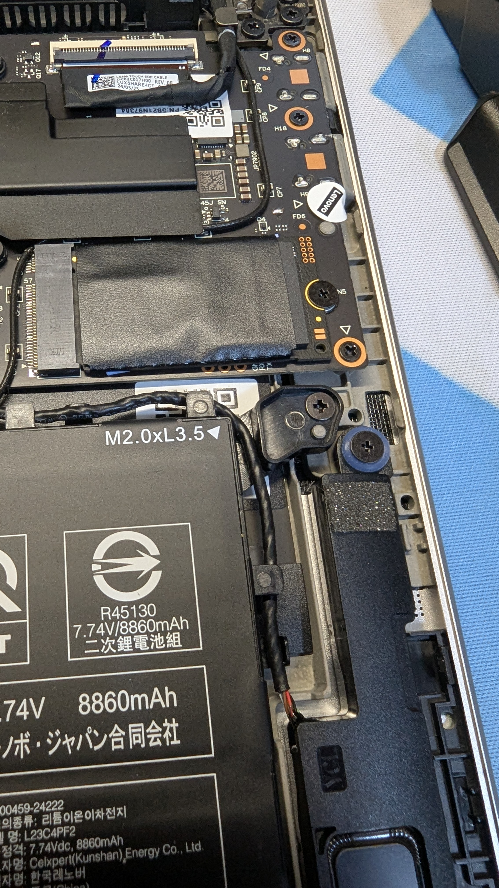

「 You're broken. And I'll put you back together.」</br>

聯想的驍龍筆電在 Linux 下的體驗是遠勝過 Windows on ARM 的，風扇比較安靜，幾乎不會有「開足馬力」的時候，儘管聲音依舊不能用，但是可以使用KVM 和 Xen，因此可以滿足我所有的用途。</br>
但是，不知道聯想在韌體裏做了什麼手腳，在更新到 NHCN60WW 版的 UEFI 韌體後，下載超過1GB的檔案時，系統會突然 freeze 掉，然後重啓。並且下載速度非常奇怪，有時候能從5兆比特突然升到20兆比特每秒。我也問過聯想的技術支援，請求提供舊版韌體下載，我自行刷回舊版韌體就可以，但是支援告訴我說我的筆電並沒有韌體更新，還好奇的問我是從哪裏獲得韌體更新的（這些專業的「技術支援」難道不知道自家筆電UEFI韌體是通過 Windows Update 提供的嗎？），最終也沒有給我提供舊版韌體下載。既然筆電廠家的「技術支援」也束手無策的話，唯一的解決方法，就只有使用者自己了。

# 使用外置 USB 無線網路卡不是一個長久的方案

對於無線網路這一問題，我曾想過買一個廉價的USB網路卡取代筆電上內建的PCIE網路卡。但是檢索了一圈後發現在售的USB網路卡不是外形太大，就是網路速度不佳，而且對 Linux 和 FreeBSD 這種類 UNIX 作業系統相容性不友好，因此這種方法雖然可以解決「燃眉之急」，卻不是長久的方法。</br>
不過，Windows 下就不會有這個問題。檔案可以正常下載（才怪！之後通過「裝置管理員」查看發現無線網路卡「消失」了），那就改用 Windows 吧？ 然而這只是在**逃避**問題，而不是**解決**問題。並且我對於 Windows 的使用已經停留在了5年前，現在 Windows 11 更新的內容，我根本不會使用，很多在 Linux 或者是 BSD 上常用的軟體根本沒有 Windows 版，至於花錢買專有軟體更是不可接受的。

# 通過 UART 獲取日誌

市面上常見的零售機可不會像原型機那樣，直接將 UART 通過 Micro USB 暴露出來，而是隱藏在預留的測試點或者微小的金屬點，需要稍加改進才能使用。想要使用 UART 的唯一辦法就是使用工具拆下筆電的外殼，同時也會丟失保固。好在聯想 Yoga 系列的筆電通常都很好拆，擰下底部的四顆金屬螺釘，隨後使用薄片從風口那裏抬起後殼，接着沿着縫隙繞一圈，整個筆電的後殼也就可以取下了。映入眼簾的是一顆碩大的電池和聯想 Yoga Air 14s 的主機板。</br>


但是 UART 要從哪裏尋找呢？爲此我在網路上檢索到了一張 Yoga Slim 7x 的檢修圖紙，上面記錄了主機板上預留的一些功能焊點。包括 NFC、數據機在內的硬體功能均在此列，因爲 Yoga Air 14s 和 Yoga Slim 7x 互爲「姊妹機型」，所以包括圖紙在內的軟硬體都是互相通用的。根據圖紙的描述和自己使用電錶測量，最後確定了無線網路卡的 UART 位置和整機的 UART 位置。一個位於網路卡旁邊的兩個金屬點，另一個位於固態硬碟下方的三個孔洞，無需取下硬碟就可以插線除錯（也就是說，我可以自行升級硬碟）。




準備三根較長的杜邦線和一個 CH341 燒錄器，將線按照主機板上的絲印進行組裝，然後將燒錄器鏈接電腦或者其他設備上。嵌入式系統不講究所謂「上位機」的概念，之後安裝 `minicom` 並執行 `sudo minicom -s` 來設定序列阜和 baudrate 爲115200：</br>


之後，按下電源按鈕，終端機內會有 bootloader 的 log：

```yaml
Format: Log Type - Time(microsec) - Message - Optional Info
Log Type: B - Since Boot(Power On Reset),  D - Delta,  S - Statistic
S - QC_IMAGE_VERSION_STRING=BOOT.MXF.2.4-00555-HAMOA-1
S - IMAGE_VARIANT_STRING=SocHamoaWP
S - OEM_IMAGE_VERSION_STRING=ip-10-195-200-192
S - Boot Interface: SPI
S - Secure Boot: On
S - Boot Config @ 0x221c8600 = 0x00000001
S - JTAG ID @ 0x221c8744 = 0x3021e0e1
S - OEM ID @ 0x221c8700 = 0x00000040
S - Serial Number @ 0x221c8610 = 0x000004467c0ab1b3
S - Feature Config Row 0 @ 0x221c21e0 = 0x0000000000000000
S - Feature Config Row 1 @ 0x221c21e8 = 0x0000000000000000
S - Core 0 Frequency, 1920 MHz
S - PBL Patch Ver: 3
S - PBL freq: 600 MHZ
S - Cluster: 0, Core: 0
S - --------------------------------------------------
PBL Timestamps (in usecs)(,version/bytes)
--------------------------------------------------
CPBL Start: 181
CPBL HW INIT Start: 573
CPBL HW INIT End: 3105
CPBL APPS Reset Start: 3225
CPBL APPS Sec Packet Init Start: 3486
CPBL APPS Sec Packet Init End: 3506
CPBL APPS Init Start: 3523
CPBL APPS Cache Init Start: 4121
CPBL APPS Cache Init End: 4150
CPBL APPS Core PWRUP Start: 4216
CPBL APPS Core PWRUP End: 4293
CPBL APPS Init End: 4295
CPBL APPS Reset End: 4318
CPBL Exit: 4390
APBL start: 10703,16777218
APBL Boot Media Detect Start: 25815
APBL Boot Media Detect End: 27263
APBL SHELF Load+Auth Start: 27265
        APBL ELF MD Load Start: 34850
        APBL ELF MD Load End: 35058
        APBL ELF Seg Load Start: 35060
        APBL ELF Seg Load End: 38691,131828
                APBL SEQ Valid Set: 38715
                APBL SEQ SA ACK Rcvd: 40738
        APBL ELF MD Load Start: 43310
        APBL ELF MD Load End: 44215
        APBL ELF Auth Start: 44225
        APBL ELF Auth End: 61918
        APBL ELF Seg Load Start: 61918
        APBL ELF Seg Load End: 75321,216272
        APBL ELF Seg Verify Start: 75321
        APBL ELF Seg Verify End: 80553
        APBL ELF MD Load Start: 82640
        APBL ELF MD Load End: 83530
        APBL ELF Auth Start: 83531
        APBL ELF Auth End: 101196
        APBL ELF Seg Load Start: 101198
        APBL ELF Seg Load End: 130485,1227744
        APBL ELF Seg Verify Start: 130485
        APBL ELF Seg Verify End: 136196
APBL SHELF Load+Auth End: 136305
                APBL TME PBL Exit: 136306
                APBL XBL_SC Exit Check: 137008
                APBL XBL_SC Exit Ack: 148173
APBL Exit: 148176
B -    149084 - SBL1, Start
B -    394822 - SBL1 BUILD @ 19:23:22 on Apr 30 2025
B -    399153 - (16f 2d 800)
B -    402264 - (16f 2d 404)
B -    404948 - (16f 2d 402)
B -    408242 - (16f 2d 800)
B -    410469 - (16f 2d 800)
B -    413000 - (16f 2d 404)
B -    416142 - (16f 2d 800)
B -    418612 - (16f 2d 402)
B -    421083 - (16f 2d 402)
B -    423767 - (16f 2d 402)
B -    426481 - (16f 2d 402)
B -    436119 - usb: usb_eud_serial  , 0x7c0ab1b3
D -       275 - sbl1_hw_init
D -      2501 - media_init:1
D -         0 - boot_check_recoveryinfo_partition
D -         0 - boot_recovery_select_boot_partitions
D -         0 - boot_recovery_partitions_info_imem_init
D -         0 - boot_save_sbl_recovery_partition_info
D -       275 - boot_handle_trial_boot
D -         0 - boot_blacklist_disable
B -    469059 - RECOVERY -  Image Load, Start
D -         0 - boot_blacklist_disable
B -    476837 - OEM_MISC -  Image Load, Start
D -     11804 - Auth Metadata
D -     17781 - OEM_MISC -  Image Loaded, Delta - (5492 Bytes)
B -    495564 - QTI_MISC -  Image Load, Start
B -    501542 - Load recovery partition: 82002003
D -     10156 - QTI_MISC -  Image Loaded, Delta - (1100 Bytes)
B -    510051 - APDP -  Image Load, Start
B -    515999 - Load recovery partition: 82002003
D -      9791 - APDP -  Image Loaded, Delta - (1100 Bytes)
D -         0 - boot_dload_dump_security_regions
D -         0 - EUD Init
D -         0 - blacklist enable
B -    536525 - (16f 2d 800)
B -    539362 - (16f 2d 404)
B -    542046 - (16f 2d 402)
B -    544760 - (16f 2d 800)
B -    547444 - (16f 2d 800)
B -    550098 - (16f 2d 404)
B -    552873 - (16f 2d 800)
B -    555496 - (16f 2d 402)
B -    558180 - (16f 2d 402)
B -    560864 - (16f 2d 402)
B -    563548 - (16f 2d 402)
D -     31598 - DP_Milestone
D -     13633 - Auth Metadata
D -     15677 - sbl1_xblconfig_init
B -    586149 - XBL Config -  Image Load, Start
B -    591852 - dtbo_found_count[1]
B -    596610 - DTB  Found: [pre-ddr][88022b02010000][0]
D -      7716 - boot_pre_ddr_dtb_load
D -      6222 - tsens_init_if
D -        31 - boot_check_device_temp
B -    621437 - PM: PM_DT_PARSING_ERR: charger
B -    621498 - BUS: 0, PMIC A:2.1 B:2.1 C:2.0 D:2.0 E:2.0 F:2.0 G:2.0 I:2.0 J:2.0 M:1.3
B -    631472 - BUS: 1, PMIC B:2.0 C:2.0 D:2.0 E:2.0 F:2.0 H:2.0 K:2.0 L:2.0 M:2.0
B -    641110 - PM: Detected Grid is 2
B -    642848 - PM: Reset by PSHOLD
B -    644892 - PM: Reset Type: Hard Reset
B -    771497 - PM: SET_VAL:Skip
B -    772534 - PM: PSI: b0x61_v0x4A OTP: v0x3A
B -    778787 - PM: OEM_PSI post-device-opsi Start
B -    779305 - PM: OEM_PSI post-device-opsi Done
B -    783636 - PM: Device Post Init # RTC: 0, #SDAM: 0
B -    788181 - PM: Device Init # SPMI Transn: 3826
D -    181902 - pm_device_init, Delta
B -    798002 - pm_driver_init, Start
B -    821944 - PM: miniPD
B -    824079 - PM: vbattcell=3735mV
B -    824659 - PM: Driver Init # SPMI Transn: 1471
D -     26413 - pm_driver_init, Delta
D -    221247 - sbl1_pmic_init
D -      2318 - media_init:2
D -         0 - media_init:3
D -       152 - boot_wdog_disable_check
D -       152 - init-logstomedia
D -         0 - shrm_load_cancel
B -    851072 - SHRM -  Image Load, Start
D -     21198 - Auth Metadata
D -     30927 - SHRM -  Image Loaded, Delta - (57052 Bytes)
B -    882304 - CDT not found in any storage media, using defaults
D -     11133 - boot_cdt_init
B -    893558 - CDT -  Image Load, Start
B -    896334 - CDT not found in any storage media
D -      8601 - sbl1_hw_platform_pre_ddr
B -    904965 - vsense_init, Start
D -         0 - vsense_init, Delta
D -     18453 - sbl1_hw_pre_ddr_init
D -       153 - boot_fedl_check
D -         0 - boot_dload_handle_forced_dload_timeout
D -      3599 - sbl1_load_ddr_training_data
B -    934825 - Pre_DDR_clock_init, Start
D -         0 - Pre_DDR_clock_init, Delta
D -     13084 - sbl1_ddr_set_params
B -    946537 - sbl1_ddr_init, Start
B -    955565 - DDR_INIT with shrm.elf
B -    955595 - INFO: PXI based read & write training enabled
B -    981947 - eCDT MRR - Data Starting Address: 0x24056D00
B -    987590 - Returning from DDR_FW_Init
B -    987620 - ddr_init = 1 cold boot
D -     41724 - sbl1_ddr_init, Delta
B -    995154 - 8 channel DDR configuration
B -    998539 - PlatID: 0x121
B -   1002565 - DSF version = 029.54.00
B -   1005341 - Manufacturer ID = 0x6, Device Type = 0x9
B -   1009031 - Rank 0 size = 16384 MB, Rank 1 size = 16384 MB
D -     68747 - sbl1_ddr_init
D -         0 - store-logstomedia
B -   1022817 - do_ddr_training, Start
B -   1062132 - DDR: Start of DDR Training Restore
B -   1264377 - Returning from DDR_FW_Restore
B -   1264560 - Current DDR Freq = 2739 MHz
B -   1268647 - Max enabled DDR Freq = 4224 MHz
B -   1272673 - DDR: End of DDR Training Restore
D -    251564 - do_ddr_training, Delta
B -   1285117 - SecLib initiate DARE sequence start
B -   1285361 - SecLib initiate DARE sequence successful
B -   1292559 - Returning from DDR_FW_Exit
D -    272731 - xbl_trng_ddi_seq
D -         0 - store-logstomedia
D -       518 - xbl_map_smem
D -         0 - boot_smem_debug_init
D -      1312 - boot_smem_init
D -       153 - boot_ddr_share_data_to_aop
D -        61 - boot_populate_ddr_details_shared_table
D -         0 - boot_recovery_partitions_info_smem_init
D -        30 - boot_update_ram_partition_table
B -   1328183 - Pimem init cmd, entry
B -   1332728 - (50000e)
D -      3477 - Pimem init cmd, exit
B -   1342396 - External heap init, Start
B -   1342457 - External heap init, End
D -     30714 - sbl1_post_ddr_init
D -         0 - sbl1_hw_init_secondary
B -   1362160 - DDR -  Image Load, Start
B -   1372378 - dtbo_found_count[1]
B -   1386347 - DTB  Found: [post-ddr][88022b02010000][2800020100000000]
D -     26352 - boot_post_ddr_dtb_load
B -   1392996 - usb: emmc_parti_unavail
B -   1396595 - usb: sdc_parti_unavail
B -   1400255 - usb: Serial - 7c0ab1b3
D -     10827 - boot_usb_update_serial
B -   1407544 - usb: qusb_dci_eud_init
D -      3569 - boot_usb_handle_charger
D -        31 - sbl1_hw_platform_smem
D -         0 - ramdump_load_cancel
B -   1421727 - RamDump -  Image Load, Start
D -      3324 - RamDump -  Image Loaded, Delta - (0 Bytes)
D -         0 - boot_update_abnormal_reset_status
D -         0 - boot_cache_set_memory_barrier
D -         0 - boot_smem_alloc_for_minidump
D -        30 - boot_shrm_mini_dump_init
D -        31 - boot_minidump_register_regions
D -        31 - boot_smem_store_pon_status
D -         0 - boot_clock_init_rpm
D -         0 - boot_vsense_copy_to_smem
D -       305 - sbl1_tlmm_init
D -         0 - sbl1_efs_handle_cookies
B -   1469307 - PM: Detected Grid is 2
B -   1493981 - PM: PM Total Mem Allocated: 12549 
D -     24705 - sbl1_pm_aop_pre_init_wrapper
B -   1498648 - AOP Config -  Image Load, Start
D -       549 - Decompression, Delta
D -     11834 - Auth Metadata
D -     28426 - AOP Config -  Image Loaded, Delta - (5588 Bytes)
B -   1532808 - AOP -  Image Load, Start
D -     12566 - Decompression, Delta
D -     20770 - Auth Metadata
D -      8692 - Segments hash check
D -     80459 - AOP -  Image Loaded, Delta - (99452 Bytes)
D -         0 - aop_loaded
D -         0 - boot_prepare_cpucp
B -   1624430 - CPUCP_DTB -  Image Load, Start
D -       275 - Decompression, Delta
D -     11803 - Auth Metadata
D -     20953 - CPUCP_DTB -  Image Loaded, Delta - (2804 Bytes)
B -   1652307 - CPUCPFW -  Image Load, Start
D -     20130 - Decompression, Delta
D -     20892 - Auth Metadata
D -      3873 - Segments hash check
D -     70699 - CPUCPFW -  Image Loaded, Delta - (156888 Bytes)
D -         0 - boot_reset_cpucp
B -   1732156 - QSEE Dev Config -  Image Load, Start
D -      2989 - Decompression, Delta
D -     12292 - Auth Metadata
D -     23210 - QSEE Dev Config -  Image Loaded, Delta - (24064 Bytes)
B -   1761100 - QSEE -  Image Load, Start
D -     92384 - Decompression, Delta
D -     22113 - Auth Metadata
D -     20130 - Segments hash check
D -    198555 - QSEE -  Image Loaded, Delta - (1120028 Bytes)
D -       397 - sbl1_hw_play_vibr
B -   1968622 - SEC -  Image Load, Start
D -     12535 - Auth Metadata
D -     18117 - SEC -  Image Loaded, Delta - (5432 Bytes)
B -   1987624 - QHEE -  Image Load, Start
D -     39986 - Decompression, Delta
D -     21076 - Auth Metadata
D -      4971 - Segments hash check
D -     98912 - QHEE -  Image Loaded, Delta - (501312 Bytes)
B -   2089829 - APPSBL -  Image Load, Start
D -     12902 - Auth Metadata
D -     14305 - Segments hash check
D -    414678 - APPSBL -  Image Loaded, Delta - (7115652 Bytes)
D -         0 - sbl1_save_appsbl_index
B -   2514054 - SBL1, End
D -   2368142 - SBL1, Delta
S - Flash Throughput, 18398 KB/s  (9346186 Bytes,  508528 us)
S - DDR Frequency, 2736 MHz


UEFI Start     [ 2741]
 - 0x0A7001000 [ 2751] Sec.efi
ASLR          : OFF [WARNING]
DEP           : ON (RTB)
Timer Delta   : +0 mS
RAM Entry 0   : Base 0x0080000000  Size 0x0000E40000
RAM Entry 1   : Base 0x00815A0000  Size 0x0056A60000
RAM Entry 2   : Base 0x00D8600000  Size 0x0000000000
RAM Entry 3   : Base 0x00DE5B0000  Size 0x0019F50000
RAM Entry 4   : Base 0x00FF800000  Size 0x0000800000
RAM Entry 5   : Base 0x0880000000  Size 0x0380000000
RAM Entry 6   : Base 0x0C00000000  Size 0x0400000000
RAM Available : 32543 MB (0x07F1FF0000)
RAM Installed : 32768 MB (0x0800000000)
Minidump      : ON
Init 1 aux cores of 11
Init CPU core 1
Continue booting UEFI on Core 0
Skipped DBI Dump Table, made numentries zero
  > Scheduler up on Core 1
UEFI Ver      : NHCN14WW.250911.BOOT.MXF.2.4-00555-HAMOA-1
Build Info    : 64b Sep 11 2025 11:47:22
Boot Device   : NVME
PROD Mode     : TRUE
Retail        : TRUE
 - 0x0D47D5000 [ 3049] DxeCore.efi 
IsArmV8Smc() return TRUE 
I2cMaster: FAIL open device num 0 Status = 34
I2cMaster: FAIL open device num 3 Status = 34
I2cMaster: FAIL open device num 7 Status = 34
I2cMaster: FAIL open device num 10 Status = 34
I2cMaster: FAIL open device num 11 Status = 34
I2cMaster: FAIL open device num 12 Status = 34
I2cMaster: FAIL open device num 13 Status = 34
I2cMaster: FAIL open device num 14 Status = 34
I2cMaster: FAIL open device num 15 Status = 34
I2cMaster: FAIL open device num 16 Status = 34
I2cMaster: FAIL open device num 17 Status = 34
I2cMaster: FAIL open device num 18 Status = 34
I2cMaster: FAIL open device num 19 Status = 34
I2cMaster: FAIL open device num 20 Status = 34
I2cMaster: FAIL open device num 22 Status = 34
I2cMaster: FAIL open device num 23 Status = 34
I2cMaster: FAIL open device num 24 Status = 34
I2cMaster: FAIL open device num 25 Status = 34
I2cMaster: FAIL open device num 26 Status = 34
Device booted from NVME/SPI_NOR 
TpmType = 0x6654504D. 
LoadOEMSecureApps: Internal Error or no apps found. Status = 0x00000005
EnterpriseMgtLib : Deleting UEFI NV variable : EnterpriseMgtClientPolicies of size : 28 bytes
EnterpriseMgt : EnterpriseMgtClientPolicies not found.
EnterpriseMgt : RegisterAddress: 0x01FDE000 Mask: 0x00000001 Value: 0x00000001 RegReadValue: 0
x00000000 FinalValue: 0x00000001 
EnterpriseMgt : Registering for OnReadyToBoot event Callback.
MfgModeMgmtDxeEntryPoint: QueryAppId for mfgmodemgmt app passed with AppId: 5
HW Wdog Setting from PCD : Disabled
SLT Platform Key not found: 14
LfcDisableAcpiModeEntry cmd 0x86 return rdBuf[0]=0!!
H2O DXE Chipset Services can not be found!
 OemSvcGetNovoButtonStatus EcInitializeDevice Status = Success !!
OemSvcGetNovoButtonStatus== 0
H2O DXE Chipset Services can not be found!
 OemSvcSwitchFoolProofFnCtrl Status = Success !!
OemSvcSwitchFoolProofFnCtrl pass 
-----OemSvcSwitchFlipToBoot ----
-----gQcomPmicSchgProtocolGuid 0----
OemSvcSwitchFlipToBoot:: storing to sdam pon from lid setting = 1 
Create ReadyToBoot event for Hotkey Mode status:0x0 
OemKernelServices Call: OemSvcUpdateOemBadgingLogoData 
OemKernelServices OemSvcUpdateOemBadgingLogoData, Status : Unsupported
OemKernelServices InitializeBadgingSupportProtocol, Status : Success
ButtonsDxeTest: Keypress SDAM data payload 0 
H2O DXE Chipset Services can not be found!
NvmExpressDriverEntry GetVariable IsCapsulePendingInPersistedMedia Not Found or data is FALSE
warning: failed to locate QMI protocol
Failed to read DGPU Env variable, Status 0xE
WinPciPowerOn: DGPU:PlatformType or SKU didn't match for Client 0
pil-tpfv Partition not found
pil-tpfv Failed to load ELF file
pil-tpfv Partition not found
pil-tpfv Failed to load ELF file
pil-tpfv Backup partition Image load Failed PStatus: D 
ddr_regions->no_of_ddr_regions : 3 
DDR Region0 Start_address : 0x0000000080000000, Size  : 0x0000000080000000 
DDR Region0 granule size  : 0x0000000080000000, Offset: 0x0000000000000000 
DDR Region1 Start_address : 0x0000000880000000, Size  : 0x0000000380000000 
DDR Region1 granule size  : 0x0000000080000000, Offset: 0x0000000000000000 
DDR Region2 Start_address : 0x0000000C00000000, Size  : 0x0000000400000000 
DDR Region2 granule size  : 0x0000000080000000, Offset: 0x0000000000000000 
Overriding PIL cfg by caller
[CreateSecureBootDxe] Clean CurrentActivePolicy variable fail: Not Found
override usb_mode: : 0x1
usb_port_retimer_init, LANE_A: core: : 0x0
Retimer Chip_id: : 0x8830
Retimer FW: : 0x5030009
Retimer_RESET_CFG: 0x1
usb_shared_ps8830_init, usb_mode: : 0x1
UsbConfigLibOpenProtocols: USB: Platform has Retimer
UsbStartController: Starting Core 3 in mode: 1
usb_shared_i2c_write, write failed reg|data : 0x70000
usb_shared_i2c_write, write failed reg|data : 0x70000
SSUsb4InitCommon: repeater_init failed for core 3
EnableSLTLoopback: xhc_slt_enable SltLbEnabled 0
EnableSLTLoopback: xhc_slt_enable SltLbEnabled 0
UsbStartController: Starting Core 4 in mode: 1
usb_shared_i2c_write, write failed reg|data : 0x70000
SSUsb5InitCommon: repeater_init failed for core 4
EnableSLTLoopback: xhc_slt_enable SltLbEnabled 0
EnableSLTLoopback: xhc_slt_enable SltLbEnabled 0
QcomChargerDxe:: bat_sts = 48,  7437,  -424  27.
warning: failed to locate QMI protocol
proxy vote done SubsysId=36
Before set GPIO Device version = 2 
NvmePowerControlDxe: IsDeviceInOffModeCharging: 0
Overriding PIL cfg by caller
WlanGetChargerPowerStatus: sPowerTypeInfo.bCanFlash = 1,  bOffModeCharging = 0
WlanGetChargerPowerStatus: Status 0x0
smem_get_addr: SMEM get addr failed! smem_type=429QFWK_SSR: lpass smp2p update 0x0 -> 0x0
QFWK_SSR: lpass smp2p update 0x0 -> 0x2
QFWK_SSR: Bit 1 is set: SSR subsystem err handling service is UP on lpass
QFWK_SSR: lpass smp2p update 0x2 -> 0x6
QFWK_SSR: Bit 2 is set: Proxy Unvote is set on lpass
proxy unvote done subsysId=1 hold_time=432ms
Get Variable PnpRuntime Fail - Not Found!!
DMI region signature error!!
Get Variable PnpRuntime Fail - Not Found!!
Speed Bin value: 8
CPR Rev value: 1
LenovoEdidEntry
IdeaPad support Edid Override
RegisterProtocolNotify
LenovoEdidEntry complete with status: Success
DisplayId_DataBlockOffsetSetup: failed, valid DisplayId version not foundLenovo EDID override 
function entry
Lenovo EDID override function get EDID size: 256 
EDID CheckSum OK
EDID PanelModulename 44433032. 
EDID ProductCode 8AC2. 
LenPanleID status Success. 
EDID EdidData->ProductCode 8AC2. 
Lenovo EDID override function Success
Lenovo EDID override function exit
[LOGO] OemSvcChangeDefaultLogoImage entry
Warning! The logo location did not meet BGRT requirement.
[WinAcpiUpdate]UpdateACPIEntry: GetDefectiveParts succeeded returning defectivePartsBitMask = 
(0x0)
PCIe enum (0x80) start : 6789
Training start : 6897
Wait for link up start : 6917
PCIe Link up on port 4
Link up Failed..!! PCIe 6 LTSSM State 0x0
Training complete : 7167
Port 4 : x2, Gen 3
Powered down PCI6
PCIe Links ready : 7169
PCIe Links setup in 380 ms
 PciRootBridgeEnumerator - end with RootBridgeDev = 0xD0FF0898, status Success
PCIe Port 4 Gen 3 Equalization
Link Status 2 Register = 0x1E
[Lane, Eq Ctrl, Local Pre, Local Cursor, Local Post, Remote Pre, Remote Cursor, Remote Post]
[0, 0x5555, 0, 24, 0, 1, 23, 0]
[1, 0x5555, 0, 24, 0, 0, 24, 0]
 StartManagingRootBridge - end with RootBridgeDev = 0xD0FEF018, status Success
 PciGetBusRange: MinBus = 0x0 with status Success
 PciPciDeviceInfoCollector - end with RootBridgeDev = 0xD0FEF018, status Success
Align bits: 21, Len 0x200000, Base 0x7C400000
H2O DXE Chipset Services can not be found!
reqId=5, isAri=1, isSkp=0
reqId=12, 1 segments, isAri=1, isSkp=1
reqId=8, 1 segments, isAri=1, isSkp=1
ConnectSts : Attach, Data Role  : DFP (HOST Mode), Lane : CC2, CoreNum : 2
UsbStartController: Starting Core 2 in mode: 1
override usb_mode: : 0x1
usb_port_retimer_init, LANE_B: core: : 0x2
Retimer Chip_id: : 0x8833
Retimer FW: : 0x5020008
Retimer_RESET_CFG: 0x1
usb_shared_ps8830_init, usb_mode: : 0x1
EnableSLTLoopback: xhc_slt_enable SltLbEnabled 0
EnableSLTLoopback: xhc_slt_enable SltLbEnabled 0
Enabled L1ss on 4
Setup L1ss took 0 ms
UsbEnumeratePort: new device connected at port 0, HubIfc =0xD0FB4898 
WARNING: TPM2 Event log has HashAlg unsupported by PCR bank (0xC)
WARNING: TPM2 Event log has HashAlg unsupported by PCR bank (0xC)
WARNING: TPM2 Event log has HashAlg unsupported by PCR bank (0xC)
WARNING: TPM2 Event log has HashAlg unsupported by PCR bank (0xC)
WARNING: TPM2 Event log has HashAlg unsupported by PCR bank (0xC)
WARNING: TPM2 Event log has HashAlg unsupported by PCR bank (0xC)
WARNING: TPM2 Event log has HashAlg unsupported by PCR bank (0xC)
Query MailBox Id:10,Status:Not Found
Query MailBox Id:11,Status:Not Found
Query MailBox Id:12,Status:Not Found
Query MailBox Id:13,Status:Not Found
Query MailBox Id:14,Status:Not Found
RawFsSimpleFsOpen:Failed to locate file/directory in partition.
: FsRoot->Open returned Not Found
: BlockGetDPP returned Not Found
UpdatePcdFromDpp GetDPP status=Not Found
LfcRtREntryPoint UpdatePcdFromDpp Failed!
Failed to get ESRT firmware info, Status = Not Found
Failed to find handle for given root device type. Status: Success
UsbRootHubResetPort:Port 0, No device after reset, return device failure 0
UsbEnumNewDevRootHub --: port 0, devstate = 0x7 
ps8830DeviceInit - Core 0, instance 4
ReadReg - I2CHandle is NULL.
ReadReg - I2CHandle is NULL.
ReadReg - I2CHandle is NULL.
ReadReg - I2CHandle is NULL.
FmpDeviceGetVersionString 0x00000000
FmpDeviceGetVersionString 0.0.0.0
PwrBtnShutDown create DetectPwrBtnEvt success
[AcpiOverrideCallBack]  Create AcpiOverrideCallBack Event status= Success
HypDtFixupEntryPoint : Reading of OsConfigTableSelection failed,checking DT setting 
HypDtFixupEntryPoint : Skipping overlay of hyp dt nodes for non-Gunyah hypervisor.OsConfigTabl
eSelectionFlag = 0x0 
 Could not find the Reset Data region .
UsbEnumeratePort: new device connected at port 1, HubIfc =0xD0FB4898 
ps8830DeviceInit - Core 2, instance 2
[FmpDeviceGetVersion] Version is 0x05020008
[FmpDeviceGetVersion] Version is 0x05020008
FmpDeviceGetVersionString 0x05020008
FmpDeviceGetVersionString 8.0.2.5
UsbEnumNewDevRootHub: SUPER_PLUS on port 1
UsbCreateDesc: met mal-format descriptor
UsbParseInterfaceDesc: failed to create interface descriptor
UsbParseConfigDesc: warning: failed to get interface setting, stop parsing now.
Failed to generate random data using secure algorithm 0: Unsupported
Failed to generate random data using secure algorithm 1: Unsupported
Failed to generate random data using secure algorithm 2: Unsupported
Failed to generate random data using secure algorithm 3: Unsupported
Failed to generate random data using secure algorithm 0: Unsupported
Failed to generate random data using secure algorithm 1: Unsupported
Failed to generate random data using secure algorithm 2: Unsupported
Failed to generate random data using secure algorithm 3: Unsupported
Failed to generate random data using secure algorithm 0: Unsupported
Failed to generate random data using secure algorithm 1: Unsupported
Failed to generate random data using secure algorithm 2: Unsupported
Failed to generate random data using secure algorithm 3: Unsupported
Failed to generate random data using secure algorithm 0: Unsupported
Failed to generate random data using secure algorithm 1: Unsupported
Failed to generate random data using secure algorithm 2: Unsupported
Failed to generate random data using secure algorithm 3: Unsupported
PwrBtnShutDown be init  [ 8482]
Is not on Off Mode charging
/local/mnt/workspace/CRMBuilds/BOOT.MXF.2.4-00555-HAMOA-1_20250430_121005/b/boot_images/boot/Q
comPkg/Drivers/TrEEDxe/TpmDxe.c..SubmitCommand: 1097 Failed! input = 0x1  
Tpm commandCode 0x14E. ResponseCode 0x28B. 
Tpm2NvRead - responseCode - 28B
/local/mnt/workspace/CRMBuilds/BOOT.MXF.2.4-00555-HAMOA-1_20250430_121005/b/boot_images/boot/Q
comPkg/Drivers/TrEEDxe/TpmDxe.c..SubmitCommand: 1097 Failed! input = 0x1  
Tpm commandCode 0x14E. ResponseCode 0x28B. 
Tpm2NvRead - responseCode - 28B
/local/mnt/workspace/CRMBuilds/BOOT.MXF.2.4-00555-HAMOA-1_20250430_121005/b/boot_images/boot/Q
comPkg/Drivers/TrEEDxe/TpmDxe.c..SubmitCommand: 1097 Failed! input = 0x1  
Tpm commandCode 0x14E. ResponseCode 0x28B. 
Tpm2NvRead - responseCode - 28B
/local/mnt/workspace/CRMBuilds/BOOT.MXF.2.4-00555-HAMOA-1_20250430_121005/b/boot_images/boot/Q
comPkg/Drivers/TrEEDxe/TpmDxe.c..SubmitCommand: 1097 Failed! input = 0x1  
Tpm commandCode 0x14E. ResponseCode 0x28B. 
Tpm2NvRead - responseCode - 28B
/local/mnt/workspace/CRMBuilds/BOOT.MXF.2.4-00555-HAMOA-1_20250430_121005/b/boot_images/boot/Q
comPkg/Drivers/TrEEDxe/TpmDxe.c..SubmitCommand: 1097 Failed! input = 0x1  
Tpm commandCode 0x14E. ResponseCode 0x28B. 
Tpm2NvRead - responseCode - 28B
/local/mnt/workspace/CRMBuilds/BOOT.MXF.2.4-00555-HAMOA-1_20250430_121005/b/boot_images/boot/Q
comPkg/Drivers/TrEEDxe/TpmDxe.c..SubmitCommand: 1097 Failed! input = 0x1  
Tpm commandCode 0x14E. ResponseCode 0x28B. 
Tpm2NvRead - responseCode - 28B
/local/mnt/workspace/CRMBuilds/BOOT.MXF.2.4-00555-HAMOA-1_20250430_121005/b/boot_images/boot/Q
comPkg/Drivers/TrEEDxe/TpmDxe.c..SubmitCommand: 1097 Failed! input = 0x1  
Tpm commandCode 0x14E. ResponseCode 0x28B. 
Tpm2NvRead - responseCode - 28B
/local/mnt/workspace/CRMBuilds/BOOT.MXF.2.4-00555-HAMOA-1_20250430_121005/b/boot_images/boot/Q
comPkg/Drivers/TrEEDxe/TpmDxe.c..SubmitCommand: 1097 Failed! input = 0x1  
Tpm commandCode 0x14E. ResponseCode 0x28B. 
Tpm2NvRead - responseCode - 28B
/local/mnt/workspace/CRMBuilds/BOOT.MXF.2.4-00555-HAMOA-1_20250430_121005/b/boot_images/boot/Q
comPkg/Drivers/TrEEDxe/TpmDxe.c..SubmitCommand: 1097 Failed! input = 0x1  
Tpm commandCode 0x14E. ResponseCode 0x28B. 
Tpm2NvRead - responseCode - 28B
/local/mnt/workspace/CRMBuilds/BOOT.MXF.2.4-00555-HAMOA-1_20250430_121005/b/boot_images/boot/Q
comPkg/Drivers/TrEEDxe/TpmDxe.c..SubmitCommand: 1097 Failed! input = 0x1  
Tpm commandCode 0x14E. ResponseCode 0x28B. 
```
有別於手機平臺上把作業系統和 bootloader 一起放在快閃記憶體上的做法，在 Windows 平臺上，bootloader 被單獨放在了一顆16MB的 SPI flash 上，而作業系統則放在SSD中。不僅提升了啓動效率，也同時避免了SSD壽命耗盡時導致筆電開機就進入EDL的「悲劇」，高通真是很聰明呢！(?) 至於「安全啓動」嗎...一般的零售機都會啓用，所以我並沒有感到意外。再有，聯想是違反GPL協議的公司，所以他們在自家的筆電上做出什麼行爲都不奇怪！之後，登入系統，需要注意的是 Ubuntu 默認沒有啓用 UART 日誌輸出，需要修改核心引數，追加`console=ttyMSM0,115200n8`引數，使得 `dmesg` 會向 UART 輸出log。</br>
再次開機，直接通過序列控制臺登入系統。通過 `wget` 從 Debian 網站下載一個大小 3.7GB 的映像，在一段時間後，系統當機了。重開機之後，我便通過日誌看到了重開機的原因：

```yaml
B -    642848 - PM: Reset by PSHOLD
B -    644892 - PM: Reset Type: Hard Reset
```
結合之前日用原型機的經驗與 Lumo 的判斷（我討厭Google，不要他追蹤我！），這是 CPU 被 PMIC 強制拉低電平（PS_HOLD）導致了硬重啓的發生，與作業系統及軟體沒有關係。在高通平臺上，能夠拉`PS_HOLD`的「實體」只有它的「子系統」了，再結合下載檔案時當機的特點，那毫無疑問就是無線子系統的問題了（無線子系統的問題，我只遇到過一次，是在一加6T上用 postmarketOS，嘗試把內建的無線網路卡切換到監聽模式檢索周圍的AP，然後當機進入Crashdump）。只是無線網路卡的 UART 測試點太小，想要鏈接杜邦線就需要自己焊接，這是比較危險的做法。因此，網路卡的韌體到底發生了什麼，我可能無法知曉，但是這個問題依然可以解決。</br>
實際上，關於高通的WCN7850網路卡以及配套的`ath12k`驅動程式，在主線核心中一直就有問題，主要表現在無法連接部分5G頻率的無線網路，以及核心無法識別網路卡的問題，社群普遍認爲這可能與網路卡的韌體有關。在我的筆電上，則需要考慮UEFI韌體的問題（我有諮詢過開發高通原型機的專業人員，他們給出的推論是「PCIE的程式碼實作可能有問題」）。但是聯想根本就不提供UEFI韌體下載啊！那要怎麼刷呢？</br>
最後我通過網路上有人分享的 Slim 7x 的 UEFI 韌體，通過燒錄器刷入後，再次通過UART登入系統，下載同樣的 Debian 映像。但是並沒有多少改善，並且當機重啓後會遇到PCIE設備初始化失敗的問題：

```yaml
[ 219.234019] ath12k_pci 0004:01:00.0: of_irq_parse_pci: failed with rc=134 
[ 219.255331] ath12k_pci 0004:01:00.0: pci device id mismatch: 0xffff 0x1107 
[ 219.269849] ath12k_pci 0004:01:00.0: failed to claim device: -5 
[ 219.280733] ath12k_pci 0004:01:00.0: probe with driver ath12k_pci failed with error -5
```
唯一的解決辦法是從UEFI關閉無線網路卡，但是重開機後發現網路卡依舊可用，那就再次測試，這次我改用`iperf3`從我的單板機上進行網路吞吐量測試，發現依然可以引起這一問題：
```yaml
root@pakala-YOGA-Air-14s-Q8X9:~# iperf3 -c 10.0.0.166 -R -b 200M                              
Connecting to host 10.0.0.166, port 5201
Reverse mode, remote host 10.0.0.166 is sending
[  5] local 10.0.0.131 port 33156 connected to 10.0.0.166 port 5201
Format: Log Type - Time(microsec) - Message - Optional Info
Log Type: B - Since Boot(Power On Reset),  D - Delta,  S - Statistic
S - QC_IMAGE_VERSION_STRING=BOOT.MXF.2.4-00555-HAMOA-1
S - IMAGE_VARIANT_STRING=SocHamoaWP
S - OEM_IMAGE_VERSION_STRING=ip-10-195-200-192
S - Boot Interface: SPI
S - Secure Boot: On
S - Boot Config @ 0x221c8600 = 0x00000001
S - JTAG ID @ 0x221c8744 = 0x3021e0e1
S - OEM ID @ 0x221c8700 = 0x00000040
S - Serial Number @ 0x221c8610 = 0x000004467c0ab1b3
S - Feature Config Row 0 @ 0x221c21e0 = 0x0000000000000000
S - Feature Config Row 1 @ 0x221c21e8 = 0x0000000000000000
S - Core 0 Frequency, 1920 MHz
S - PBL Patch Ver: 3
S - PBL freq: 600 MHZ
S - Cluster: 0, Core: 0
S - --------------------------------------------------
PBL Timestamps (in usecs)(,version/bytes)
--------------------------------------------------
（後面的內容與上次的一樣）
```
我將吞吐量限制到200Mbps，這並不是很高，而是長時間的「RX Ring」累積，導致的當機。</br>
此外，log 中有一段訊息引起了我的注意：
```yaml
PCIe Link up on port 4
Link up Failed..!! 
```
可能是因爲PCIE控制器沒有復位導致的，這也可以與上面的 `dmesg` 對應。

# 最後是如何解決的？

很遺憾，韌體和UEFI程式碼的問題我無法改善，即使我想辦法取得了驍龍 X Elite 的 BSP 原始碼，也會因爲「硬體安全啓動」而被攔在外面。唯一的辦法只有嘗試更換網路卡的韌體。在 Ubuntu 的論壇中發現不少使用者也遇到了網路卡相關的問題，大部分都與網路鏈接相關[^1]。和我
遇到的問題完全不同，那是否可以套用這一問題的解決方法呢？我決定試一下。首先，前往 [Linaro 的GitLab ](https://git.codelinaro.org/clo/ath-firmware/ath12k-firmware/-/tree/main?ref_type=heads)下載網路卡的韌體，然後安裝它們，重開機。</br>
之後，編輯 `/etc/modprobe.d/wireless.conf` 檔案，改用這些核心模組開機：

```bash
options cfg80211 ieee80211_regdom=GB
```
重開機，再次嘗試下載同樣的映像，發現下載速度降低（5~7MB/s) ，且沒有再遇到當機問題。使用 `wget` 下載時，可以獲得10Mb/s的下載速度，但是不會引起當機，如果同時下載的檔案較多，下載速度會降低到大約每秒幾百千字節。在更新到6.19核心後下載速度有明顯提升，但整個作業系統依然穩定，目前沒有再次當機過。</br>
當然，在啓用核心的`debugfs`後，發現系統重啓的原因是網路卡的韌體崩潰導致的，具體的原因暫時不清楚。不過，知道了簡單的原因，總比什麼都不知道好。或許打開筆電的行爲會永久破保固，卻也總比「閉着眼睛開車」好！只有從 log 下手才能明白問題發生的原因，並因此產生解決方案。