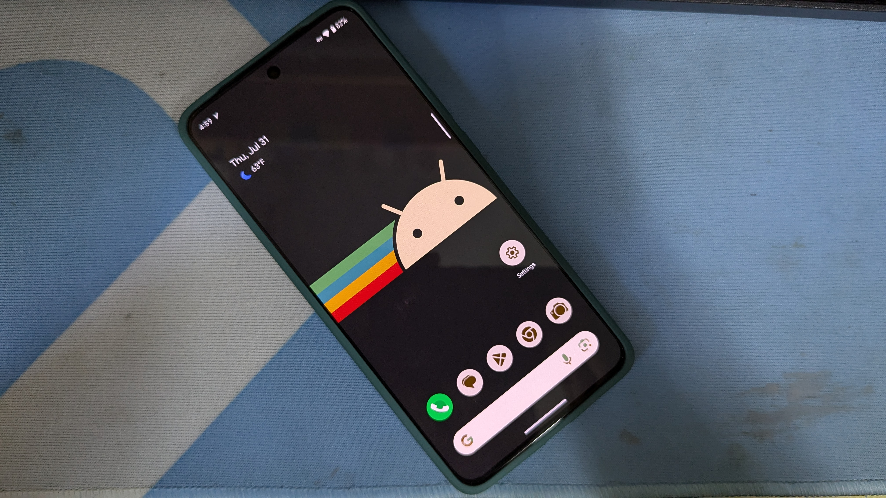
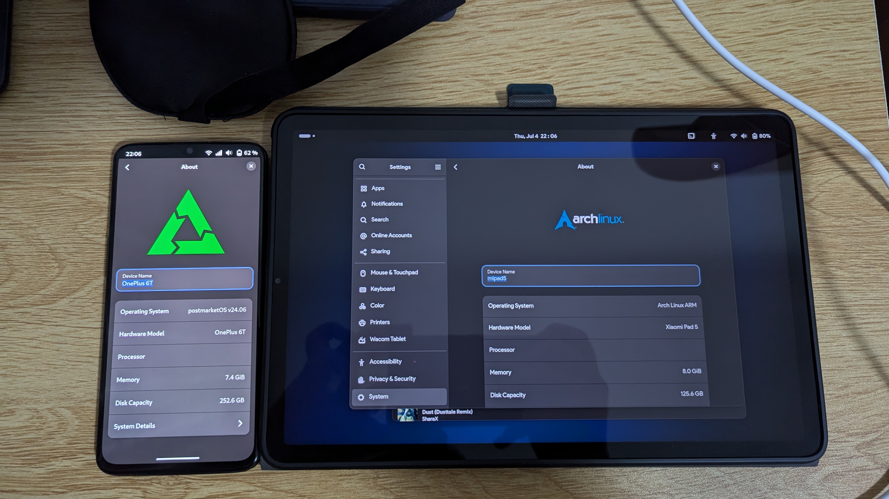

:::note
本文包含部分受版權保護的內容，您在轉載本文章時，請不要包含這些內容。除非您已經事先申請，且版權所有者已同意授權。 
受版權保護的內容：

- "OnePlus 6T at the beach" 圖片，EDKPiepaint 版權所有；
- 《刷機進行時》 歌詞，EDKPiepaint 版權所有。

如有疑問，請洽版權所有者。
:::

<iframe width="560" height="315" src="https://www.youtube.com/embed/n6GVaJL_eeY?si=T-7F7bfpk5GGeWWw" title="YouTube video player" frameborder="0" allow="accelerometer; autoplay; clipboard-write; encrypted-media; gyroscope; picture-in-picture; web-share" referrerpolicy="strict-origin-when-cross-origin" allowfullscreen></iframe>

# Part 1

你在漆黑的熒幕上 
注視著什麼呢？ 
 
遠處的山崗上 
傳來了松果香[^1] 
 
 
今天也和往常一樣，在痛苦、憂愁中過去 
時間也不知不覺 
從中流逝而過 
 
 
在我的記憶中，這一成不變的世界 
是由專有軟體組成的「圍牆花園」 
 
 
我們一起奔向那自由的彼方 
和專有軟體道過「來日見」後永不再見面 
因爲未發現自由替代，所以與家人失聯 
就這麼記住，第一次逃離「圍牆花園」[^2]的實踐 

 
 

早就 習慣 專有軟體 
（甚至）不理解，什麼是「自由」
 
 
 

# Part 2

我在不知不覺中 
獨自在天臺徘徊 
並幻想着把手機改造自由軟體的未來 
終於有一天，幻想成真 
手機「解鎖」是前提 
鍵入命令，電源鍵確認 
「圍牆花園」，再見！ 
 

 
開機之後，日誌滾動 
早已把我震驚 
想不到初次刷機的過程竟如此順利 
 
 
只是因「專有軟體」摧殘，手機早已「命不久矣」 
當年的刷機少年如今長大成人 
即使黑磚、Crashdump 也沒關係，刷機還是進行式 
如果傷心的話，就再換手機吧 
一切又從頭開始 
 
 
圍牆的 那邊是 自由的 
我終於 找到 棲身之處 
 

# Part 3

手機到家，一切又重新開始 
「解鎖」條件，似乎又提高不少 
長期經歷，（問題）早已熟練應對 
在 Linux 中開懷大笑 

# Ending

我們一起奔向那自由的彼方 
和專有軟體道過「來日見」後永不再見面 
即使不知機理也無所謂啊，只需記住那天 
遙遠的記憶之中，當初的勇敢實踐 
 
 
依靠著 專有 軟體 
只在我 理解 自由 之前 
現在 隱私 已被我 掌控 
來吧，再次開懷大笑 

[^1]:指香港生產搭載 Linux 的手機、平板電腦、筆電等的「PINE64」公司。因爲其 LOGO 爲松果，故稱之為「松果香」。
[^2]:指由 Android 和 iOS 以及其它專有軟體組成的軟體使用環境。這是現在智慧型手機的普遍軟體特徵。