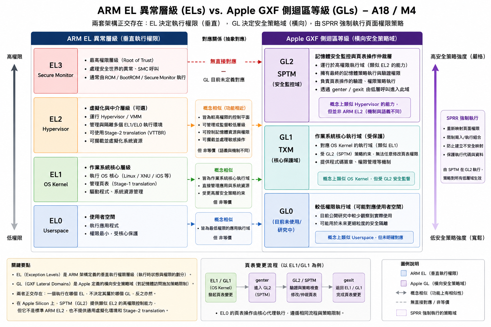
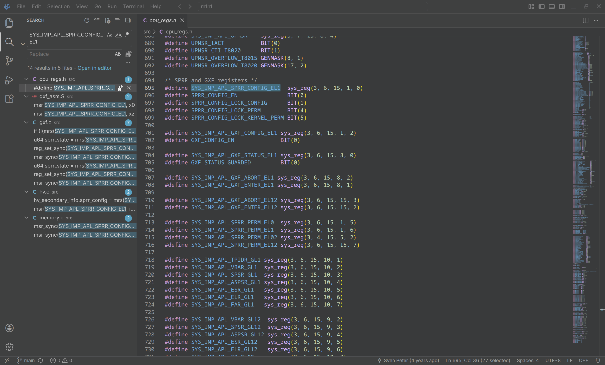

這篇部落格是我在爬取大量資料後，藉助 ChatGPT 和 Claude，以及自己一點淺薄的理解寫出的，連我自己都不知道我在講三小。</br>

:::note
本文根據 [GitHub 「Asahi Neo」專案](https://github.com/rusch95/asahi_neo)文檔改寫，由於我沒有 MacBook Neo 筆電，因此無法對裝置的具體效能，硬體情況發表評價。關於韌體實作的描述會盡力保証最新。</br>
另外，關於「PPL」「SPTM」「GXF 側迴區等級」之類術語的中文寫法爲非官方翻譯，請不要用於論文，學術研究等正式需求。
:::

Apple 爲了力推自家的 MacBook 市場，真的是蠻拼的。直接使用 iPhone 上的 A18 Pro 晶片，配合傳統 MacBook 的主機殼，發佈了「MacBook Neo」針對入門低階市場的筆電。只需要二萬臺幣就可以到手，不知道那些喜歡監獄的「Apple fans」會不會再次應援呢？</br>
</br>
就像 Apple 採用 M 系列晶片的 Mac 一樣，今年3月份發佈的 MacBook Neo 也很快有「Linux on Everything」的愛好者開始研究如何在基於手機平臺 A18 Pro 晶片的裝置上跑 Linux 核心。話說近年來圍繞 Apple Silicon 平臺的專案真的很多呀，從最早的 Asahi Linux 爲 M1，M2，M3 晶片移植主線 Linux 核心，甚至驚動 Linus 本人也購買 MacBook Air 進行核心開發；到致力於在 Apple Silicon 平臺上跑起 Windows on Arm 或者 OpenBSD 的 NT for Apple Silicon (NTASP，舊稱 AppleWoA)專案（使用 `m1n1` fork 和 Microsoft Project MU UEFI 韌體）；再就是現在的「Asahi Neo」專案，這才是我所希望看到的80年代的駭客精神，也正像我講的「黑蘋果社區中貢獻良多的開發者們」那樣，爲解放本就屬於我們的裝置所努力。</br>

# MacBook Neo 外觀紹介

從目前網路上的報道來看，MacBook Neo 似乎有點 2000年代 PowerBook 和 iBook 的設計美學。熒幕傳統的外觀，大圓角總會令人不禁想起 2000 年 Apple PowerBook G4 的熒幕設計，也是 LCD 熒幕，只是圓角小了些，並不引人注目。至於鍵盤部分倒是有點像 iBook G3 Snow，如果妳買了銀色機殼的筆電，再把系統桌布換成 Mac OS X 10.1 的桌布，從遠處看和 iBook G3 Snow 真的沒差。

# 移植 Linux 的艱難路

因爲 A18 Pro 晶片的特殊性，目前還停留在逆向階段，主要針對硬體和開機流程進行分析，尚未形成穩定可用的移植方案，但已存在可行的啟動路徑驗證（boot feasibility）。

## 開機流程的變化：SPTM 的加入

Apple 晶片的開機流程與任何常見的 Arm 晶片都不同，採用自家封閉原始碼的 iBoot 韌體，而不是常見的 U-Boot 或者 UEFI。這也使得讓 Linux 核心開機也變得困難，因爲 iBoot 從實作上就被設定爲僅能載入符合 Apple 規範格式與簽章的 kernelcache（Mach-O 格式）。雖然 macOS 也使用設備樹來描述硬體，但 macOS 採用 Apple 自家的「客製化」設備樹 ADT (Apple Device Tree)，與 Linux 的 DTB 不相容. 不過 Asahi Linux 社群爲了解決這一個難題而開發了 `m1n1` 開機載入器，能夠在開機時自動存取 ADT 設備樹，並轉製成被 Linux 支援的 DTB，這樣就可以啓動 Linux 核心。</br>
</br>
隨着 M4 晶片的發佈（還有 A18 Pro 晶片），一種叫 「SPTM (Secure page table monitor，安全頁表監視)」的機制被引入。SPTM 執行在較高的硬體等級（Apple 自定義的 GL2，類似 Arm 的 EL2 等級），必須要經由 iBoot 開機載入後才可以執行其他作業系統，目前沒有辦法 bypass 掉。而之前的 M1, M2, M3 晶片則採用內建於 XNU 核心快取的「PPL（Page Protection Layer，頁表保護）」同樣執行在 GL2 等級，但是 PPL 沒有專門的韌體。SPTM 在 iBoot 啟動流程中被初始化，並作為系統安全執行環境的一部分存在，位於專門的安全空間，受到 SPRR 保護。在這種環境下，SPTM 中的程式碼只能在 GL2 執行，因此任何存在於 EL1 的漏洞不會影響頁表。</br>
不過，macOS 在 A18 Pro 晶片上的開機流程和M系列晶片平臺大致相同，加載 PPL[^1]，SPTM 只會被 iOS 核心加載。據此就會有兩種開機方案：要嘛加載一個自訂的 macOS 核心快取，這樣 iBoot 大概不會載入 SPTM。因爲 Asahi Linux 專案早就逆向了 PPL 的組建，所以比較容易開機，變磚風險也相對低；要嘛加載自訂 iOS 核心快取打開 SPTM，移植難度大，但是可以爲後期改善A18 Pro 晶片 Linux 支援做準備。 </br>

## Apple 風格的「Secure Launch」：XNU Shim

既然 SPTM 的啟用與否取決於所載入的核心快取類型（如 iOS kernelcache），那就可以開發一種開機載入器，把載入器和 XNU 核心快取縫在一起，開機後 iBoot 讀取自訂的核心快取完成打開 SPTM，之後載入 Linux loader 就可以啓動 Linux 核心了。</br>
這也就是 XNU Shim 要實現的，藉由 [Mach-O 啓動協定](https://asahilinux.org/docs/fw/macho-boot-protocol/)，其核心思路並不是取代 boot chain，而是「嵌入」到 XNU 的啟動流程中。在 iBoot 載入自訂 kernelcache 後，系統會正常初始化 XNU，包括 MMU、CPU 狀態以及 PPL（或 SPTM）等安全機制。</br>

```text
SecureROM
  └─► iBoot stage 1 (位於 Nor Flash 快閃記憶體)
        └─► iBoot stage 2 (位於固態硬碟, APFS Preboot)
              └─► kernelcache (非 Apple 的「低安全性」簽章，簡化的自訂 XNU 核心和快取)
                    ├─► [XNU startup] cpu_machine_init → SPTM init calls
                    ├─► [XNU startup] arm_init → 負責 MMU 初始化，而 SPTM 僅對頁表操作進行約束與監控
                    └─► [SHIM INTERCEPT] → Linux loader → Linux 核心啓動
```

這種特製的 shim 會讓 iBoot 認爲自己正在載入合規的 macOS 核心。在 XNU 核心初始化流程中 hook「IOPE（`IOPlatformExpert::start()`）階段」（或者是其他合適的階段），此時 SPTM 和其他底層機制已經初始化。並使用 SPTM API 建立 Linux 核心啓動必須的記憶體空間，準備 `initramfs`，DTB 之類，關閉 SPTM Watchdog，完成跳轉 Linux 核心。概念上類似於高通 「Secure Launch」 在受控環境中啟動 OS，但 Apple 並未提供正式的3方「secure launch」 機制，XNU shim 本質上屬於啟動後接管（post-boot hijack），而非受支援的安全啟動模式。

## A18/M4 晶片上自訂的 GXF 側域模型（GXF lateral domain,GLs）：抽象層級而非 ARM EL 映射

Apple 在 A18/M4 晶片上建立了一套與 ARM EL 模型概念上相似，但並不完全對應的執行域 (execution domain) 架構。這些 GXF（GL0–GL2）層級主要透過 SPRR 機制強制執行記憶體存取權限，而非直接對應 ARM 異常層級。SPRR 是用於強制執行記憶體存取屬性的硬體機制，負責限制不同執行域對 page table 權限的修改能力。</br>
吶，下面的表格就可以清楚地展示 GXF Level 和 ARM ELs 層級之間的關係[^3]:</br>


| GXF 側迴區等級(SPRR 強制)                                           | 與 Arm ELs 異常層級抽象對應    |
| --------------------------------------------------------------------- | -------------------------------- |
| _不適用_                                                            | EL3: Secure monitor            |
| GL2 SPTM (負責頁表操作的驗證與約束，可透過`genter` 從 EL1/EL2 呼叫) | EL2: Hypervisior               |
| GL1 TXM (程式碼簽章，權限管理)                                      | EL1: OS Kernel（作業系統核心） |
| _GL0_                                                               | EL0: Userspace (使用者)        |

**註**：_斜體字_ 表示沒有與 ELs 異常層級抽象對應的 GXF 側迴區等級，或者這一等級目前在公開研究中較少觀察到（甚至沒有）實際使用。</br>

:::note

- GL2（SPTM 所在的安全監控層）在功能上類似於高權限控制平面，但並不等同於 EL2 hypervisor，而是 Apple 自定義的記憶體安全執行層。
- `genter`/ `gexit` 匯編函式是進入與退出 SPTM 管理上下文的介面，而非 ARM EL 層級之間的直接轉換機制。
- SPRR 則負責在硬體層級強制執行 page table 存取屬性，限制不同執行域對記憶體的讀寫與執行權限。
- 針對每次頁表變更，作業系統核心會透過 `genter → GL2 → gexit`的流程呼叫 SPTM 完成頁表變更。
- 顯而易見，Apple 晶片採用 GXF 和常見的 EL 模型，用於保証記憶體安全，讓每個環節的程式執行儘量減少被攻擊可能。
  :::

這是根據表格繪製的對比圖，便於大家理解：



## 關鍵寄存器：GXF / SPRR 控制面的實際語義

在經過粗略檢視 [m1n1 原始碼](https://github.com/AsahiLinux/m1n1)之後，找到了有關 GXF 的「關鍵 CPU 寄存器」，[^2]這些寄存器位於 EL1 可訪問空間，但實際影響 GL2 行為，本質上是一種「受控升權接口（controlled privilege escalation interface）」:</br>




| 寄存器變數                    | 對應系統晶片寄存器(?) | 作用               |  類型    |
| ------------------------------- | -------------------- | -------------------- |-----------|
| `SYS_IMP_APL_SPRR_CONFIG_EL1` | `S3_6_C15_C1_0`    | 打開並配置 SPRR 權限模型         |  控制寄存器 |
| `SYS_IMP_APL_GXF_CONFIG_EL1`  | `S3_6_C15_C1_2`    | 打開 GXF 執行域機制          | 控制寄存器 |
| `SYS_IMP_APL_GXF_ENTER_EL1`   | `S3_6_C15_C8_1`    | GL2 呼叫閘道（`genter` 觸發寄存器），觸發 `genter`，進入 GL2（SPTM） | 呼叫閘道 |
| `SYS_IMP_APL_GXF_STATUS_EL1`  | _不適用_           | 檢視 GXF 等級狀態，回報目前 GL level / context  | 狀態寄存器 |


:::warning
下面講述的寄存器變數與實作基於硬體逆向探索得到，可能存在錯誤。在社群文檔更新之前，本段僅提供參考。
:::
### `SYS_IMP_APL_SPRR_CONFIG_EL1`

這個寄存器是 SPRR（Secure Page Table Restrictions）啟動的核心開關，但實際上它不只是 enable bit，而是：
 - 控制 permission class mapping;
 - 決定 EL1 是否允許直接修改 page table;
 - 強制 W^X（Write XOR Execute）策略
 寄存器被設定後，EL1（或者作業系統核心）不能產生和建立 RWX mapping。一些 PTE Pattern 會被硬體拒絕，類似「寫入攔截機制」。

### `SYS_IMP_APL_GXF_CONFIG_EL1`

負責啟用 GXF execution domain model，其效果包含：</br>

- 啟用 GL0 / GL1 / GL2 的 runtime 區分;
- 啟用與 SPRR 聯動的 access control;
- 允許 genter/gexit 指令生效

如果寄存器沒有啓用，`genter()` 或許會無效，系統變成傳統的 EL 異常等級模型。

### `SYS_IMP_APL_GXF_ENTER_EL1`

這是一個 XNU shim 跳轉 GL2 的「跳板」，寫入寄存器就會完成一次從 EL1 到 GL2 的「跳轉」，完成需要 SPTM 相關的工作。</br>
寫入寄存器的方法有點類似下面的 C 程式碼：
```c
write_sysreg(SYS_IMP_APL_GXF_ENTER_EL1, arg_struct);
```
CPU 保存當前 EL1 context，然後切換到 GL2，SPTM handler 根據傳入的引數進行頁表驗証(Page table validation)，和權限相關的工作。完成後再次返回 EL1. </br>
在 Arm 匯編語言中，不難發現 `m1n1` 對 EL1 至 GL2 的實作[^4]：

```assembly
// 首先執行 gxf_init 進行 GXF 環境準備（此函式省略），SPRR 會早於 GXF 被開啓。

gxf_enter: 
    genter
    ret

_gxf_setup:           // GL2 初始化
    mov sp, x5
    ldr x1, =_gxf_vectors
    ldr x2, =_gxf_exc_sync
    ldr x3, =_gxf_entry
    msr SYS_IMP_APL_VBAR_GL1, x1    // 設定 GL1 exception vector
    msr SYS_IMP_APL_GXF_ABORT_EL1, x2   // GXF 錯誤處理
    msr SYS_IMP_APL_GXF_ENTER_EL1, x3     // 下一次 genter() 的入口

    mrs x4, CurrentEL
    cmp x4, #8
    bne 1f

    msr SYS_IMP_APL_SP_GL12, x6
    msr SYS_IMP_APL_VBAR_GL12, x1
    msr SYS_IMP_APL_GXF_ABORT_EL12, x2
    msr SYS_IMP_APL_GXF_ENTER_EL12, x3

1:
    isb
    gexit

_gxf_entry:
    stp x29, x30, [sp, #-16]!
    stp x23, x24, [sp, #-16]!
    stp x21, x22, [sp, #-16]!
    stp x19, x20, [sp, #-16]!

    // these registers would be overwritten by each exception happening in GL1/2
    // but we need them to gexit correctly again
    mrs x20, SYS_IMP_APL_SPSR_GL1
    mrs x21, SYS_IMP_APL_ASPSR_GL1
    mrs x22, SYS_IMP_APL_ESR_GL1    // 保存 GL1 狀態
    mrs x23, SYS_IMP_APL_ELR_GL1
    mrs x24, SYS_IMP_APL_FAR_GL1

    mov x5, x0
    mov x0, x1
    mov x1, x2
    mov x2, x3
    mov x3, x4

...
// 回復 GL1，使用 gexit 保証沒有洩露
    msr SYS_IMP_APL_SPSR_GL1, x20
    msr SYS_IMP_APL_ASPSR_GL1, x21
    msr SYS_IMP_APL_ESR_GL1, x22
    msr SYS_IMP_APL_ELR_GL1, x23
    msr SYS_IMP_APL_FAR_GL1, x24
...
    isb
    gexit
```
從 `m1n1` 的 `gxf_asm.S` 可以看出，GXF 並不是單純的 privilege level 切換機制，而是一個可編程的 call-gate runtime。EL1 透過設定 `SYS_IMP_APL_GXF_ENTER_EL1` 指向自訂 handler，在首次 genter 時建立 GL2 執行環境（包含 exception vector 與 abort handler）。此後每次 `genter` 都會進入該 handler（如 `_gxf_entry`），由 GL2 保存 GL1 上下文、執行傳入的 callback，並在 `gexit` 後返回。</br>
這種設計使得頁表操作與安全策略不再是單純的核心內部行為，而是轉化為經由 GL2 控制的受監管呼叫，與 SPTM 的設計理念高度一致。
### `SYS_IMP_APL_GXF_STATUS_EL1`
寄存器應該會提供一些指示碼，用於展示當前 GL 等級，有關 SPTM 的錯誤碼一類。</br>
這些寄存器構成了一條由 EL1 通往 GL2（SPTM）的受控呼叫路徑，使得頁表管理從「核心內部操作」轉變為「經由硬體強制驗證的安全服務」，這也是 Apple 在 A18/M4 上強化記憶體安全模型的核心設計。
## SPRR 權限表

即使完成了相關寄存器設定，要讓 Linux 在 MacBook Neo 上穩定運行，XNU shim 仍需處理 SPRR（System Page Protection Register）所定義的記憶體權限約束，並在適當時機透過 SPTM 介面進行頁表操作。</br>

在 `asahi_neo` 專案的逆向分析中，SPRR 權限表被觀察為一個 64-bit 寄存器，其內部由多個位元欄位組成，用於描述不同 page table permission class 對應的存取限制。這些欄位會被 SPTM 設定，用於限制較低權限 execution domain（如 EL1）建立不符合策略的記憶體映射。</br>
`asahi-neo` 專案在探索 MacBook Neo 硬體的過程中得出了關於權限表的發現：</br>

> 64-bit register encoding 16 4-bit nibbles, each mapping one page table permission class to separate EL/GL access rights. SPTM sets this table to prevent EL1 from creating writable+executable mappings in its own domain.

從行為上來看，SPRR 並不是單純的權限映射表，而是一種硬體層級的約束機制（constraint system），其作用是在記憶體存取與權限檢查過程中強制執行頁面屬性限制，確保核心無法繞過既定的安全策略（例如建立同時具備 writable 與 executable 權限的頁面）。</br>

因此，在啟用 SPTM 的系統中，作業系統核心無法直接修改最終的頁表狀態，而必須透過受控的介面（如 `genter` 進入 SPTM 執行上下文）來完成相關操作。XNU shim 在此扮演的角色，是在 Linux 啟動前建立一組符合 SPRR 約束的記憶體佈局，並確保後續頁表操作能夠透過 SPTM 正確執行。</br>

需要注意的是，SPRR 權限表的具體編碼與語義目前仍屬於逆向推測範疇，其行為主要來自觀察與實驗結果，而非官方文件定義。</br>

# 開機之後的黑夜：長路漫漫，仍有萬里之遙

XNU shim 完成了載入 Linux 核心的工作，真正重要的工作才剛剛開始。開機之後，除了 CPU，UART 工作以外，整臺筆電98％的硬體都不工作。因爲 Apple 晶片相對封閉，像是晶片 PCIe 匯流排和 USB 這些對日常使用影響比較大的功能還要逆向韌體才能寫對應的核心驅動程式。還需要解決繪圖卡的硬體加速，雖然 A18 Pro 晶片的效能即使跑採用 `llvmpipe` 的軟體渲染去執行 GUI 程式也不會像放投影片一樣，但是碰到某些對繪圖有要求的程式（GIMP，Kdenlive 之類），有內建繪圖卡硬體加速會比較好，畢竟 Apple 晶片的繪圖卡效能一直都不賴。</br>
但是 Apple 總是想着「特立獨行」，從韌體到軟體從來不會按照 Arm 標準實作。在 Apple 平臺 bring up Linux 要比一般的 Arm 晶片 bring up 困難。</br>
與一般認知不同，Linux 並不是一個「只要 CPU 能執行就可以啟動」的作業系統，它也不可以在烤麪包機上執行。對於 Arm AArch64 架構，Linux kernel 在進入點（entry point）時，對系統狀態有一組明確的前提條件：

> ...Linux 也有「系統要求」，只是這些要求多體現在硬體的底層，大多數人不會留意到而已。

- 核心必須在 EL1（Non-secure）執行（在某些情況下（例如需要設定或管理裝置上的 Hypervisior），Linux 可以在 EL2（例如透過 VHE 模式）執行）；
- MMU 必須已經啟用，且至少具備基本的記憶體映射；
- 必須提供有效的 Device Tree（DTB），描述硬體配置；
- Kernel image 必須位於可存取的記憶體區域；
- 中斷控制器(Arm GIC)與系統計時器需處於可用狀態；


然而，在 A18 Pro / M4 晶片上，這些「標準 ARM 假設」不再完全成立。最顯而易見的就是 Apple 晶片不採用標準的 Arm GIC，改用自家的 AIC 作爲中斷控制器硬體實作。因此在很長一段時間裏，Apple 的筆電即使有了 U-Boot 支援，除了 Linux，OpenBSD 之外，很少有其他系統可用。也是 Apple 筆電難以支援 Windows on Arm 的其中一個原因。由於 SPTM（GL2）與 SPRR 的存在：</br>

 - 所有 page table 修改必須透過 `genter` → GL2 → `gexit` 進行;
 - 作業系統核心（EL1 / GL1）無法直接建立任意記憶體映射;
 - SPRR 會強制執行 W^X（Write XOR Execute）等安全策略;

這使得 Linux kernel 在設計上「假設自己擁有完整記憶體控制權」的前提被打破。XNU shim 的角色因此不僅是啟動載入器，更需要作為一個頁表操作代理層（page table mediation layer），在 Linux 與 SPTM 之間轉譯記憶體管理操作。更具體地說，Linux 在啟動早期會自行建立新的 page tables，並切換 [TTBR寄存器](https://arm-software.github.io/CMSIS_5/Core_A/html/group__CMSIS__TTBR.html)來建立 kernel 的虛擬位址空間[^5]。然而，在 SPTM 的約束下，這類操作無法直接完成。換句話說，Linux 並不是單純「不能做這些操作」，而是它原本假設這些操作是本地且立即生效的（local and authoritative），這些操作幾乎適用於大多數 Arm 晶片 (例如 Snapdragon, Rockchip, Amlogic)。 但在 Apple 平臺上，這些操作變成了需要經過外部驗證的請求（validated operations）。</br>
 - 直接寫入 TTBR 或修改 PTE 可能被硬體拒絕；
 - 建立暫時性的 RWX mapping（常見於 early boot）會違反 SPRR 策略；
 - 未經驗證的記憶體屬性變更可能導致 synchronous exception。


不難看到，想要在 Apple silicon 晶片上跑起主線 Linux 核心，開發者們需要付出的努力與面對的問題，遠遠超出一般 Arm 平臺上的 Linux bring-up。這不只是驅動程式的補齊，更是對整個系統抽象的重新建構：在一個原本假設「作業系統擁有最終控制權」的世界裡，引入一層由硬體強制執行的安全邊界，並設法在不破壞 Linux 設計哲學的前提下，利用這種專有機制，重新在其之上構建一個「自由」的系統世界。</br>

今天我們能夠在 Apple Silicon 的 Mac 上使用 Linux 發行版，運行各種自由軟體，甚至在某些場景下獲得優於原生系統的效能，並不是理所當然的結果。這背後，是開發者長時間對封閉硬體與韌體的逆向分析，是一次次在黑箱中摸索邊界的嘗試，也是將「不可行」轉化為「可行」的工程實踐。</br>
他們在這條路上「曝霜露，斬荊棘」，並不是為了證明某個平台能否運行某個系統，而是為了讓使用者重新擁有選擇的權利。當越來越多的元件被理解、被實作、被上游接受，這條原本曲折狹窄的小路，也終將逐漸拓寬。Apple Silicon 平臺，這個曾經被 Linus Torvalds 認為「幾乎不可能」支援 Linux 的環境，也在無數開發者的努力下，一步步被改寫。</br>

> Oh, I’ve seen the trouble more than anyone can bear,</br>
> But I still have joy more than failure I’ve met </br>
> Still not done, I’m only halfway there </br>
> I’m a million miles ahead of where I from, but I still have another million miles to go... </br>
>  -------- Adapted from _[MTP Trouble -- A FOSS parody of Trouble by Avicii](https://blog.cloudflare88.eu.org/posts/mtp-trouble/)_

或許對多數人而言，這只是多了一個可以在 Mac 上使用 Linux 的選項，並沒有什麼可以使用的「商業價值」；但在更深的層面上，這意味著：即使在最封閉的系統之中，仍然存在著被理解、被重建，乃至被重新定義的可能。</br>
現在，「Asahi Neo」專案已經走出了千里之遙。但這條路仍然漫長，而它也已經被證明是可以走通的。

[^1]: 目前爲猜測，具體實作仍在逆向分析。
    
[^2]: [cpu_regs.h -- m1n1 by Asahi Linux at GitHub](https://github.com/AsahiLinux/m1n1/blob/main/src/cpu_regs.h)
    
[^3]: [Privilege Levels on A18 Pro / M4 -- asahi_neo by rusch95 at GitHub](https://github.com/rusch95/asahi_neo/blob/main/ARCHITECTURE.md)
[^4]: [gxf_asm.S -- m1n1 by Asahi Linux at GitHub](https://github.com/AsahiLinux/m1n1/blob/main/src/gxf_asm.S)
[^5]: [ARM Linux kernel translation base -- Stack Overflow](https://stackoverflow.com/questions/14460752/linux-kernel-arm-translation-table-base-ttb0-and-ttb1)