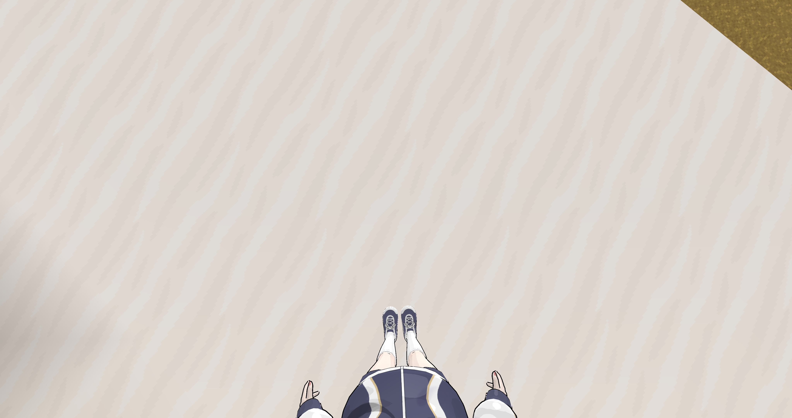
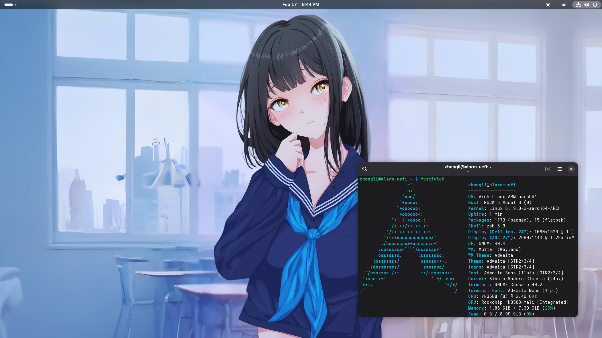
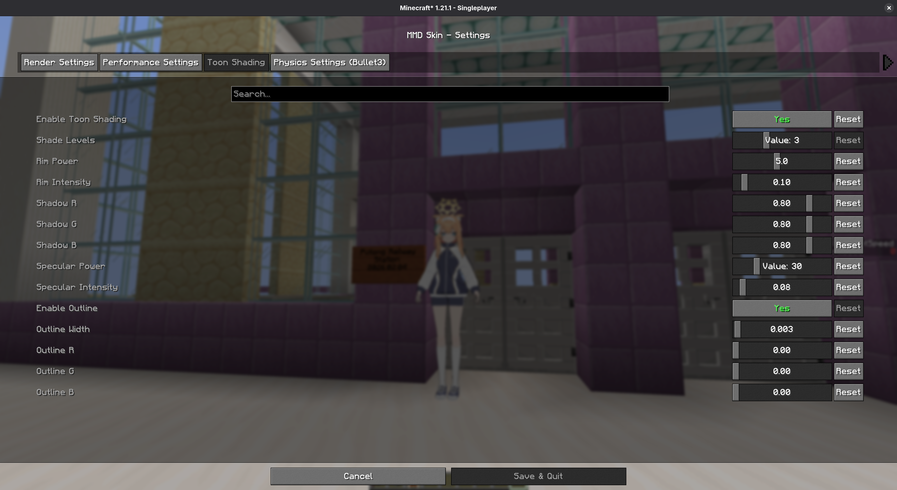
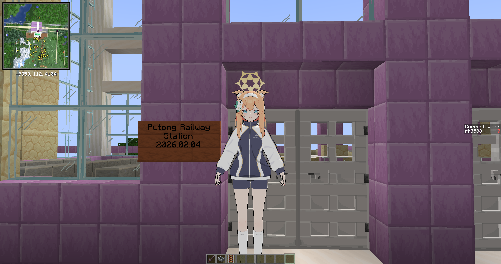
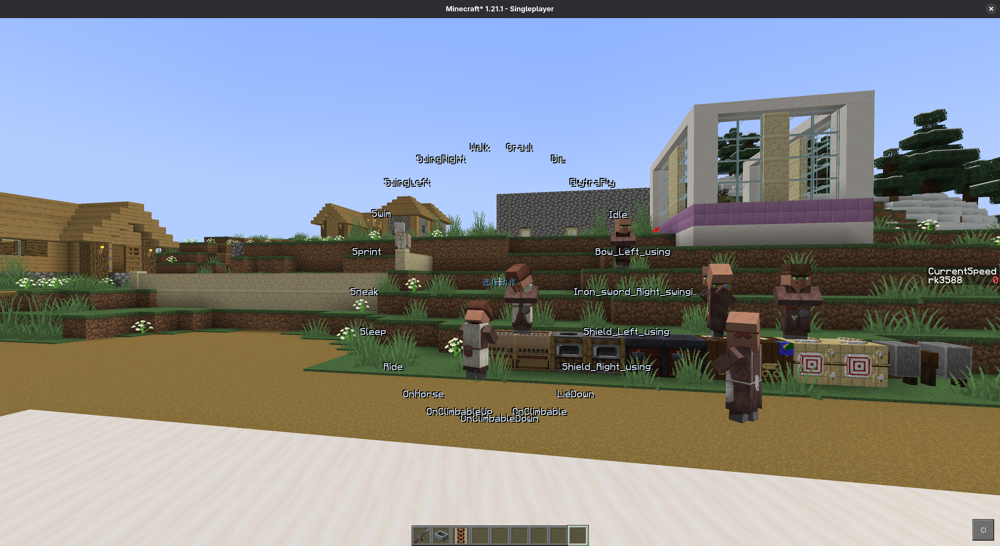
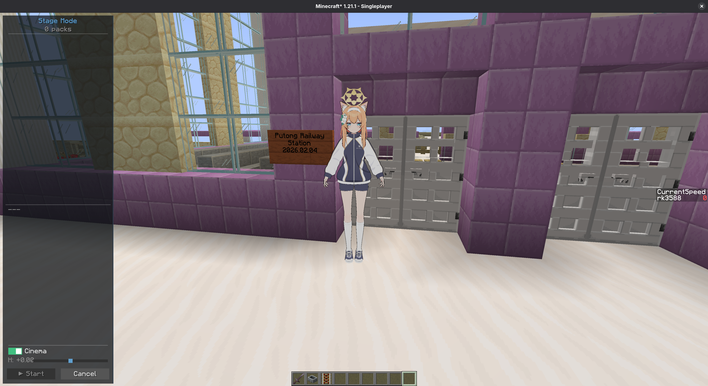

:::note
本文包含部分受版權保護的內容，您在轉載本文章時，請不要包含這些內容。除非您已經事先申請，且版權所有者已同意授權。</br>
受版權保護的內容：

- [Iochi Mari](https://3d.nicovideo.jp/works/td91904) （伊落瑪麗）人物模型，Nexon Co., Ltd 版權所有

:::

把動漫人物模型放到 Minecraft 中並藉由玩家控制的模組很早就有了（比如 CustomSteve 之類），但是很多模組要麼版本太舊，新版本根本不相容，要麼就是私有軟體，常常做一些見不得人的勾當。</br>
嗯，我知道「當個創世神」自從1.16以後在遊戲中內嵌了追蹤程式，收集使用者隱私。而且麥塊本身就是不開源的專有軟體，但是你很難在 Linux 上找到可以跨平臺協作的遊戲了。</br>
今天 Piepaint 要來介紹的就是這樣一款開放原始碼的麥塊模組，它可以把你最喜歡的動漫人物用於替換遊戲裏原本方方正正的 Steve ，同時還可以實現自訂人物動作，能夠更好豐富你的遊戲體驗。</br>
放上實際體驗效果圖片：




# 下載與安裝

模組本身是遵循 MIT 協議開放原始碼的，到 GitHub 或者 [Modrinth](https://modrinth.com/mod/mmdskin) 上去下載即可。截至目前開發者只釋出了針對 Minecraft 1.21.1 的檔案下載，支援 Forge，Fabric 和 NeoForge。根據自己的偏好下載即可。

::github{repo="shiroha-233/MC-MMD-rust"}

下載完後，把 `.jar` 檔案丟到遊戲實例的 `mods` 資料夾下，然後啓動 Minecraft 即可。</br>

這是我的測試實作，CPU 是相容 Arm V8 指令集的 RK3588 處理器，採用內建 Mali G610 繪圖卡，是一臺標準的「嵌入式系統」：



# 基本用法

遊戲啓動後，會在自己的工作目錄下建立名爲 `3d-skin` 的資料夾，並同時建立 `EntityPlayer` `DefaultAnim` `CustomAnim` `CustomAnim` `DefaultMorph` 和 `CustomMorph` 六個資料夾。這六個資料夾的用途如下：</br>

```yaml
.minecraft/
└── 3d-skin/
    ├── EntityPlayer/      # 使用者的模型
    │   ├── ModelA/        # MMD 人物模型資料夾
    │   │   ├── model.pmx  # 模型本身 (.pmx/.pmd)
    │   │   ├── *.png      # 紋理
    │   │   ├── dance.vmd  # 模型動作（非必要）
    │   │   └── smile.vpd  # 模型場景（非必要）
    │   └── ModelB/
    │       └── ...
    ├── DefaultAnim/       # 模組內建動作
    ├── CustomAnim/        # 使用者自訂動作
    ├── DefaultMorph/      # 內建場景
    └── CustomMorph/       # 自訂場景
```

之後，我們需要下載人物模型，通常會是 `.pmx` 檔案。將模型解壓縮後，放到 `EntityPlayer` 資料夾中。如果模型有紋理或者其他材質的話，也要把它放到資料夾下（這部分通常會是 `.png` 或者 `.tga` 格式的繪圖檔）。</br>
進入世界後，按住左 Alt 鍵，就可以看到 Mod 的內建設定。將滑鼠遊標指向對應的選項後，按一下左鍵再鬆開 Alt 鍵，就可以打開對應的設定項目。


選擇右上角的「Model switch」選項，模組就會讀取你放在資料夾下的人物模型，此時選擇你喜歡的模型，然後按下「Done」按鈕（模組本身僅支援簡體中文和英語）。


如果模型看着有顆粒感，或是畫面比較突兀，嘗試調整一下「渲染設定」吧！在設定裏啓用「tone shading」 和「Enable Outline」來打開三渲二和輪廓渲染，（我個人還會打開「第一人稱視角」來增強遊戲主觀視點）即可獲得媲美「原神」和「終末地」的遊戲體驗（？）</br>





通過「Action select」選單還可以設定動作~ 選擇 「Lie Down」就可以讓人物趴下來，方便進行後入和其他體位（嘿嘿嘿~）




通過「Expression select」選單也可以爲你的人物更換表情，也可以點擊右下的「+」按鈕來新增表情（啊嘿顏最好了~）


也可以控制人物的材質可見性，來決定顯示的內容！（野外露出也可以）


最後，你可以配置使用舞臺，匯入你的舞臺設定，讓人物跳舞給你看！



# 使用體驗

模組本身還處於早期階段，能夠做到這種程度已經很不容易了，我個人覺得目前沒有什麼問題，一些嚴重的 bug 也沒有遇到。唯一的問題是第一人稱的視角似乎還需要改進，視野總是高高的，很容易產生要撞到頭的感覺。另外預設的走路動作又有些慢了點.