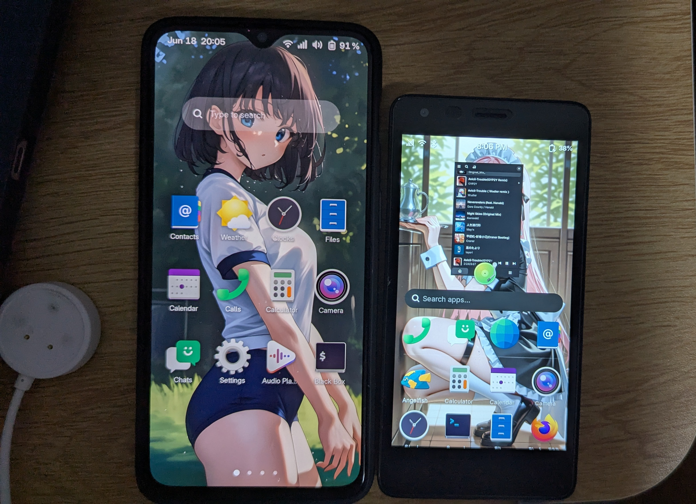

一份個人簡歷，用於記錄我從2020年來的玩機歷程。 

# Coolpad Cool 1 ——  刷機、修改系統調度
2021年2月 ——  2021年8月  
- 將父親留下的舊手機 Coolpad Cool 1 （酷派酷樂1）通過9008模式刷入TWRP第三方Rec，之後在XDA、4PDA論壇上搜尋第三方刷機包  
跟隨指南成功刷入Pixel Experience Android 11 系統，並通過magisk 來取得Root權限，之後使用Scene 4 來修改系統調度，使得這個搭載驍龍652 SoC的低端手機能夠以60幀高畫質流暢玩《狂野飆車 9》，並寫了相關教程發布於酷安； 
- 經過多種大型遊戲測試，發現使用YC調度配合Scene 4 的「場景智能切換」功能，大部分遊戲可以獲得60幀的流暢體驗。同時也將整機功耗控制在理想的範圍，延長了電池續航。

# Google Pixel 4 XL ——  刷機、Xposed
2021年6月——2024年2月28日  
- 由於Coolpad Cool 1 所搭載的驍龍652已經無法滿足我的日常需求，以及國內軟體對於低端機的「負面優化」，在我的再三請求下，我的手機得以升級。作為2019年的谷歌旗艦機型，它採用驍龍855 SoC、支援3D人臉解鎖和Soli雷達，但是在到手5個月後，谷歌對於Pixel 4 XL的系統支援便正式終止了； 
- 由於谷歌原廠的奇葩調度，使得這個855在滾動屏幕時就會滿載，我便將其解鎖，刷入 Lineage OS 19.1 （基於 Android 12L），雖然CPU調度有所改善，但是在運行國內軟體時，大量的廣告使得它「力不從心」。卡頓和掉幀頻繁發生。考慮到大多數軟體已經可以檢測magisk來判斷手機是否被Root，我將Root方案改為當時方興未艾的KernelSU方案。但是，我的手機採用的4.14核心不滿足谷歌的「GKI（通用內核）2.0」規範，我只能根據KernelSU官方的編譯指南自行編譯支援KernelSU的內核。在成功開機後，因為Xposed需要Magisk 的 Zygisk 功能，我便從GitHub搜尋到「Zygisk on KernelSU」模塊，刷入後，再安裝LSPosed（Xposed的一個分支，現已停止開源），安裝 ADClose Xposed 模組，成功將諸如酷安、嗶哩嗶哩等國內軟體無法關閉的開屏廣告、應用內廣告全部關閉，與此同時，應用的卡頓、掉幀等現象明顯減輕。

# 小米平板5 ——  主線Linux核心、Windows 11
2023年至今  

- 我知道你們在想什麼，平板和手機不能運行 Windows 對不對？由於我的桌機過於老舊，我急需一個可以運行 Windows 的設備，所以我成功說服我的父親，我便因此有了我的第一台平板。在解鎖後，我便一直尋找運行Windows的方案。通過GitHub找到了一個叫 [Renegade Project](https://renegade-project.tech/en/home) 的專案，它旨在為所有搭載高通驍龍的SoC的手機提供完整的UEFI支持。但是，為了能夠緊跟上游，我便根據官方的安裝指南和編譯指南，以及合適的驅動程序後，成功得到了一個全部功能運行正常的Windows 11環境； 
- 在接觸了自由軟體和GNU哲學後，我便將研究目標轉向了主線Linux。隨著主線核心的不斷完善，我便根據教程編譯了小米平板5的主線核心，並安裝了 Arch Linux ARM作為我的主力系統，並將相關教程以英語寫成，發布在我的網站上。

# MacBook Air M1 —— 移植PostmarketOS
2022年至今  
- 根據 PostmarketOS 官方的移植教程，我利用Asahi Linux 為 Apple Silicon SoC移植的主線Linux核心在MacBook Air 上移植成功並開機。且[我的移植現已併入上游GitLab存儲庫](https://gitlab.postmarketos.org/postmarketOS/pmaports/-/merge_requests/5913)。還被[其他開發者進行改善](https://gitlab.postmarketos.org/postmarketOS/pmaports/-/merge_requests/6518)。

# 華為暢想9 Plus ——  解鎖、刷機、修改調度
2024年—— 2025年2月  

- 隨著父親的手機再一次更新，原來的華為暢想9 Plus 便理所應當的成為了我的玩具，由於鴻蒙系統過於卡頓，以及大量的系統動畫缺失，我將其降級為EMUI 9.1，但是卡頓並未有改善； 
- 麒麟710晶片的手機沒有解鎖碼，且華為於2018年關閉了解鎖通道，但通過HCU解鎖工具以及相關教程，我還是成功解開了暢想9 Plus 的BL鎖； 
- 為了擺脫EMUI的卡頓，我刷入了基於Android 14 的 GSI（通用系統鏡像），但是由於缺少了華為的私有技術，刷入GSI的暢想9 Plus 在使用YC調度、修改了SWAP和ZRAM為8GB，且將GPU頻率調整為826MHz後，獲得了比鴻蒙系統都要流暢的體驗。 

# Rock 5B ——  編譯伺服器
2024年至今  

- 作為開發板的它，天生就具有低功耗、高性能的優點，這也是ARM——一種RISC（精簡指令集）計算機的好處，便於開發；
- 因為其所使用的RK3588處理器具有主線Linux核心支援，我便將其改造為編譯小米平板5的Armbian Linux發行版的自動化伺服器，免除了設置交叉編譯工具鏈和人工同步上游版本再編譯的煩惱。

# 一加6T ——  搭建個人部落格、Linux手機

2024年至今  

- 作為發布於2018年，搭載驍龍845的手機，其性能非常強悍。即使是在今日，搭載主線6.15核心的它，在一眾Linux發行版加持下的它，也因此有了多種用途；  
- 因為其功耗低，價格低廉，我便將其用於搭建我的個人博客，使用Astro框架構建，用於記錄我的玩機歷程。由於電池安全問題，這個職責被隨後的MTP845工程機取代。 

# 高通驍龍MTP845工程機 ——  NAS、個人部落格
2025年2月至今  

- 由於845的主線核心不支援Type-C角色切換，以及電池供電導致的安全問題，一個可以使用直流電源供電的手機或其類似物就成為了我的急需； 
- 在購買MTP845工程機後，我便根據高通的官方WP平台構建指南，在MTP845上成功運行了Windows 11 ARM版，由於工程機CPU的eFUSE未熔斷，所以我通過[slbounce](https://github.com/TravMurav/slbounce)成功啟用了EL2模式，使得我可以安裝Docker和Nextcloud用於搭建NAS和個人博客，並使用高通的Debug Board 直接供電，避免了安全問題。 

# 紅米2 ——  Linux 手機
2025年6月15日至今

- 因為紅米2出廠搭載32位的Android 4.4，在今天已經毫無用處，加上默認的8GB eMMC容量太小，我便開始研究如何增加可用空間以及運行64位系統的方法；
- 通過搜尋發現lk2nd支援SD卡啟動，於是我便安裝了PostmarketOS，將其安裝到一張256GB的SD卡上，將其插入紅米2的SD卡槽內，刷入lk2nd，重新啟動，通過手動焊接TTL後發現系統啟動正常。

