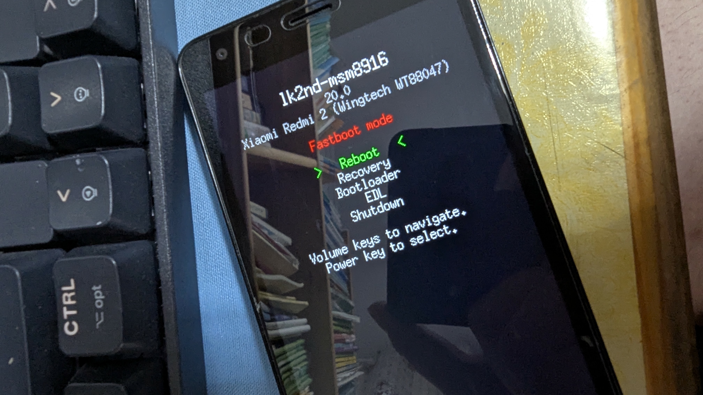
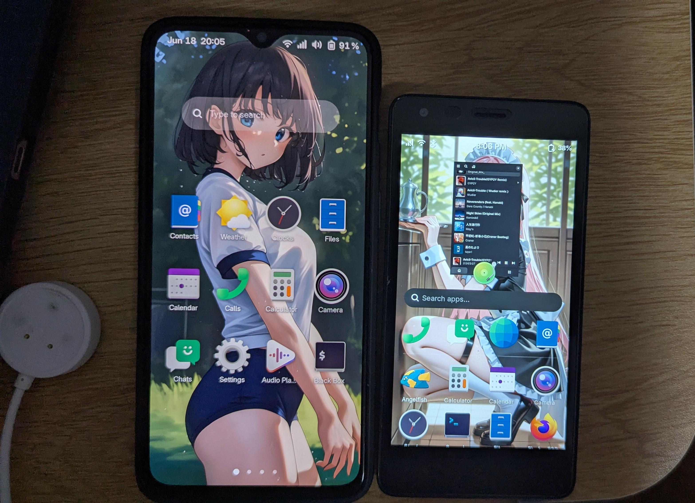
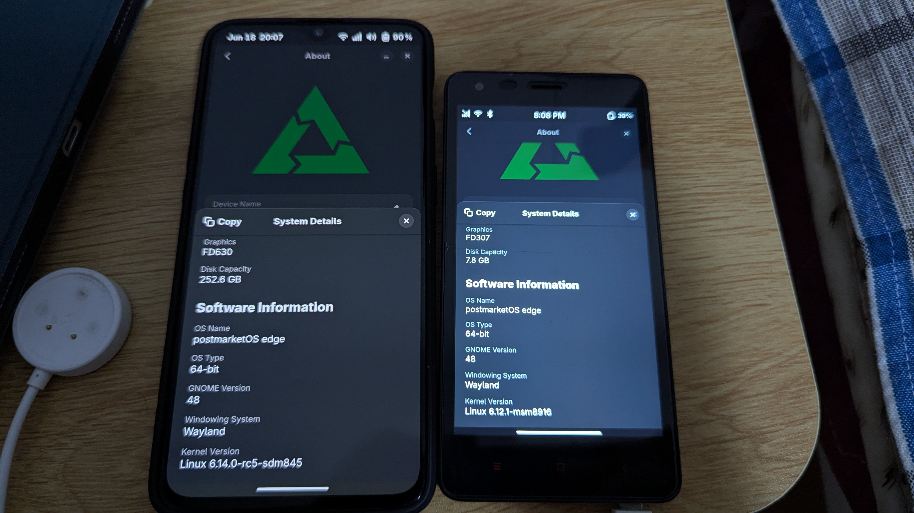

一臺發佈於2015年的手機，在手機性能飛速發展的2025年，這個10年前的產品，竟然還沒有被人遺忘...

# 硬體配置
從硬體來講，這個雖然叫“紅米2”[^1]，實際上並不是小米設計和生產的手機。搭載了高通驍龍410處理器，1GB的記憶體和8GB的內部存儲。以及4.7寸熒幕，這樣的硬體在上市的時候就是一個低階手機，與現在的驍龍 8Gen 3之類的晶片相比完全是被吊着打。可以毫不客氣地講，作爲手機，紅米2在今天早已沒有了實用價值。其搭載的32位元 Android 5.1 作業系統不僅無法安裝大多數軟體，而且還會面臨潛在的安全威脅，比如[2038年問題](https://zh.wikipedia.org/zh-hans/2038%E5%B9%B4%E9%97%AE%E9%A2%98)。</br>
但是，SoC本身是一個四核心，時脈達1.4GHz的64位元CPU，只是Bootloader和作業系統是32位元的。因此，我們還是有辦法讓這個10年的“老傢伙”執行最新的軟體的。

# 硬體雖弱，軟實力卻很強
紅米 2 有非常豐富的第三方 Android 刷機包，出廠搭載 Android 4.4 的它能刷到 Android 12 的 Lineage OS 19.1 （3.10核心）。當它的性能已經不足以支撐在 Android 中多做什麼時，它還可以運行接近最新主線的 Linux Kernel 和 Debian, Ubuntu 等正兒八經的 Linux 發行版。可能是得益於高通官方基於 MSM8916 推出了支援 Ubuntu Linux 的 DragonBoard 410c 開發板，也得益於後續開源社群的努力，MSM8916 的主線核心功能已經比較完善，UART、USB、內部存儲 (eMMC/SD 卡)、WiFi 與藍牙、GPU、顯示 (需要 panel 驅動)、聲音、基於 GPIO 的按鍵、震動、數據機 (SMS,撥打電話, 行動數據) 等都得到了支援。
有了非常完善的主線核心支援之後，紅米2作爲一個廉價嵌入式 Linux 平臺，可以輕鬆應對一部分專業用途。有很多 Youtuber 還發佈了講紅米2改裝爲 3D 列印的上位機的方法，甚至還有人把同樣基於驍龍410 SoC 的可攜式 Wi-Fi 也改裝 Linux 甚至是 Openwrt，將它變爲真正的“路由器”。

# 安裝過程
根據 Postmarket OS 維基，一步步地安裝 ```pmbootstrap``` ，在執行 ```pmbootstrap init``` 時，選擇機型爲紅米2對應的“wt88047”，我使用的是 ```edge``` 分支。具體日誌如下：
```bash
pmbootstrap init                         
[21:40:29] Location of the 'work' path. Multiple chroots (native, device arch, device rootfs) will be created in there.
[21:40:29] Work path [/home/edkpiepaint/.local/var/pmbootstrap]: 
[21:40:31] Location of the 'pmaports' path, containing package definitions.
[21:40:31] pmaports path [/home/edkpiepaint/.local/var/pmbootstrap/cache_git/pmaports]: 
[21:40:33] Choose the postmarketOS release channel.
[21:40:33] Available (12):
[21:40:33] * edge: Rolling release / Most devices / Occasional breakage: https://postmarketos.org/edge
[21:40:33] * v25.06: Upcoming stable release (DO NOT USE)
[21:40:33] * v24.12: Latest release / Recommended for best stability
[21:40:33] Channel [edge]: 
[21:40:35] NOTE: pmaports is on master branch, copying git hooks.
[21:40:35] Choose your target device vendor (either an existing one, or a new one for porting).
[21:40:35] Available vendors (95): acer, alcatel, amazon, amediatech, amlogic, apple, ark, arrow, asus, ayn, bananapi, barnesnoble, beelink, bq, clockworkpi, cubietech, cutiepi, dongshanpi, epson, essential, fairphone, finepower, fly, fxtec, generic, goclever, google, gp, hisense, htc, huawei, inet, infocus, jolla, khadas, klipad, kobo, lark, leeco, lenovo, lg, librecomputer, linksys, mangopi, medion, meizu, microsoft, mobvoi, motorola, nextbit, nobby, nokia, nvidia, odroid, oneplus, oppo, ouya, pine64, planet, pocketbook, postmarketos, powkiddy, purism, qcom, qemu, qualcomm, radxa, raspberry, realme, samsung, semc, sharp, shift, sipeed, solidrun, sony, sourceparts, surftab, t2m, thundercomm, tokio, tolino, trekstor, valve, vernee, vivo, volla, wexler, wiko, wileyfox, xiaomi, xunlong, yu, zte, zuk
[21:40:35] Vendor [xiaomi]: 
[21:40:36] Devices are categorised as follows, from best to worst:
* Main: ports where mostly everything works.
* Community: often mostly usable, but may lack important functionality.
* Testing: anything from "just boots in some sense" to almost fully functioning ports.
* Downstream: ports that use a downstream kernel — very limited functionality. Not recommended.

Available devices by codename (40): aries (downstream), armani (downstream), begonia (downstream), beryllium (community), cactus (downstream), cancro (downstream), cepheus (testing), cereus (downstream), clover (testing), dior (downstream), elish (community), equuleus (testing), ferrari (downstream), fire (downstream), fog (downstream), gemini (testing), ido (downstream), jasmine_sprout (testing), laurel (testing), lavender (testing), libra (downstream), merlin (downstream), miatoll (testing), monet (downstream), nabu (testing), natrium (testing), olive (downstream), pine (downstream), platina (testing), polaris (testing), raphael (testing), rosemary-downstream (downstream), sagit (testing), scorpio (community), spes (downstream), tulip (testing), vayu (testing), whyred (testing), willow (downstream), wt88047 (community)
[21:40:36] Device codename [wt88047]:           #根據實際需要選擇是否要保留數據機相關的功能，可以節省大約80MiB的記憶體
[21:40:37] Available providers for soc-qcom-msm8916-rproc (3):
[21:40:37] * all: Enable all remote processors (audio goes through modem) (default)
[21:40:37] * no-modem: Disable only modem (audio bypasses modem, ~80 MiB more RAM)
[21:40:37] * none: Disable all remote processors (no WiFi/BT/modem, ~90 MiB more RAM)
[21:40:37] Provider [all]: 
[21:40:39] Username [litepiepaint]: 
[21:40:40] Available providers for postmarketos-base-ui-wifi (2):
[21:40:40] * wpa_supplicant: Use wpa_supplicant as the WiFi backend. (default)
[21:40:40] * iwd: Use iwd as the WiFi backend (but may not work with all devices)
[21:40:40] Provider [default]: 
[21:40:51] Available user interfaces (28): 
[21:40:51] * none: Bare minimum OS image for testing and manual customization. The "console" UI should be selected if a graphical UI is not desired.
[21:40:51] * asteroid: (Wayland) Smartwatch UI from AsteroidOS
[21:40:51] * bananui: (Wayland) Keypad controlled UI for feature phones
[21:40:51] * buffyboard: Plain framebuffer console with modern touchscreen keyboard support
[21:40:51] * cage: (Wayland) Kiosk WM
[21:40:51] * console: Console environment, with no graphical/touch UI
[21:40:51] * cosmic: COSMIC Desktop Environment from System76
[21:40:51] * fbkeyboard: Plain framebuffer console with touchscreen keyboard support
[21:40:51] * gnome: (Wayland) Gnome Shell
[21:40:51] * gnome-mobile: (Wayland) Gnome Shell patched to adapt better to phones (Experimental)
[21:40:51] * i3wm: (X11) Tiling WM (keyboard required)
[21:40:51] * kodi: (GBM) 10-foot UI useful on TV's
[21:40:51] * lomiri: (Wayland) The convergent desktop environment (Experimental)
[21:40:51] * lxqt: (X11) Lightweight Qt Desktop Environment (stylus recommended)
[21:40:51] * mate: (X11) MATE Desktop Environment, fork of GNOME2 (stylus recommended)
[21:40:51] * mediaberry: (Wayland) An open platform for streaming boxes and smart TVs (WIP)
[21:40:51] * moonlight: (Wayland) Open Source PC client for NVIDIA GameStream, as used by the NVIDIA Shield
[21:40:51] * niri: (Wayland) A scrollable-tiling compositor (DOES NOT RUN WITHOUT HW ACCELERATION!)
[21:40:51] * openbox: (X11) A highly configurable and lightweight X11 window manager (keyboard required)
[21:40:51] * os-installer: UI for installing postmarketOS
[21:40:51] * phosh: (Wayland) Mobile UI initially developed for the Librem 5
[21:40:51] * plasma-desktop: (X11/Wayland) KDE Desktop Environment (works well with tablets)
[21:40:51] * plasma-mobile: (Wayland) Mobile variant of KDE Plasma (does not run without hardware acceleration)
[21:40:51] * shelli: Plain console with touchscreen gesture support
[21:40:51] * sway: (Wayland) Tiling WM, drop-in replacement for i3wm (DOES NOT RUN WITHOUT HW ACCELERATION!)
[21:40:51] * sxmo-de-dwm: Simple Mobile: Mobile environment based on SXMO and running on dwm
[21:40:51] * sxmo-de-sway: Simple Mobile: Mobile environment based on SXMO and running on sway
[21:40:51] * weston: (Wayland) Reference compositor (demo, not a phone interface)
[21:40:51] * xfce4: (X11) Lightweight desktop (stylus recommended)
[21:40:51] User interface [plasma-mobile]: 
[21:40:52] This user interface has an extra package: Meta package for additional Plasma mobile apps
[21:40:52] Enable this package? (y/n) [y]: 
[21:40:53] Based on your UI selection, 'default' will result in installing systemd.
[21:40:53] Install systemd? (default/always/never) [default]:   #如果啓動異常，在此處鍵入“never”來改爲使用 OpenRC 來初始化。
[21:40:54] Additional options: extra free space: 0 MB, boot partition size: 256 MB, parallel jobs: 2, ccache per arch: 5G, sudo timer: False, mirror: https://mirrors.aliyun.com/postmarketOS/
[21:40:54] Change them? (y/n) [n]: 
[21:40:54] Additional packages that will be installed to rootfs. Specify them in a comma separated list (e.g.: vim,file) or "none"
[21:40:54] Extra packages [nano]: 
[21:40:55] Your host timezone: Asia/Singapore    #設定時區
[21:40:55] Use this timezone instead of GMT? (y/n) [y]: 
[21:40:56] Choose your preferred locale, like e.g. en_US. Only UTF-8 is supported, it gets appended automatically. Use tab-completion if needed.
[21:40:56] Locale [en_US]: 
[21:40:56] Device hostname (short form, e.g. 'foo') [xiaomi-wt88047]:       #設定主機名稱 
[21:40:57] NOTE: No SSH public keys found to copy to the device.
[21:40:57] See https://postmarketos.org/ssh-key-glob for more information.
[21:40:57] After pmaports are changed, the binary packages may be outdated. If you want to install postmarketOS without changes, reply 'n' for a faster installation.
[21:40:57] Build outdated packages during 'pmbootstrap install'? (y/n) [y]: 
[21:40:58] Zap existing chroots to apply configuration? (y/n) [y]: 
[21:41:01] DONE!
```
需要注意的是，因爲驍龍410設備的記憶體都很小，因此官方提供了停用數據機、Wi-Fi 和藍牙的相關軟體，這樣可以爲手機節約80～90MiB的記憶體。還有最新的 ```edge``` 分支的GPU驅動有問題，使用 Plasma 桌面會有過於好笑的圖形BUG。</br>

刷機過程就平平無奇了。需要注意的是紅米2因爲 SoC 沒有熔斷，因此不需要解開鎖，在更新到最新的 [Android 5.1 ](https://xiaomirom.com/en/rom/redmi-2-redmi-2-pro-wt88047-global-fastboot-recovery-rom/)之後，還需要刷入 ```lk2nd``` 來充當引導 Linux 的中間層，避免原廠 Bootloader 向主線核心傳遞不必要的核心引數。

::github{repo="msm8916-mainline/lk2nd"}



更新至 Android 5.1 之後，在原廠的 Fastboot 下，鍵入下列命令就可以刷入最新版的 ```lk2nd``` :

```bash
fastboot flash:raw boot lk2nd-msm8916.img
```
之後，按下音量上來進入 ```lk2nd``` 的 Fastboot 頁面。

:::note
如果將系統裝在 SD 卡中，就不需要清除 ```system``` 分區。直接鍵入 ```pmbootstrap install --sdcard=/dev/...``` 就可以了。
:::

然後，通過 ```fastboot``` 命令，把系統刷入 ```userdata``` 分區內，需要注意的是，不需要根據 Wiki 上說的用 lk2nd 來刷[^2]，原廠的 Fastboot 也是可以的：

```bash
fastboot flash userdata /path/to/postmarketos-wt88047.img
fastboot erase system
    # Or pmbootstrap flasher flash_rootfs --partition userdata
```
當然，8GB的內部存儲很小，如果用於執行對存儲有需求的應用程式，就只好把系統裝在 SD 卡裏了（我就把系統裝在了一張256GB 的 SD 卡裏）。

這是安裝完成後的效果：


上面的是官方圖，下面的是我自己的圖片（忽略旁邊的一加6T）：





# 紅米2的 UART 
我可以不誇張的說，想要找到一臺正常市面上銷售的手機的 UART ，難度不亞於在澳大利亞一般大的柴堆中尋找一根縫衣針。對於幾乎沒有任何資料的我而言，發現手機的 UART 幾乎是不可能的一件事。畢竟，這不是高通 MTP 工程機，會把UART 做成 Micro USB 的樣子，你只需要一根 Micro USB 數據電纜連接工程機與 PC，然後設定 Baudrate 用諸如 ```minicom``` 之類的程式就可以除錯。好在， Postmarket OS 的 Wiki 就記錄了紅米2的 UART 金屬接點[^3]，我只需要焊接好，用萬能的CH340就可以了。


# 總結

手機 SoC 的快速迭代實在讓人感嘆，手機晶片性能已經遠甩開嵌入式 Linux 開發中常用的晶片。開源的力量是令人敬佩的，手機廠商對於手機系統的更新精力有限，老機型沒有新機型更新積極是必然的。但這也使得手機即使性能硬實力沒有太落後，也很難不提早迎來生命的終結。而開源和社區的力量似乎提供了一條讓手機發揮更大價值的道路，就如紅米 2、一加 6T 等至今依然活躍的老機型，不僅作為手機的生命周期得到延長，甚至還開拓了更加廣闊的應用場景，我也可以實現一些超越手機的功能，比如搭建“當個創世神”的伺服器，開設自己的部落格一類。衆多寫在信息技術教科書中的、早已成爲常識的“手機不能運行Windows”“手機無法運行Linux發行版、無法建設伺服器”的各種“不可能”，在自由軟體的幫助，以及各路開發者的努力下，正在逐漸變成“可能”。也許你會說：“我又不做這些‘高科技’工作，我也不使用社交軟體，只是用來打電話，有必要接觸這些‘自由軟體’和‘專有軟體’嗎？”或者“那些擔心隱私洩露的人，你們到底在怕什麼？不做虧心事，不怕鬼敲門！身正不怕影子斜”之類的話。我認爲，你可以不必在乎概念，但是我可以保證一點：使用自由軟體對於你是“百利而無一害”的，它不會有任何侵犯你隱私的的行爲，畢竟原始碼都可以被檢查到，誰敢往裏面藏“私貨”呢？請記住：專有軟體，也稱為非自由軟體，表示該軟體不尊重使用者和社群的自由。專有程式把開發者或著作權人的權力地位架在使用者之上。避禍之道就是堅持使用自由（尊重自由的）軟體。因為自由軟體是由使用者自主掌控，因此能對惡意的軟體功能起相當大的保護效果。

因此，早日使用自由軟體，才能獲得自由。

最後，這裡是EDKPiepaint，登出，祝你有個美好的一天！

[^1]:實際上，紅米2的設計和製造商是 Wingtech，由問泰科技設計生產。
[^2]:來自 [Postmarket OS Wiki 的安裝指南](https://wiki.postmarketos.org/wiki/Qualcomm_Snapdragon_410/412_(MSM8916)#Installation)
[^3]: 來自 Postmarket OS Wiki 關於紅米2的[描述](https://wiki.postmarketos.org/wiki/Xiaomi_Redmi_2_(xiaomi-wt88047)#UART)