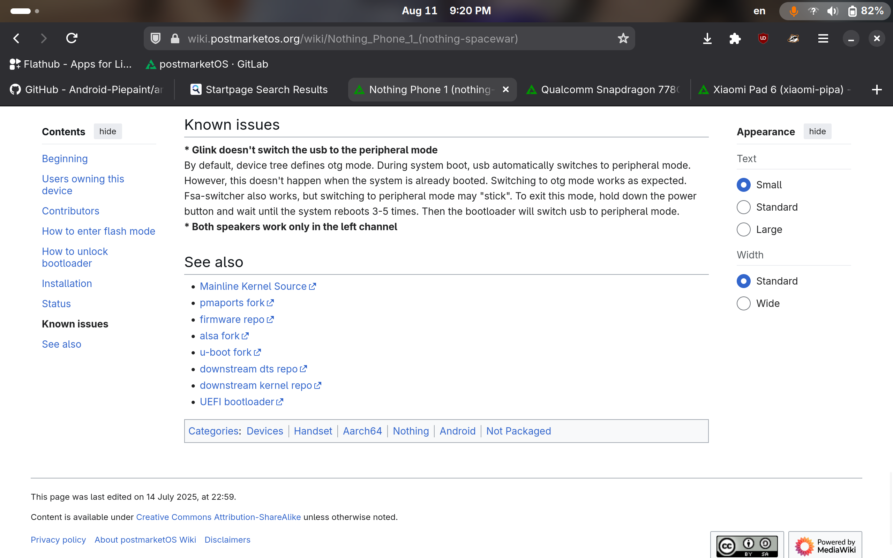
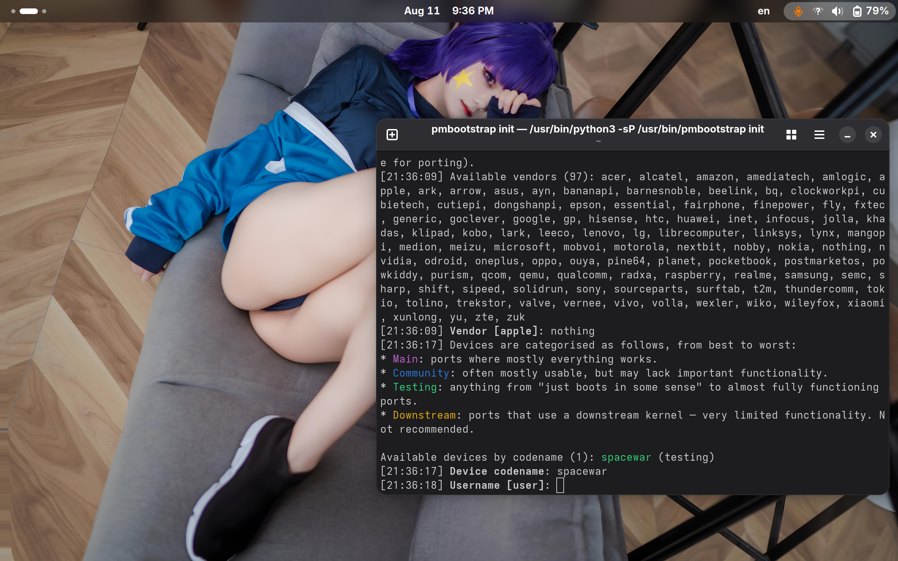
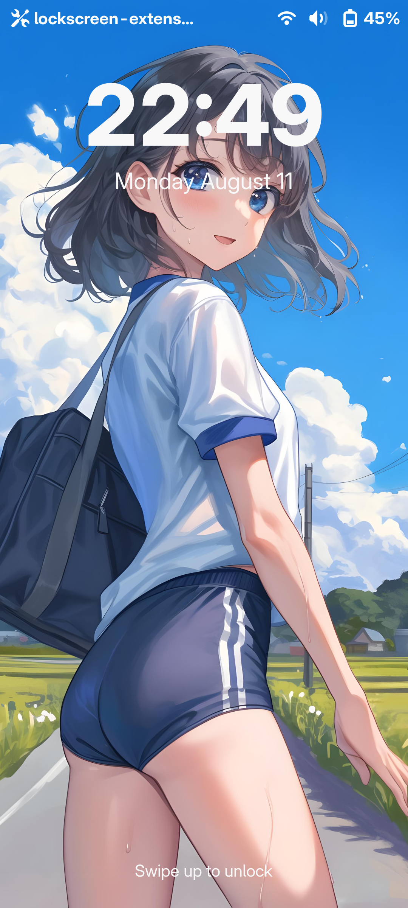
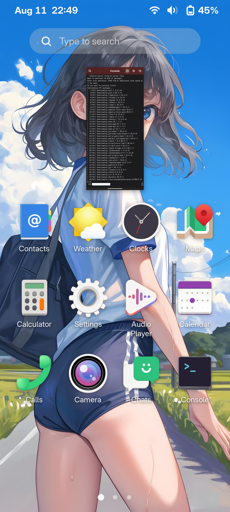

雖然 PostmarketOS 對我而言早就不是什麼新鮮的事物了，但是我依然喜歡刷機的樂趣，因為我深知：只有自由軟體才能真正的保護我的隱私，讓我擁有數位人權。這次在 Nothing Phone（1）上的 Linux 之旅也讓我收穫頗豐。

:::note
本文僅代表作者（EDKPiepaint）個人及少數刷機和自由軟體愛好者的觀點，請不要參考。（是的，**請不要參考**)
 - 由於本文所使用的專業術語較多，對於沒有相關經歷的人而言，本文會比較晦澀難懂，請謹慎閱讀。如果你是只會大喊大叫諸如”我不懂！“之類的話，並且會發火，還有種被人瞧不起的感覺的，或者是只會擺出架子（一些家長或者”老爺“最擅長這麼做）的人，我建議你不要閱讀了。
:::

:::warning[中國大陸的閱讀者請注意]
本文包含部分（或全部包含）政治類話題，以及一些其它具有爭議性的，或者因爲當地的內容審查政策而不予通過的內容。儘管本部落格已被GFW所封鎖，但部分專業讀者仍有能力訪問本部落格。在此鄭重提醒：**如果您是[極端愛國主義者，或者具有排外主義立場的人，亦或是熱衷於在網路上攻擊異議人士的人](https://zh.wikipedia.org/zh-tw/%E5%B0%8F%E7%B2%89%E7%B4%85)，請立即關閉本網站**！！！
:::

# 主線核心的支援情況
Nothing Phone（1）採用的驍龍778G+ 晶片目前支援狀況良好。除去GPS以外的部分工作正常。[^1]對於 Nothing Phone（1）本身而言，除去GPS、振動馬達、Glyph LED不工作以外，其餘部分良好。但聲音、藍牙部分需要自行修補才可以工作。

# 準備工作
PostmarketOS 的 GitLab上目前還沒有 Nothing Phone（1）的軟體包[^2]，這意味着想要構建PostmarketOS 的映像，我們就需要找到一個包含相關軟體的第三方 `pmaports` 來進行後續操作。幸運的是，Wiki 下面就有這個 `pmaports` 的[連結](https://github.com/mainlining/pmaports/tree/danila/spacewar)：



執行 `git clone https://github.com/mainlining/pmaports.git` 將這個 `pmaports` 下載到本機，然後從裡面複製出兩個資料夾： `device-nothing-spacewar` `firmware-nothing-spacewar` 到任意位置。之後執行 `pmbootstrap init` 設定存儲庫位置，設定版本為 `edge` 分支，然後按下 `control-C`終止程式。前往 `pmbootstrap` 的工作目錄，將這兩個資料夾放到 `工作目錄/cache_git/pmaports/device/testing` 目錄下，重新執行 `pmbootstrap init`，繼續設定：



```bash
pmbootstrap init                         
[21:40:29] Location of the 'work' path. Multiple chroots (native, device arch, device rootfs) will be created in there.
[21:40:29] Work path [/home/edkpiepaint/.local/var/pmbootstrap]: 
[21:40:31] Location of the 'pmaports' path, containing package definitions.
[21:40:31] pmaports path [/home/edkpiepaint/.local/var/pmbootstrap/cache_git/pmaports]: 
[21:40:33] Choose the postmarketOS release channel.
[21:40:33] Available (12):
[21:40:33] * edge: Rolling release / Most devices / Occasional breakage: https://postmarketos.org/edge
[21:40:33] * v25.06: Upcoming stable release (DO NOT USE)
[21:40:33] * v24.12: Latest release / Recommended for best stability
[21:40:33] Channel [edge]: 
[21:40:35] NOTE: pmaports is on master branch, copying git hooks.
[21:40:35] Choose your target device vendor (either an existing one, or a new one for porting).
[21:40:35] Available vendors (96): acer, alcatel, amazon, amediatech, amlogic, apple, ark, arrow, asus, ayn, bananapi, barnesnoble, beelink, bq, clockworkpi, cubietech, cutiepi, dongshanpi, epson, essential, fairphone, finepower, fly, fxtec, generic, goclever, google, gp, hisense, htc, huawei, inet, infocus, jolla, khadas, klipad, kobo, lark, leeco, lenovo, lg, librecomputer, linksys, mangopi, medion, meizu, microsoft, mobvoi, motorola, nextbit, nothing, nobby, nokia, nvidia, odroid, oneplus, oppo, ouya, pine64, planet, pocketbook, postmarketos, powkiddy, purism, qcom, qemu, qualcomm, radxa, raspberry, realme, samsung, semc, sharp, shift, sipeed, solidrun, sony, sourceparts, surftab, t2m, thundercomm, tokio, tolino, trekstor, valve, vernee, vivo, volla, wexler, wiko, wileyfox, xiaomi, xunlong, yu, zte, zuk
[21:40:35] Vendor [xiaomi]: nothing
[21:40:36] Devices are categorised as follows, from best to worst:
* Main: ports where mostly everything works.
* Community: often mostly usable, but may lack important functionality.
* Testing: anything from "just boots in some sense" to almost fully functioning ports.
* Downstream: ports that use a downstream kernel — very limited functionality. Not recommended.

Available devices by codename (1): spacewar (testing)
[21:40:36] Device codename [spacewar]:           
[21:40:39] Username [litepiepaint]: 
[21:40:40] Available providers for postmarketos-base-ui-wifi (2):
[21:40:40] * wpa_supplicant: Use wpa_supplicant as the WiFi backend. (default)
[21:40:40] * iwd: Use iwd as the WiFi backend (but may not work with all devices)
[21:40:40] Provider [default]: 
[21:40:51] Available user interfaces (28): 
[21:40:51] * none: Bare minimum OS image for testing and manual customization. The "console" UI should be selected if a graphical UI is not desired.
[21:40:51] * asteroid: (Wayland) Smartwatch UI from AsteroidOS
[21:40:51] * bananui: (Wayland) Keypad controlled UI for feature phones
[21:40:51] * buffyboard: Plain framebuffer console with modern touchscreen keyboard support
[21:40:51] * cage: (Wayland) Kiosk WM
[21:40:51] * console: Console environment, with no graphical/touch UI
[21:40:51] * cosmic: COSMIC Desktop Environment from System76
[21:40:51] * fbkeyboard: Plain framebuffer console with touchscreen keyboard support
[21:40:51] * gnome: (Wayland) Gnome Shell
[21:40:51] * gnome-mobile: (Wayland) Gnome Shell patched to adapt better to phones (Experimental)
[21:40:51] * i3wm: (X11) Tiling WM (keyboard required)
[21:40:51] * kodi: (GBM) 10-foot UI useful on TV's
[21:40:51] * lomiri: (Wayland) The convergent desktop environment (Experimental)
[21:40:51] * lxqt: (X11) Lightweight Qt Desktop Environment (stylus recommended)
[21:40:51] * mate: (X11) MATE Desktop Environment, fork of GNOME2 (stylus recommended)
[21:40:51] * mediaberry: (Wayland) An open platform for streaming boxes and smart TVs (WIP)
[21:40:51] * moonlight: (Wayland) Open Source PC client for NVIDIA GameStream, as used by the NVIDIA Shield
[21:40:51] * niri: (Wayland) A scrollable-tiling compositor (DOES NOT RUN WITHOUT HW ACCELERATION!)
[21:40:51] * openbox: (X11) A highly configurable and lightweight X11 window manager (keyboard required)
[21:40:51] * os-installer: UI for installing postmarketOS
[21:40:51] * phosh: (Wayland) Mobile UI initially developed for the Librem 5
[21:40:51] * plasma-desktop: (X11/Wayland) KDE Desktop Environment (works well with tablets)
[21:40:51] * plasma-mobile: (Wayland) Mobile variant of KDE Plasma (does not run without hardware acceleration)
[21:40:51] * shelli: Plain console with touchscreen gesture support
[21:40:51] * sway: (Wayland) Tiling WM, drop-in replacement for i3wm (DOES NOT RUN WITHOUT HW ACCELERATION!)
[21:40:51] * sxmo-de-dwm: Simple Mobile: Mobile environment based on SXMO and running on dwm
[21:40:51] * sxmo-de-sway: Simple Mobile: Mobile environment based on SXMO and running on sway
[21:40:51] * weston: (Wayland) Reference compositor (demo, not a phone interface)
[21:40:51] * xfce4: (X11) Lightweight desktop (stylus recommended)
[21:40:51] User interface [plasma-mobile]: 
[21:40:52] This user interface has an extra package: Meta package for additional Plasma mobile apps
[21:40:52] Enable this package? (y/n) [y]: 
[21:40:53] Based on your UI selection, 'default' will result in installing systemd.
[21:40:53] Install systemd? (default/always/never) [default]:   #如果啓動異常，在此處鍵入“never”來改爲使用 OpenRC 來初始化。
[21:40:54] Additional options: extra free space: 0 MB, boot partition size: 256 MB, parallel jobs: 2, ccache per arch: 5G, sudo timer: False, mirror: https://mirrors.aliyun.com/postmarketOS/
[21:40:54] Change them? (y/n) [n]: 
[21:40:54] Additional packages that will be installed to rootfs. Specify them in a comma separated list (e.g.: vim,file) or "none"
[21:40:54] Extra packages [nano]: 
[21:40:55] Your host timezone: Asia/Singapore    #設定時區
[21:40:55] Use this timezone instead of GMT? (y/n) [y]: 
[21:40:56] Choose your preferred locale, like e.g. en_US. Only UTF-8 is supported, it gets appended automatically. Use tab-completion if needed.
[21:40:56] Locale [en_US]: 
[21:40:56] Device hostname (short form, e.g. 'foo') [nothing-spacewar]:       #設定主機名稱 
[21:40:57] NOTE: No SSH public keys found to copy to the device.
[21:40:57] See https://postmarketos.org/ssh-key-glob for more information.
[21:40:57] After pmaports are changed, the binary packages may be outdated. If you want to install postmarketOS without changes, reply 'n' for a faster installation.
[21:40:57] Build outdated packages during 'pmbootstrap install'? (y/n) [y]: 
[21:40:58] Zap existing chroots to apply configuration? (y/n) [y]: 
[21:41:01] DONE!
```

之後，執行 `pmbootstrap install` 來進行構建安裝映像。

# 解鎖

去[這裡](https://github.com/quintenvandamme/nothing_archive)下載一份 Nothing Phone（1）的韌體，以備不時之需。然後，前往 `設定-->系統--->開發人員選項-->OEM解鎖`，啟用OEM解鎖，重新啟動手機至Bootloader模式，連接電腦，打開終端機，鍵入 `fastboot flashing unlock` 手機會展示是否需要解鎖的畫面，選擇“UNLOCK BOOTLOADER” ， 按下電源鍵確認。之後手機會自動恢復工廠設定。

::github{repo="quintenvandamme/nothing_archive"}

# 刷機

之後，將手機重新啟動到 bootloader，在終端機執行如下命令：

```bash
pmbootstrap flasher flash_kernel
pmbootstrap flasher flash_rootfs --partition userdata
```
因為 Nothing Phone 是 Android 手機，所以 PostmarketOS 的分割表也繼承自 Android 。刷機時將 rootfs 寫入 Android 的 `userdata` 分割就好了。刷完後需要清除 `dtbo` 分割並禁用 AVB 驗證。在禁用 AVB 驗證時需要使用原廠韌體的 `vbmeta` 映像：

```bash
fastboot --disable-verity flash vbmeta /path/to/vbmeta.img
```

之後就可以重新啟動手機了。但是......

# 修復 bug

但是，在清除 `dtbo` 分割並禁用 AVB 後，手機仍然會卡在 bootloader 無法繼續。因為我們不知道這個手機的 UART 位置，所以就無法通過 UART 了解到底發生了什麼，如果執行 `fastboot reboot recovery` 就可以使手機開機。由此我懷疑這個手機的引導程式有 bug，解決這個 bug 的唯一辦法是同時將 `boot.img` 刷到兩個槽位。</br>
在開機之後，因為 Nothing Phone（1）的主線核心目前不穩定，像是GPU、聲音和藍牙就需要我們手動修補。你會遇到畫面響應卡頓、沒有聲音、藍牙、Wi-Fi還有5G行動網路不工作的問題。但是這些問題都是可以解決的。

 ## 修復 Wi-Fi 和 5G 行動網路
 通過核心日誌可以看出，數據機已經被初始化了：

 ```bash
 [    4.343776] remoteproc remoteproc0: modem is available
```
因此只需要啟動管理數據機的相關軟體就可以了。在 Linux 中，管理數據機的軟體是 `ModemManager`，因此我們需要通過 `rc-service` 開關服務即可：

```bash
sudo rc-service modemmanager start

#每次開機時自動啟用

sudo rc-update add modemmanager
```
執行完後，應該可以看到狀態列上出現信號圖標，GNOME設定（我選擇的是GNOME桌面）中也會出現對應選項。</br>
修復 Wi-Fi也同樣簡單——啟用 `networkmanager` 就好了：

```bash
sudo rc-service networkmanager start

#每次開機時自動啟用

sudo rc-update add networkmanager
```

連接網際網路的指令是：

```bash
sudo nmtui
```

為什麼不能在 GNOME 的快速設定中點擊 Wi-Fi 的選項然後連接網路？因為缺少 `polkit` 相關的服務使得除了 root 以外的使用者的 GNOME 桌面涉及系統的功能都失效了（例如撥打電話）。

## 修復 GPU

通過安裝 Adreno 642L 的韌體就可以了，PostmarketOS 的套件庫有收：

```bash
sudo apk add firmware-qcom-adreno-a660
```
## 修復藍牙

:::important
通常不需要修補藍牙，因為 PostmarketOS 已包含了藍牙相關的全部韌體。
:::

如果藍牙在某次更新後不幸罷工，唯一的辦法是前往 `pmbootstrap` 的工作目錄，然後前往 `rootfs-nothing-spacewar/lib/firmware/` 將 `qca` 資料夾通過 FTP或者SMB 複製到手機的 `/lib/firmware` 目錄中。

## 修補聲音

將 Nothing Phone（1）的 ALSA配置文件複製到 `/usr/share/alsa` 中，替換整個 `ucm2`資料夾。其配置文件可從這裡取得：

::github{repo="mainlining/alsa-ucm-conf"}

下載 `spacewar/pong` 分支的內容到手機即可。

## 修補 GNOME 權限認證問題

安裝 `polkit-elogind` 並重新啟動手機:

```bash
sudo apk add polkit-elogind

sudo rc-update add poklit
```

# 後記





經過這些修補，這個 Nothing Phone（1）總算可以正常使用了。最後，這裡是EDKPiepaint，登出，祝你有個美好的一天！

[^1]: [原文表述為：“本設備可以執行PostmarketOS，但其相關依賴軟體未進入套件庫“](https://wiki.postmarketos.org/wiki/Nothing_Phone_1_(nothing-spacewar))
[^2]: [mainlining/pmaports -- GitHub](https://github.com/mainlining/pmaports/tree/danila/spacewar)
