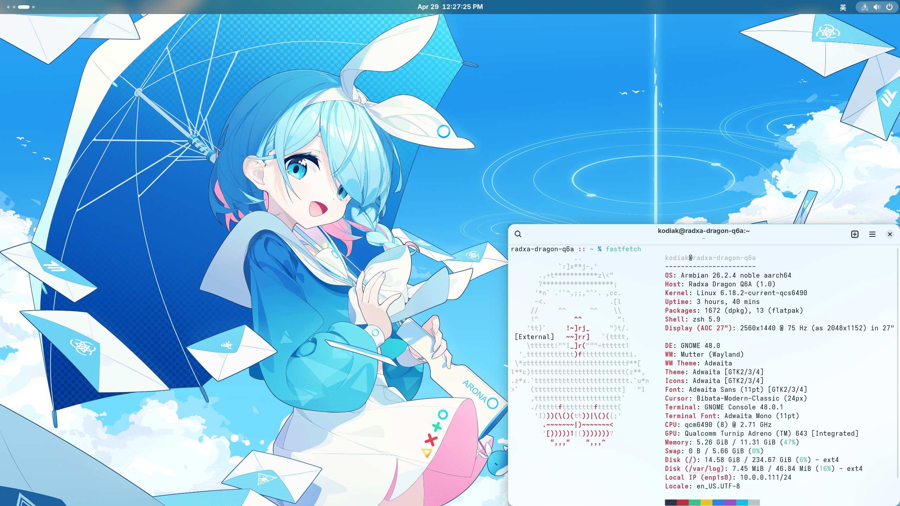
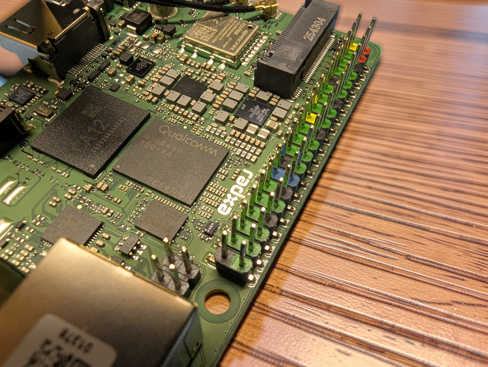
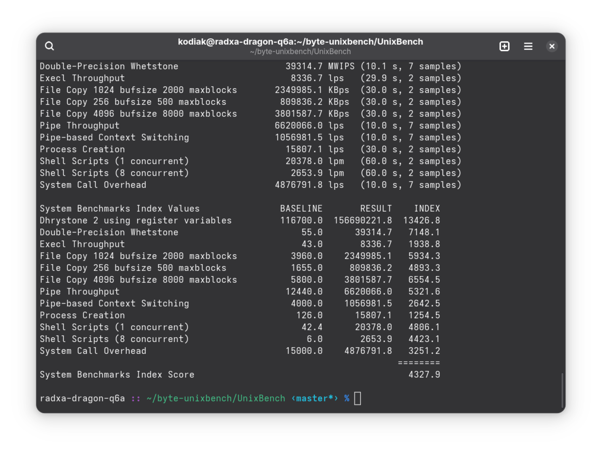
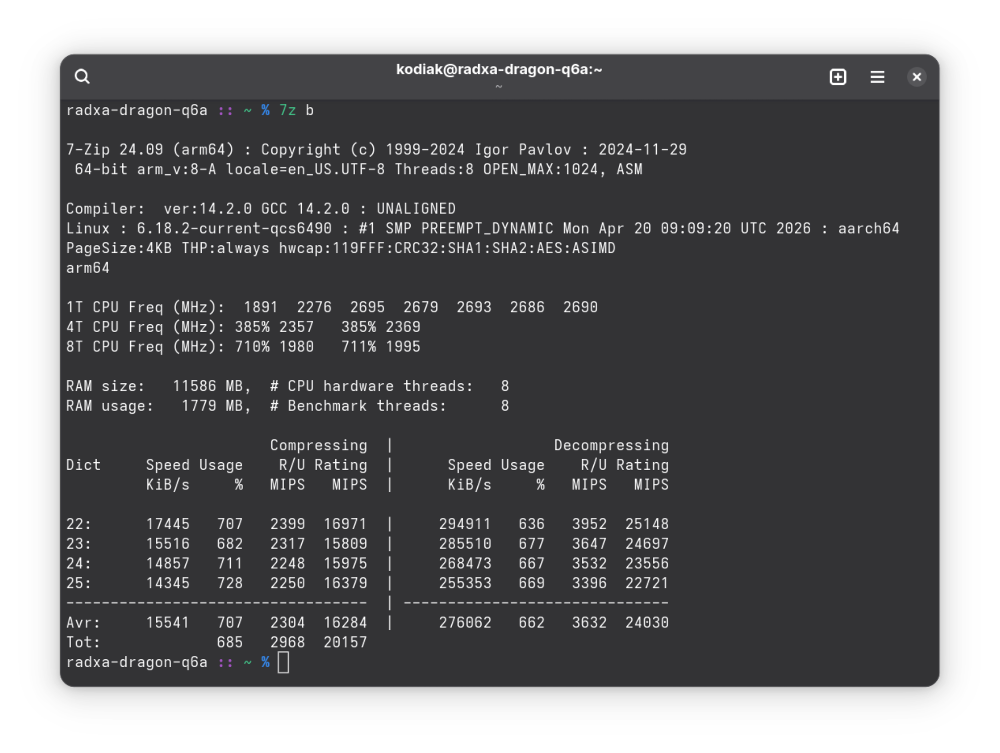
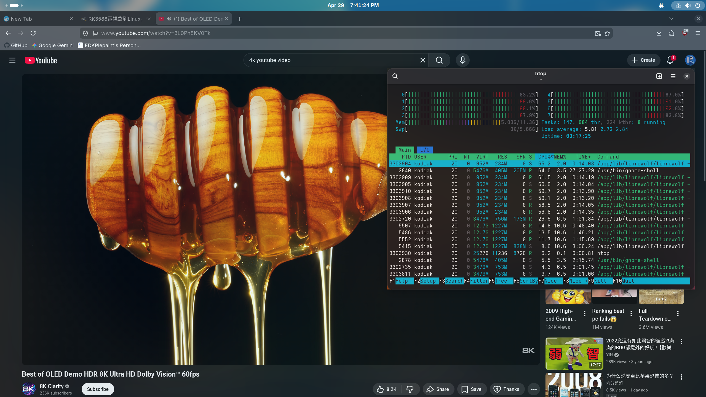

:::note
建議配合下面音樂瀏覽，效果更佳：
<iframe width="560" height="315" src="https://www.youtube.com/embed/Fs7MuuVwCOM?si=5PJSfvkHBlZQb60x" title="YouTube video player" frameborder="0" allow="accelerometer; autoplay; clipboard-write; encrypted-media; gyroscope; picture-in-picture; web-share" referrerpolicy="strict-origin-when-cross-origin" allowfullscreen></iframe>
:::

最近在進行 SM8750 MTP 原型機的主線核心移植工作，隨著測試硬體功能而重編核心的次數不斷增多，原本僅有8GB記憶體的 Rock 5B 單板機在編譯核心時所花費的時間也就馬慢慢增加。雖說不會影響整體移植進展就是了，更沒有人要求我在哪天結束之前上傳成果。不過總覺得...身邊的設備都改用16GB記憶體了，我的驍龍筆電更是有32GB的RAM。何況在嵌入式裝置這種對記憶體要求嚴格的地方，更多的記憶體加上優秀的作業系統，只會讓這部裝置硬體資源更充足，所以經過多次考慮後，最終選擇了12GB記憶體的版本。



# 外觀紹介

Radxa Dragon Q6A 是一顆採用驍龍 Dragonwing QCS6490 ARM 晶片的單板機。相容 Arm v8 指令集，核心時脈 2.7GHz，採用 big.Little 設計。從外觀來看，單板機的大小和常見的信用卡相比沒有什麼區別。</br>
在我開箱驍龍筆電時我就注意到了，但是考慮到效能問題，以及RK3588晶片單板機還可以滿足日常開發用途，就沒有入手。Radxa 是一家位於中國深圳的單板機生產製造公司，這臺單板機在2024年上市，在 [AliExpress](https://www.aliexpress.com/item/1005010224206962.html) 上可以購買。</br>
就像其他 Radxa 的單板電腦一樣，這一臺同樣使用塑料盒子包裝。盒子內還附有貼紙。


從盒子裡取出單板電腦，和前一代 Rock 5B 產品相比，這臺單板機的面積比上一代小了不少，像是 HDMI，USB的位置也發生了變化。</br>



除了單板機標準的 GPIO 以外，這臺單板機還內建了移遠FCU760K WiFi 模組，用於提供無線網路支援（雖然內建的網路卡沒有驅動程式就是了），還有做成 M.2 固態硬碟接口的 PCIe 匯流排，可以相容PC上大多數硬體，也可以安裝固態硬碟提升裝置I/O速度。板底還附有 MIPI CSI/DSI，UFS/eMMC 模組接口，用於安裝熒幕和UFS/eMMC 快閃記憶體。這對於追求隨機讀寫效能的開發者來說，比起傳統的 microSD 卡要可靠得多。不要看板子很小，這也要差不多2900臺幣！</br>
值得一提的是，Q6A 搭載的 QCS6490 晶片在電源管理上相當考究。它支援 USB-C PD 供電，這點對於已經滿桌子 PD 充電器的我來說非常友善。不過，由於這顆晶片在高負載編譯時發熱量不容小覷，板子上也預留了主動散熱片的安裝孔位，但沒有留出風扇的安裝接口。

# 軟體環境與初次啟動
> 各就位，探針準備！</br>
> `Preloader` 之後接 `DA`！</br>
> 零售預備，熔絲熔燬！</br>
> 晶片燒燬記得賠！</br>
> -------- 「準備開刷！」-- 根據「蔚藍檔案」中國服大運動會主題曲「準備出發！」改編</br>

插上電源，隨著綠色的LED點亮，螢幕上也隨之出現 Radxa 的 logo。在使用記憶卡的情況下，完全開機需要20秒。就像高通平臺的既有風格那樣，Q6A單板電腦的開機韌體同樣基於 Coreboot 和最新的 EDK II UEFI 實作，可以相容任何支援UEFI開機的作業系統。另外韌體還內建ACPI支援，甚至可以使用官方釋出的驅動程式改裝 Windows 11,幾乎所有的硬體都是正常的（韌體適用於 Windows 平臺）。可以通過進入 EDL 手動更新新的韌體，只需要按下耳機插孔旁邊的按鈕即可。另外晶片沒有熔燬，因此刷自己的客製化韌體來提升開機速度也是可以的。


想要更新韌體，將單板機進入EDL，然後下載[官方韌體](https://dl.radxa.com/dragon/q6a/images/dragon-q6a_flat_build_wp_260120.zip)，使用 `edl` 工具進行韌體更新：

```bash
sudo edl --memory=spinor rawprogram rawprogram0.xml patch0.xml --loader=prog_firehose_ddr.elf
```
需要注意的是。必須使用 USB-A to USB-A 線將單板機與電腦相連！不知道為什麼這臺單板電腦非要這麼做，推測可能是因為 QCS6490 內部的引腳定義或初級引導程式（PBL）在硬體設計上，將其中一個 USB-A 接口定義為首選的數據傳輸路徑。雖然這對習慣了「萬物皆可 Type-C」的現代開發者來說有點復古，但也算是玩驍龍開發板的一種獨特儀式感吧。</br>
</br>
軟體方面，目前只有 Armbian 對這臺裝置支援還比較不錯。當然因為這臺裝置尚處於初期階段，很多針對裝置的更改還沒有進入主線，所以目前常見的採用主線核心的發行版都開不起來。現在的 Radxa 和 PINE64 一樣，都是負責設計和製造硬體，至於軟體和作業系統則完全交給社群開發。如果想要存取UART，只需要通過杜邦線連接到UART轉換裝置，通過電腦存取即可。</br>

## 硬體探索

和之前所有的裝置一樣，在 Q6A 上也可以通過常見的 `lsusb` `lspci` `inxi` 等命令列工具來獲取硬體信息。例如 `lspci` 就可以檢視裝置的PCIe匯流排上外掛了哪些裝置，使用 `-v` 引數可以看到更詳細的內容:

```bash
# lspci -vvvv 
0000:00:00.0 PCI bridge: Qualcomm Technologies, Inc SM8250 PCIe Root Complex [Snapdragon 865/870 5G] (prog-if 00 [Normal decode])
	Device tree node: /sys/firmware/devicetree/base/soc@0/pcie@1c00000/pcie@0
	Control: I/O+ Mem+ BusMaster+ SpecCycle- MemWINV- VGASnoop- ParErr- Stepping- SERR+ FastB2B- DisINTx+
	Status: Cap+ 66MHz- UDF- FastB2B- ParErr- DEVSEL=fast >TAbort- <TAbort- <MAbort- >SERR- <PERR- INTx-
	Latency: 0
	Interrupt: pin A routed to IRQ 145
	IOMMU group: 14
	Region 0: Memory at 60300000 (32-bit, non-prefetchable) [size=4K]
	Bus: primary=00, secondary=01, subordinate=ff, sec-latency=0
	I/O behind bridge: 1000-1fff [size=4K] [16-bit]
	Memory behind bridge: 60400000-604fffff [size=1M] [32-bit]
	Prefetchable memory behind bridge: 00000000fff00000-00000000000fffff [disabled] [64-bit]
	Secondary status: 66MHz- FastB2B- ParErr- DEVSEL=fast >TAbort- <TAbort- <MAbort- <SERR- <PERR-
	BridgeCtl: Parity- SERR+ NoISA- VGA- VGA16- MAbort- >Reset- FastB2B-
		PriDiscTmr- SecDiscTmr- DiscTmrStat- DiscTmrSERREn-
	Capabilities: <access denied>
	Kernel driver in use: pcieport
	Kernel modules: shpchp

0000:01:00.0 Ethernet controller: Realtek Semiconductor Co., Ltd. RTL8111/8168/8211/8411 PCI Express Gigabit Ethernet Controller (rev 1b)
	Subsystem: Realtek Semiconductor Co., Ltd. Device 0123
	Control: I/O+ Mem+ BusMaster+ SpecCycle- MemWINV- VGASnoop- ParErr- Stepping- SERR- FastB2B- DisINTx+
	Status: Cap+ 66MHz- UDF- FastB2B- ParErr- DEVSEL=fast >TAbort- <TAbort- <MAbort- >SERR- <PERR- INTx-
	Latency: 0, Cache Line Size: 64 bytes
	Interrupt: pin A routed to IRQ 144
	IOMMU group: 14
	Region 0: I/O ports at 1000 [size=256]
	Region 2: Memory at 60404000 (64-bit, non-prefetchable) [size=4K]
	Region 4: Memory at 60400000 (64-bit, non-prefetchable) [size=16K]
	Capabilities: <access denied>
	Kernel driver in use: r8169
	Kernel modules: r8169

0001:00:00.0 PCI bridge: Qualcomm Technologies, Inc SM8250 PCIe Root Complex [Snapdragon 865/870 5G] (prog-if 00 [Normal decode])
	Device tree node: /sys/firmware/devicetree/base/soc@0/pcie@1c08000/pcie@0
	Control: I/O+ Mem+ BusMaster+ SpecCycle- MemWINV- VGASnoop- ParErr- Stepping- SERR+ FastB2B- DisINTx+
	Status: Cap+ 66MHz- UDF- FastB2B- ParErr- DEVSEL=fast >TAbort- <TAbort- <MAbort- >SERR- <PERR- INTx-
	Latency: 0
	Interrupt: pin A routed to IRQ 147
	IOMMU group: 15
	Region 0: Memory at 40300000 (32-bit, non-prefetchable) [size=4K]
	Bus: primary=00, secondary=01, subordinate=ff, sec-latency=0
	I/O behind bridge: f000-0fff [disabled] [16-bit]
	Memory behind bridge: fff00000-000fffff [disabled] [32-bit]
	Prefetchable memory behind bridge: 00000000fff00000-00000000000fffff [disabled] [64-bit]
	Secondary status: 66MHz- FastB2B- ParErr- DEVSEL=fast >TAbort- <TAbort- <MAbort- <SERR- <PERR-
	BridgeCtl: Parity- SERR+ NoISA- VGA- VGA16- MAbort- >Reset- FastB2B-
		PriDiscTmr- SecDiscTmr- DiscTmrStat- DiscTmrSERREn-
	Capabilities: <access denied>
	Kernel driver in use: pcieport
	Kernel modules: shpchp

```
不難發現，QCS6490應該是驍龍865或者870為基礎修改的晶片（韌體中也可以看到晶片的代號為 `Kodiak`）。同時也可以看到由 Realtek 生產的網路卡。想要檢視硬體的信息可以通過 `dmidecode` 檢視：

```bash
# sudo dmidecode
Handle 0x0002, DMI type 0, 26 bytes
BIOS Information
	Vendor: Qualcomm Technologies, Inc.
	Version: 6.0.251230.BOOT.MXF.1.0.1-00549-KODIAKWP-1
	Release Date: 12/30/2025
	ROM Size: 32 MB
	Characteristics:
		ACPI is supported
		Function key-initiated network boot is supported
		Targeted content distribution is supported
...
```

就可以檢視當前韌體的版本，裝置的 SPI 快閃記憶體大小，以及韌體支援的功能。至於晶片本身，可以通過檢視 `/proc/cpuinfo/` 或者 `lscpu` 指令也可以。

```bash
# lscpu
lscpu                                                                   
Architecture:                aarch64
  CPU op-mode(s):            32-bit, 64-bit
  Byte Order:                Little Endian
CPU(s):                      8
  On-line CPU(s) list:       0-7
Vendor ID:                   ARM
  Model name:                Cortex-A55
    Model:                   0
    Thread(s) per core:      1
    Core(s) per socket:      4
    Socket(s):               1
    Stepping:                r2p0
    Frequency boost:         disabled
    CPU(s) scaling MHz:      100%
    CPU max MHz:             1958.4000
    CPU min MHz:             300.0000
    BogoMIPS:                38.40
    Flags:                   fp asimd evtstrm aes pmull sha1 sha2 crc32 atomics fphp asimdhp cpui
                             d asimdrdm lrcpc dcpop asimddp
  Model name:                Cortex-A78
    Model:                   1
    Thread(s) per core:      1
    Core(s) per socket:      4
    Socket(s):               1
    Stepping:                r1p1
    CPU(s) scaling MHz:      29%
    CPU max MHz:             2707.2000
    CPU min MHz:             691.2000
    BogoMIPS:                38.40
    Flags:                   fp asimd evtstrm aes pmull sha1 sha2 crc32 atomics fphp asimdhp cpui
                             d asimdrdm lrcpc dcpop asimddp
NUMA:                        
  NUMA node(s):              1
  NUMA node0 CPU(s):         0-7
...
```
當然，這臺單板機還內建了高通自家的 TPU 用於處理 AI 模型的運作。雖然效能應該比不上 SC8380 的 Hexagon TPU 啦，但是執行一些輕量的 LLM 應該不成問題。另外也可以使用高通自己的 AI Hub 使用預先處理好的模型。

# QCS 6490 效能測試

純測試CPU效能，使用 Unixbench 跑分，總分4327分（不使用散熱裝置，使用記憶卡開機）。



這個分數比 Rasperry Pi 5 的效能要好（3594 分），但明顯不如 Oneplus 6T（6030 分）。如果用 Android 手機處理器比較，大致相當於2025年中階 Android 手機水平。按理說QCS6490 CPU 效能不應該如此差勁呀，是因為我使用記憶卡開機的緣故？等之後給我的單板機加裝SSD再試試看。</br>
接下來是 `7zip` 壓縮效能測試（不使用散熱裝置，使用記憶卡開機），總分20157 MIPS。



Q6A 和我的 Nothing Phone 1（19062 MIPS）效能大致相同，依舊要優於 Rasperry Pi 5（13263 MIPS）</br>
在核心編譯方面，使用[同樣的 SM8750 主線核心原始碼](https://github.com/Xlie-Electronic-Customs/linux)，從原始碼編譯核心，Q6A 用了15分鐘，Rock 5B 用了32分鐘。作為對比用的驍龍筆電則需要大概5分鐘。
</br>
另外，晶片內建的 Adreno 643 繪圖卡可以通過 `freedreno` 核心模組被主線核心支援。有 GPU 加速的話，播放影片和玩遊戲都不是問題。然而因為主線核心缺乏硬體解碼器的支援，這臺 Q6A 單板機完全無法播放 4K YouTube 影片，使用 `htop` 檢視 CPU 利用率偏高。在沒有風扇的情況下，核心溫度可能會飆到90度。



# 總結

我想這個 Q6A 單板電腦硬體本身非常有潛力，但是目前裝置的主線核心支援非常差勁。只希望未來會有更多驅動進入主線核心，這樣就不必要使用更多的 Out-of-tree patches 去修補主線核心。
