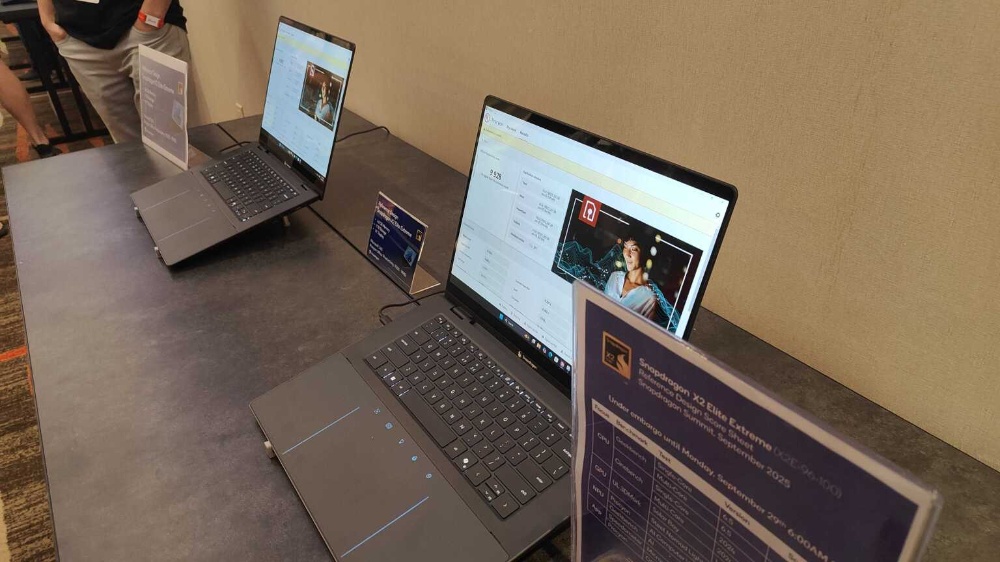
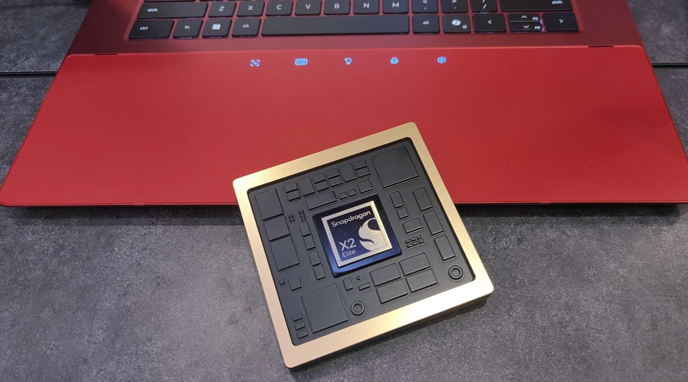
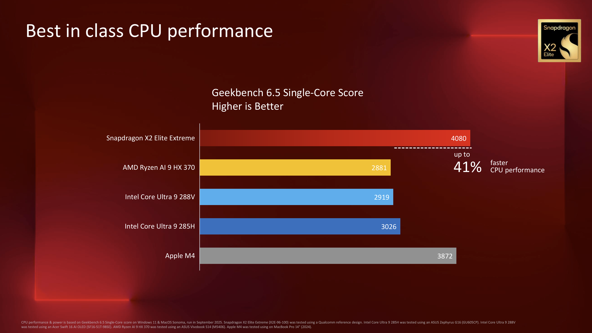
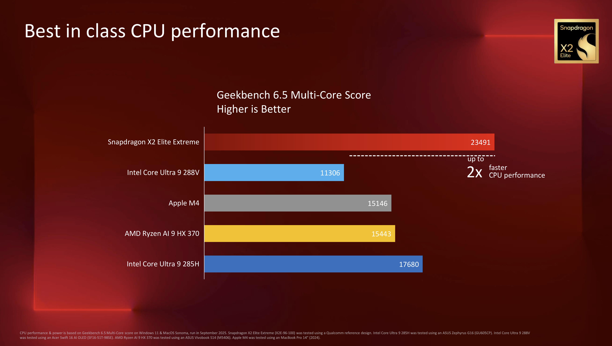
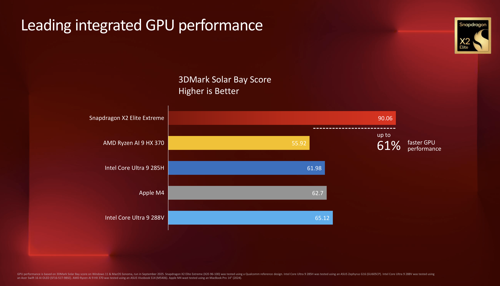
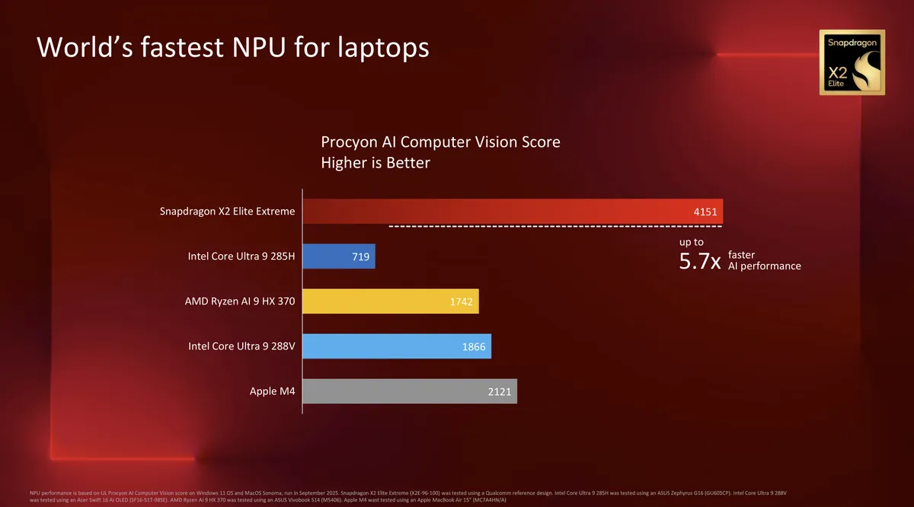

:::note
本文包含部分受版權保護的內容，您在轉載本文章時，請不要包含這些內容。除非您已經事先申請，且版權所有者已同意授權。 
受版權保護的內容：

- Qualcomm Snapdragon X2 Elite Reference Design 圖片，原圖片由[PCMag](https://www.pcmag.com/news/first-tests-qualcomms-snapdragon-x2-elite-extreme-shows-some-serious-speed#specs-how-the-snapdragon-x2-shapes-up-in-the-stack) 提供，美國高通公司版權所有;
- Qualcomm Snapdragon X Elite Reference Demo 圖片 ，原圖片由[CNX Software – Embedded Systems News](https://www.cnx-software.com/2023/10/31/qualcomm-snapdragon-x-elite-soc-benchmarks-in-windows-and-linux/) 提供，美國高通公司版權所有；
- Qualcomm Snapdragon X2 Elite 跑分結果，由[Windows Central](https://www.windowscentral.com/hardware/qualcomm/snapdragon-x2-elite-extreme-vs-apple-m4-pro-max) 提供，Windows Central 版權所有；
- [Iochi Mari](https://3d.nicovideo.jp/works/td91904) （伊落瑪麗）人物模型，Nexon Co., Ltd 版權所有；
- [PineBook Pro](https://linuxblog.io/pinebook-pro-my-first-impressions-and-setup-tips/) 圖片，Linuxblog 版權所有;
- She，Groove Coverage 版權所有
:::

<iframe width="560" height="315" src="https://www.youtube.com/embed/XQ1v9ZCcJvg?si=V_qzj8PZ53ebopN-" title="YouTube video player" frameborder="0" allow="accelerometer; autoplay; clipboard-write; encrypted-media; gyroscope; picture-in-picture; web-share" referrerpolicy="strict-origin-when-cross-origin" allowfullscreen></iframe>

# Part 1

She appears everyday during exhibition,  
Doing some Geekbench, then fallin' asleep  
She is so beautiful when she lying on the desk,  
Nobody ever put a ring on her hand  

# Part 2
Running virtual machines, compiling kernel  
She is the legend, the legend is she  
She sings to Stallman and Torvalds in Finland,  
Contributing to Open-Source, you aren't supposed to ask why  

# Part 3
She is the one that you never forget,  
She is the Ferrari-made laptop you met  
Oh, she must be the reason why you fall into love for snaptop  
She'll always help you, no matter you want  

# Part 4
She has a trackpad, and privacy switches  

She appears in the morning, and the dusk she's gone  
Every little hour every seconds we met,  
Privacy is the eternity, that's what she gives  

# Part 5
She looks like Pinebook, from PINE64  

She's trackpad like MacBook, but it's bigger than Mac's  
She wins everything that we mignt do  
She'll always help you, no matter you want  
 
She is the one that you never forget,  
She is the Ferrari-made laptop you met  
Oh, she has 18 cores and 64 Gigabytes of RAM,  
She'll always help you, no matter you want  
 
Oh, she looks so pretty, ahead of her time  

# Part 6
She is so powerful,  

Protecting my privacy, like what I said:  
"She is ahead of her era"  

# Part 7

She is the one that you never forget,  
She is the Ferrari-made laptop you met  

Oh, she must be the reason why you fall into love for snaptop  
She'll always help you, no matter you want  

# Part 8

(She is the one---) She is the one (That you never forget) that you never forget,  
She is the Ferrari-made laptop you met  
She's the reason (Oh, she must be the reason) why you fall into love for snaptop  
She'll always help you, no matter you want  

# Ending

_Nah--nah-nah--nah-nah-nah--nah-nah-nah-nah_  
_Nah--nah-nah--nah-nah-nah--nah-nah-nah-nah_  
_Nah-nah-nah-nah-nah-nah----nah-nah-nah-nah_  
_Nah-nah-nah-nah-nah-nah-nah-nah---nah-nah_  

 

_Nah--nah-nah--nah-nah-nah--nah-nah-nah-nah_  
_Nah--nah-nah--nah-nah-nah--nah-nah-nah-nah_  
_Nah-nah-nah-nah-nah-nah----nah-nah-nah-nah_  
_Nah-nah-nah-nah-nah-nah-nah-nah---nah-nah..._  
