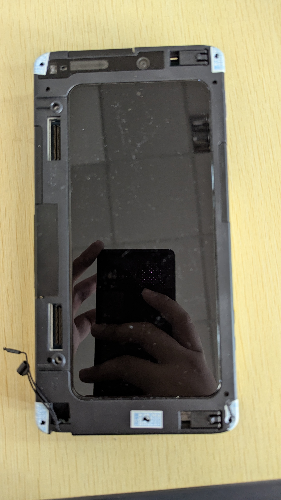
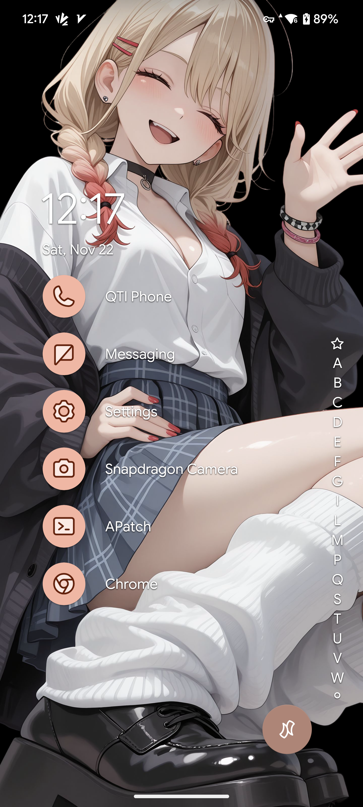

這次的的主角是來自高通的工程機——驍龍 SM8750 MTP。不同於之前評測過的845 MTP工程機，這臺8750 MTP 的工程機更加強大，同時也帶來了很多全新的硬體功能和特性。

## 什麼是 MTP 工程機？

MTP(**M**obile **T**est **P**latform)是 Qualcomm 為手機開發者、晶片調校與技術測試使用的官方工程開發設備，不是市售消費手機。主要用於模組研發、數據機測試、驅動與 Android HAL 研發、相機ISP調教等偏向硬體和底層韌體的工作，亦可用於評估硬體效能之用。與同樣作爲工程機的QRD（**Q**ualcomm **R**eference **D**esign）不同，後者更接近完整的商用手機方案開發樣機。
如果把手機開發比作蓋樓：

- MTP：打地基 + 建結構

- QRD：完成主體、可以交設計圖給 OEM 製造手機

- 市售手機：裝潢完、買回家即用
</br>
下面的表格可以體現二者與市售手機的不同：


| 項目                  | MTP                                                                                                                               | QRD                                | 市售手機*                |
| ----------------------- | ----------------------------------------------------------------------------------------------------------------------------------- | ------------------------------------ | -------------------------- |
| 定位                  | 晶片底層研發平臺                                                                                                                  | 接近市場量產的市售手機方案         | 一般使用者的日常使用     |
| 成熟度                | 系統未必完整和穩定，需大量測試                                                                                                    | 高度與硬體整合，有完整的系統和設計 | 非常成熟且穩定           |
| 主要使用者            | 硬體/驅動/數據機工程師/媒體臨時評測/手機OEM/OEM等                                                                                 | 手機OEM/ODM、產品工程研發          | 一般使用者               |
| 功能重點              | 測數據機、供電、RF、相機、I/O、驅動                                                                                               | 作為量產手機設計範本               | 滿足絕大多數一般使用場景 |
| 外型                  | 多爲黑色外殼包裹，暴露大量除錯用接口（如USB 2.0、UART，若是配合Debug Board還可以提供 JTAG 等），屏幕一般爲客製或直接使用QRD的熒幕 | 外觀接近正常手機（可整機）         | 正常手機應該有的外形     |
| 是否可解鎖 Bootloader | 幾乎都可開（原廠解鎖，無限制）、便於寫測試程式                                                                                    | 同左                               | 取決於廠商               |
| 開發方向              | BSP、HAL、電源、射頻、IC 驗證等                                                                                                   | 終端產品、軟體與硬體整合           | 基本沒有                 |
| 稳定度                | 不一定穩定（取決於韌體）、功能可能未完成                                                                                          | 可靠度較高，可演化為量產機         | 非常成熟且穩定           |
| SoC是否配置安全啓動   | 否                                                                                                                                | 大多沒有                           | 大多數都有配置           |
| 燒錄韌體是否需要簽名  | 是（高通測試簽名）                                                                                                                | 同左                               | 是（測試+廠商私鑰）      |

一句話總結：**MTP 是底層晶片與硬體測試平台；QRD 是接近商品化的完整手機參考設計。**

> [!NOTE]
> 市售手機：指由廠商推出的，面向一般用戶的手機，例如：Samsung Galaxy S10、iPhone X、Google Pixel 7等。

## 第一印象
如果習慣日常手機那種圓潤精緻的外觀，那第一次看到 MTP 工程機，大概會覺得：
> 這不是手機，這是拿在手上的小型基地台。

它比一般手機：

- 更厚,

- 更重,

- 外殼看起來完全不追求美感,

- 大量測試接口直接暴露在外;

- 這種外觀不是為了好看，而是方便：

- *隨時接上 UART、USB、測試板、外接儀器*;

- 隨時 dump log,

是一種徹徹底底的功能主義。</br>

我的這臺工程機非常好，上面的標籤告訴我它的製造日期在2024年（或者2025年）左右，外觀沒有任何損傷，屏幕也非常的清晰沒有任何瑕疵，而且展示效果非常的豔麗。此外還配備了5G毫米波天線，能夠增強5G網路的穩定性。不知道爲什麼，總覺得屏幕長得和我的 Pixel 7 Pro 好像呀...




## 啓動
插電、開機，從Qualcomm 的 logo顯示到系統啓動，全程僅過去了5秒，這速度甚至要比現在主流的手機要快了很多。我想應該歸功於BSP裸機化程度高、無多餘動畫和組件。系統方面是高通提供的BSP，基於 AOSP Android 15 開發而來，包含了簡化的 Google 框架和高通的測試程式。




核心方面，採用了 6.6 核心，高通自己的QGKI，基於 Android GKI 核心修改而來。因爲高通平臺`init_boot`映像與`boot`映像通用，所以修補`init_boot`的映像來獲取root權限的方法就行不通了。而傳統 Magisk 的方法又過於簡單，我決定採用更新的解決方案—— Apatch。好在高通的工程機韌體自帶root權限，這也是為什麼 MTP 是工程人員最喜歡的設備，完全沒有解鎖層級的限制。通過`dd`命令提取映像，丟到 Apatch 中修補，然後 fastboot 刷入修補後的映像就行了。


值得注意的是，MTP8750的核心採用了4K分頁大小編譯。難道說驍龍8 Elite 也支援16K 分頁的核心開機？這得等我備份韌體之後從BSP編譯再試試了。

## 硬體很強大


硬體上，這臺工程機可謂是性能強悍，它搭載了驍龍8 Elite CPU（沒有熔斷的早期版本），雖然是降頻版，主頻只有3628MHz（不如QRD的高），配備了LPDDR5x 16G RAM，512GB UFS 4.0存儲，但是它的性能依然很強悍。從Geekbrench的測試結果來看，多核心分數達到了驚人的7936分，已經超過了三星Galaxy S24 Ultra 的性能。爲了滿足5G網絡的需求，它採用了高通X80 5G數據機，配備了5G毫米波天線，可以提供高達10Gbps的下行速率。其採用的 Fastconnect 7900 Wi-Fi網路卡，支援 Wi-Fi 7 網路。NPU也得到了升級。</br>
聲音方面，這臺工程機的揚聲器在底部，依然是標準的雙揚聲器結構。聲音聽起來非常不錯，很符合我對於工程機的印象。其電源按鈕和音量調節按鈕在下部，只能說這個按鍵佈局非常奇葩，倒着看反而會好一些。接口依然保留了UART 和 Type-C USB 3.1接口，還有SIM卡插槽和SD卡接口。與前面幾代的MTP不同，這臺MTP8750的除錯板接口從後部移到了前面，接口也從兩個縮爲一個，不得不好奇對應的調試板是什麼樣了。</br>
相機方面，後置三個鏡頭，每個鏡頭都是5000萬畫素，但是拍攝效果一般，也支援HDR攝影。通過 Opencamera 可以錄製 8K 30幀的視頻，但是撐不到5分鐘便黑了，因爲電池太差了（後來發現是電池插座接觸不良）...xD</br>
:::note
下面的圖片均由 MTP8750 工程機拍攝，分別使用驍龍相機和 Opencamera 拍攝，並且使用了 HDR 功能。
:::


不難看出，使用驍龍相機開啓HDR影片，其效果非常好，色彩雖不如Pixel 7 Pro，但也很豔麗。然而不知道是不是 Opencamera 的HDR實作有問題，使用它拍出來的HDR照片出現了亮部（特別是樓梯、地面、白色區域）被完全「洗白」，細節消失的問題：


:::note
這是使用 Pixel 7 Pro 拍攝的 HDR相片，用於參考：

:::

拋開這一點不談，鏡頭設計也是非常好看的，採用了鍍膜鏡頭，在陽光下會顯出金黃色光澤，非常漂亮。</br>
熒幕方面，採用了一塊 11吋的OLED顯示屏，解析度在3220x1440，一塊不錯的2K的P3高色域屏幕，熒幕重新整理頻率在120Hz，畫素密度是320ppi，顯示效果非常好，色彩也很豔麗。高通之前的綠屏（熒幕在深色背景下呈現偏綠色）問題，在這臺工程機上有明顯改善，支援杜比全景影像，也支援HDR。熒幕上方有一個攝像頭挖孔，經後期比對後發現這塊屏幕來自QRD 8750 工程機。

## 軟體也很穩定

在簡單檢索後發現，工程機的韌體爲原版 Android 15，沒有經過修改，與之前卡頓的，問題頻出的845工程機不同，8750的韌體非常穩定，沒有出現當機問題，唯一發現的問題是震動馬達會在一分鐘後停止工作。插入的手機卡也能識別（系統IMEI與標籤上展示的IMEI完全一致），並能正常撥打電話、收發短信，使用數據網路也會自動開啓5G網絡。使用其內建的GPS測試軟體也可正常搜尋衛星並定位，還可以模擬GPS定位。安裝 Apatch Root 後也能正常安裝模組和授予 Root權限。內建的測試應用也都能正常工作，其餘基本手機上的硬體（如麥克風、Wi-Fi、傳感器等）也都能正常工作。可以說，即使我沒有想到新的工程機的用途，臨時作爲備用手機日用也很不錯。

## 提取韌體

> 先備份，永遠不會錯。

刷機之前，最好是備份一份韌體，以備不時之需。因爲工程機沒有開啓安全啓動，所以可以直接從網路上搜尋驍龍8 Elite 至尊版的手機韌體，然後從中提取`xbl_s_devprg_ns.melf`文件，這是驍龍8 Elite 至尊版的EDL引導文件。後續的韌體提取工作要用到這個文件。</br>
然後，下載“高通工具箱”（Linux可使用`edl`或者`qdl`程式代替），將其解壓，執行程式。在“存儲類型”中選擇“UFS”，LUN數默認爲6即可，然後選擇引導文件，發送引導，點擊“全分區回讀”，之後軟體會彈出提示。值得注意的是我們需要在將要回讀的分割表0中，講`[rawdump]`的方括號刪掉，跳過讀取 `rawdump` 分區，之後的分區表保持默認就可以，稍作等待，我們會得到一個大小爲15.5GB的映像檔和EDL刷機用的 `rawprograms.xml`  `patch.xml` 和 `partition.xml` 文件。

！[Screen showing the process of extracting the firmware](assets/qcom-toolbox.jpg)

下面的文本展示了韌體的結構圖（使用 `tree` 命令）:

```yaml
.
├── flash_all.bat
├── for_ROM_maker
│   ├── generate
│   │   ├── gpt_backup0.bin
│   │   ├── gpt_backup1.bin
│   │   ├── gpt_backup2.bin
│   │   ├── gpt_backup3.bin
│   │   ├── gpt_backup4.bin
│   │   ├── gpt_backup5.bin
│   │   ├── gpt_both0.bin
│   │   ├── gpt_both1.bin
│   │   ├── gpt_both2.bin
│   │   ├── gpt_both3.bin
│   │   ├── gpt_both4.bin
│   │   ├── gpt_both5.bin
│   │   ├── gpt_empty0.bin
│   │   ├── gpt_empty1.bin
│   │   ├── gpt_empty2.bin
│   │   ├── gpt_empty3.bin
│   │   ├── gpt_empty4.bin
│   │   ├── gpt_empty5.bin
│   │   ├── gpt_main0.bin
│   │   ├── gpt_main1.bin
│   │   ├── gpt_main2.bin
│   │   ├── gpt_main3.bin
│   │   ├── gpt_main4.bin
│   │   ├── gpt_main5.bin
│   │   ├── patch0.xml
│   │   ├── patch1.xml
│   │   ├── patch2.xml
│   │   ├── patch3.xml
│   │   ├── patch4.xml
│   │   ├── patch5.xml
│   │   ├── rawprogram0_BLANK_GPT.xml
│   │   ├── rawprogram0_WIPE_PARTITIONS.xml
│   │   ├── rawprogram0.xml
│   │   ├── rawprogram1_BLANK_GPT.xml
│   │   ├── rawprogram1_WIPE_PARTITIONS.xml
│   │   ├── rawprogram1.xml
│   │   ├── rawprogram2_BLANK_GPT.xml
│   │   ├── rawprogram2_WIPE_PARTITIONS.xml
│   │   ├── rawprogram2.xml
│   │   ├── rawprogram3_BLANK_GPT.xml
│   │   ├── rawprogram3_WIPE_PARTITIONS.xml
│   │   ├── rawprogram3.xml
│   │   ├── rawprogram4_BLANK_GPT.xml
│   │   ├── rawprogram4_WIPE_PARTITIONS.xml
│   │   ├── rawprogram4.xml
│   │   ├── rawprogram5_BLANK_GPT.xml
│   │   ├── rawprogram5_WIPE_PARTITIONS.xml
│   │   ├── rawprogram5.xml
│   │   ├── wipe_rawprogram_PHY0.xml
│   │   ├── wipe_rawprogram_PHY1.xml
│   │   ├── wipe_rawprogram_PHY2.xml
│   │   ├── wipe_rawprogram_PHY4.xml
│   │   ├── wipe_rawprogram_PHY5.xml
│   │   ├── wipe_rawprogram_PHY6.xml
│   │   ├── wipe_rawprogram_PHY7.xml
│   │   ├── zeros_1sector.bin
│   │   └── zeros_5sectors.bin
│   ├── orig
│   │   ├── gpt_backup0.bin
│   │   ├── gpt_backup1.bin
│   │   ├── gpt_backup2.bin
│   │   ├── gpt_backup3.bin
│   │   ├── gpt_backup4.bin
│   │   ├── gpt_backup5.bin
│   │   ├── gpt_main0.bin
│   │   ├── gpt_main1.bin
│   │   ├── gpt_main2.bin
│   │   ├── gpt_main3.bin
│   │   ├── gpt_main4.bin
│   │   ├── gpt_main5.bin
│   │   ├── partition.xml
│   │   ├── rawprogram0.xml
│   │   ├── rawprogram1.xml
│   │   ├── rawprogram2.xml
│   │   ├── rawprogram3.xml
│   │   ├── rawprogram4.xml
│   │   └── rawprogram5.xml
│   ├── readme.txt
│   └── 本目录说明.txt
├── images
│   ├── abl_a.img
│   ├── abl_b.img
│   ├── ALIGN_TO_128K_1.img
│   ├── ALIGN_TO_128K_2.img
│   ├── aop_a.img
│   ├── aop_b.img
│   ├── aop_config_a.img
│   ├── aop_config_b.img
│   ├── apdpb.img
│   ├── apdp.img
│   ├── bluetooth_a.img
│   ├── bluetooth_b.img
│   ├── boot_a.img
│   ├── boot_b.img
│   ├── cdt.img
│   ├── connsec.img
│   ├── core_nhlos_a.img
│   ├── core_nhlos_b.img
│   ├── cpucp_a.img
│   ├── cpucp_b.img
│   ├── cpucp_dtb_a.img
│   ├── cpucp_dtb_b.img
│   ├── ddr.img
│   ├── devcfg_a.img
│   ├── devcfg_b.img
│   ├── devinfo.img
│   ├── dpm.img
│   ├── dsp_a.img
│   ├── dsp_b.img
│   ├── dtbo_a.img
│   ├── dtbo_b.img
│   ├── featenabler_a.img
│   ├── featenabler_b.img
│   ├── frp.img
│   ├── fsc.img
│   ├── fsg.img
│   ├── gpt_backup0.bin
│   ├── gpt_backup1.bin
│   ├── gpt_backup2.bin
│   ├── gpt_backup3.bin
│   ├── gpt_backup4.bin
│   ├── gpt_backup5.bin
│   ├── gpt_main0.bin
│   ├── gpt_main1.bin
│   ├── gpt_main2.bin
│   ├── gpt_main3.bin
│   ├── gpt_main4.bin
│   ├── gpt_main5.bin
│   ├── hyp_a.img
│   ├── hyp_b.img
│   ├── imagefv_a.img
│   ├── imagefv_b.img
│   ├── init_boot_a.img
│   ├── init_boot_b.img
│   ├── keymaster_a.img
│   ├── keymaster_b.img
│   ├── keystore.img
│   ├── logdump.img
│   ├── logfs.img
│   ├── mdcompress.img
│   ├── metadata.img
│   ├── misc.img
│   ├── modem_a.img
│   ├── modem_b.img
│   ├── modemst1.img
│   ├── modemst2.img
│   ├── multiimgoem_a.img
│   ├── multiimgoem_b.img
│   ├── multiimgqti_a.img
│   ├── multiimgqti_b.img
│   ├── pdp_a.img
│   ├── pdp_b.img
│   ├── pdp_cdb_a.img
│   ├── pdp_cdb_b.img
│   ├── persist.img
│   ├── pvmfw_a.img
│   ├── pvmfw_b.img
│   ├── qmcs.img
│   ├── quantumcontentfv.img
│   ├── quantumfv.img
│   ├── quantumsdk.img
│   ├── questdatafv.img
│   ├── qupfw_a.img
│   ├── qupfw_b.img
│   ├── qweslicstore_a.img
│   ├── qweslicstore_b.img
│   ├── rawprogram0.xml
│   ├── rawprogram1.xml
│   ├── rawprogram2.xml
│   ├── rawprogram3.xml
│   ├── rawprogram4.xml
│   ├── rawprogram5.xml
│   ├── recovery_a.img
│   ├── recovery_b.img
│   ├── secdata.img
│   ├── shrm_a.img
│   ├── shrm_b.img
│   ├── soccp_dcd_a.img
│   ├── soccp_dcd_b.img
│   ├── soccp_debug_a.img
│   ├── soccp_debug_b.img
│   ├── spunvm.img
│   ├── spuservice_a.img
│   ├── spuservice_b.img
│   ├── ssd.img
│   ├── storsec.img
│   ├── super.img
│   ├── testparti.img
│   ├── toolsfv.img
│   ├── tz_a.img
│   ├── tz_b.img
│   ├── tzsc.img
│   ├── uefi_a.img
│   ├── uefi_b.img
│   ├── uefisecapp_a.img
│   ├── uefisecapp_b.img
│   ├── uefivarstore.img
│   ├── vbmeta_a.img
│   ├── vbmeta_b.img
│   ├── vbmeta_system_a.img
│   ├── vbmeta_system_b.img
│   ├── vendor_boot_a.img
│   ├── vendor_boot_b.img
│   ├── vm-bootsys_a.img
│   ├── vm-bootsys_b.img
│   ├── vm-persist.img
│   ├── xbl_a.img
│   ├── xbl_b.img
│   ├── xbl_config_a.img
│   ├── xbl_config_b.img
│   ├── xbl_ramdump_a.img
│   ├── xbl_ramdump_b.img
│   ├── xbl_sc_logs.img
│   └── xbl_sc_test_mode.img
├── mtp8750.melf
└── mtp8750.qcn

5 directories, 215 files
```

之後是提取 QCN 文件，用於恢復數據機韌體之用。方法依然簡單，只需在工具箱中點擊“讀QCN”即可。需要開啓除錯端口：

```bash
adb root
adb shell setprop sys.usb.config diag,adb
```
之後通過 `lsusb` 可以看到 UID 爲 “901D”的設備出現了，然後選擇QCN保存目錄即可。

這樣，MTP8750的韌體就算備份完成了，可以開始後續的主線核心移植了。

## 總結

8750 MTP 給我的最大感受是：

> 高通的工程機，不僅是「開發板」，也是「日用機」。

它具備：

- 功能完整

- 性能強悍

- 驅動成熟

- 調試工具齊全

- 通訊堆疊整合度高

- 所有開發限制基本都打開

對 Kernel、Modem、Camera、BSP 工程師來說：

- 是一台能工作、能測試、能刷、能玩，甚至能拿來日用的夢幻開發設備。

接下來，我會開始：

- 自行重編 BSP (或許...)；

- 測試高通 Gunyah 虛擬機；

- 移植 UEFI 引導程式，用於支援 Windows、Linux 等作業系統，並支援 PXE、USB啓動；

- 完成主線核心和 Linux 移植

真正精彩的部分，現在才剛開始。敬請期待吧！