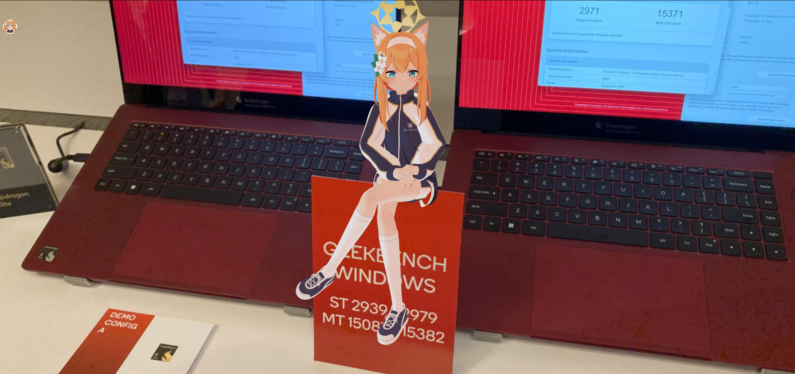

:::note
本文包含部分受版權保護的內容，您在轉載本文章時，請不要包含這些內容。除非您已經事先申請，且版權所有者已同意授權。 
受版權保護的內容：

- Qualcomm Snapdragon X2 Elite Reference Design 圖片，原圖片由[PCMag](https://www.pcmag.com/news/first-tests-qualcomms-snapdragon-x2-elite-extreme-shows-some-serious-speed#specs-how-the-snapdragon-x2-shapes-up-in-the-stack) 提供，美國高通公司版權所有;
- Qualcomm Snapdragon X Elite Reference Demo 圖片 ，原圖片由[CNX Software – Embedded Systems News](https://www.cnx-software.com/2023/10/31/qualcomm-snapdragon-x-elite-soc-benchmarks-in-windows-and-linux/) 提供，美國高通公司版權所有；
- [Iochi Mari](https://3d.nicovideo.jp/works/td91904) （伊落瑪麗）人物模型，Nexon Co., Ltd 版權所有；
- Trouble (Feat. Karin Andersson)，Dogena Music 版權所有；
- 本文歌詞，由 Nile Oryon 和 EDKPiepaint 持有版權和著作權
:::

<iframe width="560" height="315" src="https://www.youtube.com/embed/2fBOmKdvq1U?si=VsWsqEEKIGcsw35o" title="YouTube video player" frameborder="0" allow="accelerometer; autoplay; clipboard-write; encrypted-media; gyroscope; picture-in-picture; web-share" referrerpolicy="strict-origin-when-cross-origin" allowfullscreen></iframe>

# Part 1
In the world I came,  
Made my mind a little different,  
And I, modded my phone  
Flash new ROMs, double the fun  
But I always want a snaptop in my life,  
Fell into imagination, and got me into trouble   

# Part 2
I bricked my MacBook,  
That got me into trouble  
I don't know snaptops, will they barely meet my requirements,  
But there ain't no other laptops,  
That make me feel like Mac's do.
  
  
  
 Fell into imagination, and got me into trouble   
  
  
  
  
  
  

 # Part 3

When I received my laptop,  
That I brought at heavy cost,  
Now I, modding firmware  
Installing Linux,  
Double its fun  
When I found speaker doesn't work,  
Started to research, and got into trouble  

# Part 4
Oh my Oryon, you got me into trouble  
For my secutiry, try to activite your hypervisor  
But after a green rectangle, there's nothing I can do  
 

# Part 5
Don't leave me alone, with you my troubles are all gone  
You'll be fixed, when I write my patches  
And I-I-I...  
Started to study, and joined community  
  
  
  
  
  
  
  
  
  
 스냅샷(Snaptop)...  
