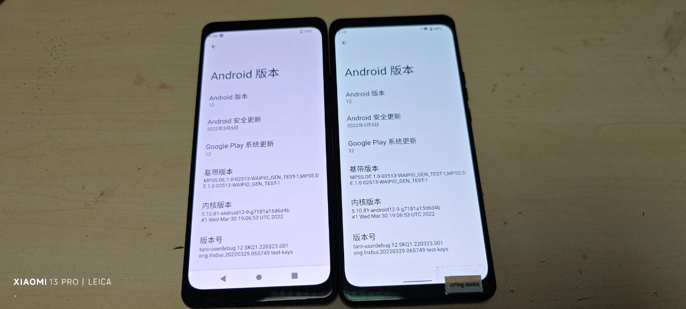
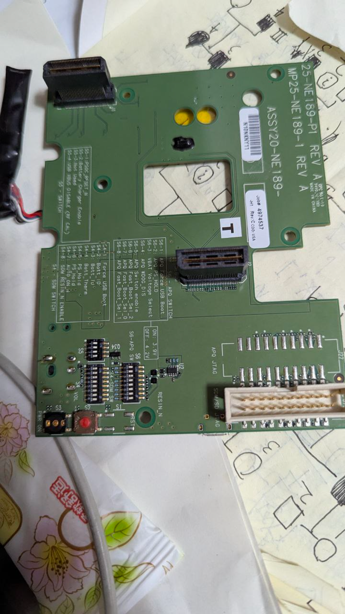
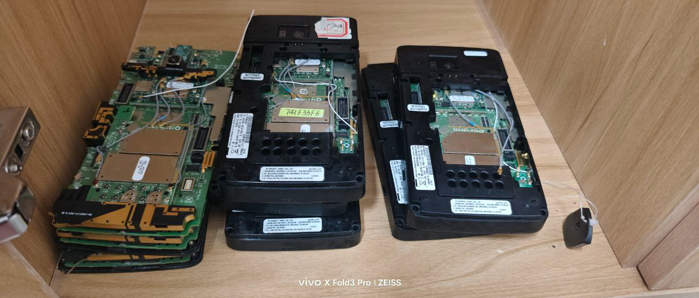

# 寫在前面

我在今年2月初，在經過3天時間說服了父親之後，通過一個叫“鹹魚”的二手交易平臺（之前我在eBay上嘗試搜尋過，找不到有關高通工程機的商品）上購買了一臺高通MTP850（其實應該叫 MTP845）工程機。
經過3天的時間後，我收到了心念已久的 MTP850 工程機。是的，對於經常折騰工程機的人（還有那些因爲工作原因接觸到的）而言，這算不得什麼。但是，作爲一個普通消費者的我來說，卻是令人興奮的。可能沒有人能夠想象到開箱時的我有多麼開心了。 
如今我還有不到一個月就要高考（學生時代611，長大後996，唉...）了，也不知道我是否還有時間，趁着家長不注意，悄悄的在高壓之下寫幾篇文章呢......

# 什麼是工程機

工程機，原本是晶片廠家提供給手機廠商和開發者作為**參考設計和測試用途**的裝置。按照其原始設計理念，這些設備並不是為一般消費者銷售的。

因爲其特殊的性質，想要接觸到它，只有這麼**幾種**可能：

 - 在手機廠商任職，且自己的職位可以接觸到這些工程機；
 - 在對應的晶片廠家上班，參與相關工程機的生產、組裝或者是測試環節；
 - 電子市場中回收或翻新的來源；
 - 開發完畢後的淘汰機：廠商將相關機型提供給手機品牌或ODM/OEM（原始設計/製造商）進行開發和測試。開發結束後，這些設備會被當作電子垃圾處理。 
 
但是，得益於某些環節中出現的紕漏，或者有些員工的_小心思_，使得這些本該被銷毀的工程機，出現在了二級市場，從而使得一般的消費者也可以較爲輕鬆的買到。
 
# 常見的工程機

一般來講，市面上的工程機，視晶片生產商不同，工程機的名稱、外形也就不同。例如高通的MTP工程機就與QRD的外形大相徑庭。在Google上搜尋了3個小時以後，我總結了以下幾個你可能會遇到的晶片廠商：

 - 高通（Qualcomm）；
 - 聯發科（MediaTek）；
 - 全志（AllWinner）；
 - 瑞芯微（Rockchip）；
 - 紫光展銳（Sprd.)
 
其中，你在二手交易平臺上碰見最多的是高通驍龍的工程機（以MTP和QRD最爲典型），其次是聯發科的工程機。紫光的也有，但是很難遇到，有的時候甚至找遍全網都不一定能發現（至於Tor麼...我沒試過）。至於不在上述列表中的，
那就更難遇到了。遇到這種情況的話，先想辦法下單吧，不然你有可能再也見不到它了。
當然，就像正常的手機一樣，在下單之前，也有必要瞭解一下工程機的性能。專業一點的人可以下載Aida64查看CPU信息，繼而通過互聯網查找跑分數據用於評估晶片效能。但是，不是每個人都會下載Aida64去查看的（比如我的Mr.Daddy），他們寧願相信短視頻上有一些人的錯誤言論，也不願意聽內行人的科學解答。
考慮到該死的GFW的存在，我總結了一個簡單的常見處理器效能排行榜，供大家參考： 

 - 第一名：瑞芯微
 - 理由：瑞芯微自始至終都是高效能的流媒體處理器，經常可以在生活中常見的電子廣告牌、數位機上盒等設備上見到。一般的開發板上也會有它的身影。甚至官方也會生產開發人員套件，並提供相關的BSP源碼供開發者下載。且價格較爲便宜，存貨量大，可以直接購買全新的套件。也會有售後保障及技術人員支援。
 - 第二名：聯發科
 - 理由：聯發科的良品率較高。就目前一般手機的良品率來看，聯發科的處理器效能在0.45～1.75（即45％～175％）之間。且其64位元處理器`67xx`系列，效能只低於驍龍30％。但是聯發科的工程機比較難遇到（至少我是沒有看到），不過運氣好的話還是可以看到資源的。
 - 第三名：高通驍龍
 - 理由：高通工程機以較多的存貨而讓購買難度降低了不少，但是高通工程機的系統存在或多或少的問題，從而使得它們在日常使用中效能十分低下。從而會有UI卡噸、系統當機、不支援電信卡或無法認證 Google 服務等問題。
 - 全志
 - 需要自行查找資料來獲取相關信息（且生產較早的全志與較新的處理器效能差異巨大，例如A133的CPU效能不錯，而H616的效能中等，但是A20的效能就不怎模樣），一般是開發板常客；
 - 第四名：紫光展銳
 - 理由，作爲給低功耗設備開發的處理器，其成本最低，當然，效能也是最低的。我爲了摸魚需要，特地從“閒魚”上購買了DW99手錶，其採用的紫光展銳SC9832E（另一種說法是SC8541E）處理器，可以讓我玩7個小時的《狂野飆車 7》，從而讓我度過在學校的痛苦時光（雖然下午5點回家不算早，但比起那些在學校上晚自習，到九點半才能回家的人來說，我簡直不要太舒服了）。
 
# 挑選合適的工程機

不知你對於工程機的第一印象是什麼呢？是小巧玲瓏的手機還是厚重如磚的”黑色麪包“？我只能說，這兩種情況都有可能。就拿較爲輕鬆獲得的高通工程機來舉例： 
目前流通在市面上的高通工程機主要有兩種：**QRD**（**Q**ualcomm **R**eference **D**esign）和 **MTP**（**M**obile **T**esting **P**latform）工程機。我將對這兩種工程機的特點進行說明。 

:::note
好吧，在與家長的激烈討論後，我承認無論是QRD還是MTP，都有相當大的幾率會被“老爺”們發現。
:::

## QRD

就是所謂的“公模機”。主要是提供給OEM用於產品設計參考，相對而言更接近於成品。你可以把它理解爲高通製造的手機： 

有意思的是，或許高通覺得自己設計製造公模機太費時間，所以之後將設計QRD的事情交給了對岸的小作坊！ 

QRD的特點： 

 - 小巧，方便握持。普通手機大小，可以輕鬆裝進口袋，若是早期型號甚至可以在一些禁止使用手機的地方（如學校）藏的很好；
 - 大容量電池，續航更久（當然，這是看運氣的）；
 - 缺點：容易被認出來（例如學校的“老爺”）、後蓋有大量開孔用於暴露除錯接口（或者根本沒有後蓋）使得QRD非常怕液體飛濺，同時也難以買到與之大小、按鍵佈局相似的手機殼用於保護。
 
## MTP

全稱“移動測試平臺”，主要用於評估硬體。MTP最顯著的特點是採用了模組化設計，且程度較高。像是數據機（Modem）和Wi-Fi的部分會外掛出來（雖然你拿不下來就是了），體積更大，功能更強。早期的MTP工程機由於處理器效能限制，通常比較小巧,與QRD相近。
隨着處理器效能的提升，MTP也就越來越大了。例如我的 MTP850： 

MTP的特點： 
 - 模組化設計；
 - 因爲除錯需要，通常會有多個USB用於輸出，提供除錯板（Debug board）用於提供電源和諸如[JTAG之類](https://en.wikipedia.org/wiki/JTAG)的硬體Debug接口；
 - 體積較大（不公平......我要看看你的）；
 - 缺點：體積較大，容易被發現、沒有電池，需要自己製作，且810之後的MTP由於熒屏較小（我的850工程機也只有5吋），邊緣較寬，想要摸魚需要一定的技巧。

# 你的工程機，值多少？

截止目前，聯合目前工程機分佈情況，列舉目前工程機的種類： 

 1. 高通QRD：
 - 包括QRD855、QRD820、QRD8250、QRD765、QRD845、QRD8650、QRD8450等的公模機；
 2. 高通MTP：
 - 包括MTP820、MTP850、MTP835、MTP8250等；
 3. 聯發科工程機：包含官方公模機以及各大廠商基於MTK晶片的某一手機型號的工程機；
 4. 全志、瑞芯微及其他：官方的開發板以及其他硬體早期開發階段流出的設備。 
 
## 根據自身實際情況挑選適合自己的工程機

以山東某區的兩所正經的“公立高中”舉例： 

七中禁止任何電子設備 
大高中禁止手機、平板電腦等電子設備（接到某些學生的投稿說，他們那裏的“老爺”們雖然每天都在強調，但是他們從來沒有查過。據說某個分部主任的班裏有一半以上的人都帶着手機，而他自己卻不知道）。 
 
假如你是七中的同學，屬於重點高中，學校自然對電子設備的管理比較嚴格。但也許是前面幾屆學生表現得過於聽話，使得學校的“老爺”們缺乏辨識摸魚玩意的能力。這種情況下你把MTP8250帶去都不會有事情。 
而對於大高中，只需要把你的工程機放進公文包裏趁無人注意時塞進桌子底下，然後開始摸魚即可。（據說坐在最後一排靠窗的人都會在自習課摸魚）

# 關於工程機的事情，我想要告訴你...

首先，我們在二手市場遇到的工程機，就外觀而言，基本不會非常完美，就像你的嶄新出場的手機一樣。因爲某些原因，你看到的工程機大多是沒有後蓋的，因爲它們被銷毀了。外觀上的磕碰都是小事，最重要的是關心基本的功能是否正常。例如問一問買家，熒幕是否正常顯示？是否有數據機部分的損壞？是否有電池？或者除錯板？也許這些問題會讓你聽起來像是個新手，但瞭解硬體的情況是非常重要的。
因爲工程機基本都是測試完畢的“電子垃圾”，所以它們各個元器件的情況都不會特別好。例如QRD電池膨脹、續航時間短、基頻損壞都是正常的，有的QRD甚至連開機都是問題......  
對於MTP，最普遍的問題則是熒幕老化、OLED影像殘留、熒幕有壞點、沒有電池......等等這些硬體上的問題，甚至還會有元件缺失或損壞的問題（我的其中一臺MTP845的音量鍵就損壞了，導致我每次想要通過fastboot刷機時，只能拿掉外殼，用鑷子按下殘留的觸點來實現按鍵組合進入fastboot，再刷機）。 

對於MTP工程機，如果買家不提供對應機型的除錯板（不同平臺的除錯板在硬體上互不相容）的話，建議不要下單，因爲MTP工程機需要自製電池。當然也會有預裝電池的。如果已有除錯板，你可以忽略。如果你沒有，而自帶電池又很糟糕，無法支持手機開機的話，麻煩就大了。畢竟電池不好的話，還可以用除錯板直接直流12V供電。 

:::note
這裏給已經有MTP850工程機和除錯板的小夥伴一個提示：想要使用12V電源供電，需要取下電池（如果有），將後面的開關中的“S6”“S7”兩個打開，之後安裝除錯板，使用輸出電壓爲**12V DC, 2A**的適配器供電.
:::

來到作業系統上，問題就更多了。首先我要講的是，你的工程機作業系統不會像正常的手機那樣、操作順暢，相反，迎接你的只有UI卡噸、聲音頓挫、無法鏈接互聯網、甚至當機進入CrushDump。 
而你的工程機，不會像你的手機那樣，在你剛剛進入刷機圈，在各大社群、BBS中隨便檢索就可以得到刷機包，然後簡單刷機的。雖然Bootloader默認解鎖、SoC沒有熔斷，但並不意味着刷機會變得簡單！ 
首先，工程機沒有人會移植第三方的刷機包，所以我們只能刷GSI通用系統影像，當然，因爲底層原因，即使刷了GSI，你的工程機也不會改善很多。我寫過關於如何優化MTP850的文章，雖然UI順暢度有所改善，但是當機的情況仍然會發生。 
其次，工程機系統出現問題變磚，對於GSI還好說，只需下載其它GSI映像刷入即可，一旦是黑磚，那就基本不可能救回來了。因爲你根本無法找到工程機的刷機包，因爲版權問題，部分工程機的刷機包只流傳於部分愛好者之間。每一臺工程機，對於一般人而言，都充滿了未知和挑戰。 

下面的視頻中，有一張工程機當機進入CrushDump的圖片，你能把它找出來嗎？ 

<iframe src="//player.bilibili.com/player.html?isOutside=true&aid=114330368477661&bvid=BV1ZUd6YoETr&cid=29392176909&p=1" scrolling="no" border="0" frameborder="no" framespacing="0" allowfullscreen="true"></iframe>

如果你能夠接受工程機的缺陷，那你可以考慮下單一臺你心儀的工程機了！希望你玩的開心！最後，這裏是EDKPiepaint，登出，祝你有個美好的一天！
