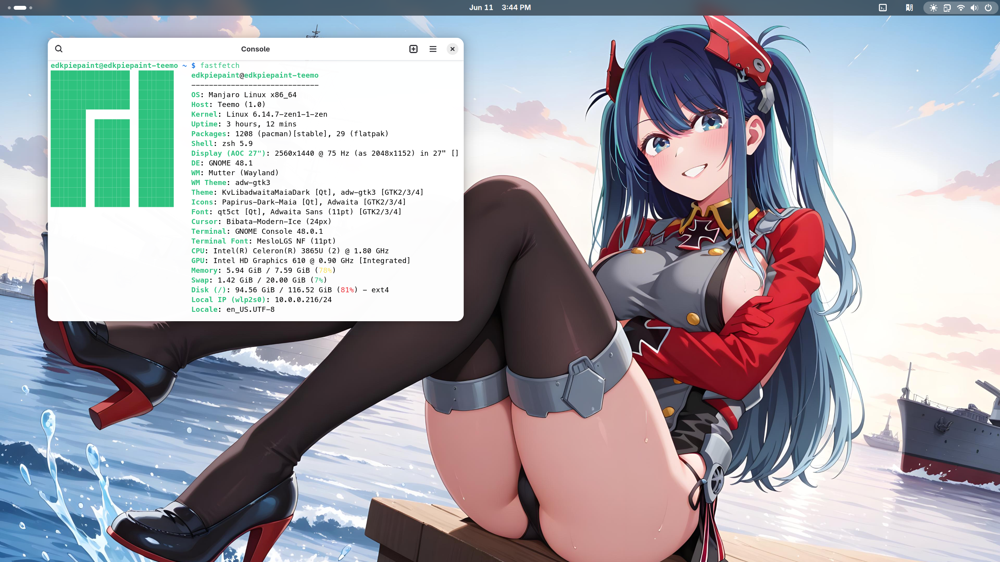
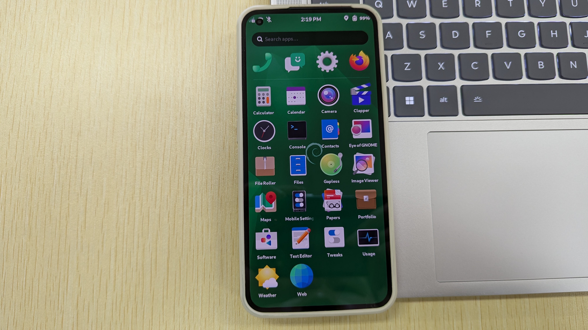
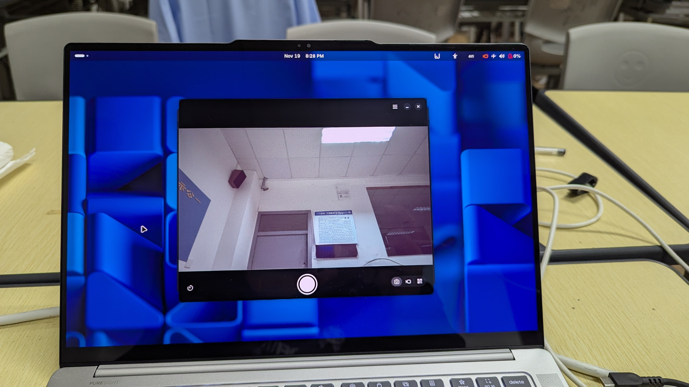

請配合下面影片閱讀本文，效果更好:

<iframe width="560" height="315" src="https://www.youtube.com/embed/xzhAOVbGrUs?si=9XvqCgimGi_uOqES" title="YouTube video player" frameborder="0" allow="accelerometer; autoplay; clipboard-write; encrypted-media; gyroscope; picture-in-picture; web-share" referrerpolicy="strict-origin-when-cross-origin" allowfullscreen></iframe>

<audio controls>
  <source src="https://github.com/Android-Piepaint/android-astro-files/raw/refs/heads/main/Porter%20Robinson%20-%20Look%20at%20the%20Sky%20(loophoof,%20NLS%20and%20Proto_ssin%20Remix_Cover)%20ft.%20hittcell%20-%20PR%CE%9BDA%20_%20_ssynae.ogg" type="audio/mpeg">
  Your browser does not support the audio element.
</audio>

「저는 리뉴스(Linux)를 공부하는 좋아합니다.」和大多數計算機工學的人不同，學習 Linux 並非是學校要我學，才不得已開始學習。相反，我是完全主動踏入 Linux，BSD 和自由軟體相關的議題的。因為我崇尚自由軟體和GNU哲學，而且我唸的是網路相關的科系。 
我從來都沒有認為，我已經學會 Linux。尤其是伺服器方面，我的掌握還不夠深入，畢竟家裡沒有辦法真的擺一臺伺服器硬體在那裡，無論是噪聲還是能耗都無法忍受。現在我已經把 Linux 當作日常主力作業系統，用於瀏覽網路、文書處理、美工，在極少數情況下我也會玩遊戲（Minecraft），也會用C開發簡單的程式。比如上週剛剛為一臺不知名廠家生產的POS機上的七畫管設計了一個[顯示系統時間、CPU平均時脈和記憶體使用情況的程式](https://github.com/Android-Piepaint/Dumb-POS-display-clock-monitor)。光是逆向顯示協定就花了我半小時。 
 
學 Linux 的好處是瞭解了很多開源軟體方案（例如自架雲端硬碟 Nextcloud ，Docker 自架 Android 雲手機），這些軟體中，很多都是跨平臺的，可以取代很多同類型的商業軟體。當然我是講我自己日常使用的方面，有許多方案並不符合業界標準，甚至無法被所有人接受。 
 
和大多數人學習 Linux 的方式不同，我學習 Linux 的方式比較「碎片化」。有關的知識點都是經過網路檢索、翻看 Reddit 板塊、以及YouTube上相關的課程來獲取，近些年來還認識了中國大陸的「酷安」論壇，發現上面很多「奇技淫巧」。知識點都是一點一點補全的，最近才知道中文輸入法甚至也有好多框架可選。為了增進理解，我開始閱讀鳥哥的 Linux 私房菜和[電腦上試跑 Linux：硬體測試筆記](https://github.com/cc-books/testnotes)二本書，才知道循序漸進的學是怎樣的感覺。這兩本書都有電子版，所以比較方便，只要有平板電腦或者筆電，到哪裡都可以開始學習之路。為了增進了解，還特地在 YouTube 上訂閱了作業系統和嵌入式作業系統移植相關的課程，雖然影片都是英語，也沒有字幕。但是憑著對 Linux 和自由軟體的熱情，以及堪用的英文水平，也能學到一些新鮮事。還說服家人給我買各種原型機和單板機進行嘗試，花費不少臺幣，但是家裡人從來沒有指責過我（我也理解他們賺錢真的不容易）。 
至於為什麼學習嵌入式作業系統移植，因為用不到數學! :P 

# 「編年記」

實際上我真正使用 Linux 和 BSD 的時間總共只有6年半，之前都只是「過渡期」而已。

## 2018年：序章

最早接觸的是 Android X86 9.0（顯然 Android 不是 GNU/Linux 發行版，但它使用的是修改過的 Linux 核心），因為64位元的 Windows 10 在4GB記憶體的桌機上有點卡，所以尋求替代品。 
用了之後，雖然效能得到了改善，但是 G2020 CPU 是 X86 架構，手機上常用的應用到了電腦上沒幾個能開的。雖然後期有開啟相容程式，用 Google Play 下載的應用也多了不少，只能執行32位元 ARM 程式。根本不能日常使用，隨後又裝回 Chrome OS 繼續使用。但是主機板的顯示晶片不夠力，所以運行 Android 程式總是卡卡的。 
因此後面就不怎麼使用了，不過這是我初次接觸基於 Linux 核心修改的作業系統，是一切的開始。手機相簿裡到現在還有關於桌機的照片。

## 2019年：接觸 macOS，Linux 「時代」的前夜

在那之後沉寂了一段時日，後來我認識的同學家裡有用 MacBook，她便向我興致勃勃的講述關於 macOS 的事情。我第一次看到UI介面如此現代化的作業系統，和精緻的筆電，這也同時是我第一次接觸到 Android，Chrome OS 和 Windows 之外的，採用 Mach-O 微核心的商業 UNIX 作業系統。但是我總不可能說服家人去買幾千臺幣的 MacBook 吧！所以只好用虛擬機過過癮。至於我對 MacBook 的印象，只有2013年在某個地下街的 Apple 專賣店看到過一次，當時對於鍵盤上的「Command」鍵還有上面四葉草的圖示留下了深刻的記憶。為此在我小時設計「拙劣」的「苦力怕」筆電（不過是用紙盒拼成筆電造型）上也留下了它的影子。甚至於15年後的今日，我也會盯著 MacBook 上的「Command」鍵看一看。 
 
後來瞭解了什麼是「Hackintosh」（OSX86）專案，經過一段時間的檢索與嘗試，最終把 macOS 安裝在桌機上。當時使用的是 macOS 10.15.6 版本，發覺安裝之後並沒有像 Mac 一樣好用，或許並非 G2020 CPU 的關係，而是CPU內建的 Intel HD Graphics 2500 繪圖卡沒有 macOS 驅動程式，只能使用軟體渲染。即使如此，我還是堅持著用了一年，到後面才改用 Manjaro Linux。期間學會了使用虛擬機。爲此還特意製作了[主機板的 OpenCore 配置檔](https://github.com/Android-Piepaint/GIGABYTE-B460M-D2V-Hackintosh)。在 macOS 下面，我也開始學習了基本的 UNIX 命令（`cd` `ls` `top` 之類），同時還學會了設定 `brew` 和 `macports` 套件管理員，算是為之後改用 Linux 作了基礎。

 ::github{repo="Android-Piepaint/GIGABYTE-B460M-D2V-Hackintosh"}

## 2020年：Fedora 登臺，Manjaro Linux 主場，Linux 時代來臨

2020年是接觸最廣泛的一年。我的華碩 K501E 筆電因為只有2GB記憶體和舊式 BIOS 韌體而無法升級到 Windows 10 作業系統，只能停留在結束支援的 Windows 7,我只好改裝 Linux 來繼續使用筆電。或許是出於「與眾不同」的想法，我沒有選擇一般人常用的 Ubuntu，而是為了最新的軟體，直接使用了 Fedora Linux 發行版。比起 Windows 下風扇的「開足馬力」，在 Fedora 下，風扇幾乎非常安靜，只有在看 YouTube 影片時，才會稍稍轉動，吹出溫熱的風。我在那臺已有15年歷史的筆電上完成了許許多多個「第一次」：第一次使用 `dnf` 套件管理員安裝了常用軟體（Firefox，LibreOffice，Telegram...），第一次客製化 GNOME，KDE Plasma 桌面，第一次編譯軟體... 當然，隨著更多的「第一次」出現，我也無意中學習了更多的指令用法：使用 `ps -aux` 看目前執行的進程，`free` 用來檢視剩餘記憶體空間，`df -h` 檢視硬碟分割及容量，還有使用 `dmesg` 抓核心 log 之類。之後又改為使用 Manjaro Linux，因為是滾動發行版，軟體永遠都是最新的，基本上上游代碼編譯完成就可以使用到。隨著發行版的變更，套件管理員也就自然改變了。Manjaro 是我使用時間最久的一個發行版，在5月於筆電和桌機安裝並開始使用後，一直到2021年3月才改回使用上游的 Arch Linux 發行版。 
 
要問 Manjaro 給我最深的印象是什麼，應該是它龐大的套件庫。除了系統自己的套件庫以外，妳還可以使用來自 Flathub 或者 Snap 上的軟體，也有 Appimage 檔可供使用。如果妳需要的軟體或者套件在這三者都沒有收怎麼辦？ Manjaro 也相容 Arch Linux User Repository （AUR套件庫），只需要到 AUR 檢索需要的軟體，就可以從套件庫構建並安裝。同時也可以便利的更新。當然，從 AUR 安裝套件是需要手工介入的，有些套件需要從原始碼編譯。 
Manjaro 的體驗，也算是為我之後的 Distro hoppin’ 做了基礎。

## 2021年：遷移到 Arch Linux，成為 Distro hopper

在使用過 Fedora 和 Manjaro 之後，我對於 Linux 的興致開始消退。所以決定嘗試不同的發行版。從3月到8月期間有嘗試過不少發行版：以安全性為主，採用虛擬機技術的 Qubes OS；主打客製化系統，改善電腦效能的 Gentoo Linux；還有不可變動的「穩定發行版」Fedora Sliverblue 之類。後來對 PinePhone 這類採用 Linux 系統的智慧型手機感興趣，又開始了瞭解為行動裝置設計的 Linux 發行版，但是當時手邊沒有裝置受支援，也只好用 QEMU 看一看... 
後來又對 Arch Linux 感興趣，通過網路下載映像後安裝。與絕大多數 Linux 發行版不同，Arch Linux 的安裝映像沒有圖形介面，也沒有安裝指令稿。所有的安裝流程都要通過命令完成。這對於習慣了圖形介面的我而言，第一次看到僅有黑白二色的TTY控制臺是非常新奇的。「這就是 Linux 最本質的一面，曾經熟悉的安裝流程如今已經成為了檢驗妳的試驗」。靠著 Arch Wiki 的安裝說明，我開始了安裝流程：分割硬碟，掛載分割，安裝基礎系統，使用 `chroot` 建立使用者，配置系統檔案...當所有的流程結束，重開機電腦後看到熟悉的TTY控制臺出現後，喜悅的心情早已溢於言表。我竟然會對「安裝完成 Linux 系統」這件事產生成就感，真是不可思議。至於使用部分，因為先前使用過基於 Arch Linux 的 Manjaro，所以沒有什麼特別之處。（下面的圖片並不是當時留下的，而是遷移到 ARM 架構之後的事情了。） 

但是這次對於 Linux 的安裝機理有了比較全面的認知，同時也學會了配置 `swap` `zram` 來改善系統記憶體，也知道如何通過 GRUB 和 `systemd-boot` 來修改核心引導引數，為之後嘗試移植 Linux 到手機、平板電腦，還有之後的原型機作了基礎。

## 2022年：遷移向 64位元 ARM 架構，開啟嵌入式系統之旅；全面改用自由軟體，從此刻開始

> 也可以瞭解：[我的 ARM 架構遷移心得](https://blog.cloudflare88.eu.org/posts/my-5-years-arm64-architecture-journey/)

2022年是我 Linux 學習歷史中，最為重要的一年。因為長期在 YouTube 上學習課程，我的眼界也擴展了不少，因為「與眾不同」的想法，我接觸到了 FreeBSD，OpenBSD 這二個BSD發行版。與 Linux 這種最早被設計為「相容 POSIX 標準的 UNIX 模仿品」不同，BSD 系列作業系統流淌著悠久的 UNIX 血液，是統治過電腦30年的巨人。UNIX 的設計理念影響了許多作業系統和一代人，甚至於現今的 Windows 也在模仿著 UNIX 。從各種方面來講，BSD的配置方法甚至要比Linux還要原始。配置文檔也比較難懂。好在網路上有大量教學講述如何配置 FreeBSD ，配合 FreeBSD 自己的文檔設定，最後也成功的安裝了顯卡驅動和 GNOME。唯一無法解決的問題是當時為了裝 macOS 時買的 PCIe 無線網路卡不被 FreeBSD 支援，只好改用有線網路。 
 
或許是因為嘗試各種作業系統和編譯程式，桌機上用了7年的500GB機械硬碟開始頻繁斷電，反應速度明顯變長，壞軌數量也多了。雖然後期有換固態硬碟，但是雙核心的 G2020 CPU 已經無法滿足我的使用需求。我對於新電腦的需求越來越迫切，最後在有一次去商場的時候趁機向家人提出添置新的筆電，沒想到大家都同意了，就破例買了一臺8GB記憶體，512GB硬碟的 MacBook Air 「基本款」，剛好趕上 Apple 發佈自己的 M1 ARM 晶片，因此裡所應當的成為了「試驗者」。在享受到 Retina 熒幕的
豔麗之後，又很快瞭解到了 Asahi Linux 專案，他們給 Apple 製造的M系列晶片移植了主線核心。我也在我的筆電上安裝了 Arch Linux Arm 取代 macOS 用於日常使用和辦公，由此也開始了我向 Arm 遷移的過程。也就是在那一時間，我也開始研究「嵌入式裝置」。因為我的筆電採用 ARM 晶片，在移植系統上就可以把它當作大型的「單板電腦」來處理，加上 MacBook 所有的元件都是焊在主機板上，也提供 UART 方便除錯。這也是我第一個接觸到的嵌入式裝置。Asahi Linux 使用 `m1n1` 與 U-Boot 作為引導 Linux 開機的 bootloader，這也同時讓我開始學習 U-Boot 的內容，學會了簡單的命令，用來控制電腦開機。也確認了學習方向。 
 
隨著硬體環境遷移到了 Arm 架構，與之相對應的軟體也要進行遷移。好在 Linux 上大多數常用的軟體都有釋出 Arm 版本，因此遷移的過程比較順利。但是很多我使用的商業閉源軟體沒有釋出 Arm 版，那時候還沒有像 `box64` `FeX-EMU` 的方案能夠以近乎原生效能執行為X86架構設計的應用，因此只好開始找尋開源的「替代品」：用 Inkscape 取代 Sketch 做美工，用 Kdenlive 取代 Davinci Resolve 來製作影片；用 Blender 取代 SketchUP 設計 3D 模型之類。但也同時讓我體會到了「開源軟體」的便利——只要有原始碼，即使開發者沒有釋出妳所在平臺的檔案，也可以自己編譯安裝，為此還學會了修補程式和 Git 的用法；原始碼公開，所有人都可以檢視，也就不會容許開發者做見不得人的勾當。或許就是因為這份經歷，使得我如今在軟體的選擇上，多半選擇自由軟體。在裝置的選擇上，也是以 Arm 和 RISC-V 架構為主。 
另外，一些嵌入式 Linux 作業系統中常見的詞彙，像是「設備樹」「分頁大小」「就地執行」這類也開始取代過去常見的「ACPI」「DSDT」「BIOS」「超執行緒」這些詞，我也把以前比較「通用」的 Linux 系統學習，轉為嵌入式裝置和嵌入式作業系統移植的學習，到此學習的方向正式確定。 
 
8月份在網路上翻看了關於自由軟體基金會（FSF）的紹介，同時也瞭解了GNU哲學。加之線上參加了 FOSDEM 2022 的開發人員會議，「自由軟體」「數位人權」「隱私權」的觀念開始深入我的思想，GNU 哲學也成為我日後撰寫文章，發佈影片，以及日常處理文書的行為標準（到現在別人要我寫一篇文字稿，我都會用沒有專利的`.odt`格式保存並傳送，至於別人能否存取，我不關心）。

> 自由軟體（或尊重自由的軟體），代表軟體尊重使用者的自由，以及社群的自由。粗略地講，它代表使用者擁有執行、複製、散布、研究、更動和改善該軟體的自由。

因為我始終認同FSF的理念，為隱私，為安全，更重要的是為自由，決定全盤轉換到 Linux，指的是電腦、手機的作業系統，都必須是 Linux ；而運作在上面的軟體，大部分也都得是自由軟體。甚至是電腦週邊配件(繪圖板、網路卡)等也必須是對 Linux 友好，為證明 Linux 不是只能存在於伺服器，同時也能當成桌面系統使用。 
直到現在，我的電腦上所安裝的軟體中，完全的自由軟體佔九成。閒暇時間我也會創作與自由軟體相關的音樂小作品，它們都收錄在[部落格的「Music」類別下](https://blog.cloudflare88.eu.org/archive/category/Music/)。

## 2023～2025年：行動裝置上的 Linux，「驍龍本」登場

本來想要在家裡添置幾臺伺服器，但是思索再三終究因為不符合家庭條件而作罷，畢竟需要24小時開著，這對於噪聲和電費將是一筆不小的負擔。決定改用淘汰的過市手機裝 Linux 系統來實現輕便伺服器的功效，畢竟現在的 Android 手機效能普遍都有提升，拿去跑 Docker 容器服務也可以。因為先前有使用過 Linux 的經驗，所以便買了一臺主線核心支援較好的一加6T，安裝了 PosrmarketOS 後在上面架設容器自架相簿服務替代 Google 相簿，跑 Ad Blocker 用來擋廣告，也曾短暫的架設過 Minecraft 伺服器進行多人線上遊戲...總之伺服器上常見的內容，我全都在手機上架設了。而且還自帶電池，算是廉價的UPS系統，即使斷電也不會有問題。後來我的 SDM845 MTP 原型機取代了我的一加6T，同時還用於架設我的部落格，原來的一加6T成為「備用機」，在裝上SIM卡後也算是體驗了一下「PinePhone」的感覺。後期還移植了 Arch Linux ARM，能夠享受到最新的軟體。這也是我部落格首頁背景的來歷。 

當然後期為了更好的效能，又改用 Nothing Phone 1。12GB的記憶體可以執行更多的 Docker 容器，但是這次更偏向日常使用方面。唯一的問題是驍龍778G 的 CPU 主線核心支援不佳，像是音訊的部分需要每次開機來修補才能工作。當然也學會了很多東西，比如根據設備樹中硬體的節點來修補韌體；修改核心配置檔啟用 Docker 支援之類...之後因為不滿足於 MacBook 上的 Fedora 而開始給 MacBook 移植 PostmarketOS，目前已經被上游接受，進入 testing 分支了。
 

至於「驍龍本」的到來，可以說是一次「意外」。因為一場大雨，我的 MacBook 因為保護不當導致熒幕進水，而不得不送修。在等待期間需要有新的筆電來滿足我的日常使用，又不想改用 X86 筆電，因為效能一如既往的弱！恰好想到之前在商店看到一臺[聯想的驍龍本](https://blog.cloudflare88.eu.org/posts/first-impression-with-xelite/)，為了測試高通驍龍 X Elite 晶片受主線核心的支援程度，我再一次說服家人給我買下了一臺。後期也這臺筆電上開展了許多實驗，比如採用[「Secure launch」](https://blog.cloudflare88.eu.org/posts/alpine-on-kvm/#%E6%BA%96%E5%82%99%E5%B7%A5%E4%BD%9C)讓 Linux 執行在 EL2 下從而可以[使用 KVM 虛擬機](https://blog.cloudflare88.eu.org/posts/alpine-on-kvm/)和[其它採用KVM的容器](https://blog.cloudflare88.eu.org/posts/windows-arm-on-docker/)。這篇部落格上，經過粗略計算，關於驍龍本的內容佔了四分之一。

## 2025年～現在：成為一名 Linux porter，慢慢成長

隨著在嵌入式系統方面的深入學習，普通的 Linux 手機早就無法滿足我的需要，因為目前支援主線核心的手機幾乎全是零售手機，而它們都有開基於硬體的安全啟動，這使得修改韌體的工作幾乎無法進行。但是先前的845原型機因為電池老舊無法繼續使用，就只好買了一臺8750 的 MTP 原型機（其實是二臺，另一臺用去當伺服器架設我的部落格了，如果仔細看會發現部落格網站標題的後面會有「Powered by QTI SM8750 MTP」字樣）開始主線核心和 [Armbian Linux 的移植](https://blog.cloudflare88.eu.org/posts/armbian-port-next/)。好在主線核心中一直有SM8750 MTP 的設備樹，ALSA配置檔也有對應的檔案用於音訊。但是移植工作依舊不容易，僅移植核心就花費了三個月，只是為了解決熒幕沒有畫面的問題。為了擺脫 Android 那繁雜的啟動流程（主要是`boot`映像不好製作），便改用PC上常見的UEFI開機方式，同時也可以使用 EFI Framebuffer 暫時解決顯示畫面問題。

好在高通從835之後在所有的晶片上改用符合 [ARM EBBR 標準](https://arm-software.github.io/ebbr/)的 UEFI 韌體（根據高通BSP中的文檔來看，應該叫「Core Platform Boot，是基於 Coreboot 修改的韌體」），一些從UEFI韌體學習到的知識也可以直接搬到這裡來用。後來從編譯 Nothing Phone 1 的主線核心的過程想到必須要把韌體放到設備樹中給定的位置才能夠加載必要的韌體。靠著這個簡單的方法，我成功在7.0主線核心上修補了MTP原型機上的 ADSP，CDSP 二個遠程處理器，後來驚喜的發現主線核心支援了 Type-C 的雙重角色切換，我之前專門為筆電購置的 Type-C Dock 終於派上了用場。

這是我第一次在比較現代的平臺上，在不借助任何圖紙和BSP參考的情況下，成功移植 Linux 作業系統。儘管半數以上的硬體不工作，但考慮到整個採用SM8750 晶片的手機主線核心支援數目寥寥，並且大多數手機的支援情況還不如我的原型機時，我覺得我的進展還是稍微快了不少。為此還特意po片發到 YouTube，雖然播放量只有不到2K，但看得出來大家都喜歡為裝置移植 Linux 的「開發人員」呢... 
給大家貼上我的影片連接：Look at the code, I'm still here, and you'll be alive next year（我影片的背景音樂: Porter Rubinson 的 Look at the Sky）!

<iframe width="560" height="315" src="https://www.youtube.com/embed/Ecv3HICeK74?si=5m9OW-QJOP2zHKan" title="YouTube video player" frameborder="0" allow="accelerometer; autoplay; clipboard-write; encrypted-media; gyroscope; picture-in-picture; web-share" referrerpolicy="strict-origin-when-cross-origin" allowfullscreen></iframe>

每當螢幕上跳動起熟悉的 Linux Boot Log，那種在純黑背景下閃爍的白色字元，對我而言，不僅是程式碼的執行，更像是一種跨越硬體封鎖的「呼吸」。
在這幾個月與 SM8750 原型機沒日沒夜的對話中，我突然明白，Porter Robinson 在歌詞裡唱的那句「I'm still here」，其實也是硬體對開發者的回應。那些被廠商鎖定、被時代遺忘、或被視為「早期原型」的電子零件，本該在垃圾堆中沈默，卻因為我們對主線核心的執著，重新獲得了自由呼吸的權利。只要有人還在寫 Code，這份技術的生命力就會延續到下一年，甚至更久。 

這讓我重新審視了接下來想聊的主題。 

# 「공부」的意思是「功夫」，也是學習

在韓文裡，「學習」的其中一種寫法是「공부（Gongbu）」，其漢字本源正是「功夫」。 

移植 Linux 曾被我視為一種技術直覺，但這次歷時三個月、只為了解決一個螢幕畫面問題的過程讓我體悟到：真正的學習，其實就是一種「功夫」。它不是速成的補習班，而是像老僧入定、像匠人磨刀，是在無數次 Kernel Panic 與 CrashDump 中，用時間一點一滴磨出來的韌性。當我撥開可以「塵世閒遊」的虛度光陰，去閱讀「鳥哥的 Linux 私房菜」「電腦上試跑 Linux：硬體測試筆記」這些書，或者在網路上檢索嵌入式裝置的文章，在 YouTube 上花費數個小時看嵌入式作業系統移植和 Linux 相關的課程影片；或是在編譯程式或核心鍵入的「`make`」命令檢驗成果時，我學習的不只是「知識」而是在修煉「功夫」。這份功夫說起來簡單，也難。簡單之處，在於只是讓那些冰冷的晶片像歌詞中所寫的那樣「活過來」；困難之處，在於往往需要付出幾個月甚至幾年的汗水。要求開發者必須耐得住寂寞，在幾個月甚至幾年的枯燥中，守住那一抹象徵「自由軟體精神」和「GNU哲學」的微光。
