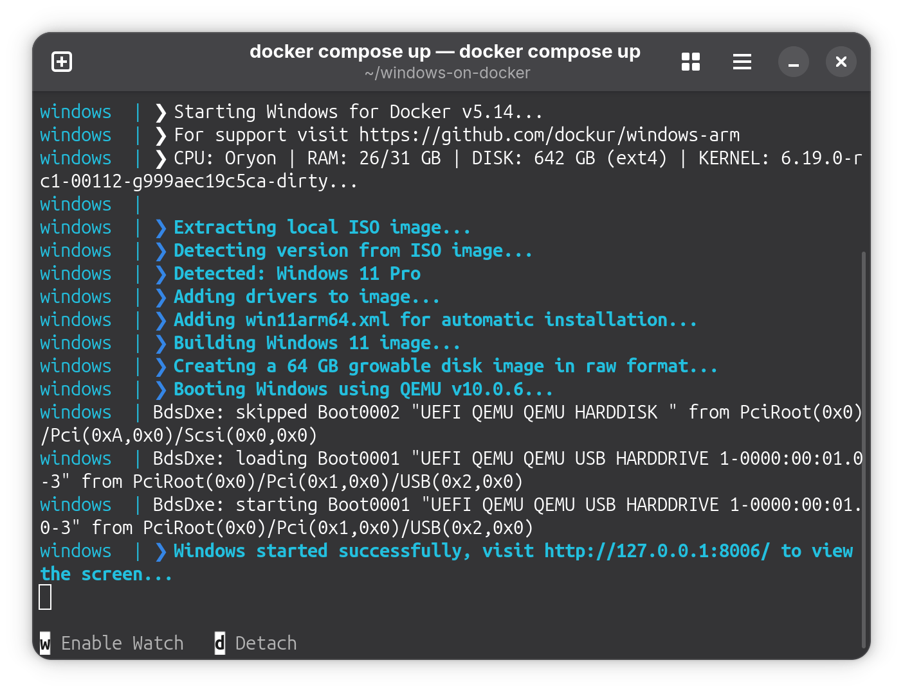

本文重點討論如何使用 Docker 架設 Windows 11 ARM 容器，將必須的 Windows 應用安裝於其中，防止隱私被收集。

# 寫在前面

原本以爲筆電上裝 Ubuntu 搭配 `box64` 轉譯執行 64位元 X86 應用應用程式就足夠了，在最近的幾天裏又想辦法用 `box64` 轉譯執行 Wine 跑部分 Windows 應用程式，但是有相當多的程式會開不起來。通過控制臺看log 也不知道如何除錯，但是！學校每次讓完成一些任務時提供的程式都是專有軟體，而且還只有 Windows 版...在2026年了，還在秉持「單一平臺」的開發理念簡直就是一種錯誤的想法！不過我不是開發者，不能要求廠家推出 Linux 版，更何況還是 ARM 筆電的 Linux 作業系統，只能想辦法去把這個應用跑起來。再者，在 Linux 上用 Wine 跑 Windows 程式本身就是政治不正確的行爲，有那麼多 Linux 原生的程式不用，卻偏偏想辦法跑 Windows 程式，這是不尊重自由軟體精神的表現。這樣在 Linux 上跑 Windows 程式的方法就只剩下了虛擬機和其它方法了。

# 安裝 Docker

首先根據 [Docker 的官方文檔](https://docs.docker.com/engine/install/ubuntu/)，添加 Docker 的套件庫，然後安裝 Docker:

```bash
# 新增 Docker 套件庫的GPG金鑰：
sudo apt update
sudo apt install ca-certificates curl
sudo install -m 0755 -d /etc/apt/keyrings
sudo curl -fsSL https://download.docker.com/linux/ubuntu/gpg -o /etc/apt/keyrings/docker.asc
sudo chmod a+r /etc/apt/keyrings/docker.asc

# 添加 Docker 套件庫：
sudo tee /etc/apt/sources.list.d/docker.sources <<EOF
Types: deb
URIs: https://download.docker.com/linux/ubuntu
Suites: $(. /etc/os-release && echo "${UBUNTU_CODENAME:-$VERSION_CODENAME}")
Components: stable
Signed-By: /etc/apt/keyrings/docker.asc
EOF

sudo apt update
```
之後，通過 `sudo apt install docker-ce docker-ce-cli containerd.io docker-buildx-plugin docker-compose-plugin`命令安裝 Docker。然後啓用 Docker 的 Systemd 服務。之後將使用者加入 `docker` 群組，重開機後即可使用 Docker 命令。

# 架設 Windows 11 ARM 容器

本文所使用的專案來自 GitHub，你可以在這裏檢視其原始碼：

::github{repo="dockur/windows-arm"}

在自己的工作目錄下建立一資料夾，命名爲 `windows-on-docker`，然後進入該資料夾，新增 Docker compose 檔：

```yaml
services:
  windows:
    image: dockurr/windows
    container_name: windows
    environment:
      VERSION: "11"  # 如果不想使用微軟官方的映像，可以改成其它WoA映像下載連結。
    devices:
      - /dev/kvm
      - /dev/net/tun
    cap_add:
      - NET_ADMIN
    ports:
      - 8006:8006
      - 3389:3389/tcp
      - 3389:3389/udp
    volumes:
      - ./windows:/storage # 也可以指定本機的 Windows 映像檔。
    restart: always
    stop_grace_period: 2m
```

之後通過 `docker compose up` 命令啓動容器，或者使用下面的命令：

```bash
docker run -it --rm --name windows -e "VERSION=11" -p 8006:8006 --device=/dev/kvm --device=/dev/net/tun --cap-add NET_ADMIN -v "${PWD:-.}/windows:/storage" --stop-timeout 120 docker.io/dockurr/windows
```

注意電腦必須支援 KVM 虛擬化才可以。對於高通驍龍845[^1]、SC8280XP、X Elite 等支援 EL2 異常層級的晶片，需要每次在啓動 Linux 之前在 UEFI Shell 中手動加載 `slbounce` 驅動進行 Secure Launch，才能使 Linux 核心初始化 hypervisor，並啓用 KVM。這個行爲會使 ADSP 噴掉，所有依賴 ADSP 的硬體將不工作，因爲 ADSP 是由 hypervisor初始化的。有關如何啓用 KVM 的方法，可參考[上一篇文章](https://blog.cloudflare88.eu.org/posts/alpine-on-kvm/)。


執行指令後，如果沒有任何錯誤訊息，且你的裝置支援KVM，就可以開啓瀏覽器，在地址欄鍵入 `http://127.0.0.1:8006` 來訪問 Windows 11 的桌面環境。</br>




之後，Windows 11 的安裝過程會自動開始，只需等待大約15分鐘即可。安裝完後會自動登入，預設使用者名稱是 Docker，沒有密碼。


# 改善使用體驗

容器啓動後，默認的解析度是 `800×600`，且QEMU的虛擬顯示卡不支援 Windows 的 Direct X 3D 加速，因此不太適合執行遊戲、存取線上視頻等對於繪圖卡有要求的應用，只能勉強執行文書類應用。但這樣的好處是不需要額外的顯示驅動就可以執行應用，而且不會遇到圖形API不相容的問題。

## 提升解析度

雖然QEMU的虛擬顯示卡不支援 Windows 的 3D加速，但還是可以讓容器使用 Virtio GPU 虛擬繪圖卡提升解析度。只需要在 Docker compose 檔中增加以下設定：

```yaml
environment:
  VGA: "virtio-gpu"
```
之後重新啓動容器，就可以調整解析度了。</br>


## 調整虛擬磁碟大小

默認的虛擬磁碟大小是 64GB，可以調整到自己需要的大小，方法是在 Docker compose 檔中增加以下設定：

```yaml
environment:
  DISK_SIZE: "256G"
```

之後重新啓動容器，C槽的大小應該會變成256GB。</br>

## 修改CPU和記憶體

Docker 默認會分給 Windows 11 2個CPU核心和4GB記憶體。這個預設值對於絕大多數文書處理應用完全夠用了，配合輕量化的 Midori 瀏覽器和 FrogFind 搜尋引擎（提示作業系統太新而不給執行？修改瀏覽器UA即可。）也可以實現訪問網際網路，記憶體用量也有富餘。對於驍龍 X Elite 而言，增加容器使用的CPU核心和記憶體大小，也不錯。如果想要調整CPU和記憶體大小，只需修改 Docker compose 擋的 `environment` 區段，例如：

```yaml
environment:
  RAM_SIZE: "8G"
  CPU_CORES: "4"
```

之後重新啓動容器，就可以應用新的CPU數量和記憶體大小了。</br>

## 在地化 Windows 11 容器

修改使用者名稱和登入密碼：</br>

```yaml
environment:
  USERNAME: "sunxi"
  PASSWORD: "kaanapali"
```

爲 Windows 11 設置中文語言支援：</br>

```yaml
environment:
  LANGUAGE: "Chinese"
```

修改鍵盤佈局：</br>

```yaml
environment:
  REGION: "en-US"
  KEYBOARD: "en-US"
```

其它進階使用方式可在專案的 GitHub 原始碼的 `Readme` 中查看。

[^1]:對於驍龍845等手機平臺的晶片，只有未開啓硬體安全啓動的設備（原型機、測試機、部分零售機如 SHIFT6mq）且配置了支援 Secure Launch 的 `devcfg` 配置的韌體才可以通過執行 Secure launch 使 HLOS（高階作業系統，諸如 Windows，Linux，ChromeOS等）核心執行於 EL2 異常層級下，並可以使用硬體虛擬化。