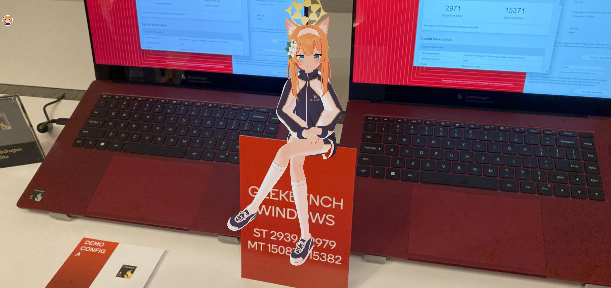
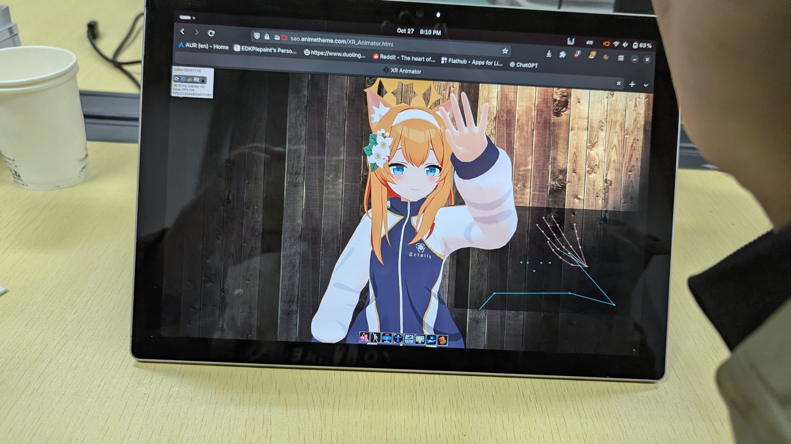

:::note
本文包含部分受版權保護的內容，您在轉載本文章時，請不要包含這些內容。除非您已經事先申請，且版權所有者已同意授權。 
受版權保護的內容：

- Qualcomm Snapdragon X2 Elite Reference Design 圖片，原圖片由[PCMag](https://www.pcmag.com/news/first-tests-qualcomms-snapdragon-x2-elite-extreme-shows-some-serious-speed#specs-how-the-snapdragon-x2-shapes-up-in-the-stack) 提供，美國高通公司版權所有;
- Qualcomm Snapdragon X Elite Reference Demo 圖片 ，原圖片由[CNX Software – Embedded Systems News](https://www.cnx-software.com/2023/10/31/qualcomm-snapdragon-x-elite-soc-benchmarks-in-windows-and-linux/) 提供，美國高通公司版權所有；
- [Iochi Mari](https://3d.nicovideo.jp/works/td91904) （伊落瑪麗）人物模型，Nexon Co., Ltd 版權所有
:::
XR Animator是一個支援Linux、Windows、macOS的開源桌寵軟體，可以在桌面放3D模型，讓他/她與你打招呼。內建採用了[MediaPipe](https://github.com/google/mediapipe)和[TensorFlow](https://github.com/tensorflow/tfjs-models)機器學習技術的動態捕捉，能夠實時偵測到人體的動作，並將其轉化爲人物模型的動作。
比起其他需要專業設備才能進行身體動作的捕捉，XR Animator 只需要使用者有一個支援720P解析度的攝像機即可。如果作業系統不支援，亦可以通過[這裏](https://sao.animetheme.com/XR_Animator.html)來存取網頁版，如果手機是 Android 或 iPhone，還可以通過AR技術將人物放置於真實的世界中，與她們進行互動！

# 下載 XR Animator

XR Animator 是開源軟體，其原始碼可於[Github](https://github.com/ButzYung/SystemAnimatorOnline)取得，或點擊下面的鏈接卡片：

 ::github{repo="ButzYung/SystemAnimatorOnline"}

 根據自己的作業系統，選擇合適的文件下載。需要注意的是，雖然僅提供了 64位元`X86` 架構的安裝檔，Windows 版的亦可以在 Windows On ARM 設備上執行，而 Linux 需要使用 `Box64` 轉譯。 
 程式設定非常簡單，例如我是 Gentoo Linux 只需解壓歸檔，然後通過 `chmod +x` 賦予程式可執行權限，最後雙擊 `electron` 來打開程式即可！

# 基本用法
程式打開後，將你的模型（需包含有`.pmx` 檔的ZIP壓縮文件）直接拖入窗口，然後按下“START”來啓動！（沒有模型就跳過這個步驟）

現在可以和人物互動了，比如點一下腳就會跌倒、點一下人物的胸部或是其他部位就會看到用手遮擋的動作（好色哦嘿嘿嘿）......點二下重置鏡頭，右鍵拖曳視窗位置。按住Ctrl鍵與滑鼠左鍵可以轉動和移動人物，使用滾輪則是放大和縮小人物，便於看清人物的細節。(?)

點下方的姿勢按鈕能夠切換許多動作～還能將動作儲存起來。

系統匣的選單也有很多光影選項能開，可以讓模型更好的融入背景。不過這就會額外耗費顯示卡計算資源了，繪圖卡不好的電腦別開太高級的光影選項。點選Always on Top將視窗永遠置頂。

# 設定動作捕捉

可以使用攝像頭進行實時的動作捕捉，亦可以通過載入單張照片來使人物做出想要的姿勢。某些動作後面會有對應的表情展示，來讓你來決定是進行全身捕捉或半身捕捉。

首先，設定要使用的照相機，按一下工具列的“相機”設定，在對話框中選擇你的相機。然後點選“動作”設定，選擇第三個，按一下“動態捕捉”設定身體部分。之後人物會根據你的面部表情和動作跟着反應了。

# 手機上使用 AR

準備 Android 或者 Linux 手機，然後前往[這裏](https://sao.animetheme.com/XR_Animator.html) 用法與電腦版一致，點一下左上角的手機圖標進入AR模式，注意場景儘量比較複雜些，否則人物很難顯示出來。 
工具列裡面有接球遊戲，至少要站離模型5公尺遠才能玩！ 